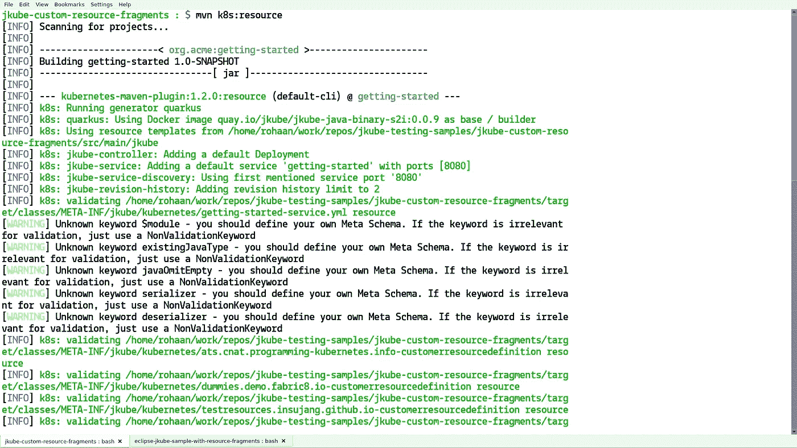
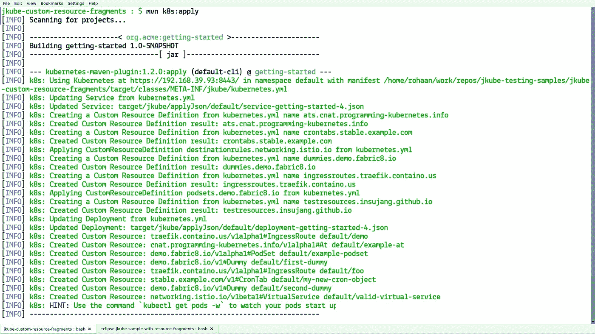
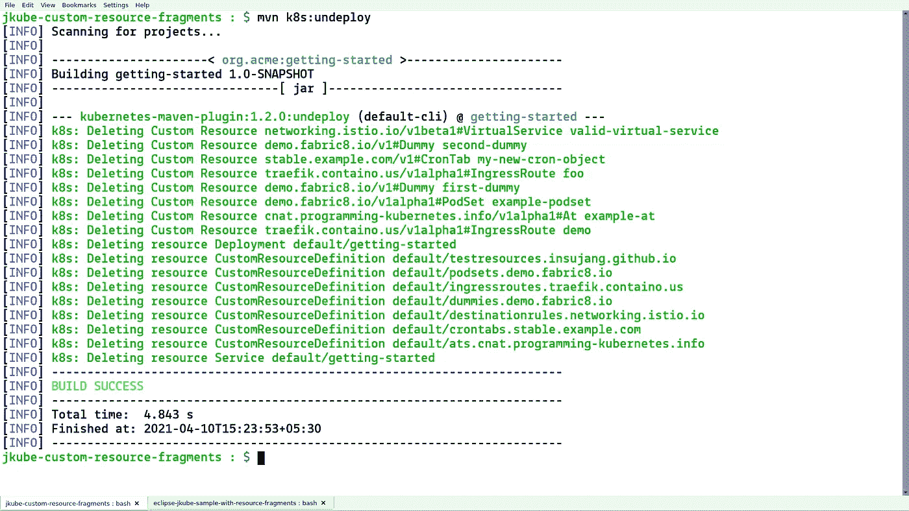

# 使用 Eclipse JKube Kubernetes Maven 插件应用自定义资源片段

> 原文：<https://itnext.io/apply-customresource-fragments-using-eclipse-jkube-kubernetes-maven-plugin-be2cba65b58f?source=collection_archive---------2----------------------->


[日蚀 JKube](https://github.com/eclipse/jkube)

有时候，您希望将一些自定义资源与应用程序的工作负载资源一起应用，如`Deployment`、`Service`等。对于这个用例，您可能想要使用 Kubernetes Maven 插件的[资源片段](https://www.eclipse.org/jkube/docs/kubernetes-maven-plugin#_resource_fragments)特性来为 JKube 提供定制的 YAML 片段，以便在应用阶段进行部署。在这篇博文中，我们将看看如何向 Kubernetes Maven 插件提供我们的 CustomResource 片段，以便在应用阶段部署它们。

## 将 Kubernetes Maven 插件添加到项目:

为了使用 Eclipse JKube 部署 CustomResource 片段，您需要在 pom.xml 中添加 Kubernetes Maven 插件，如下所示:

```
**<plugin>** 
   **<groupId>**org.eclipse.jkube**</groupId>** 
   **<artifactId>**kubernetes-maven-plugin**</artifactId>** 
   **<version>**1.2.0**</version>** 
**</plugin>**
```

## 将自定义资源片段放入`src/main/jkube`:

为了提供 CustomResource 片段，我们需要将它们放在 Kubernetes Maven 插件的资源目录中(默认为`${baseDir}/src/main/jkube`)。

对于标准资源，我们需要为核心 Kubernetes 资源命名我们的资源片段，如`Deployment`、`Service`等。尊重他们的同类。因此，用于部署的片段将被命名为`deployment.yaml`，用于服务的片段将被命名为`service.yaml`。但是在 CustomResources 的情况下，这种类型的元素是不固定的，因此您需要为您的 CustomResource 片段添加一个后缀`*-cr.yml`，以便 Eclipse JKube 可以检测到指定的片段是 CustomResource 片段。下面是您的资源目录的样子:

```
**jkube-custom-resource-fragments : $** ls -l src/main/jkube/ 
total 312 
-rw-rw-r--. 1 rohaan rohaan    388 Mar 26 19:04 ats-crd.yml 
-rw-rw-r--. 1 rohaan rohaan    160 Mar 26 19:04 ats-cr.yml 
-rw-rw-r--. 1 rohaan rohaan   1371 Mar 26 19:04 crontab-crd.yml 
-rw-rw-r--. 1 rohaan rohaan    164 Mar 26 19:04 crontab-cr.yml 
-rw-rw-r--. 1 rohaan rohaan    304 Mar 26 19:04 dummy-crd.yml 
-rw-rw-r--. 1 rohaan rohaan    105 Mar 26 19:04 dummy-cr.yml 
-rw-rw-r--. 1 rohaan rohaan   1259 Mar 26 19:04 ingressroute-cr.yml 
-rw-rw-r--. 1 rohaan rohaan 258715 Mar 26 19:04 istio-crd.yaml 
-rw-rw-r--. 1 rohaan rohaan    539 Mar 26 19:04 podset-crd.yaml 
-rw-rw-r--. 1 rohaan rohaan    107 Mar 26 19:04 second-dummy-cr.yml 
-rw-rw-r--. 1 rohaan rohaan    132 Mar 26 19:04 test2-cr.yml 
-rw-rw-r--. 1 rohaan rohaan   2327 Mar 26 19:04 traefic-crd.yaml 
-rw-rw-r--. 1 rohaan rohaan    225 Mar 26 19:04 traefic-ingressroute2-cr.yml 
-rw-rw-r--. 1 rohaan rohaan    303 Mar 26 19:04 virtualservice-cr.yml
```

注意，在我的例子中，我在我的`src/main/jkube`目录中也有一些 CustomResourceDefinitions。但是，CustomResourceDefinitions 是一个群集范围的资源，应该由 Cluster-Admin 安装；您还可以通过将 CustomResourceDefinitions 作为资源片段来部署它们。

资源片段中也可以有 maven 属性占位符，如下所示:

```
**apiVersion:** demo.fabric8.io/v1alpha1 
**kind:** PodSet 
**metadata:** 
  **name:** ${podset.name} 
**spec:** 
  **replicas:** ${podset.replicas}
```

您可以将这些配置为 maven 属性，如下所示:

```
**<properties>   
   <podset.replicas>**3**</podset.replicas> 
   <podset.name>**example-podset**</podset.name> 
</properties>**
```

## 生成+应用自定义资源片段:

一旦你把你的自定义资源片段放到插件的资源目录中。您应该能够利用`k8s:resource`目标生成资源。您的所有 CustomResource 片段都将在资源阶段得到丰富。

```
**$** mvn k8s:resource
```



k8s:资源目标

您应该能够在`target/classes/META-INF/jkube/kubernetes`目录中看到最终的丰富清单。

一旦生成了资源清单，就可以使用 apply 目标将它们应用到 Kubernetes 集群。如果您没有为资源目录中的这些 CustomResource 提供 CustomResourceDefinitions，则需要确保该特定 CustomResource 的 CustomResourceDefinition 已经存在。然后，您可以像这样继续运行应用目标:

```
**$** mvn k8s:apply
```



k8s:应用目标

然后，您可以检查您的自定义资源是否得到应用。对我来说，他们得到了预期的申请。

```
jkube-custom-resource-fragments : $ kubectl get dummy 
NAME           AGE 
first-dummy    4m43s 
second-dummy   4m42s 
jkube-custom-resource-fragments : $ kubectl get podset 
NAME             AGE 
example-podset   4m48s 
jkube-custom-resource-fragments : $ kubectl get virtualservice 
NAME                    GATEWAYS   HOSTS   AGE 
valid-virtual-service              ["c"]   4m52s 
jkube-custom-resource-fragments : $ kubectl get crontab 
NAME                 AGE 
my-new-cron-object   5m4s 
jkube-custom-resource-fragments : $
```

## 从 Kubernetes 群集中删除应用的资源:

一旦您完成了对应用的定制资源工作负载的测试，并且想要清理已部署的所有内容。您可以简单地运行取消部署目标:

```
**$** mvn k8s:undeploy
```



k8s:取消部署目标

## 结论:

今天的博文到此结束。我希望您已经了解了如何利用 Eclipse JKube 来部署您的定制资源片段。您可以在以下 github 资源库中找到代码:

 [## r0haaaan/jkube-自定义资源-片段

### 您还可以向 Eclipse jbu be 的源目录(src/main/jbu be)和 Eclipse jbu be 提供定制的资源片段…

github.com](https://github.com/r0haaaan/jkube-custom-resource-fragments) 

请试用并通过常规渠道提供反馈:

*   推特:[https://twitter.com/jkubeio](https://twitter.com/jkubeio)
*   吉特:[https://gitter.im/eclipse/jkube](https://gitter.im/eclipse/jkube)
*   Github 问题:[https://github.com/eclipse/jkube/issues](https://github.com/eclipse/jkube/issues)