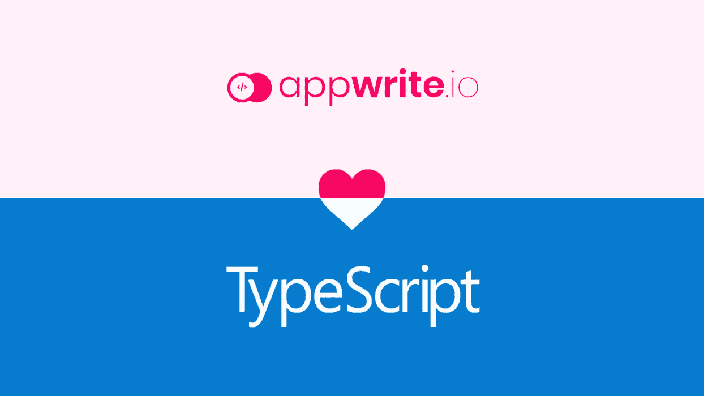

# Appwrite 0.6 提供了完整的类型脚本支持

> 原文：<https://itnext.io/appwrite-0-6-comes-with-full-typescript-support-b207caa47a1a?source=collection_archive---------6----------------------->

本周发布的新的 [Appwrite 版本](https://dev.to/eldadfux/introducing-appwrite-0-6-with-flutter-support-3p8)，包括一个更新的 JS SDK，使用一个 **d.ts 声明**文件提供完整的类型脚本支持。有了这个新特性，您的 Appwrite SDK 对象现在将在您的 IDE 中具有带有类型提示的自动完成功能。

> 如果你以前没有听说过 Appwrite，它是一个开源的 BAAS(后端即服务),抽象了从头构建 API 所需的大量复杂性和重复性。该服务器被打包成一组 Docker 容器，您可以在任何地方快速托管，并且它有大量的内置安全功能。您可以在: [https://appwrite.io](https://appwrite.io) 了解更多信息

TypeScript 使得为您喜欢的库添加声明文件变得更加容易。声明文件只是向 TypeScript 描述现有 JavaScript 代码库形状的文件。通过使用-声明文件(也称为. d.ts 文件)，您可以避免误用库，并在编辑器中获得更好的完成效果。

这个新特性现在在 0.2 版本的 [Appwrite JS SDK](https://github.com/appwrite/sdk-for-js) 中可用。你可以使用命令`npm install appwrite`直接从 NPM 获取它。请注意，0.2 版仅与 0.6 版或更高版本的 Appwrite 服务器兼容。如果你使用的是旧版本的 [Appwrite](https://appwrite.io/) ，这可能是一个很好的机会[升级你的设置](https://appwrite.io/installation)。

这是一个很好的机会来感谢亚历山德罗·曼戈内·🇮🇹在 GitHub 的 SDK 生成器库上贡献了这个特性，谢谢你，亚历山德罗！

# 加入我们

如果您希望了解更多关于 [Appwrite](https://appwrite.io/) 的信息，或者需要关于 Appwrite 入门的支持，您可以加入我们的 [Discord 社区](https://discord.gg/GSeTUeA)。你也可以在[推特](https://twitter.com/appwrite_io)、 [GitHub](https://github.com/appwrite/appwrite) 或[脸书](https://www.facebook.com/appwrite.io)上关注我们。