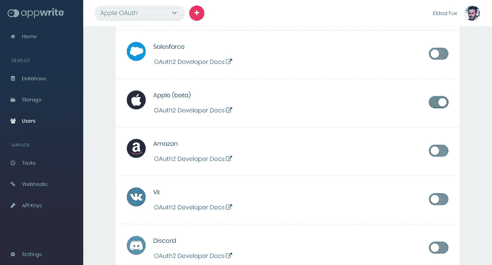
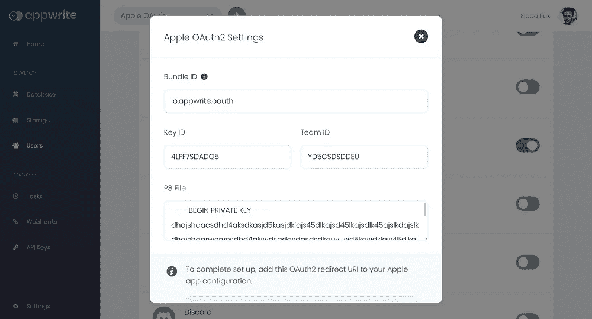

# Appwrite 后端服务器 v0.6.2 引入了对“使用 Apple 登录”的支持

> 原文：<https://itnext.io/appwrite-backend-server-v0-6-2-introduces-support-for-sign-in-with-apple-b5ee84c29478?source=collection_archive---------3----------------------->

**我们很兴奋地宣布**[**app write**](https://appwrite.io)**[**开源**](https://github.com/appwrite/appwrite) **后端服务器 0.6.2 版本的发布。这是我们第一次推出** [**项目**](https://github.com/appwrite/appwrite) **以来的 12 个版本的 Appwrite。****

****

> **如果你以前没有听说过 Appwrite，它是一个 [**开源** BAAS](https://github.com/appwrite/appwrite) (后端即服务)，抽象了从头构建 API 时所需的大量复杂性和重复性。该服务器被打包成一组 Docker 容器，您可以在任何地方快速托管，并且它有大量的内置安全功能。您可以在 [https://appwrite.io](https://appwrite.io) 了解更多信息**

**新版本引入了对 Apple OAuth 认证的新测试版支持，更好的说法是“[使用 Apple](https://developer.apple.com/sign-in-with-apple/) 登录”。这一新功能将允许您使用 Apple private sign up service 轻松认证您的用户。非常感谢 Christy Jacob 为这个功能的推出所做的贡献。**

********

**苹果 OAuth 服务加入了 Appwrite 中可用的 17 个 OAuth 适配器**

**新版本还引入了我们社区成员在 Discord 和 GitHub 上报告的多个错误修复和改进。非常感谢我们的社区成员[托尔斯滕·迪特曼](https://github.com/TorstenDittmann)、[佩德罗·希斯内罗斯·桑塔纳](https://github.com/PedroCisnerosSantana)、[穆罕默德·哈坎·亚兹坎](https://github.com/mehmet-hakan-yazkan)、[塔威柴·马克雷](https://github.com/netfirms)、[扬森·阿鲁达](https://github.com/jansenarruda)、[普尼特·迪万](https://github.com/punitdiwan)和[法提克](https://github.com/FathiQ)，他们通过报告问题、发送拉式请求以及普遍的支持，积极参与了这个版本的改进。**

**版本 0.6.2 的完整变更日志可以在我们的 [GitHub 发布页面](https://github.com/appwrite/appwrite/releases)上找到。如果你想知道 Appwrite 下一步会有什么新的特性和改进，你也可以查看我们的[公开路线图](https://github.com/appwrite/appwrite/projects)。**

**你现在可以[安装新的 Appwrite 服务器](https://appwrite.io/docs/installation)，或者从以前的[版本](https://appwrite.io/docs/installation)升级。如果您寻求任何帮助、建议或想要与我们分享您的反馈，请随时联系我们的社区或团队成员，联系方式是 [Discord](https://discord.gg/GSeTUeA) 或 [Twitter](https://twitter.com/appwrite_io) 。**