# 设计成功的 SaaS

> 原文：<https://itnext.io/architecting-a-successful-saas-eaa24c5ad6d7?source=collection_archive---------0----------------------->

## 了解基于云的 SaaS 模型

帖子的音频版本

*原载于* [*AWS APN 博客*](https://aws.amazon.com/blogs/apn/architecting-successful-saas-understanding-cloud-based-software-as-a-service-models/) *。*

你是一家初创公司，有一个革命性的新软件产品的想法。您可以快速构建一个测试版本，并将其部署到云中。在成功的社会营销活动和协调一致的销售努力之后，几十个客户订阅了你的 SaaS 产品。你欣喜若狂…直到你意识到你从来没有为这种程度的成功设计过你的产品。你忙着编码、筹集资金、营销和销售，你从来没有计划过如何扩展你的 Sass 产品。您将如何确保您的客户以及您自己的安全。您将如何实现您承诺的产品可靠性、合规性和性能。此外，无论您或他们的增长速度有多快，您将如何监控和计量客户的使用情况。

我经常听到初露头角的企业家开玩笑说，如果成功是他们最大的问题就好了。当然，成功不会是他们最大的问题。对许多人来说，问题是后来才出现的，因为他们未能交付承诺的高质量产品，令客户失望。更糟糕的是，由于丢失或暴露敏感数据，损害了客户(以及他们自己)的声誉。俗话说，你永远不会有第二次机会来给人留下第一印象。客户信任来之不易，也容易失去。正确设计一个可扩展的、安全的基于 SaaS 的产品与功能开发和销售一样重要。没有人想在第一天就失败——你太努力了。

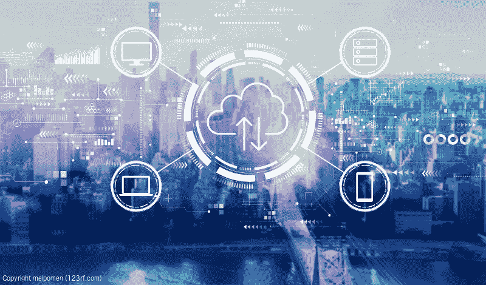

# 设计成功的 SaaS

在这一系列文章《构建成功的 SaaS》中，我们将探讨如何正确规划和构建一个专为云托管而设计的 SaaS 产品。我们将从回答一些基本问题开始，比如，什么是 SaaS，对于软件分发来说，SaaS 有什么替代方案，SaaS 最常见的产品模型是什么。然后，我们将研究不同的高级 SaaS 架构，回顾租户隔离策略，并探索 SaaS 供应商如何安全地与其客户的云帐户进行交互。最后，我们将讨论 SaaS 提供商如何满足既定的最佳实践，如来自 [AWS SaaS 工厂](https://aws.amazon.com/partners/saas-factory/)和 [AWS 良好架构框架](https://aws.amazon.com/architecture/well-architected/)的最佳实践。

在这篇文章中，我从 AWS 和 AWS 市场的供应商那里选择了许多云服务的例子。然而，讨论的原则可能适用于其他领先的云提供商、SaaS 产品和基于云的软件市场。本帖中的所有信息都是公开的。

# 什么是 SaaS？

根据 [AWS Marketplace](https://aws.amazon.com/marketplace) 、*的说法，【软件即服务】是一种软件应用的交付模式，供应商通过该模式在互联网上托管和运营应用。客户为使用软件付费，却不拥有底层基础设施。*AWS 的另一个定义，*“SaaS 是一种许可和交付模式，软件由提供商集中管理和托管，客户可以通过订阅获得。”*

像其他形式的软件一样，SaaS 产品是由通常所说的独立软件供应商(ISV)生产的。根据[维基百科](https://en.wikipedia.org/wiki/Independent_software_vendor)的说法，独立软件供应商*是一个专门制造和销售软件的组织，而不是硬件，为大众或利基市场设计。这与内部软件或定制软件不同，内部软件是由使用内部软件的组织开发的，而定制软件是为某个特定的第三方设计或改编的。尽管 ISV 提供的软件是由最终用户使用的，但它仍然是供应商的财产。*

虽然估计差异很大，但根据[软件即服务(SaaS)2020 年全球市场报告](https://www.researchandmarkets.com/reports/4852466/software-as-a-service-saas-global-market-report?utm_source=dynamic&utm_medium=CI&utm_code=kdmfsk&utm_campaign=1328967+-+Global+Software+as+a+service+(SaaS)+Market+Report+2020%3a+Market+was+Valued+at+%24134.44+Bn+in+2018+and+is+Expected+to+Grow+to+%24220.21+Bn+at+a+CAGR+of+13.1%25+through+2022&utm_exec=chdo54cid)，全球 SaaS 市场在 2018 年的价值约为 13444 亿美元，预计到 2022 年将以 13.1%的复合年增长率(CAGR)增长至 22021 亿美元。 [Statista](https://www.statista.com/statistics/477742/public-cloud-software-revenue-forecast/) 预测 SaaS 收入将增长更快，预计到 2022 年收入将达到 2660 亿美元，到 2027 年将持续强劲增长至 3460 亿美元。

# 基于云的使用模式

让我们首先回顾一下个人、企业、学术机构、公共部门和政府消费云提供商服务的三种最常见方式，这些云提供商包括亚马逊网络服务(AWS)、微软 Azure、谷歌云和 IBM Cloud(现在包括 Red Hat)。

## 间接用户

间接用户是消费基于云的 SaaS 产品的客户。间接用户通常不太可能知道他们订阅的 SaaS 产品由哪个云提供商托管。许多 SaaS 产品可以导入和导出数据，以及与其他 SaaS 产品集成。许多成功的公司使用多家厂商的 SaaS 产品在云中运行他们的整个业务。

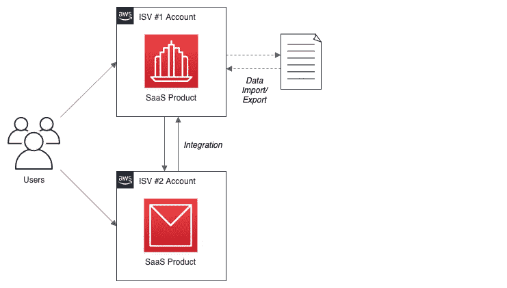

**例题**

*   一家广告公司使用[谷歌 G 套件](https://gsuite.google.com/)进行员工和客户之间的日常沟通和协作。
*   一家大型汽车零部件制造商使用 [Workday](https://www.workday.com/) 基于云的企业资源管理(ERP)套件开展业务。
*   一家使用 [Zendesk](https://www.zendesk.com/) 提供客户支持的软件安全公司。他们还利用 Slack 通道，使用 Zendesk 的 Slack 集成来查看、创建和处理支持票据。
*   一家招聘公司使用[缩放会议&聊天](https://www.zoom.us/meetings)来面试远程候选人。他们还使用 Zoom 与[杠杆](https://marketplace.zoom.us/apps/B526c9wrT62K16prCgFDGg)招聘软件的集成来安排面试。

## 直接用户

直接用户是使用基于云的[基础设施即服务](https://aws.amazon.com/types-of-cloud-computing/) (IaaS)和[平台即服务](https://aws.amazon.com/types-of-cloud-computing/) (PaaS)产品构建和运行其软件的客户；DIY(自己动手)模式。部署在客户帐户中的软件可以由客户创建，也可以从第三方软件供应商处购买并部署在客户的云帐户中。直接用户可以从多个云提供商那里购买 IaaS 和 PaaS 服务。

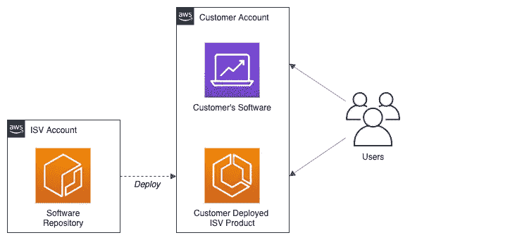

**例题**

*   一个高级爱好者，他使用 [AWS 物联网核心](https://aws.amazon.com/iot-core)和[亚马逊 QuickSight](https://aws.amazon.com/quicksight/) 作为定制智能家居自动化应用的一部分。
*   一家私募股权公司，使用云服务的组合维护自己专有的基于人工智能的投资推荐引擎，如 [AWS Lambda](https://aws.amazon.com/lambda/) 和[亚马逊 SageMaker](https://aws.amazon.com/sagemaker/) 。
*   一家移动支付公司，使用[亚马逊 EKS](https://docs.aws.amazon.com/eks) 和[亚马逊 DynamoDB](https://aws.amazon.com/dynamodb/) 运行自己的大容量信用卡处理应用程序。为了帮助确保 PCI 合规性，他们还使用 Aqua 的客户部署产品，[Aqua Cloud Native Security Platform for EKS(BYOL)](https://aws.amazon.com/marketplace/pp/B07KCNBW7B)。

## 混合用户

混合用户是使用 IaaS、PaaS 和 SaaS 产品组合的客户。客户通常将多个 IaaS、PaaS 和 SaaS 产品连接起来，作为大型企业软件应用平台的一部分。

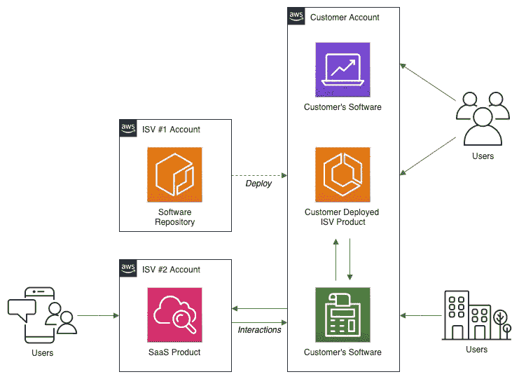

**示例**

*   一家托管其专有薪资软件产品的薪资公司，使用 IaaS 产品，如 [Amazon EC2](https://aws.amazon.com/ec2/) 和 [Elastic Load Balancing](https://aws.amazon.com/elasticloadbalancing/) 。此外，他们使用一种集成的基于 SaaS 的欺诈检测产品，如[c sequence Security CQ bot defense](https://aws.amazon.com/marketplace/pp/B083XH2XFP)，来确保工资单客户的安全。
*   一家在线游戏公司，使用完全托管的基于容器的 PaaS 服务运行其应用程序， [Amazon ECS](https://aws.amazon.com/ecs/) 。为了推广他们的游戏产品，他们使用 SaaS 的营销产品，比如 Mailchimp Marketing CRM。

# 基于云的软件

大多数基于云的软件以两种方式销售，客户部署或 SaaS。下面，我们看到了 AWS 市场上产品交付方式的细分。图表中除 SaaS 以外的所有项目都代表客户部署的产品。无服务器应用程序在 AWS 上的其他地方[可用，并且没有出现在 AWS 市场统计中。](https://aws.amazon.com/serverless/serverlessrepo/)

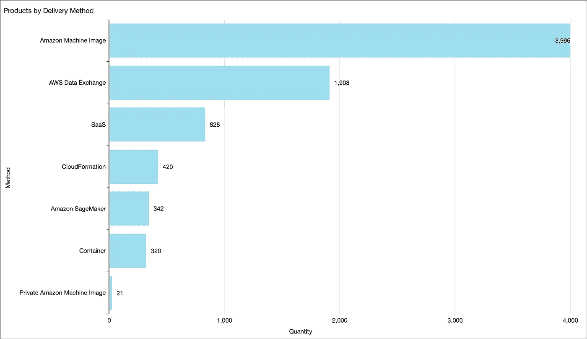

AWS 市场:所有产品—交付方式(2020 年 2 月)

# 客户部署的

向基于云的 IaaS 和 PaaS 服务的消费者销售客户部署的软件产品的 ISV。产品由客户、系统集成商(SI)或 ISV 安装到客户的云帐户中。客户部署的产品让人想起传统的“盒装”软件。

客户通常为软件产品支付定期的每小时、每月或每年的订阅费，通常称为现收现付(PAYG)。支付给供应商的订阅费是云服务提供商向客户收取的基础计算资源费用之外的费用，客户部署的产品在客户的云帐户中运行。

一些客户部署的产品可能也需要软件许可证。软件许可证通常通过其他渠道单独购买。将您已经拥有的许可应用于新购买的产品通常被称为自带许可(BYOL)。BYOL 在大型企业客户中很常见，他们可能已经与 ISV 签订了企业许可协议(ELA)。

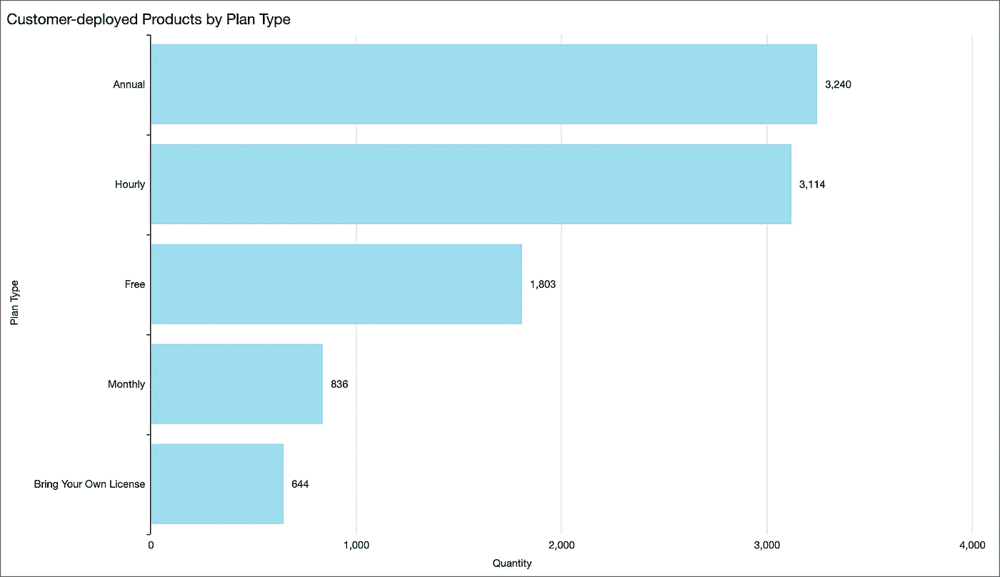

AWS 市场:客户部署的产品订阅类型(2020 年 2 月)

客户部署的基于云的软件产品可以采取多种形式。最常见的可交付成果包括虚拟机(VM)的某种组合，如[亚马逊机器映像](https://docs.aws.amazon.com/AWSEC2/latest/UserGuide/AMIs.html) (AMIs)、Docker 映像、[亚马逊 SageMaker 模型](https://aws.amazon.com/about-aws/whats-new/2018/11/awsmarketplace-makes-it-easier-to-build-machine-learning-applications-on-amazonsagemaker/)，或基础设施代码，如 [AWS CloudFormation](https://aws.amazon.com/cloudformation/) 、 [HashiCorp Terraform](https://www.terraform.io) 或 [Helm Charts](https://helm.sh) 。客户通常从供应商的 AWS 帐户或其他公共或私有源代码或二进制存储库中获取这些可交付成果。下面，我们看到 AWS Marketplace 上客户部署的产品按交付方式的细分。

AWS 市场:客户部署的产品交付方法(2020 年 2 月)

虽然从历史上看，AMIs 一直是客户部署软件交付的主要方法，但较新的技术，如 Docker 映像、无服务器、SageMaker 模型和 AWS 数据交换数据集将继续在这一领域发展。 [AWS 无服务器应用程序存储库(SAR)](https://aws.amazon.com/serverless/serverlessrepo/) ，目前包含 500 多个无服务器应用程序，未反映在此图表中。根据[最近的一篇帖子](https://aws.amazon.com/blogs/apn/listing-serverless-applications-with-your-amazon-machine-images-on-aws-marketplace/)，AWS 似乎正在努力使在 AWS 市场销售无服务器软件变得更加容易。

客户部署的基于云的软件产品可能需要在已安装的产品和 ISV 之间建立连接，以获得产品支持、许可证验证、产品升级或安全通知。

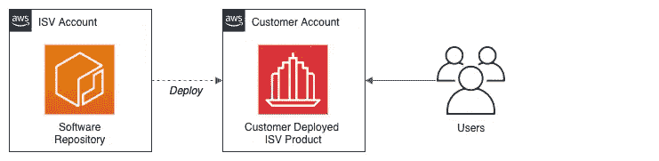

**例句**

*   Fortinet 为全球企业业务提供高性能、集成的网络安全解决方案。Fortinet 在 AWS Marketplace 上销售其客户部署的基于 AMI 的产品 [Fortinet FortiGate (BYOL)下一代防火墙](https://aws.amazon.com/marketplace/pp/B00ISG1GUG)。
*   [Alluxio](https://www.alluxio.io) 是大数据以及人工智能和人工智能工作负载的数据编排领域的领导者。Alluxio 在 AWS Marketplace 上销售其客户部署的基于 AMI 的产品， [Alluxio Enterprise Edition —用于数据分析的缓存](https://aws.amazon.com/marketplace/pp/B07WR37VD1)。
*   [Kasten](https://www.kasten.io/product/) 为[亚马逊 EKS](https://aws.amazon.com/eks/) (托管 Kubernetes 服务)提供云原生数据管理。Kasten 在 AWS Marketplace 上为 Kubernetes 应用程序的备份和恢复、灾难恢复和移动性提供客户部署的基于容器的产品 [Kasten K10](https://aws.amazon.com/marketplace/pp/B07K3R3Z86) 。
*   [深度视觉 AI](https://www.deepvisionai.com/) 专业从事图像、视频的视觉识别技术。Deep Vision 提供多种 API，包括 [Deep Vision 上下文识别 API](https://aws.amazon.com/marketplace/pp/prodview-okqswmxz6zuko?qid=1582006140402&sr=0-3&ref_=srh_res_product_title) 、 [Deep Vision 品牌识别 API](https://aws.amazon.com/marketplace/pp/prodview-wecwhlujsc4mg?qid=1582006140402&sr=0-2&ref_=srh_res_product_title) 、 [Deep Vision 人脸识别 API](https://aws.amazon.com/marketplace/pp/prodview-5ec5gmuixxuqw?qid=1582006140402&sr=0-6&ref_=srh_res_product_title) ，均在 AWS 市场销售。这些 API 与 Amazon SageMaker 一起工作，并且为实时推理和批量转换按小时收费。为[亚马逊 SageMaker](https://aws.amazon.com/sagemaker/) 设计的 SaaS 产品在 AWS 市场上是一个不断增长的类别。

# SaaS

向客户销售 SaaS 软件产品的独立软件开发商。SaaS 产品由 ISV 部署、管理和销售，并由云提供商(如 AWS)托管。SaaS 产品可能会也可能不会与客户的云帐户交互。就基于订阅的费用结构而言，SaaS 产品与客户部署的产品相似。订阅可能基于一个度量单位，通常是一段时间。订阅也可能基于用户数量、请求、主机或数据量。

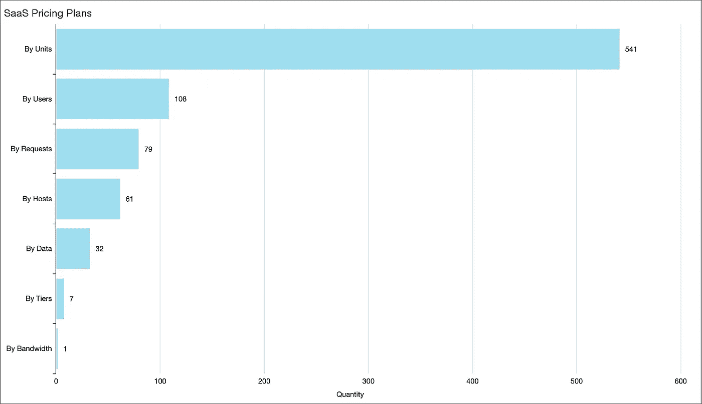

AWS 市场:SaaS 定价计划(2020 年 2 月)

SaaS 产品和客户部署产品之间的一个显著区别在于，底层云提供商没有直接的客户成本。基本成本被捆绑到 SaaS 产品的订阅费中。

与客户部署的产品相似，SaaS 的产品面向消费者和企业。SaaS 的产品涵盖了消费、商业、特定行业和技术领域。AWS Marketplace 提供的产品涵盖[八大类](https://docs.aws.amazon.com/marketplace/latest/buyerguide/buyer-product-categories.html)和 70 多个子类。

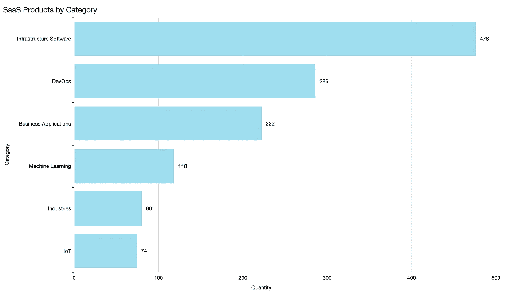

AWS 市场:SaaS 产品类别(2020 年 2 月)

# SaaS 产品变体

我经常与各种各样的基于云的软件供应商合作。根据我的经验，根据客户与 SaaS 产品互动的主要方式，大多数基于云的 SaaS 产品可以分为四类:

*   **单机**:与客户云账户无交互的 SaaS 产品；
*   **数据访问**:SaaS 产品，连接客户的云账户，只获取数据；
*   **增强**:连接到客户云账户的 SaaS 产品，与客户软件交互并增强；
*   **离散服务**:增强的一种变体，一种 SaaS 产品，提供离散的服务或功能，与更完整的软件产品相对；

## 独立的

独立的 SaaS 产品不会与客户的云帐户进行交互。独立 SaaS 产品的客户通过 SaaS 供应商提供的界面与产品进行交互。许多独立的 SaaS 产品可以导入和导出客户数据，也可以与其他基于云的 SaaS 产品集成。独立的 SaaS 产品可能面向消费者，称为企业对消费者(B2C SaaS)。他们也可能瞄准企业，称为企业对企业(B2B SaaS)。

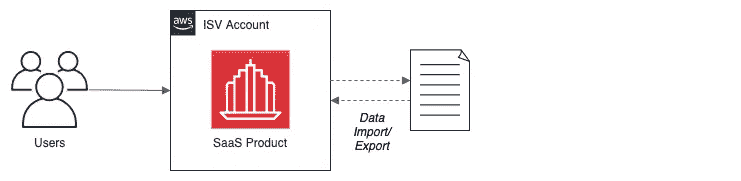

**例题**

*   [领先的在线云培训平台 A Cloud Guru](https://acloud.guru/) 在 AWS Marketplace 上销售其 [A Cloud Guru AWS 培训&认证](https://aws.amazon.com/marketplace/pp/B07BR52XXY) SaaS 产品。
*   Hubspot 是一家领先的 B2B SaaS 产品营销、销售和服务提供商。Hubspot 由美国的 AWS 主办，通过他们的网站销售其营销中心的一体化集客营销软件。
*   特雷罗是 B2B SaaS 产品的另一个例子。Trello 的 Trello 产品[托管在 AWS](https://trello.com/en/legal/security) 上，使用户能够组织和优先化他们的项目。

## 数据存取

一种 SaaS 产品，连接到客户云帐户或内部的数据源。这些 SaaS 产品通常属于大数据和数据分析、机器学习和人工智能以及物联网(物联网)类别。这些类别的产品需要处理大量数据。鉴于数据的绝对数量或数据的实时性，通过 SaaS 供应商的用户界面将数据直接导入或手动输入 SaaS 产品是不现实的。通常，这些 SaaS 产品会缓存客户的部分数据，以降低客户的数据传输成本。

与以前的独立 SaaS 产品类似，这些 SaaS 产品的客户通过 SaaS 供应商提供的用户界面与产品进行交互。

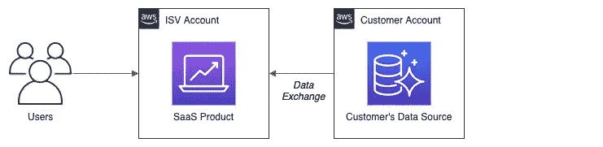

**例题**

*   [Zepl](https://www.zepl.com/) 提供企业数据科学分析平台，支持数据探索、分析和协作。Zepl 在 AWS Marketplace 上销售其 [Zepl 科学和分析平台](https://aws.amazon.com/marketplace/pp/B07YYP2ZCF) SaaS 产品。Zepl 产品集成了多种类型的客户数据源，包括雪花、亚马逊 S3、亚马逊红移、亚马逊雅典娜、谷歌 BigQuery、Apache Cassandra ( [亚马逊 MCS](https://aws.amazon.com/mcs/) )和其他 SQL 数据库。
*   Sisense 提供企业级、云原生商业智能和分析平台，由人工智能提供支持。Sisense 在 AWS Marketplace 上提供其 [Sisense 商业智能](https://aws.amazon.com/marketplace/pp/B07Y9KZ3K1) SaaS 产品。该产品允许客户使用 Sisense 的[数据连接器](https://www.sisense.com/data-connectors/)准备和分析不同的大数据集。各种各样的连接器提供了与数十种不同的基于云的本地数据源的连接。
*   [Databricks](https://databricks.com/) 提供统一的数据分析平台，专为大规模数据工程和协作数据科学而设计。Databricks 在 AWS Marketplace 上销售其 [Databricks 统一分析平台](https://aws.amazon.com/marketplace/pp/B07K2NJKRW) SaaS 产品。Databricks 允许客户与许多[不同数据源](https://docs.databricks.com/data/data-sources/index.html)、数据存储类型和数据类型的数据进行交互，包括批处理和流。
*   DataRobot 提供了一个企业人工智能平台，使全球企业能够合作利用人工智能的力量。DataRobot 在 AWS 市场上销售其 [DataRobot 自动机器学习 AWS](https://aws.amazon.com/marketplace/pp/B0822Z543Q) SaaS 产品。使用连接器，如 [Skyvia 的 OData 连接器](https://skyvia.com/data-integration/analyze-odata-with-datarobot)，客户可以将他们的数据源连接到 DataRobot 产品。

## 增大

一种 SaaS 产品，可与客户的应用程序进行交互并对其进行增强，该应用程序由客户在其自己的云帐户中进行管理。这些 SaaS 产品通常在供应商的 SaaS 产品和客户账户之间保持安全、松散耦合的单向或双向连接。AWS 上的供应商经常使用诸如[亚马逊事件桥](https://aws.amazon.com/eventbridge/)、 [AWS PrivateLink](https://aws.amazon.com/privatelink/) 、 [VPC 对等](https://docs.aws.amazon.com/vpc/latest/userguide/vpc-peering.html)、亚马逊 S3、亚马逊 Kinesis、亚马逊 SQS 和亚马逊社交网络等服务来与客户的账户进行交互并交换数据。通常，这些 SaaS 产品属于安全、日志记录和监控以及开发运维类别。

这些类型的 SaaS 产品的客户通常与他们自己的软件进行交互，而 SaaS 产品则通过 SaaS 供应商提供的接口进行交互。

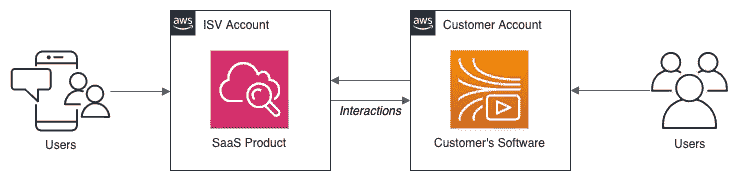

**例题**

*   [CloudCheckr](https://cloudcheckr.com/) 提供解决方案，帮助客户优化领先云提供商的成本、安全性和合规性。CloudCheckr 在 AWS Marketplace 上销售其[云管理平台](https://aws.amazon.com/marketplace/pp/B072LXGVZ5) SaaS 产品。CloudCheckr 使用 AWS IAM 跨帐户角色和亚马逊 S3 在客户的帐户和他们的 SaaS 产品之间交换数据。
*   [Splunk](https://www.splunk.com/) 为实时运营智能提供领先的软件平台。Splunk 在 AWS Marketplace 上销售其 [Splunk 云](https://aws.amazon.com/marketplace/pp/B06XK299KV) SaaS 产品。Splunk 云支持快速应用程序故障排除，确保安全性和合规性，并提供对关键业务服务的实时监控。根据他们的[文档](https://docs.splunk.com/Documentation/SplunkCloud/8.0.2001/Admin/AWSGDI)，Splunk 使用 AWS S3、亚马逊 SQS 和亚马逊 SNS 服务的组合将 AWS CloudTrail 日志从客户的帐户传输到 Splunk 云。

## 离散服务

离散 SaaS 产品是 SaaS 增强产品的变体。分立 SaaS 产品为客户的软件应用程序提供特定的、独特的功能。这些产品可能是 API、数据源或机器学习模型，通常完全通过供应商的 API 来访问。这些产品具有有限的或没有可视用户界面。这些 SaaS 产品有时被称为“服务即服务”。离散 SaaS 产品通常属于人工智能和机器学习、金融服务、参考数据以及认证和授权等类别。

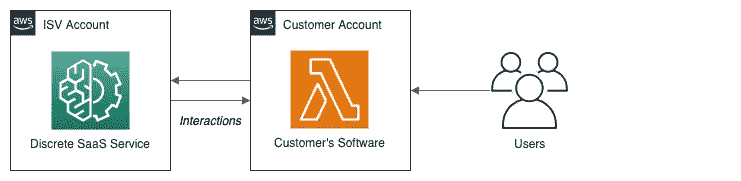

**例题**

*   [Twinword](https://www.twinword.com/) 提供了多种文本分析 API，包括[情感分析 API](https://aws.amazon.com/marketplace/pp/B072MPBGY3?qid=1582005238453&sr=0-2&ref_=srh_res_product_title) 、[文本相似度 API](https://aws.amazon.com/marketplace/pp/B071G93T67?qid=1582005238453&sr=0-1&ref_=srh_res_product_title) 、[情感分析 API](https://aws.amazon.com/marketplace/pp/B07FXSGDV5?qid=1582005238453&sr=0-3&ref_=srh_res_product_title) 和[文本分类 API](https://aws.amazon.com/marketplace/pp/B072MNWYD9?qid=1582005238453&sr=0-4&ref_=srh_res_product_title) ，均在 AWS Marketplace 上出售。API 根据每月的请求数量进行定价。
*   [Sensifai](https://sensifai.com/) 提供全面的视频识别系统，可用于标记视频和图片。Sensifai 提供了几个基于 SaaS 的 API，包括[自动视频识别](https://aws.amazon.com/marketplace/pp/B07F1933J3?ref_=srh_res_product_title)、[自动音频或声音分类](https://aws.amazon.com/marketplace/pp/prodview-pnpmf6jpxxdag?ref_=srh_res_product_title)和[动作识别(可训练算法)](https://aws.amazon.com/marketplace/pp/prodview-7rkbfhtga4eza?ref_=srh_res_product_title)，所有这些都在 AWS 市场上出售。

# 自动气象站数据交换

AWS Marketplace 上有一个新的产品类别。 [AWS 数据交换](https://aws.amazon.com/data-exchange/)于 2019 年 11 月发布，可以轻松在云端查找、订阅和使用第三方数据。据 AWS 称，数据交换供应商可以发布新数据，也可以自动发布对现有数据的修改并通知用户。一旦订阅了数据产品，客户就可以使用 AWS 数据交换 API 将数据加载到亚马逊 S3，然后使用各种 AWS 分析和机器学习服务进行分析。

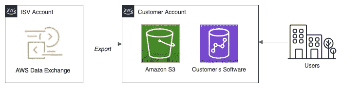

数据交换似乎最符合客户部署产品的描述。然而，考虑到供应商-订户关系的性质，数据可能会定期交换——由供应商修改和发布，由订户提取——我会将数据交换视为基于云的混合产品。

AWS 数据交换产品在 [AWS Marketplace](https://aws.amazon.com/marketplace/search/results?filters=FulfillmentOptionType&FulfillmentOptionType=AWSDataExchange) 上有售。合格的数据提供商越来越多，包括路透社、Foursquare、TransUnion、Pitney Bowes、IMDb、Epsilon、ADP、Dun & Bradstreet 等。如下图所示，数据集可用于金融服务、公共部门、医疗保健、媒体、电信等类别。

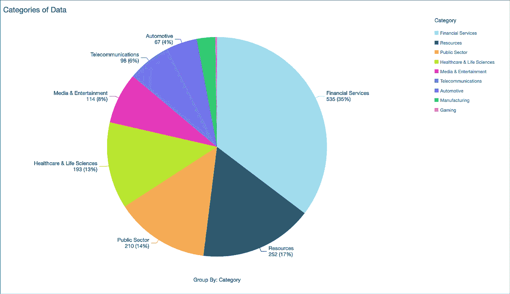

AWS 市场:数据交换产品类别(2020 年 2 月)

**例句**

*   [Dun & Bradstreet](https://www.dnb.com/) 目前在 AWS 市场上提供 30 多种数据产品，通过 AWS 数据交换交付。产品包括[直销服务—第一研究行业简介](https://aws.amazon.com/marketplace/pp/prodview-sfgp356t5lkus?ref_=srh_res_product_title)、[保险机构&券商—第一研究行业简介](https://aws.amazon.com/marketplace/pp/prodview-hvjmadrodszw4?ref_=srh_res_product_title)、[百货公司(美国)—行业营销档案](https://aws.amazon.com/marketplace/pp/prodview-g7avkntf4p6vy?ref_=srh_res_product_title)。Bradstreet 的数据集是基于 12 个月的订阅来定价的。
*   [路透社](https://www.reutersagency.com/en/reuters-for/machine-learning/)目前在 AWS 市场上有九种数据产品，通过 AWS 数据交换提供。产品包括[路透新闻档案:汽车(1 年)](https://aws.amazon.com/marketplace/pp/prodview-wo322feqtb5b2?ref_=srh_res_product_title)、[路透新闻档案:制药(1 年)](https://aws.amazon.com/marketplace/pp/prodview-vetc4mncmd67k?qid=1582172460661&sr=0-2&ref_=srh_res_product_title)、[路透新闻档案:能源(1 年)](https://aws.amazon.com/marketplace/pp/prodview-j6fylah44rvz4?qid=1582172460661&sr=0-6&ref_=srh_res_product_title)。
*   [SafeGraph](https://www.safegraph.com/) 提供美国商业场所的精确兴趣点(POI)数据、企业名录和商店访客洞察数据。SafeGraph 目前在 AWS Marketplace 上提供 23 种不同的产品，使用 AWS 数据交换交付，包括 [SafeGraph 核心场所——餐馆](https://aws.amazon.com/marketplace/pp/prodview-4335ycrdykska?qid=1582299059636&sr=0-2&ref_=srh_res_product_title)、 [SafeGraph 核心场所——全美](https://aws.amazon.com/marketplace/pp/prodview-v6fzqq76yyl4i?qid=1582299059636&sr=0-5&ref_=srh_res_product_title)和 [SafeGraph 步行交通模式(2019)——汽车经销商](https://aws.amazon.com/marketplace/pp/prodview-dz3qaipd3mjp2?qid=1582299278464&sr=0-12&ref_=srh_res_product_title)。

# 结论

在这第一篇文章中，我们已经熟悉了客户消费基于云的 IaaS、PaaS 和 SaaS 产品和服务的常见方式。我们还探讨了 ISV 向客户销售其软件产品的不同方式。在未来的帖子中，我们将研究不同的高级 SaaS 架构，回顾租户隔离策略，并探索 SaaS 供应商如何安全地与其客户的云帐户进行交互。最后，我们将讨论 SaaS 提供商如何满足最佳实践，比如来自 [AWS SaaS 工厂](https://aws.amazon.com/partners/saas-factory/)和 [AWS 良好架构框架](https://aws.amazon.com/architecture/well-architected/)的最佳实践。

# 参考

这里有一些很好的参考资料，可以让你了解更多关于在 AWS 上构建和管理 SaaS 产品的知识。

*   [AWS 上的 SaaS](https://aws.amazon.com/partners/saas-on-aws/)
*   [SaaS 成功案例](https://aws.amazon.com/partners/saas-on-aws/success/)
*   [AWS SaaS 工厂](https://aws.amazon.com/partners/saas-factory/)
*   [通过 AWS Marketplace 简化 SaaS 采购](https://aws.amazon.com/marketplace/saas)
*   [AWS 市场:基于软件即服务的产品](https://docs.aws.amazon.com/marketplace/latest/userguide/software-as-a-service-based-products-saas.html)

这篇博客代表我自己的观点，不代表我的雇主亚马逊网络服务公司。

*云计算镜像—版权所有 melpomen(*[*【123rf.com】*](https://www.123rf.com/)*)*