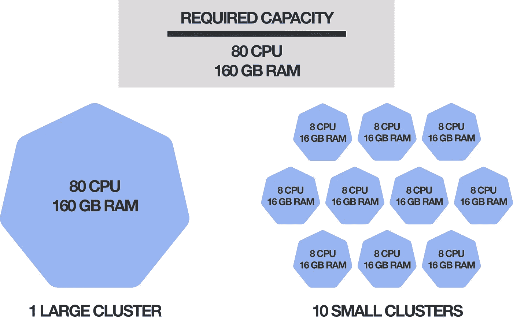

# 构建 Kubernetes 集群—选择集群大小

> 原文：<https://itnext.io/architecting-kubernetes-clusters-choosing-a-cluster-size-92f6feaa2908?source=collection_archive---------1----------------------->

本文讨论了运行一组给定的应用程序时使用许多小型集群或少数大型集群的利弊。

> 在文章 [**“构建 Kubernetes 集群-选择工作节点大小”**](/architecting-kubernetes-clusters-choosing-a-worker-node-size-b3729cc0c78f) *中讨论了选择许多小型或少数大型工作节点来实现给定集群容量的相关主题。*

# 内容

作为快速参考，以下是讨论过的优点(👍)和缺点(👎)的两个集群策略。

**几个大集群:**

*   👍 [**易于管理**](#a4a1)
*   👍 [**性价比**](#f738)
*   👍 [**最优资源利用**](#7cb1)
*   👎 [**单点故障**](#3259)
*   👎 [**缺乏隔离**](#c947)
*   👎 [**无名称空间资源的管理**](#9206)
*   👎 [**集群大小受限**](#2116)

**许多小星团:**

*   👍 [**强隔离**](#955c)
*   👍 [**减小爆炸半径**](#1fc2)
*   👍 [**粒度访问控制**](#c82f)
*   👍 [**集群可以自定义**](#a6b2)
*   👎 [**耗资巨大**](#4701)
*   👎 [**低效的资源使用**](#36d0)
*   👎 [**运营开销**](#d95c)

# 介绍

如果您想在 Kubernetes 上运行一组给定的应用程序，您会遇到一些关于如何使用 Kubernetes 集群的基本问题:

*   *我应该在同一个集群中运行所有应用程序，还是拥有多个集群？*
*   每个集群应该有多大？
*   *我应该在每个集群中运行哪些应用？*

一般来说，有两个基本的方向可以选择:大型集群(但数量较少)，其中运行相对较多的应用程序；或者小型集群(但数量较多)，每个集群中只运行少量应用程序。

这两种方法都是有效的，本文将讨论每种方法的优缺点。这将帮助您下定决心，决定哪种策略最适合您的用例。

# 所需容量

要运行一组给定的应用程序，您需要一定数量的计算资源，如 CPU 内核和内存。我们将这个所需的资源量称为*所需的容量*。

Kubernetes 集群提供一定数量的计算资源(这是*集群容量*，因此有多种方法可以将您所需的容量映射到 Kubernetes 集群。

例如，假设您需要 80 个 CPU 内核和 160 GB 内存。以下是使用 Kubernetes 实现这一目标的许多可能方式中的两种:

第一个选项通过单个集群提供所需的全部容量。因此，所有的应用程序都运行在同一个集群中(这个集群可能由许多或大型工作节点组成)。

第二个选项通过 10 个集群实现所需的容量，每个集群提供所需容量的十分之一。这意味着每个集群只托管应用程序的一个子集(这些集群可能只包含一些小的工作节点)。

*搭建好舞台之后，现在让我们来看看“少数大集群”和“许多小集群”这两种对立方法的利弊。*

# 大型集群

这种方法包括拥有更少但更大的集群。在最极端的情况下，这是一个运行所有应用程序的集群。

## 👍易于管理

单个集群比许多集群更容易管理。例如，更新 Kubernetes 可以作为一次性任务随意完成。这同样适用于其他集群组件的更新，如 DNS 服务或 CNI 插件。

这个列表还包括集群范围内服务的设置、配置和维护，比如监控、日志记录、跟踪、服务网格等等。如果您只有一个集群(或几个集群)，所有这些任务的操作开销相对较小。

另一方面，如果您有许多集群，一致地执行所有这些任务，并保持不同的集群同步，可能会带来一个主要问题。您需要投入时间和精力来开发有效管理集群的工具和流程。

## 👍成本效益高

大多数情况下，Kubernetes 集群会产生一些固定成本，这些成本与集群的容量无关。

例如，对于 AWS 和 GCP 的托管 Kubernetes 服务，[亚马逊弹性 Kubernetes 服务(EKS)](https://aws.amazon.com/eks/) 和[谷歌 Kubernetes 引擎(GKE)](https://cloud.google.com/kubernetes-engine) ，无论集群大小，您都必须为每个集群支付每小时 0.10 美元的费用。

这意味着，如果您有一个集群，您的固定成本为每月 73 美元，而如果您有 10 个集群，您的固定成本为每月 730 美元，即使两个集群提供的总容量相同(如上一节中的示例)。

> 这种定价方案的一个值得称赞的例外是 Azure 的托管 Kubernetes 服务，名为 [Azure Kubernetes 服务(AKS)](https://azure.microsoft.com/services/kubernetes-service/) ，目前每个集群没有固定成本。您只需为在集群中用作工作节点的计算实例支付正常费用。

即使您不使用托管的 Kubernetes 服务，而是自己管理 Kubernetes(内部或在云中),您的成本也可能会比使用少量(大型)集群的成本高。

这是因为，为了实现控制平面的高可用性，每个集群应该有多个主节点(通常是三个)。因此，如果您有 10 个集群，您需要留出作为主节点的机器数量是只有一个集群的 10 倍，并且以某种方式，您必须为这些机器付费。

## 👍最佳资源利用

Kubernetes 旨在优化利用集群的计算资源(CPU 和内存)。这是通过 [Kubernetes 调度器](https://kubernetes.io/docs/reference/command-line-tools-reference/kube-scheduler/)实现的，它根据这个 Pod 的资源配置文件为每个 Pod 选择一个最佳运行位置。

如果您将所有计算资源捆绑在一个集群中，由于剩余的资源块无法再使用，因此浪费的资源总量可能会减少。

例如，如果每个集群都有大约 0.25 个 CPU 核心和 250 MB 的剩余内存不能用于任何工作负载，而您有 100 个集群，那么您总共浪费了 25 个 CPU 核心和 25 GB 的内存。另一方面，如果只有一个集群，那么浪费的资源是微不足道的。

此外，每个集群的管理组件需要一些固定数量的资源，如主节点、etcd 和节点代理。如果您有小型集群，您只需要用于管理的资源比例(因此不能用于您的工作负载)要比大型集群高得多。

看到优点之后，让我们来看看大型集群的缺点。

## 👎单点故障

单个集群显然是单点故障。例如，如果所有主节点都出现故障，那么群集的整个控制平面都会关闭。控制平面也可能在其他方面受到损害，例如，如果 Kubernetes 版本的某些设置或更新产生了意想不到的影响。

在这些情况下，依赖于 Kubernetes API 的应用程序(如控制器、操作器或监控工具)会停止正常工作。虽然不依赖于 Kubernetes API 的应用程序看起来可能会继续工作，但这些应用程序不能再进行扩展、重新配置和从故障中恢复，并且您不能部署任何新的应用程序。

这同样适用于其他集群范围组件的故障，如 DNS 服务、CNI 插件或底层网络基础设施。

如果你所有的应用都在同一个集群中运行，那么*你所有的*应用都会受到这种故障的影响。另一方面，如果您的应用程序分布在多个集群中，其中一个集群出现故障所造成的损失会小得多。

## 👎缺乏孤立

Kubernetes 的重点是共享基础设施，而不是提供应用程序之间的隔离。在同一个 Kubernetes 集群中运行的所有应用程序共享某些基础设施，如网络和 DNS 服务。此外，在同一工作节点上运行的应用程序共享该节点的硬件(CPU 和内存)以及操作系统。

从安全性和合规性的角度来看，这可能是一个问题，特别是如果 Kubernetes 被用作多租户系统(即在同一个集群上运行不同客户的应用)。

例如，恶意应用可以利用其工作者节点的操作系统内核中的安全漏洞来访问数据，或者以其他方式阻止在同一工作者节点上运行的另一应用。

另一方面，如果不同的应用程序在完全不同的集群上运行，这些应用程序之间会有一个硬隔离(也就是说，它们不共享任何基础架构)，这样的安全漏洞是不可能的。

## 👎非命名空间资源的管理

集群可以用 [Kubernetes 名称空间](https://kubernetes.io/docs/concepts/overview/working-with-objects/namespaces/)来组织，这限制了 Kubernetes 资源的范围和可见性。名称空间也是组织集群中访问权限的基础。

然而，并不是所有的 Kubernetes 资源都有命名空间。有许多资源，如 [PersistentVolume](https://kubernetes.io/docs/reference/generated/kubernetes-api/v1.18/#persistentvolume-v1-core) 、 [PodSecurityPolicy](https://kubernetes.io/docs/reference/generated/kubernetes-api/v1.18/#podsecuritypolicy-v1beta1-policy) 、 [PriorityClass](https://kubernetes.io/docs/reference/generated/kubernetes-api/v1.18/#priorityclass-v1-scheduling-k8s-io) 、 [StorageClass](https://kubernetes.io/docs/reference/generated/kubernetes-api/v1.18/#storageclass-v1-storage-k8s-io) 和[CustomResourceDefinition](https://kubernetes.io/docs/reference/generated/kubernetes-api/v1.18/#customresourcedefinition-v1-apiextensions-k8s-io)，都没有绑定到名称空间，这意味着它们的作用域和可见性是整个集群。

> 您可以用`kubectl api-resources --namespaced=false`列出所有没有命名空间的 Kubernetes 资源。

如果您有一个包含许多应用程序和用户的大型集群，这些非命名空间资源就会累积起来，名称冲突和其他冲突的风险也会增加。您可能需要设计一些协调和限制来管理集群中非命名空间资源的使用。

此外，管理非命名空间资源需要集群范围的权限。如果您将此权限授予某个用户(例如，允许他们自己管理他们的[自定义资源定义](https://kubernetes.io/docs/concepts/extend-kubernetes/api-extension/custom-resources/))，此权限的范围会非常大，因为它还允许用户访问集群中所有其他应用程序和用户的非命名空间资源。

## 👎集群大小是有限的

Kubernetes 星团不可能无限扩大。Kubernetes 项目定义了 5000 个节点、150，000 个 pod 和 300，000 个容器的一些上限[在单个集群中仍然可以得到支持。](https://kubernetes.io/docs/setup/best-practices/cluster-large/)

这些限制的原因是大量节点、Pod 和容器给 Kubernetes 控制平面和其他集群范围的组件(如 DNS 和 Pod 网络实现)带来的压力

例如，大量的工作节点可能会使节点控制器或 etcd 存储后端过载，因为每个节点代理都会在 etcd 数据库上产生一个观察器。

您可以通过使用更大的节点来避免这个问题(这样您就需要更少的节点)。但这只会引入新的问题，因为每个节点的大量 Pods 可能会使节点代理过载，如 kubelet 和容器运行时(Kubernetes 项目建议每个节点运行不超过 100 个 Pods)。

> 工作者节点的大小和数量问题也在相关文章 [**“构建 Kubernetes 集群—选择工作者节点大小”**](/architecting-kubernetes-clusters-choosing-a-worker-node-size-b3729cc0c78f) 中讨论

一般来说，您的集群越大，您需要的硬件就越强大，您就越有可能遇到性能瓶颈，而这些瓶颈可能[很难解决](https://events19.lfasiallc.com/wp-content/uploads/2017/11/BoF_-Not-One-Size-Fits-All-How-to-Size-Kubernetes-Clusters_Guang-Ya-Liu-_-Sahdev-Zala.pdf)。

# 小集群

这种方法包括使用大量较小的集群来实现所需的容量。在最极端的情况下，这可能是每个应用程序的单独集群。

这种方法的优点很大程度上对应于前一种方法的缺点，反之亦然。然而，让我们总结一下最重要的几点。

## 👍强隔离

在不同集群中运行的应用程序彼此之间高度隔离。没有共享硬件，没有共享网络，也没有共享操作系统。因此，应用程序之间的安全漏洞风险大大降低。

> 如果节点本身只是运行在共享底层硬件上的虚拟机(VM ),这可能不完全正确，因为这通常是云环境中的情况。但是，VMs 提供的隔离仍然比 Kubernetes 提供的隔离大得多。

如果您的应用程序有严格的安全性要求或者属于不同的客户，这一点尤其重要。在这种情况下，解决方案可能是为每个客户建立一个单独的集群，以便不同客户的应用程序尽可能相互隔离。

## 👍减小爆炸半径

如果您有许多集群，并且其中一个集群出现故障，损害仅限于在该集群中运行的应用程序。因此，拥有许多小型集群可能是分散意外事件风险的一种策略。

## 👍粒度访问控制

如果你的集群很小并且很集中(也就是说，只托管一小部分应用程序)，那么很少的人(开发人员、测试人员、客户等等)。)需要能够访问每个集群。这大大降低了负面事件的风险，因为大多数错误都是人为造成的(如果发生了什么，损害也仅限于一个集群)。

一个特别有用的策略是将应用的生产版本转移到一个单独的集群中，并进一步锁定对该生产集群的访问。理想情况下，生产集群只能通过 CD 工具访问(也就是说，没有人可以访问)，这有助于消除最关键工作负载的人为错误风险。

## 👍集群可以定制

如果您的集群只专注于运行一小部分应用程序，那么您可以针对它们托管的应用程序定制这些集群。例如，如果一个应用程序需要 GPU 支持，您可以将一个 GPU 节点放在其集群中，而不必将该节点暴露给不需要它的其他应用程序(并且您需要防止被调度到该节点，例如，带有[污点和容差](https://kubernetes.io/docs/concepts/scheduling-eviction/taint-and-toleration/))。

这同样适用于其他集群配置，比如 CNI 插件。您可以选择最适合该集群中应用的 CNI 插件(例如，加密或不加密，有或没有[网络策略](https://kubernetes.io/docs/concepts/services-networking/network-policies/)支持，等等)。

列表中还有[准入控制器](https://kubernetes.io/docs/reference/access-authn-authz/admission-controllers/)、[认证方法](https://kubernetes.io/docs/reference/access-authn-authz/authentication/)、 [Kubernetes beta 特性](https://kubernetes.io/docs/reference/command-line-tools-reference/feature-gates/)等等，您可以为每个集群单独配置。

*看到优点之后，让我们来看看小集群的缺点。*

## 👎昂贵的

每个 Kubernetes 集群通常都有一个与其规模无关的固定成本，例如[亚马逊弹性 Kubernetes 服务(EKS)](https://aws.amazon.com/eks/) 和[谷歌 Kubernetes 引擎(GKE)](https://cloud.google.com/kubernetes-engine) 管理的 Kubernetes 服务的基本费率，或者如果您自己管理 Kubernetes，主节点的成本。

一般来说，10 个群集，每个群集提供 10%的所需容量，会比单个群集提供 100%的所需容量更昂贵。

## 👎低效的资源使用

每个集群都需要一些固定数量的资源来运行，这在很大程度上与其规模无关。例如，每个集群至少需要一个主节点(但是为了实现高可用性，最好有多个主节点)，而不管工作节点的类型和数量如何(因此也不管集群为运行的工作负载提供的容量如何)。

例如，如果您有 100 个集群，其中有 3 个工作节点，并且为了实现控制平面的高可用性，每个集群也有 3 个主节点，那么您将大约 50%的资源用于管理。

另一方面，如果您有一个包含 300 个工作节点的集群(提供与 100 个小集群相同的容量)，您仍然只需要 3 个主节点来管理这个集群，因此，您只使用了大约 1%的资源来进行管理。

> 一般来说，更多的工作节点需要更强大的主节点(但不一定是更多的主节点)。因此，大型集群的资源利用率也会有所降低，但没有小型集群那么高。这也在 [**“构建 Kubernetes 集群—选择工作者节点大小”**](/architecting-kubernetes-clusters-choosing-a-worker-node-size-b3729cc0c78f) 中讨论。

总的来说，如果您使用较小的集群，您很可能需要提供更高的资源总量，以达到运行工作负载的给定容量。

## 👎运营开销

高效且一致地管理大量(小型)集群是一项重要的任务。考虑更新、调整和修补集群范围的组件，比如 Kubernetes 本身、CNI 插件或容器运行时。您必须多次执行所有这些操作，最好是同时执行，以避免任何差异和配置偏差。

这个列表还包括您在集群中提供的服务，比如监控、日志记录、警报、跟踪或服务网格。这样的事情可能需要频繁地更新、重新配置和调整，同样，您必须能够在所有集群中以一致的方式做到这一点。

这很可能需要您开发工具和流程来自动完成这些任务，这需要时间和精力。因此，通过拥有许多小集群，您引入了必须解决的全新问题，即这些集群的管理，例如，如果您只有一个大集群，这种形式就不存在。

# 人们说什么

不久前(2019 年年中)，有一个关于新堆栈的[小型和非代表性调查，问了我们刚刚在本文中讨论的完全相同的问题:*“你更喜欢几个大集群还是许多小集群？”*](https://thenewstack.io/the-optimal-kubernetes-cluster-size-lets-look-at-the-data/)

在这些答复中，大约一半赞成小型集群，四分之一赞成大型集群。

然而，比原始数据更有趣的是人们给出的选择理由。

**大星团**的主要论点是:

*   **更好的资源利用**
*   **性价比更高**
*   **减少运营开销**

而支持**小集群**的主要论点是:

*   **大型集群的性能考虑事项**
*   **隔离和安全**
*   **减小爆炸半径**

这很好地总结了这两种方法的优缺点，正如我们在本文中刚刚讨论的那样。

我个人认为，小集群的投票数较高是因为使用小集群比使用大集群在概念上更简单。如果有疑问，您可以创建一个新的集群，这样您就有了一个全新的开始，避免了遇到大型集群可能带来的不可预见和难以解决的问题的风险，例如隔离和安全考虑、性能问题和访问管理。

另一方面，通过使用大型集群，你不得不处理和解决这些问题，以便有效和高效地使用集群，这可能需要相当多的实验和努力。这可能会吓跑很多人，因此偏向小集群。

然而，Kubernetes 仍然年轻，发展迅速。对大型集群的支持和稳定性在未来只会增加，我们很可能会看到该领域的一些最佳实践的发展。因此，大型集群很有可能在未来获得更多的认可。

# 结论

那么，应该使用几个大集群还是许多小集群呢？一如既往，答案取决于您的用例，本文中讨论的优点和缺点应该为您做出决定提供必要的关键点。

以下是一些需要考虑的最重要的问题:

*   如果您有严格的安全性要求，请考虑在单独的集群中运行关键工作负载。Kubernetes 目前无法提供足以满足多租户等用例的硬隔离和安全保证。
*   如果你的目标是最小化成本(包括资源和人力成本)，那么更大的集群无疑是一条可行之路。
*   无论您选择哪种场景，在单独的集群中运行应用程序的生产版本都是有意义的，因为这些工作负载的可靠性非常重要。

一个可能的策略是从两个集群开始，一个用于开发和测试，一个用于生产。然后，如有必要，您可以将安全敏感型工作负载划分到各自的集群中。一般来说，多个团队可以使用同一个集群，但是如果需要的话(例如，如果您的团队非常大)，集群也可以被团队分割。