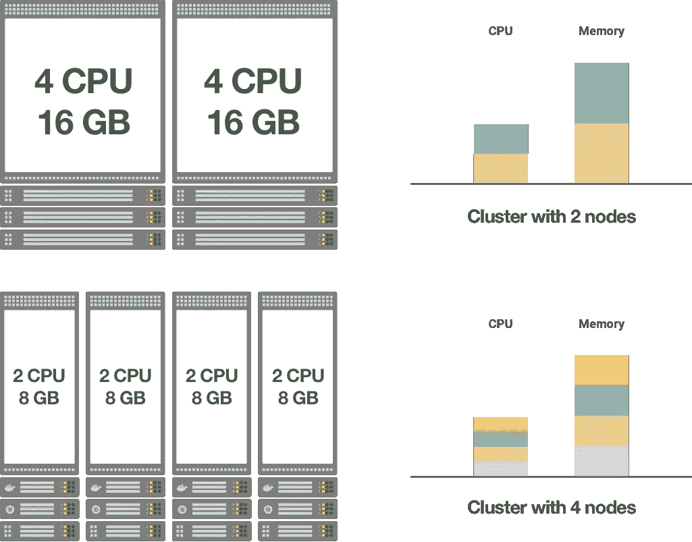
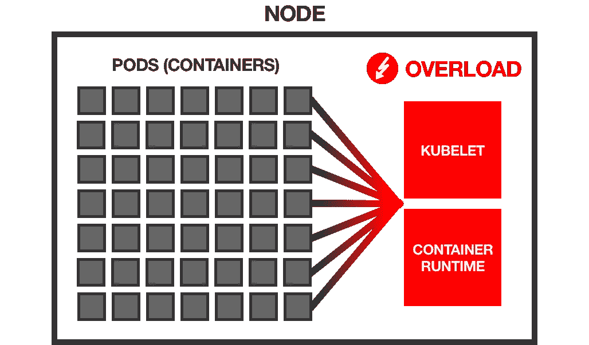
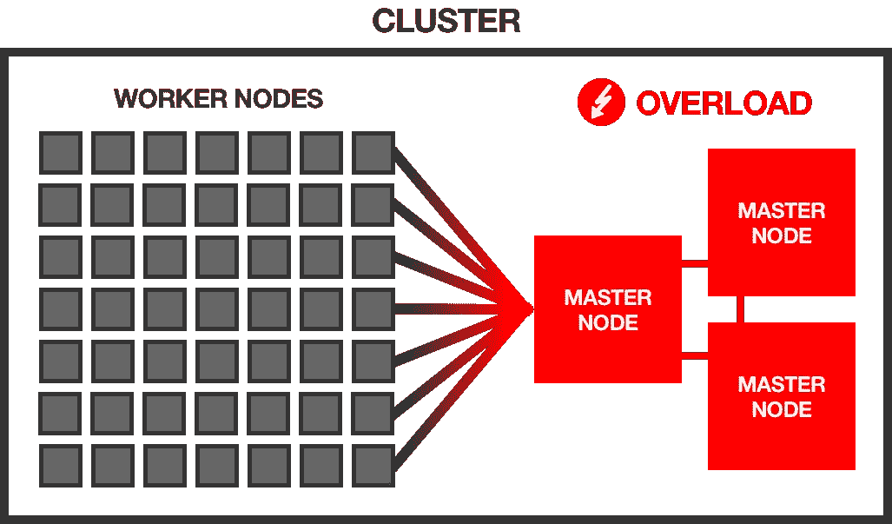

# 构建 Kubernetes 集群—选择工作节点大小

> 原文：<https://itnext.io/architecting-kubernetes-clusters-choosing-a-worker-node-size-b3729cc0c78f?source=collection_archive---------2----------------------->

本文讨论了在 Kubernetes 集群中使用许多小型或少数大型工作节点的利弊。

> 在文章 [**“构建 Kubernetes 集群—选择集群规模”**](https://medium.com/@weibeld/architecting-kubernetes-clusters-choosing-a-cluster-size-92f6feaa2908) 中讨论了使用许多小型或少数大型 Kubernetes 集群来运行一组给定的应用程序的相关主题。

*本文原载于*[*learn k8s . io*](https://learnk8s.io/kubernetes-node-size)*。*

# 内容

作为快速参考，以下是讨论过的优点(👍)和缺点(👎)的大小节点。

**大型节点:**

*   **👍** [**1。管理开销少**](#75c9)
*   **👍** [**2。降低每个节点的成本**](#38db)
*   **👍** [**3。允许运行资源密集型应用**](#db6f)
*   **👎** [**1。每个节点的大量单元**](#ac83)
*   **👎** [**2。有限复制**](#f79c)
*   **👎** [**3。更高的爆炸半径**和](#4619)
*   **👎** [**4。大比例增量**](#3b27)

**小节点:**

*   **👍** [**1。减小爆炸半径**](#58e6)
*   **👍** [**2。允许高复制**](#b9ca)
*   **👎** [**1。大量节点**](#648d)
*   **👎** [**2。更多系统开销**](#5de5)
*   **👎** [**3。降低资源利用率**](#f842)
*   **👎** [**4。小节点上的 Pod 限制**](#f0bc)

# 介绍

当您创建一个 Kubernetes 集群时，首先出现的一个问题是:“我应该使用什么类型的工作节点，应该有多少个？”。

如果您正在构建一个本地集群，您应该订购一些最新一代的 power 服务器，还是使用您数据中心中的十几台旧机器？

或者，如果你正在使用一个托管的 Kubernetes 服务，比如[谷歌 Kubernetes 引擎(GKE)](https://cloud.google.com/kubernetes-engine/) ，你应该使用八个`n1-standard-1`还是两个`n1-standard-4`实例来实现你想要的计算能力？

# 集群容量

一般来说，Kubernetes 集群可以被看作是将一组单独的节点抽象为一个大的“超级节点”。

这个超级节点的总计算能力(就 CPU 和内存而言)是所有组成节点能力的总和。

有多种方法可以实现群集的预期目标容量。

例如，假设您需要一个总容量为 8 个 CPU 内核和 32gb RAM 的集群。

> 例如，因为您希望在群集上运行的应用程序集需要这么多资源。

以下是设计集群的两种可能方式:

组织总容量为 8 个 CPU 内核和 32 GB 内存的集群的两种方式。

这两个选项都会产生具有相同容量的群集，但是左边的选项使用 4 个较小的节点，而右边的选项使用 2 个较大的节点。

*哪个比较好？*

走近这个问题，我们先来看看“大节点少”和“小节点多”这两个对立方向的利弊。

> 注意，本文中的“节点”总是指工作节点。主节点的数量和大小的选择是一个完全不同的话题。

# 几个大节点

这方面最极端的情况是由一个工作节点提供所需的全部集群容量。

在上面的示例中，这将是一个具有 16 个 CPU 内核和 16gb RAM 的工作节点。

*让我们来看看这种方法的优势。*

## 👍 1.更少的管理开销

简单地说，管理少量机器比管理大量机器更省力。

更新和补丁可以更快地应用，机器可以更容易地保持同步。

此外，机器数量少的情况下，预期故障的绝对数量比机器数量多的情况下少。

*但是，请注意，这主要适用于裸机服务器，不适用于云实例。*

如果您使用云实例(作为托管 Kubernetes 服务的一部分或您自己在云基础设施上安装的 Kubernetes)，您将底层机器的管理外包给了云提供商。

因此，管理云中的 10 个节点并不比管理云中的单个节点多多少。

## 👍 2.降低每个节点的成本

虽然更强大的机器比低端机器更贵，但价格上涨不一定是线性的。

换句话说，拥有 10 个 CPU 内核和 10gb RAM 的单台机器可能比拥有 1 个 CPU 内核和 1gb RAM 的 10 台机器便宜。

*但是，请注意，如果您使用云实例，这可能不适用。*

在目前主要云提供商[亚马逊 Web 服务](https://aws.amazon.com/ec2/pricing/on-demand/)、[谷歌云平台](https://cloud.google.com/compute/vm-instance-pricing)、[微软 Azure](https://azure.microsoft.com/en-us/pricing/calculator/#virtual-machines) 的定价方案中，实例价格随容量线性增长。

例如，在谷歌云平台上，64 个`n1-standard-1`实例的成本与单个`n1-standard-64`实例完全相同——两个选项都提供 64 个 CPU 内核和 240 GB 内存。

所以，在云中，你通常不能通过使用更大的机器来节省任何钱。

## 👍 3.允许运行资源密集型应用程序

拥有大型节点可能只是您希望在集群中运行的应用程序类型的一个需求。

例如，如果您有一个需要 8 GB 内存的机器学习应用程序，您就不能在只有 1 GB 内存的节点的集群上运行它。

但是您可以在具有 10 GB 内存的节点的集群上运行它。

*看到了优点，让我们看看缺点是什么。*

## 👎 1.每个节点有大量机架

在更少的节点上运行相同的工作负载自然意味着在每个节点上运行更多的 pod。

*这可能会成为一个问题。*

原因是每个 pod 都会给运行在节点上的 Kubernetes 代理带来一些开销，比如容器运行时(例如 Docker)、kubelet 和 cAdvisor。

例如，kubelet 对节点上的每个容器执行定期的活性和就绪性探测——容器越多，kubelet 在每次迭代中的工作量就越大。

cAdvisor 收集节点上所有容器的资源使用统计信息，kubelet 定期查询这些信息，并在其 API 上公开这些信息——同样，这意味着 cAdvisor 和 kubelet 在每次迭代中都要做更多的工作。

如果吊舱的数量变大，这些东西可能会开始降低系统的速度，甚至使其不可靠。

每个节点上的大量 pod 可能会使节点代理(如 kubelet)过载。

有报告称[节点被报告为未就绪](https://github.com/kubernetes/kubernetes/issues/45419)，因为常规的 kubelet 健康检查花费了太长时间来遍历节点上的所有容器。

*由于这些原因，Kubernetes* [*推荐每个节点最多 110 个 pod*](https://kubernetes.io/docs/setup/best-practices/cluster-large/)*。*

到目前为止，Kubernetes 已经过测试，可以在常见的节点类型上可靠地工作。

根据节点的性能，您可能能够成功地在每个节点上运行更多的 pods 但是很难预测事情是否会顺利运行或者您是否会遇到问题。

*大多数托管的 Kubernetes 服务甚至对每个节点的 pod 数量进行了硬性限制:*

*   在[Amazon Elastic Kubernetes Service(EKS)](https://github.com/awslabs/amazon-eks-ami/blob/master/files/eni-max-pods.txt)上，每个节点的最大 pod 数量取决于节点类型，范围从 4 到 737。
*   在[谷歌 Kubernetes 引擎(GKE)](https://cloud.google.com/kubernetes-engine/quotas) 上，限制是每个节点 100 个 pod，不管节点的类型。
*   在[Azure Kubernetes Service(AKS)](https://docs.microsoft.com/bs-latn-ba/azure/aks/configure-azure-cni#maximum-pods-per-node)上，默认限制是每个节点 30 个 pod，但可以增加到 250 个。

因此，如果您计划在每个节点上运行大量的 pods，那么您可能应该预先测试事情是否按预期工作。

## 👎 2.有限复制

少量的节点可能会限制应用程序的有效复制程度。

例如，如果您有一个由 5 个副本组成的高可用性应用程序，但您只有 2 个节点，那么该应用程序的有效复制程度将降低到 2。

这是因为这 5 个复制副本只能分布在 2 个节点上，如果其中一个出现故障，它可能会一次关闭多个复制副本。

另一方面，如果您至少有 5 个节点，每个副本可以在单独的节点上运行，单个节点的故障最多会导致一个副本停止运行。

因此，如果您有高可用性需求，您可能需要集群中一定数量的最小节点。

## 👎 3.更大的爆炸半径

如果只有几个节点，那么一个故障节点的影响会比有很多节点时更大。

例如，如果您只有两个节点，其中一个出现故障，那么大约一半的 pod 会消失。

Kubernetes 可以将故障节点的工作负载重新安排到其他节点上。

但是，如果只有几个节点，则剩余节点上没有足够的备用容量来容纳故障节点的所有工作负载的风险会更高。

其结果是，您的部分应用程序将永久关闭，直到您再次启动故障节点。

因此，如果您希望减少硬件故障的影响，您可能希望选择更多的节点。

## 👎 4.大比例增量

Kubernetes 为云基础设施提供了一个[集群自动缩放器](https://github.com/kubernetes/autoscaler/tree/master/cluster-autoscaler)，允许根据当前需求自动添加或删除节点。

如果您使用大节点，那么您有一个大的缩放增量，这使得缩放更加笨拙。

例如，如果您只有 2 个节点，那么添加一个额外的节点意味着将集群的容量增加 50%。

这可能比您实际需要的要多得多，这意味着您要为未使用的资源付费。

因此，如果您计划使用集群自动扩展，那么较小的节点可以实现更加流畅和经济高效的扩展行为。

*在讨论了几个大节点的利弊之后，让我们转向许多小节点的场景。*

# 许多小节点

这种方法包括用许多小节点而不是几个大节点组成集群。

*这种方法的利弊是什么？*

使用许多小节点的优点主要对应于使用少数大节点的缺点。

## 👍 1.减小爆炸半径

如果节点越多，每个节点上的 pod 自然就越少。

例如，如果您有 100 个单元和 10 个节点，那么每个节点平均只包含 10 个单元。

因此，如果其中一个节点出现故障，影响仅限于总工作负载的一小部分。

有可能只有你的一些应用程序受到影响，而且可能只有少量的副本，所以应用程序作为一个整体保持运行。

此外，剩余节点上很可能有足够的备用资源来容纳故障节点的工作负载，以便 Kubernetes 可以重新调度所有的 pods，并且您的应用程序可以相对较快地恢复到全功能状态。

## 👍 2.允许高度复制

如果您已经复制了高可用性应用程序和足够多的可用节点，Kubernetes 调度程序可以将每个副本分配给不同的节点。

> 您可以通过[节点亲合性](https://kubernetes.io/docs/concepts/configuration/assign-pod-node/#node-affinity)、 [pod 亲合性/反亲合性](https://kubernetes.io/docs/concepts/configuration/assign-pod-node/#inter-pod-affinity-and-anti-affinity)和[污染和容忍](https://kubernetes.io/docs/concepts/configuration/taint-and-toleration/)来影响调度程序的 pod 放置。

这意味着，如果一个节点出现故障，最多会有一个副本受到影响，而您的应用程序仍然可用。

*已经看到了使用许多小节点的优点，缺点是什么？*

## 👎 1.大量节点

如果使用较小的节点，自然需要更多的节点来实现给定的集群容量。

*但是大量的节点对于 Kubernetes 控制平面来说是一个挑战。*

例如，每个节点都需要能够与所有其他节点通信，这使得可能的通信路径数量以节点数量的平方增长，所有这些都必须由控制平面管理。

Kubernetes 控制器管理器中的节点控制器定期遍历集群中的所有节点来运行健康检查——更多的节点意味着节点控制器的更多负载。

更多的节点也意味着更多的 etcd 数据库负载——每个 kubelet 和 kube-proxy 都会产生一个 etcd 的 [watcher](https://etcd.io/docs/v3.3.12/dev-guide/interacting_v3/#watch-key-changes) 客户端(通过 API 服务器), etcd 必须向其广播对象更新。

一般来说，每个工作节点都会给主节点上的系统组件带来一些开销。

集群中的大量工作节点可能会使 Kubernetes 控制平面过载。

根据官方说法，Kubernetes 声称支持多达 5000 个节点的集群。

然而，在实践中，500 个节点可能已经[构成了不小的挑战](https://www.lfasiallc.com/wp-content/uploads/2017/11/BoF_-Not-One-Size-Fits-All-How-to-Size-Kubernetes-Clusters_Guang-Ya-Liu-_-Sahdev-Zala.pdf)。

大量工作节点的影响可以通过使用更高性能的主节点来减轻。

*实践中就是这么做的。*

以下是`kube-up`在[谷歌云平台(GCP)](https://cloud.google.com/compute/docs/machine-types) 上针对不同数量的工作节点使用的[主节点大小](https://kubernetes.io/docs/setup/best-practices/cluster-large/#size-of-master-and-master-components):

*   5 个工作节点→ `n1-standard-1`主节点
*   500 个工人节点→ `n1-standard-32`主节点

还有这里的[亚马逊网络服务(AWS)](https://aws.amazon.com/ec2/instance-types/) :

*   5 个工作节点→ `m3.medium`主节点
*   500 个工人节点→ `c4.8xlarge`主节点

如您所见，对于 500 个工作节点，所使用的主节点分别有 32 个和 36 个 CPU 内核以及 120 GB 和 60 GB 的内存。

这些都是相当大的机器！

因此，如果您打算使用大量小节点，您需要记住两件事:

1.  您拥有的工作节点越多，您需要的高性能主节点就越多。
2.  如果您计划使用 500 个以上的节点，您可能会遇到一些性能瓶颈，需要一些努力来解决。

> 像 [Virtual Kubelet](https://www.youtube.com/watch?v=v9cwYvuzROs) 这样的新开发允许绕过这些限制，允许集群拥有大量的工作节点。

## 👎 2.更多系统开销

Kubernetes 在每个 worker 节点上运行一组系统守护进程，包括容器运行时(例如 Docker)、kube-proxy 和包含 cAdvisor 的 kubelet。

> cAdvisor 包含在 kubelet 二进制文件中。

所有这些守护进程一起消耗固定数量的资源。

如果您使用许多小节点，那么这些系统组件使用的资源部分会更大。

例如，假设单个节点的所有系统守护程序一起使用 0.1 个 CPU 核心和 0.1 GB 内存。

如果您有一个包含 10 个 CPU 内核和 10 GB 内存的节点，那么守护程序将占用集群容量的 1%。

另一方面，如果您有 10 个节点，每个节点有 1 个 CPU 内核和 1 GB 内存，那么守护程序会消耗 10%的集群容量。

因此，在第二种情况下，你账单的 10%用于运行系统，而在第一种情况下，只有 1%。

因此，如果您想最大限度地提高基础设施支出的回报，那么您可能会选择更少的节点。

## 👎 3.较低的资源利用率

如果您使用较小的节点，那么您最终可能会得到大量的资源碎片，这些资源碎片太小而无法分配给任何工作负载，因此处于未使用状态。

例如，假设您的所有 pod 都需要 0.75 GB 的内存。

如果您有 10 个 1 GB 内存的节点，那么您可以运行 10 个这样的 pod，最终您会在每个节点上得到一块无法再使用的 0.25 GB 内存。

这意味着，集群总内存的 25%被浪费了。

另一方面，如果您使用具有 10 GB 内存的单个节点，那么您可以运行 13 个这样的 pods——最终您只能得到一个无法使用的 0.25 GB 的块。

在这种情况下，您只浪费了 2.5%的内存。

所以，如果你想最小化资源浪费，使用更大的节点可能会提供更好的结果。

## 👎 4.小节点上的 Pod 限制

*在一些云基础设施上，小节点上允许的最大 pod 数量比您想象的更受限制。*

这就是[Amazon Elastic Kubernetes Service(EKS)](https://aws.amazon.com/eks/)的情况，其中[每个节点的最大 pod 数量](https://github.com/awslabs/amazon-eks-ami/blob/master/files/eni-max-pods.txt)取决于实例类型。

例如，对于一个`t2.medium`实例，pod 的最大数量是 17，对于`t2.small`是 11，对于`t2.micro`是 4。

> 您可以在这个文件的[中找到每个 AWS EC2 实例类型的最大 pod 数量的概述。](https://github.com/awslabs/amazon-eks-ami/blob/master/files/eni-max-pods.txt)

*这些都是非常小的数字！*

任何超出这些限制的 pod 都无法被 Kubernetes 调度程序调度，并无限期地保持在*挂起*状态。

如果您没有意识到这些限制，这可能会导致难以发现的错误。

因此，如果你计划在亚马逊 EKS 上使用小节点，[检查相应的每个节点的 pod 限制](https://github.com/awslabs/amazon-eks-ami/blob/master/files/eni-max-pods.txt)，并计算两次节点是否能容纳你所有的 pod。

# 结论

*那么，您应该在集群中使用少量大节点还是大量小节点呢？*

一如既往，没有明确的答案。

您希望部署到集群的应用程序类型可能会指导您的决策。

例如，如果您的应用程序需要 10 GB 的内存，您可能不应该使用小节点——集群中的节点应该至少有 10 GB 的内存。

或者，如果您的应用程序需要 10 倍复制来实现高可用性，那么您可能不应该只使用 2 个节点，您的集群应该至少有 10 个节点。

对于介于两者之间的所有场景，这取决于您的具体需求。

*以上哪些优点和缺点与你相关？哪些不是？*

也就是说，没有规则要求所有节点必须具有相同的大小。

没有什么可以阻止您在集群中混合使用不同大小的节点——Kubernetes 集群的工作节点可以是完全异构的，这可能允许您权衡两种方法的优缺点。