# 跨 AWS 帐户构建安全性和治理第 3 部分:AWS 上的数据安全性。

> 原文：<https://itnext.io/architecting-security-governance-across-your-aws-accounts-4ee96b14ea08?source=collection_archive---------4----------------------->


**“把你学到的东西传下去。”~尤达**

***注意！*** *:这是一个多集系列的* ***第三集*** *。第一部分请点击**[***这里。***](/architecting-security-governance-across-your-aws-accounts-part-1-introduction-ae200624424d)**对于第二部分，请点击* [***这里***](/architecting-security-governance-across-your-aws-accounts-part-2-incident-response-on-aws-44b1ee01f1ee)**

> ***“公司在防火墙、加密和安全接入设备上花费数百万美元，这是金钱的浪费；这些措施都没有解决安全链中最薄弱的环节。”—* 凯文·米特尼克，“世界上最著名的黑客”**

**根据《2019 年云安全报告》，网络安全专业人士最关心的云安全问题是 ***数据丢失和泄露。这些信息对我们任何人来说都不应该感到惊讶，因为现在并不缺少数据泄露。数据从来没有像现在这样有价值，因为大公司愿意花大价钱来获取消费者的数据。尽管我很想谈论我们的数据有多珍贵，但我们需要继续前进。*****

****在我们开始之前，让我们讨论一下为什么我们甚至需要在云中加密我们的数据(业内人士对此怎么说？):****

> **1-合规性:您需要满足合规性要求，即 PCI-DSS**
> 
> **2-您试图保护您的数据免受您的云提供商的其他客户的影响**
> 
> **3-您试图保护您的数据免受云提供商的攻击**
> 
> **4-这是安全最佳实践**

****我们来翻译一下上面的:****

> **~我们需要最大限度地减少未经授权的数据物理访问**
> 
> **~我们需要减少对敏感数据的未经授权的逻辑访问**
> 
> **~我们需要实现数据完整性、机密性和可用性(CIA)**

**当然，我们不可能在一两篇文章中涵盖数据安全的所有方面，因为这是一个庞大的信息安全领域，关于这个主题的书籍已经有很多了。这篇文章旨在让作为安全或云工程师的你具备在 AWS 中有效实现数据安全的必要知识。**

**这篇文章的愿望是回答几年前我开始与 AWS 合作时的问题，试图了解加密和数据安全是如何工作的。我记得问过自己这类问题；“如果我今天加密了一个 EBS 卷，并在几个月后连接到一个 EC2 实例。这个 EC2 实例如何知道用于加密 EBS 卷的加密密钥？消息服务呢？他们如何处理加密？CloudHSM 是否与其他类似于 KMS 的 AWS 服务交互？KMS 会保存我的加密密钥吗？它会以明文形式存储它们吗？加密对我来说绝不是一个容易解释的话题。如果你试图从我这里理解它而迷失了方向，我不会责怪你。特别是如果你对这个主题不熟悉，我的目标是为你简化它。**

**AWS 有很多存储产品；这使得客户很难理解应该如何配置每个服务来安全地存储数据。数据要么通过线路传输，要么等待传输呼叫**

## **加密所有内容:**

**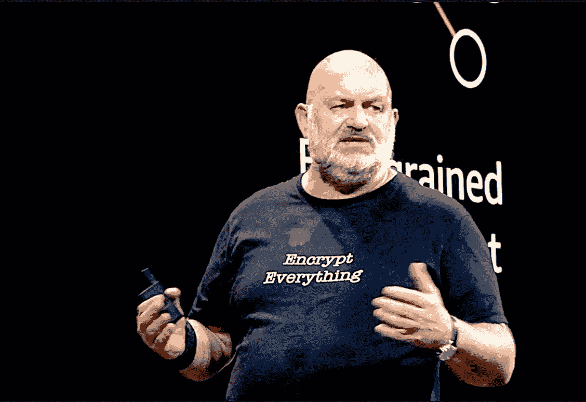**

****沃纳·威格尔~首席技术官 AWS****

**说真的，加密一切！如果你的企业大到足以让你迁移到 AWS，你就会明白为什么你需要加密一切。在大多数情况下，您所需要做的就是选中一个框或者调用一个 API 来启用加密。在 AWS 上启动并运行加密并不需要太多时间。然而，我们需要了解每个服务如何与您的密钥管理系统对话，以及每个服务如何处理数据加密。说到这里，让我们从我的开场白中谈到数据安全时的一个重要的 AWS 服务(AWS KMS)开始**

## **AWS 密钥管理系统**

> **AWS 密钥管理服务(KMS)使您可以轻松创建和管理密钥，并控制各种 AWS 服务和应用程序中的加密使用。AWS KMS 是一项安全且有弹性的服务，它使用已通过 FIPS 140–2 验证或正在验证的硬件安全模块来保护您的密钥。AWS KMS 与 AWS CloudTrail 集成，为您提供所有关键使用的日志，以帮助满足您的监管和合规需求。**

## **KMS 试图解决什么问题？**

**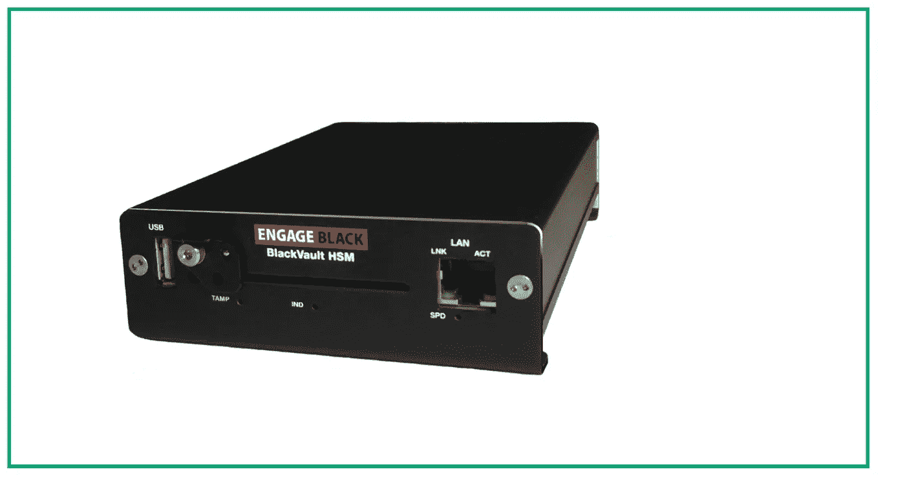**

****HSM 黑金库****

**假设您想要加密 EBS 卷中的一些数据，您可以使用 OpenSSL 轻松应用 AES 256 加密。这意味着您有一个需要保护的加密密钥。您再次对加密密钥进行双重加密以确保万无一失。然而，最终，您需要明文密钥来解密您的加密密钥，并最终解密您的加密数据。你把钥匙放在哪里？在优盘里？你投资了一些硬件安全模块，在这个超级安全的 HSM 之外，你的密钥永远不能以明文形式存在。您的应用程序需要扩大和缩小规模，生成万亿字节的数据，并对这些数据进行加密。如何使用您的本地 HMS 将这个明文密钥安全地传递到您的 EBS 卷？你不能。使用 KMS 可以让你谈论 AWS 管理的云 HSM，这意味着 KMS 只不过是一个存储这些明文密钥的接口。您的明文密钥在数千个 HSM 中复制，以实现高耐用性，因为这些密钥永远不会丢失。根据 AWS 的说法，HMS 中的密钥存储是 AWS 向其客户保证的最持久的信息。因此，使用 KMS 意味着您遵守联邦法规，因为您的密钥存储在 FIPS 140–2 投诉服务中心。您还可以让您的应用程序使用 API 来安全地与您的密钥对话。此外，您还将实现低延迟，因为您的数据不会离您的键太远！**

## **KMS 在工作。**

**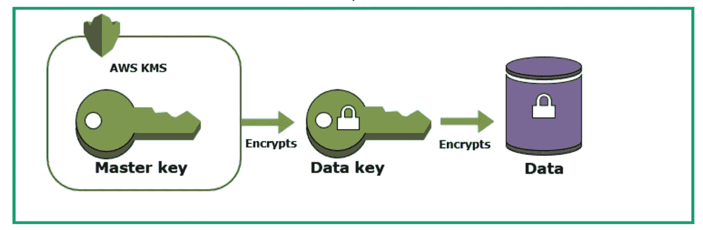**

**假设您的数据中心存储了一些重要的客户数据。您希望在 AWS 中存储两个数据副本，一个在亚马逊 S3，另一个在 EBS 卷。**

**为了加密 EBS 和 S3 中的数据，您决定使用 KMS。让我们把这件事做好，我们会边做边解释，因为我认为基于场景的插图是有意义的。**

****第一步**:要使用 KMS，我们需要创建一个**客户主密钥。**它是什么，为什么称之为客户主密钥？**

**客户主密钥(CMK)是用于加密您的数据加密密钥的实际加密材料的逻辑表示。等等，我不能用这个 CMK 加密我的数据吗？不，您使用 CMK 来加密用于加密您的数据的数据密钥。**

**什么是数据键和备份键？备份密钥是真正的加密材料，为你喜欢的 CMK 做加密。备份密钥存储在 AWS 批准的硬件中并受到保护，使用已经过[FIPS 140–2](https://en.wikipedia.org/wiki/FIPS_140-2)验证的硬件安全模块。数据密钥是 KMS 用来加密和解密数据的。数据密钥总是与数据一起加密存储(作为元数据)。等等，KMS 不储存数据密钥？不需要，数据键与数据一起存储在 S3 系统中，每个对象都有一个唯一的数据键，而在 EBS 中，每个卷都有自己的数据键。**

## **关于 CMK 的要点:**

**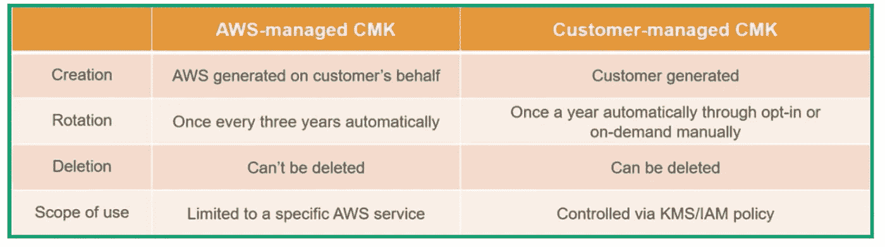**

**CMK 类型**

**CMK 被称为 CMK，因为“客户”管理钥匙的某些方面。AWS 也会代表您创建和管理主密钥，这就是为什么会有这样的区别:**

> ***1-客户创建密钥***
> 
> ***2-客户可以每年轮换密钥(有一个更频繁轮换的解决方案)***
> 
> ***3-客户管理对密钥的访问(谁可以旋转密钥、删除密钥、使用密钥进行加密操作)***
> 
> **4-您的存储服务和 CMK 必须位于同一地区**
> 
> **5-您不能导出 CMK**
> 
> **6-如果您删除了 CMK，您将无法读取您使用删除的 CMK 加密的数据(使用 IAM/SCP 来消除 CMK 删除！)**
> 
> **7- CMK 的价格是按密钥和使用情况计算的**
> 
> **8-您可以使用 OpenSSL 创建自己的加密材料(备份密钥),然后将其作为您的 CMK 的备份密钥上传到**
> 
> **9-一些 AWS 存储服务可以为您生成数据密钥**

**我们去找一个新的闪亮的 CMK 来加密我们的数据。**

****

**创造 CMK**

**我们还需要一个化名，CMK 的化名无非是指着你的 CMK。创建 CMK 时，AWS 会返回一个 CMK Id，您可以在使用 CMK 时参考该 Id。**

**CMK 别名的最大用处是利用它来更频繁地轮换您的 CMK 键。**

**假设您有一个法规遵从性要求，您需要每三个月更换一次 KMS CMK 密钥。因为 AWS 只允许每 12 个月自动轮换一次密钥。我们可以通过删除来旋转密钥。但是，请记住，如果删除密钥，您将无法读取使用删除的密钥加密的数据。CMK 化名拯救者。创建第一个 CMK 键时，请确保使用以下命令为其创建别名:**

```
**aws kms create-alias --target-key-id ca52d1a0-af36-4ab6-95b6-567fbf837e17 --alias-name "alias/Part3" --region us-east-1 --profile default**
```

**当需要旋转密钥时，创建一个新的 CMK，并将您的别名指向新的 CMK Id。请记住，CMK 别名应该在您的应用程序中硬编码，以便它们能够解密数据。接下来，KMS 将使用新创建的 CMK Id/旧别名来处理现有的数据密钥。**

**让我们创建一个 bucket 并将一个文件上传到其中，然后解释 AWS 如何对文件进行加密。**

**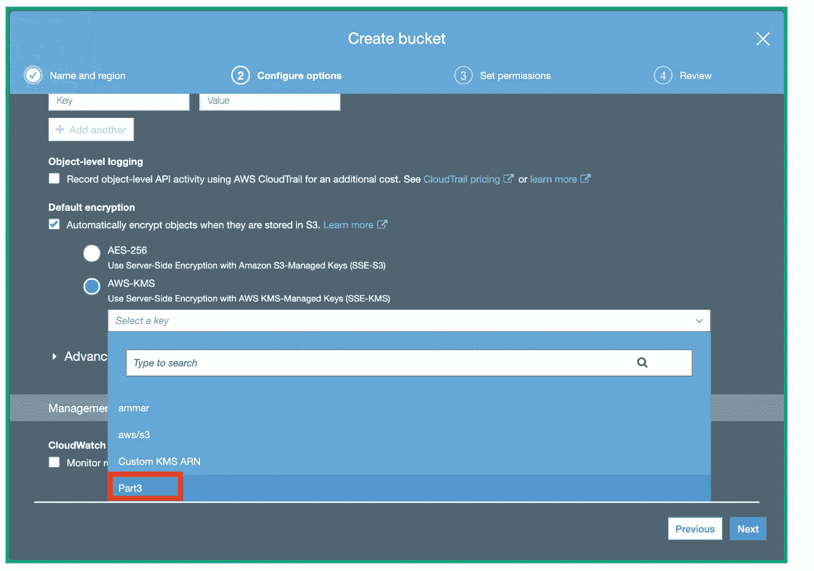**

**选择第 3 部分 KMS·CMK 作为加密对象元数据的新存储桶显示了我们的 CMK 的使用**

**如您所见，我们不必担心数据密钥生成，我们所要做的就是告诉我们的桶应该使用哪个 CMK。**

****信封加密:****

**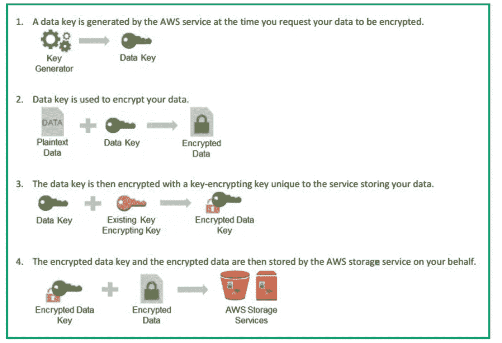**

****信封加密****

***每当我们将一个对象上传到我们的 S3 存储桶时，AWS 都会生成一个新的加密(数据)密钥，用于在将对象存储到磁盘之前对其进行加密。***

***对存储的对象进行加密意味着拥有存储在磁盘上的原始对象的攻击者在计算上无法对其进行解密，任何拥有该密钥的人都可以对其进行解密，因此数据密钥必须以相对无用的形式安全存储，这可以通过使用 CMK 对数据密钥进行加密来实现。***

**要解密该对象，您需要拥有该对象的唯一数据密钥，但即使您拥有该密钥，也无法用于解密数据，因为它也已被 CMK 加密。**

***要解密数据密钥，或至少代表您使用它，您必须拥有客户主密钥，或与控制客户主密钥并能代表您使用它的实体建立信任关系。***

***数据密钥非常小，因为 KMS 只支持对称加密，使用一个密钥来加密和解密数据。每个数据密钥只有几十个字节，这就是为什么 CMK 不用于加密大型对象，而只用于加密微小的数据密钥。当轮换客户主密钥时，特定于对象的加密(数据)密钥用旧的后备密钥解密，并用新的后备密钥重新加密。新的数据版本被存储，旧的版本被丢弃。***

***由于数据键的尺寸很小，当我们旋转 CMK AWS 时，税收并不多。AWS 必须只处理小型数据密钥，而不是使用数据密钥的天文对象。***

> **可以将几个类比引向公寓大楼，其中钥匙存储在公共锁箱中，其中改变锁箱锁将通过限制对公共锁箱的访问来限制对单独公寓钥匙的访问，从而限制将来对单独公寓的访问。这种类比不成立，因为除其他原因外，物理钥匙很容易被复制……但很明显，在这个例子中，更换锁箱锁(相对简单的操作)与更换一个或多个公寓的锁(更实质性的操作)无关。**
> 
> **总之，在这种情况下，他们会创建一个新的密钥来加密/解密您上传的每个对象，然后以加密的形式存储该密钥…作为一种预防措施，他们会定期地、对您透明地更改其存储的密钥表示。~ **迈克尔— sqlbot** [**堆栈溢出**](https://medium.com/u/d53dd768d047?source=post_page-----4ee96b14ea08--------------------------------)**

## **深度潜水:**

**让我们通过扮演一个 S3 桶请求数据密钥来加密和解密一个文本文件的角色来模拟上面的情况。希望这个过程能帮助我们理解幕后的工作原理。**

**1-生成数据密钥；这一步发生在我们上传一个对象到 s3 的时候。AWS 为我们生成一个用于加密数据的纯文本密钥和用于解密数据的 CiphertextBlob。在 S3 的情况下，CiphertextBlob 作为元数据与对象一起存储。**

**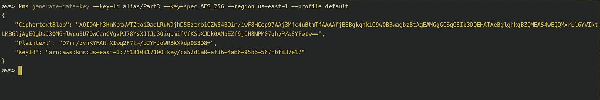**

**注意，我们提到的是别名，而不是 Id**

**我们需要跟踪 CiphertextBlob 和明文，以便进行后续操作。**

**我将它们保存在单独的文件中:**

```
**CiphertextBlob_base64_datakey.txt
Plaintext_base64_datakey.txt**
```

**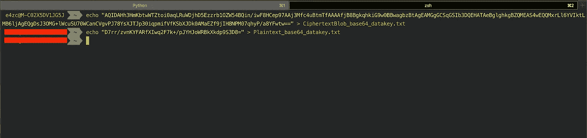**

**保存明文及其加密版本**

**让我们解码 Plaintext_base64_datakey.txt 文件，因为 KMS 希望我们解码 base64 编码的文件。最后，让我们使用 OpenSSL 和解码后的明文密钥加密一些数据。**

**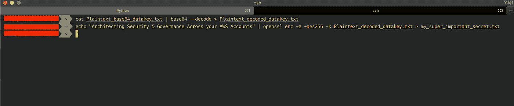**

**加密数据**

**解码和 base64 明文数据密钥已经完成了它们的工作，帮助我们加密我们的秘密，现在是我们摆脱它们的时候了！我们不再需要他们了。因为如果我们需要解密数据，加密版本(CiphertextBlob)具有所有需要的信息。**

**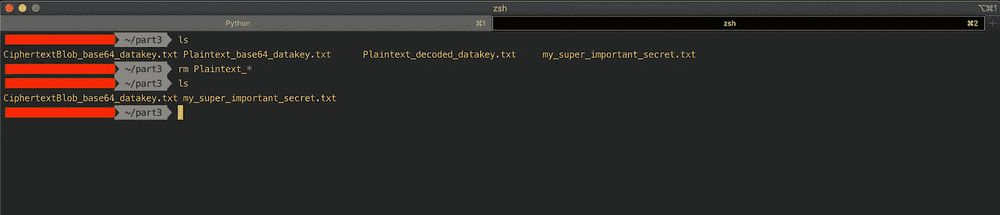**

**删除明文密钥**

## **反转关于(这次不截图):**

**要使用 KMS 解密加密的文件，我们需要运行以下命令**

**1-解码 base64 cipher text blob _ base64 _ data key . txt 文件:**

```
**cat CiphertextBlob_base64_datakey.txt | base64 --decode  > CiphertextBlob_decoded_datakey.txt**
```

**2-请 KMS 解密你的密码:**

```
**aws kms decrypt --ciphertext-blob CiphertextBlob_decoded_datakey.txt --region us-east-1 --profile default**
```

**这个命令应该返回解密数据所需的明文。我们首先将它保存在一个文件中，然后对它进行编码，最后对加密的数据文件运行以下命令:**

```
**cat my_super_important_secret.txt | openssl enc -d -aes256 -k plaintext_decode.txt**
```

**该命令应该返回“在您的 AWS 帐户中设计安全性和治理”，我们将它保存在我们的 cat my _ super _ important _ secret . txt 文件中**

## **KMS 接入政策:**

****

**[米尔科维](https://unsplash.com/@milkovi?utm_source=unsplash&utm_medium=referral&utm_content=creditCopyText)在 [Unsplash](https://unsplash.com/search/photos/secure?utm_source=unsplash&utm_medium=referral&utm_content=creditCopyText) 上的照片**

**意外或恶意删除 CMK 云比一开始就不用它来加密数据密钥更危险。不幸的是，你再也不能恢复密钥或读取加密数据了。**

**有两种方法来管理 KMS 密钥的安全性。您可以让您的安全团队在您的 AWS 安全帐户中创建这些密钥，然后与开发帐户共享它们。这种方法减少了不知道这些键是在哪里创建、管理等带来的压力。我的首选方法是允许开发人员在他们的开发帐户中创建这些密钥，这将有助于您更精细地管理密钥访问。您可以始终拥有一个服务控制策略来防止用户删除这些密钥。**

**这种技术还限制了爆炸半径，因为只有该帐户中的用户才能访问 KMS 密钥。但是，您可以始终使用密钥策略，只允许少数个人访问 KMS 密钥。总的来说，我喜欢看到密钥更靠近数据，因为当开发人员需要解决数据和加密密钥的问题时，这可以降低复杂性。**

**对于管理您的 KMS 关键政策，我认为您应该看看 [AWS 文档](https://docs.aws.amazon.com/kms/latest/developerguide/key-policies.html)，因为我认为它做得很好**

**因为我们上面的 KMS 讨论涉及了加密静态数据的很多方面。让我们通过快速总结 AWS 如何帮助您处理通过网络传输的加密数据来结束这个循环。**

## **运输安全中的 AWS 数据**

****

****AWS 雪地车****

**这意味着确保数据在内部和外部端点之间传输时得到加密和保护。应该使用 TLS、IPsec 和 MACsec 等协议用您控制的密钥对数据进行加密。**

****网络层加密:****

**如今，AWS 为客户提供了三种不同的选项来加密虚拟私有云内的流量。以下截图摘自 AWS 文档，总结了这些产品。**

**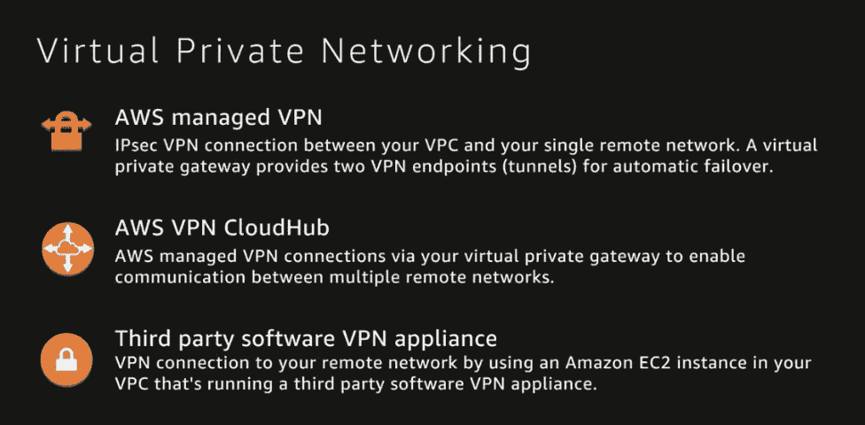**

**VPC 流量加密(第 4 层)**

**请记住，AWS 最近宣布，默认情况下，您的 VPC 内端点之间的所有流量都是加密的，这就是 AWS。**

****网页层加密:****

**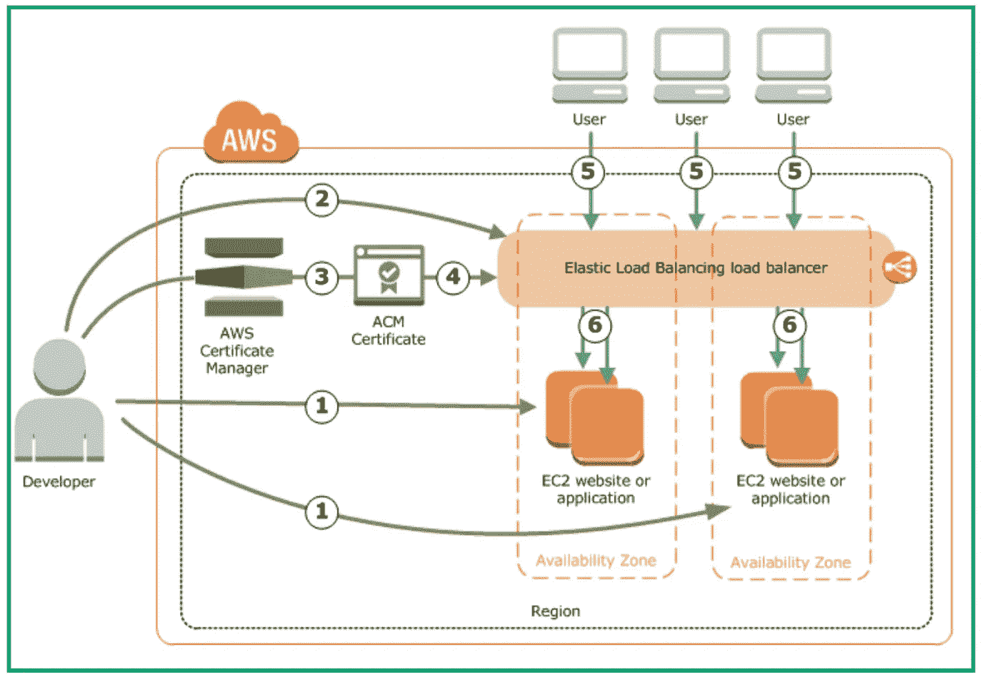**

**AWS 有一项名为 ACM (AWS Certificate Manager，AWS 证书管理器)的令人难以置信的服务，可以帮助您将私有和公共证书供应和推送至您的云资源。ACM 还将管理这些证书的轮换，您也可以获得类似于 KMS 的加密密钥。**

**ACM 正试图解决以下两个问题中的一些:**

****1-为面向公众的 AWS 云资源提供 TLS 证书:****

> **~阿尔布/NLB**
> 
> **~亚马逊云锋**
> 
> **~亚马逊 API 网关**

****2-处理 PKI 的棘手部分:****

> **~密钥对和 cets 签名请求生成和分发**
> 
> **~私钥的加密和安全存储**
> 
> **~ cert 的管理更新和开发**

**使用以下服务时，您可以导入自己的证书或使用 ACM:**

**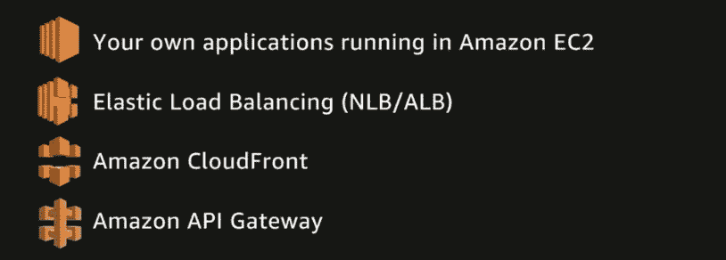**

**TLS 端点(HTTPS)**

## **感谢您的宝贵时间:)如果您希望看到更多关于 AWS 云安全的内容，或者您可以帮助我改进这些内容，请告诉我们。**