# 跨您的 AWS 帐户构建安全性和治理第 2 部分:AWS 上的事件响应。

> 原文：<https://itnext.io/architecting-security-governance-across-your-aws-accounts-part-2-incident-response-on-aws-44b1ee01f1ee?source=collection_archive---------1----------------------->

***注*** *:这是一个多部分系列的第 2 部分。第一部分请点击**[***这里。***](/architecting-security-governance-across-your-aws-accounts-part-1-introduction-ae200624424d)*

*这是“跨您的 AWS 帐户构建安全性和治理”的第二部分系列。在这一部分中，我们将在 AWS 云上探索事故响应计划的狭窄通道；我们还将使用云托管实施有趣的自动化事件响应活动。*

*“建立一个声誉需要 20 年，而几分钟的网络事件就能毁掉它。”― ***夏羽纳珀****

> *根据 [**NIST**](https://www.nist.gov/) 的说法，安全事件是指*“实际或潜在危害信息系统或系统处理、存储或传输的信息的保密性、完整性或可用性，或构成违反或即将违反安全策略、安全程序或可接受的使用策略的事件。”**

*好吧，那就是满嘴，我们简化一下。事件是对您的 IT 服务的意外降级。*

*在这一部分中，我们将了解流程、AWS 服务以及您轻松应对安全漏洞的雾夜所需的策略。*

*有大量的事件响应框架，它们详细解释了您需要为有效的事件响应团队、行动手册和流程自动化实现什么。*

# *让我们从谈论 AWS 上的事件响应阶段和攻击面开始，然后尝试将 AWS Lambda 招募到我们的事件响应团队，以便在出现问题时提供帮助；希望我们能付得起 Lambda 的工资:)*

# *云中的事件响应阶段(NIST)*

*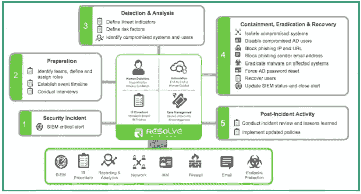*

*参考:NIST SP 800–53，第 4 版*

*当谈到响应安全事件时，与传统数据中心相比，云中的阶段没有太大变化，但技术实现确实发生了显著的改善。让我们探索阶段。*

***高效运行手册的七个事件响应阶段***

*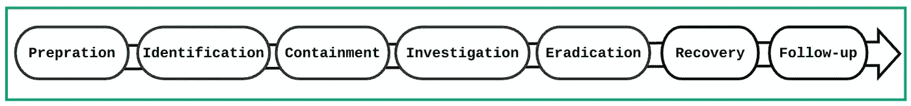*

# *1-准备阶段:*

*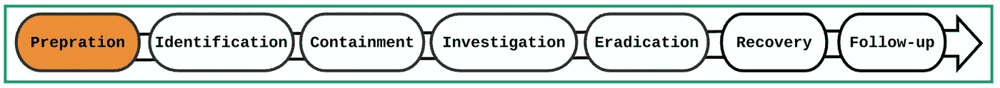*

***准备阶段***

*这个阶段是关于，你猜对了，准备工作。我们需要做好准备，首先完成威胁建模，缩小攻击面，并采取任何必要的主动措施来防止安全事件的发生。我们需要启用****监控******加密*****限制*****爆炸半径*** 。**

## **通过应用主动措施做好准备:**

***1-* ***数据分类*** *:确定数据的敏感级别、所有者和安全需求。***

***2-* ***所有权*** *:所有的资源都应该被标记，知道谁拥有一组受损的资源是很好的，所有者至少可以向您提供关于可能导致受损的资源或配置中的数据存储的敏感级别的信息。提示:我们应该始终标记我们的资源！***

**3- ***风险管理*** : *识别威胁、风险和漏洞，弄清楚你的风险偏好，然后根据你愿意容忍的风险水平来管理你的风险和漏洞。***

***4-* ***弹性:*** *架构高度可用、容错的基础设施。提示:使用 AWS well architect 工具并阅读 well-architect 白皮书。***

**5- ***最小特权原则*** : *使用 AWS IAM 和资源策略，只将* ***有限访问权限*** *授予那些需要访问数据或在您的环境中操作的人。***

**6- ***测试(比赛天数):*** *测试* *你的突发事件应对方案。我相信在真正的安全事故发生之前，您会发现您可以解决的缺点。***

## **通过记录所有内容做好准备:**

**没有理由不在所有帐户和地区启用 CloudTrail 和其他日志服务。如果发生违规事件，您将没有证据来告诉您的资产发生了什么。**

**当您启用 CloudTrail 时，您接触的任何 AWS 服务都将在 Cloudtrail 中记录对它们采取的操作，cloud trail 也可以与 CloudWatch 和日志集成，并将存储在一个集中的 **s3 bucket** 中。**

**CloudWatch 事件可以被 **AWS Lambda** 用于实时补救，被 **SNS** 用于实时通知。无论您使用 SDK、控制台还是 AWS CLI，所有操作都将被记录下来。你对 AWS 资源采取的任何行动都可能被用来对付你:)我知道这是不好的，我保证不会再这样做了。最后，请不要忘记启用 ClouTrail 日志文件验证。**

**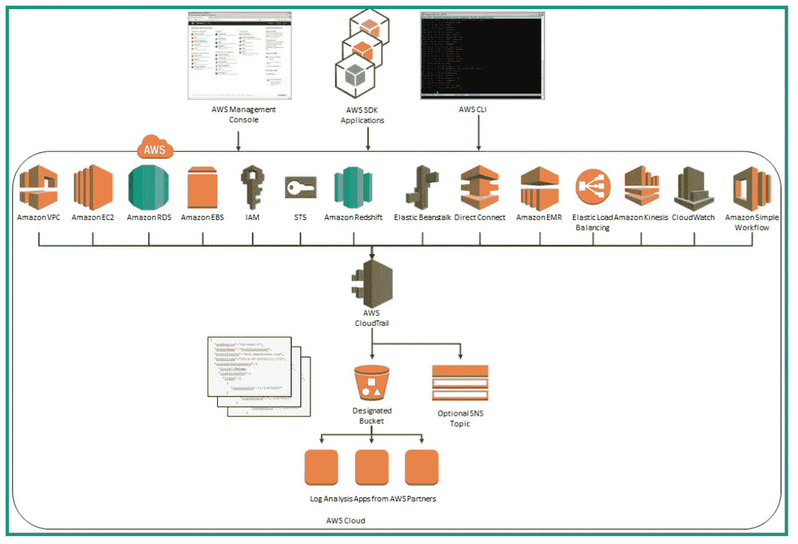**

****CloudTrail 工作流程****

## **通过限制爆炸半径来做准备**

**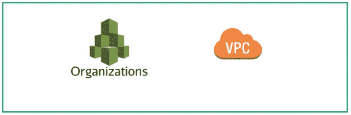**

**爆炸半径**

**使用 AWS 组织和 VPC、子网 NACLs、EC2 安全组等。，通过根据业务部门、产品等隔离 AWS 帐户和资源来限制爆炸半径..**

**这种方法与深度防御等原则相结合，可以更好地抵御威胁。**

## **通过加密所有内容做好准备:**

> **数据隐私专家会告诉你，“把你的数据当成每个人都在看，因为他们可能一直在看。”**

**加密是通过使用加密算法和加密密钥来屏蔽数据的过程。如果使用强大的加密算法，不良分子将无法以明文形式读取您的数据，如果他们能够在传输中截获数据或在静止状态下访问数据的话。**

**AWS 为您提供加密数据的选项，包括但不限于 KMS。**

**AWS KMS 和其他直接加密数据的服务使用一种称为 ***信封*** 加密的方法来提供性能和安全性之间的平衡。见下文:**

**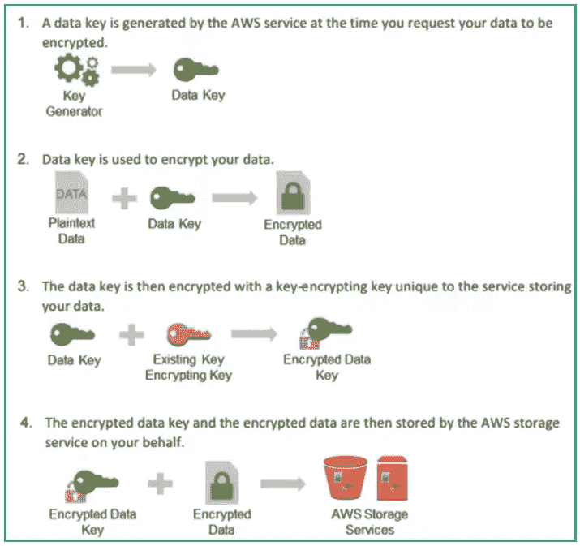**

****服务器端加密****

# **2-识别阶段:**

**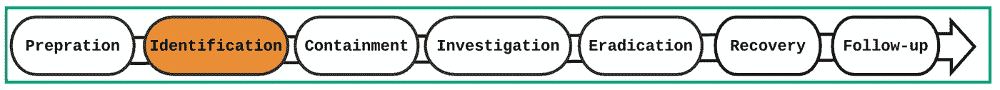**

****识别阶段****

**危害迹象很多，例如 AWS GuardDuty 高严重性警报，说明您的 EC2 实例正在向与比特币采矿相关的域发出出站调用，或者最好不是生产服务停止。**

**识别阶段是我们发现事故正在发生的阶段。实施识别阶段的最佳方式是确保为您认为重要的所有安全发现设置警报，例如 AWS root 帐户登录。**

****如果你意识到事故已经发生，你需要回答以下问题:****

***1-* ***为什么:*** *了解违规背后的意图是什么，可以帮助你识别产品和资源范围以及攻击的性质。***

***2-* ***什么:*** *识别丢失的数据和损坏的资源，以及* ***什么*** *你需要清理和、隔离、缓解的精力和资源。***

***3-* ***如何:*** *找出他们利用来获得对您系统的未授权访问的弱点。***

***4-* ***何时:*** *确保跟踪所有事件***

***5-* ***谁:*** *谁* *是坏演员。***

**当涉及到识别安全问题时，依靠人类是一种糟糕的做法，因为我们不像机器一样善于关联离群值和异常值。使用 AWS 服务的自动化事件响应是一条出路，您也可以通过应用机器学习和安全分析来实现这一点。**

# **3-遏制阶段:**

**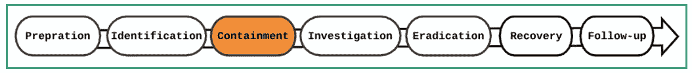**

**遏制阶段:**

**你已经通过了所有繁琐的鉴定步骤现在呢？这个阶段包括消除安全威胁。**

**我们应该有一个 Cloudformation 或 Terraform 模板，它拥有为取证调查构建隔离环境所需的所有资源。我们需要采取的一些措施包括:**

***1-将您的 AWS 帐户转移到一个拥有非常严格的 AWS 组织服务控制政策的组织单位。***

***2-拒绝访问应该应用于 s3 存储桶***

***3-限制安全组，因此他们只允许指定用于调查的端口。***

***4-全球 DENY * IAM 政策应附加到不涉及此阶段的所有实体***

**应部署自动化来阻止受损的资源、快照卷、禁用 KMS 加密密钥和更改的 Route53 记录集。**

# **4-调查阶段:**

****

**调查阶段**

**调查阶段包括遏制阶段之后的活动，包括但不限于取证和一般日志分析。调查阶段应揭示事件发生的时间，不良行为者采取了什么行动来访问我们的系统，违规的副作用是什么，以及根据目前收集的证据，这种违规再次发生的可能性。如前所述，调查应在隔离的环境中进行。**

## **您可以使用的服务:**

***1- VPC 流量日志。***

***2- CloudTrail。***

***三云观察。***

***4- Athena 用于分析日志。***

# **5-根除阶段:**

**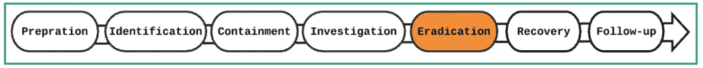**

**根除阶段**

**这个阶段包括小心处理受影响的资源。如果有必要，我们会删除资源，并将健康和清洁资源转移到更安全的环境中。**

**攻击者应该无法破译加密数据，这意味着我们可以执行以下一些操作:**

**1-禁用或删除 KMS 键**

**2-从 EBS 卷中删除溢出的文件，并将干净的数据移动到新的加密 EBS 卷中**

**3-删除由 s3 服务器端加密加密的 s3 对象**

**4-删除加密的 s3 对象和用 KMS 或客户密钥加密的 s3 对象的加密 cmk**

**如果数据未加密，您唯一的选择是从您可以保证未被篡改的最后一个已知良好状态恢复您的存储资源。**

# **6-恢复阶段:**

**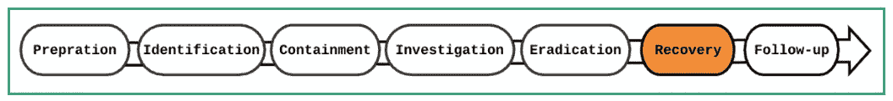**

**恢复阶段**

**现在，我们已经尽了一切努力来确定发生了什么，并且尽了最大努力来执行数据清理，我们需要将我们的运营恢复到正常状态。**

**我们可以在此阶段执行的一些操作:**

**1-恢复资源。**

**2-恢复网络连接。**

**3-使用新的和改进的访问控制策略和加密密钥。**

**4-监控你周围的任何异常行为。**

# **7-后续阶段:**

**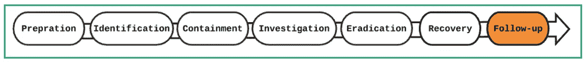**

**后续阶段**

**跟进阶段(也称为事后分析)是关于吸取的教训和需要实施的跟进活动，以避免新的安全事件并改进我们的事件操作手册。**

# **自动化**

**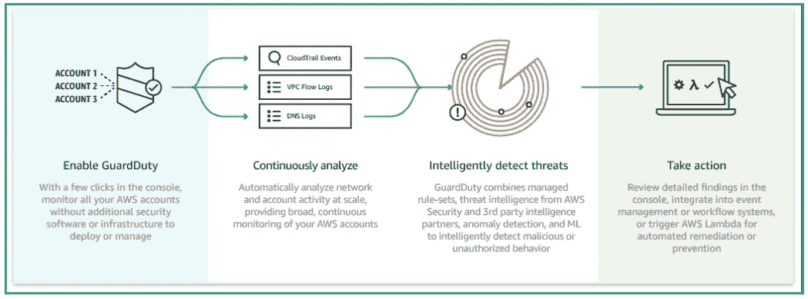**

**AWS 门卫自动化工作流程**

**如果你已经做到了，谢谢你！让我们动手实践一个用例，这个用例应该能够让我们理解到目前为止所讨论的想法。最后，如果你不去做，光有一个可靠的计划是不够的。**

****对于这项活动，我们需要以下内容:****

**1-隔离的 AWS 环境。**请不要使用您的生产环境，因为此活动会消耗资源。****

**2-在**隔离的** AWS 环境中， **AWS GuardDuty** 必须启用，以便它生成将由 **CloudWatch** 事件和 AWS **Lambda** 消耗的结果。**

**3-一个 EC2 实例(t2.micro)，为了生成一些安全发现，我们可以打开所有端口或类似的东西。**

**4-我们将设置 [**云托管**](https://github.com/cloud-custodian/cloud-custodian) ，以便它部署此活动所需的无服务器组件。**

*****注意*** *—您需要将云托管部署到您启用了*守护任务*的同一区域。***

**当我们的云托管策略检测到由 AWS GuardDuty 生成的中/高严重性发现时，该解决方案非常简单，它应该对范围内的资源采取措施。**

****托管人将对受损的 EC2 实例采取什么行动*和*:****

***1-删除附加到 EC2 实例的 IAM 角色。***

***2-停止 EC2 实例。***

***3-对卷进行快照，以便进行取证调查。***

**让我们从安装云托管开始，并编写我们的第一个策略。在您的终端中运行以下命令来安装 CC:**

****

**安装云托管**

**然后，用以下内容创建一个名为`custodian.yml`的文件:**

**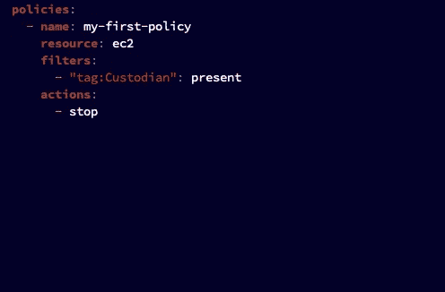**

**你的第一份保单**

**这个策略所做的就是停止任何带有标签关键字“保管人”的 EC2 实例。**

**运行您的第一个策略:**

**我假设您正在使用配置文件通过 CLI 访问您的 AWS 帐户，如果没有，您可以查看如何使用 API 密钥对保管人进行身份验证，或者保管人承担角色命令，如果您正在使用配置文件，下面是如何使用 AWS CLI 配置文件在本地运行该策略，这意味着该策略不会基于 CloudTrail 生成的事件或预定义的计划运行。**

****

**如果成功，您应该会在命令行上看到类似以下内容的输出:**

**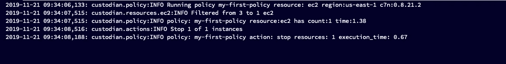**

**现在，您是一名能够在 AWS 上实现安全自动化的云托管专家，让我们拿出真正的策略吧！**

**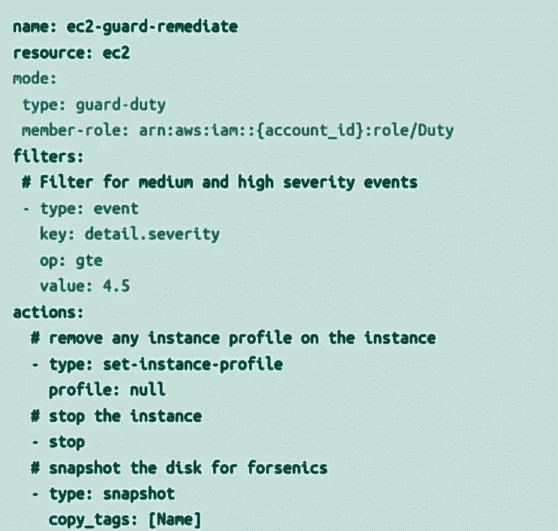**

**真正的交易**

**遵循为您的第一份保单提供的步骤；编写策略，保存它，并将其部署到一个**隔离的** AWS 环境中，然后看看它的神奇之处。如果 GuardDuty 生成了发现，那么策略 Lambda 将消费生成的事件，并通过采取我们上面解释的动作来做出反应。**

****好吧！事件响应部分到此为止！****

****

****感谢您花费宝贵的时间！如果您想了解更多，请点击**👏 ***这样别人就能看到了*****最重要的是在社区评论里分享你的经验。****