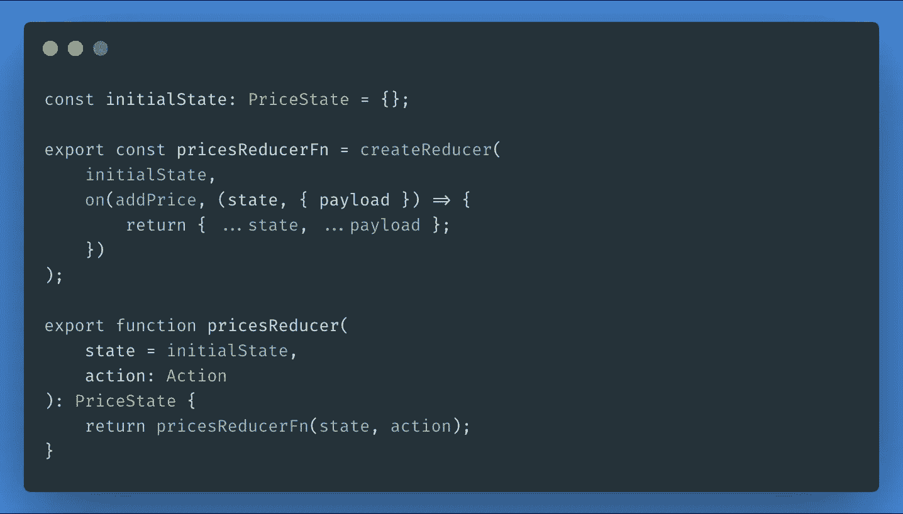
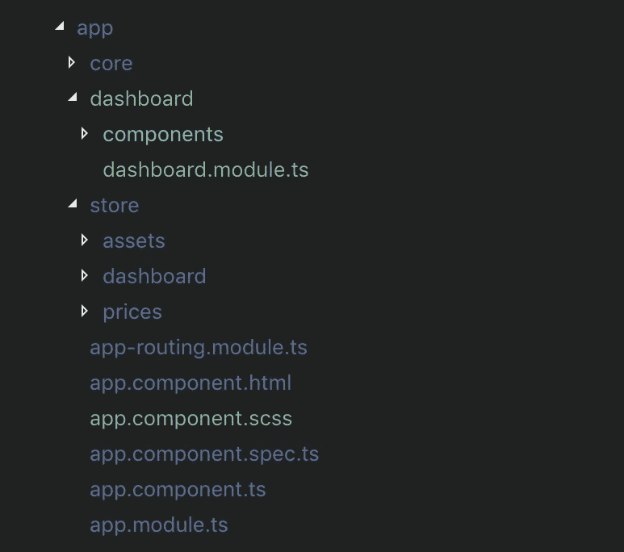
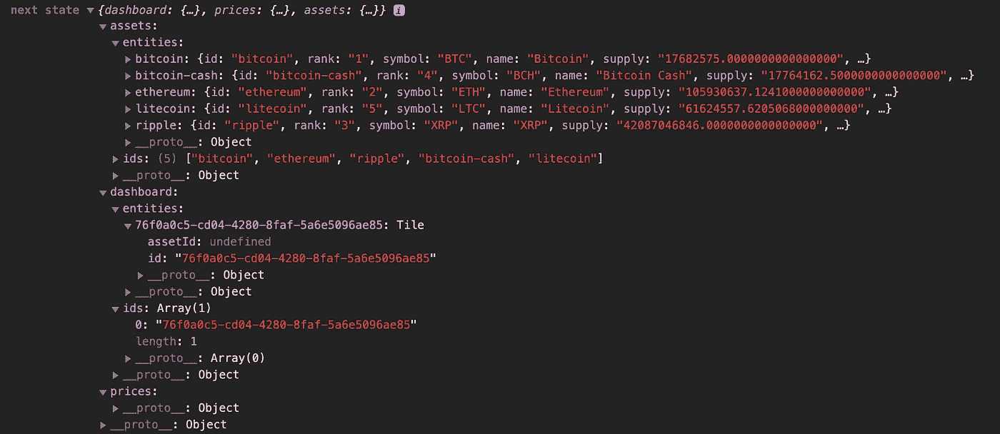

# 在 NGRX 中构建商店

> 原文：<https://itnext.io/architecting-the-store-in-ngrx-e4955641d746?source=collection_archive---------7----------------------->

## 在 NGRX 中构建和设计商店的分步指南



这是系列文章的第二篇，旨在详细解释用 NGRX 构建 Angular 应用程序的一步一步的方法。

在本系列的第一篇文章[中，我写了一篇关于 NGRX 平台所有概念的概述。](/state-management-with-ngrx-introduction-1aae0803e988)

如果您从未使用过 NGRX，或者从未深入研究过，我真的建议您阅读它。

## NGRX 8

在前一篇文章中，使用当前的 NGRX 版本解释了这些概念。为了让文章保持最新，从现在开始，我将使用 NGRX version 8 中发布的最新特性来介绍和解释相同的概念。外面有些很酷的东西！

特别是，我们将了解如何创建:

*   使用`createAction`的动作
*   带`createReducer`的减速器
*   与`createEffect`的效果(在下一篇文章中)

## 这篇文章是关于什么的？

相反，在本文中，我们将探索构建构成我们的存储的实体的过程，并将为每个实体设置实体适配器、动作和 reducers。

作为我之前关于[创建可伸缩文件夹结构](/building-an-enterprise-grade-angular-project-structure-f5be32533ba3)的一篇文章的后续，我们将看到一个创建存储模块作为由我们的域模块导入的服务模块的例子。

我们将开始构建一个应用程序，从 [Coincap](https://coincap.io) **中检索实时加密价格，并在一个可定制的仪表板中显示它们。

***我浏览了各种获取实时价格的网站，Coincap 是迄今为止最简单、最清晰的提供商。向团队致敬！*

# 设置角度和 NGRX

让我们看看如何设置 Angular 应用程序和 NGRX。

## Angular CLI 工作空间

您可能要做的第一件事是用 Angular CLI 创建一个新的应用程序，并添加路由和样式参数。

`ng new <app> --routing --style=scss`

## NGRX

让我们安装使用 NGRX 所需的所有库:

`npm i @ngrx/store @ngrx/effects @ngrx/entity`

你差不多都准备好了！

在本系列的最后，我将在 Github 上发布整个应用程序，这样您就可以使用自己的项目运行或复制粘贴代码。

# 项目的文件夹结构

让我们简单看一下我选择的项目结构:



*   **`**store**`里有什么？
    在`store`中的每个文件夹都是一个 Angular 服务模块，它只是为仪表板模块设置 NGRX 存储和效果，仪表板模块是一个域模块，我们的应用程序的智能组件就放在这个域模块中。**

**让我们来看看`DashboardStoreModule`这个还是很简单的:**

```
@NgModule({
    imports: [
        StoreModule.forFeature('dashboard', dashboardReducer),
        // will import effects
    ],
    providers: [
       // will import providers
    ]
})
*export class* DashboardStoreModule {}
```

**然后`DashboardModule`将导入`DashboardStoreModule`和其他商店模块:**

```
@NgModule({
    declarations: [
       // components
    ],
    imports: [
        *// store service modules* DashboardStoreModule,
        PricesStoreModule,
        AssetsStoreModule,*// other modules*],
    exports: [RouterModule]
})
*export class* DashboardModule {}
```

*   ****`**DashboardModule**`**哪里导入的？** `DashboardModule`是一个延迟加载的模块，所以我们不从应用程序的任何地方导入它，而是在路由模块配置中引用它。****

****为了让延迟加载的特性模块与 NGRX 一起工作，我们需要为`StoreModule`和`EffectsModule`调用 forRoot 方法，尽管使用空值。****

```
**@NgModule({
    declarations: [AppComponent],
    imports: [
        // other modules,
        StoreModule.forRoot({}, { metaReducers }),
        EffectsModule.forRoot([]),
    ],
    bootstrap: [AppComponent]
})
*export class* AppModule {}**
```

# ****商店实体****

****为了构建商店，我们需要首先分析我们的数据结构。****

****正如我上面提到的，该应用程序将以一个带有**磁贴**的**仪表盘**为特色，每个小部件都将包含加密货币价格标签。为了检索显示**价格**，我们首先需要加载**资产(加密货币)**。****

****然后，我们将使用 4 个不同的实体来构建我们相当简单的商店:****

*   ****包含磁贴(或小部件)的仪表板****
*   ****资产列表(加密货币)****
*   ****(认购的每项资产的)价格****

## ****平面存储与嵌套存储****

****我们有两种建店方式:****

*   ****嵌套结构，直接将价格添加到资产存储中****
*   ****一种平面结构，其中资产和价格被分成两个独立的对象，并且仅基于资产 ID 相关****

****我个人比较喜欢扁平化的结构。****

******为什么？过去，我错误地选择了嵌套结构，我发现了以下问题:******

*   ****通过直接给资产添加价格，我们将改变实体的原始接口****
*   ****更深的嵌套结构更难查询****

****在这个简单的例子中，它并没有真正影响性能或复杂性。但是，如果您计划构建一个具有复杂状态的大型应用程序，您将很快发现嵌套结构是如何导致选择器和存储复杂性增加的。****

****我的建议是将存储保持为对象的平面结构，并使用唯一值来保持它们之间的关系。****

# ****仪表盘****

****为了简单起见，我们将保持仪表板的最小化。我们只需要小部件中的两件东西:****

*   ****磁贴 ID****
*   ****资产 ID****

****为了构建商店的这一部分，我们将使用`@ngrx/entity`。****

## ****瓷砖****

****让我们首先创建一个名为`Tile`的类，它代表我们状态的模型:****

```
***export class* Tile {
    *public readonly* id = uuid(); *constructor*(*public* assetId?: *string*) {}
}**
```

****当然，除非一个磁贴预先加载了一个资产 ID，否则在用户决定显示哪个资产之前，资产 ID 不会被定义，这就是为什么我们标记为可能的`undefined`。****

## ****仪表板适配器****

****我们继续为我们的状态创建适配器。我们的状态将只是一个实体状态，包含一组图块:****

## ****仪表板操作****

****为了创建我们的动作，我们将使用 NGRX 8 提供的名为`createAction`的新工厂。****

****总结代码，我们创建了 3 个动作:****

*   ****`addTile`谁的有效载荷是一个`Tile`级****
*   ****`removeTile`它只接收一个字符串作为有效载荷，也就是 ID****
*   ****`updateTile`它也接收一个`Tile`类****

****注意`props`是一个从`@ngrx/store`导入的函数，作为第二个参数被调用。****

## ****仪表板减速器****

****为了构建仪表板缩减器，我们将使用名为`createReducer`的新工厂方法，该方法采用以下参数:****

*   ****第一个参数是初始状态，这是我们使用实体适配器创建的****
*   ****以下所有参数都是每个动作的缩减器函数，我们使用从`@ngrx/store`导入的函数`on`来定义****
*   ****我们使用实体适配器方法来添加、删除和更新仪表板的图块****

****我们在`DashboardStoreModule`中导入了减速器:****

```
**@NgModule({
    imports: [
         StoreModule.forFeature('dashboard', dashboardReducer),
    ]
// more**
```

# ****资产****

****因为我们将使用 Coincap 的 API 接收资产列表，所以我们将复制它们的接口:****

## ****资产操作****

****为了获取资产，我们需要对 Coincap 的 API 执行一个 HTTP 请求。HTTP 动作将通过我们将在下一篇文章中定义的效果方法。****

****这里需要注意的是我分解资产*动作*的方式:****

*   ******getAssetsRequestStarted:**
    请求开始时调度的操作****
*   ******getAssetsRequestSuccess:**
    当请求成功时被调度的动作(为了简单起见，这里没有错误动作，但是你应该总是创建它们)****
*   ******addAssets:**
    仅由 reducer 使用的动作，这是一个向商店添加资产的命令****

## ****资产缩减器和适配器****

****唯一对 *addAssets* 动作做出反应的 reducer 函数将简单地在获取所有资产后将其添加到存储中。****

# ****价格****

****Coincap 的 API 返回的价格非常简单，只是带有资产键及其相对价格的对象。因此，我们有一个非常简单的价格商店。****

## ****价格行动****

****我们将创建 3 个行动:****

*   ******addPrice:** 收到价格后更新商店的动作****
*   ******createPriceSubscription**:
    创建订阅的动作****
*   ******关闭价格订阅** :
    关闭订阅的动作****

## ****降价****

****由于 Coincap 的实时 API 返回的价格只是资产及其价格的一个键，所以我们真的不需要对实体框架做太多工作。****

****实际上，对于收到的每一个价格，我们只需通过用新的有效负载传播价格对象，用存储中的资产 ID 及其价格来设置键。****

****如果它不存在，就会被创建，否则，就会被它的最新值覆盖。****

****想象我们的状态是:****

```
**{ "bitcoin": "some price" };**
```

****我们来自 WebSocket 流的有效负载是:****

```
**{ "ethereum": "another price" }**
```

****这只会变成:****

```
**{ 
    "bitcoin": "some price",
    "ethereum": "another price"
};**
```

****下面是一个简单操作的代码:****

# ****商店的概况****

****让我们用一些数据来看看这家店:****

********

*   ****我们已经获取了 5 项资产****
*   ****我们有一个，空瓷砖****
*   ****我们没有价格，因为图块尚未订阅资产****

# ****外卖食品****

*   ****布置您的应用程序实体，并分析它们之间的关系，以便清楚地了解商店的结构可能是什么样子****
*   ****使用 NGRX 实体！这是一个伟大的工具来减少你的减速器样板****
*   ****使用商店服务模块将用户界面模块从商店中分离出来****
*   ****比起嵌套结构，更喜欢扁平结构****
*   ****保持动作的清晰和粒度，区分命令和事件****

****在下一篇文章中，我们将着眼于创建从 API 获取数据的效果，以及从 *Coincap* 接收实时价格的流。****

****希望你喜欢这篇文章，如果你同意，不同意，或者如果你想做任何不同的事情，请留言！****

*****如果你喜欢这篇文章，请关注我的*[*Medium*](https://medium.com/@.gc)*或*[*Twitter*](https://twitter.com/home)*以获取更多关于 Angular、RxJS、Typescript 等的文章！*****

*****原发布于*[*https://frontend . consulting*](https://frontend.consulting/architecting-the-store-in-ngrx)*。*****