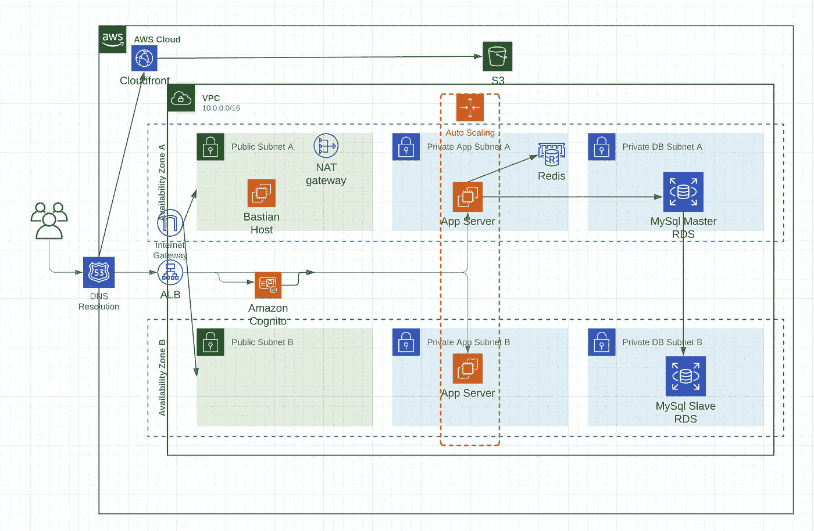

# 初创企业的架构

> 原文：<https://itnext.io/architecture-for-a-startup-86651962bc99?source=collection_archive---------1----------------------->

[Med Badr Chemmaoui](https://unsplash.com/@medbadrc?utm_source=medium&utm_medium=referral) 在 [Unsplash](https://unsplash.com?utm_source=medium&utm_medium=referral) 上拍摄的照片

在我最近的工作中，我有机会为一家初创公司从头开始设计后端架构。这是探索和创建一个最小化、易于理解且安全的架构的时候了。我在个人项目中使用 terraform 和 ansible 已经有一段时间了。这是使用一切的最佳地点。我决定用这些工具从代码开始写一切。 [Terraform](https://medium.com/@mitesh_shamra/infrastructure-as-a-code-with-terraform-e7021bf28d7d) 作为代码用于基础设施 [Ansible](https://medium.com/@mitesh_shamra/introduction-to-ansible-e5b56ee76b8c) 作为配置管理。

在编写任何代码之前，第一件事就是设计一个可伸缩的系统，当初创公司成长为尤尼克隆时，这个系统可以扩展。经过大量的头脑风暴，我想出了下面的设计，这似乎是完美的考虑到这是一个启动，并会随着时间的推移而演变，所以需要灵活性，因为更多的组件将随着时间的推移而增加。

我们将整个系统分成不同的模块:

1.  静态 web 应用:我们有一个静态网站，部署在 S3 上，使用 S3 提供的静态 web 托管功能。我在 S3 前面加了一个 CloudFront CDN 来更快的服务用户，因为 CDN 会缓存内容。所有域都通过 Route53 路由。
2.  后端生产系统:后端应用服务器部署在通过自动扩展组管理的 EC2 实例上。这个应用服务器使用 Redis (AWS ElasticCache)进行数据缓存，使用 MySQL (RDS)进行数据持久化。我对 Mysql 实例使用了主-从配置，其中从实例也用作任何数据相关需求的读取副本。应用层和数据层位于不同的私有子网中。没有从公共互联网到应用服务器和数据库的 SSH 访问。为了访问这些实例上的日志，我们在公共子网中添加了一个具有 SSH 访问权限的 bastion 主机，这是任何生产系统的单一入口点。Bastion 主机被添加到一个单独的自动扩展组中，以防止对专用子网中关键系统的访问。私有子网内的实例通过 NAT 网关访问互联网，这有助于向外部服务发出请求。我使用 ALB 通过路由规则向应用服务器发出请求，使用 [Cognito](https://aws.amazon.com/cognito/) (google auth)来保护一些管理 API。
3.  分析系统:我们使用元数据库，通过 MySql 读取副本进行分析。Metabase 是一款开源商业分析服务器。这被部署在应用子网中，并使用带有 Cognito (google auth)的 ALB 来公开，以保持内部用户的访问安全。
4.  监控:我们使用 NewRelic 免费层来监控系统，并使用自托管的 sentry 服务器来捕捉所有服务器问题。Sentry 对于捕捉应用程序运行时出现的后端错误非常有帮助。哨兵是部署在单独的管理 VPC，因为这是相同的所有环境。
5.  部署:我们使用詹金斯进行部署。我试着使用其他工具，但和詹金斯在一起感觉很自在。总体理念是一次构建，随处部署。我们对每个部署都有两个任务，一个构建分支，另一个部署这个构建。这样，我们可以在任何环境中部署相同的版本。这是部署在管理 VPC，这是用于常见的用例。

总的来说，我们的完整生产系统分为三层(公共层、应用程序层和数据层)，每层都有自己的子网，跨越一个区域中的两个可用性区域。我们将 S3 VPC 端点添加到我们的 VPC 中，这样就可以在所有情况下访问 S3，而无需通过公共互联网。每个 EC2 实例都有一个附加的实例角色，可以访问 AWS 资源。

我不想深入细节，因为每个组件都是不言自明的一个小谷歌搜索。我只是想给出一个架构设计的概述，任何初创公司都可以在考虑安全性的同时使用。一旦我们知道了系统的外观，使用 terraform 和 ansible 这样的工具创建它们就非常容易了。

感谢 [Devashish Meena](https://medium.com/u/61c0a24121f4?source=post_page-----86651962bc99--------------------------------) 帮助完成这一设计。

***PS:如果你喜欢这篇文章，请鼓掌支持*** 👏 ***。欢呼***