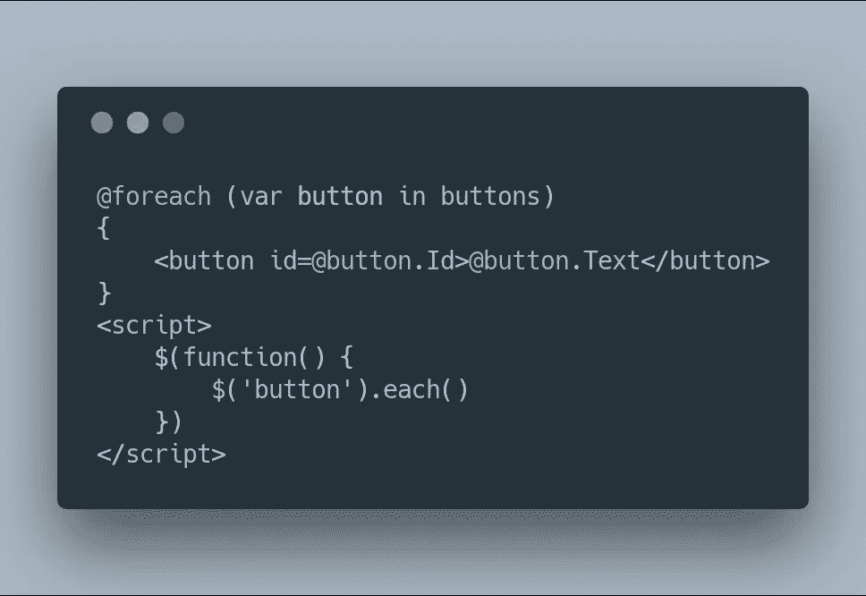

# 没人需要的架构是服务器端模板

> 原文：<https://itnext.io/architecture-no-one-needs-is-server-side-templating-78331391274?source=collection_archive---------1----------------------->

在一篇名为[The Architecture No One Needs](https://www.gregnavis.com/articles/the-architecture-no-one-needs.html)的博客文章中，Greg Navis 声称 SPA(单页应用程序)是*“几乎总是比多页应用程序差”*，并声称有其他选择*“可以在没有成本的情况下产生类似的收益”*。委婉地说，我不同意他的观点，我会试着解释为什么我觉得斯帕是在为未来铺路。

虽然我同意不是所有的应用程序都应该使用 SPA 模型，也不是每个团队都应该采用新技术进行开发，但 SPA 方法的几乎所有替代方案都存在明显的缺陷。让我们分析一下用“老方法”构建应用程序的主要问题。

# 模板灾难

在 SPA 框架出现之前，几乎所有的应用都是使用服务器端语言和模板系统开发的:PHP、Ruby、Python、Java、C#等等。以这种方式构建的应用程序很少有复杂的客户端逻辑或交互，需要编写大量的 JavaScript 代码。这没问题，但是让我们看看这种方法有什么问题:

1.  模板语言基本上是字符串插值，它在加载时构建表示层*。*
2.  客户端代码是单独开发的，在加载后必须*“挑选”目标元素。*

*对于任何大型应用程序(我指的是超过 50 个单独开发的屏幕)，维护起来会变得越来越困难。模板语言基本上是智能的字符串插值器，有着古怪的语法。我们不要忘记，有些人甚至使用模板语言生成 JavaScript 代码，只是因为他们可以这样做——毕竟它是字符串。*

**

*Razor/C#*

*虽然上面的图片展示了一个简单的例子，但是模板语言中会出现什么样的问题已经很清楚了。一种语言(服务器端)正在为另一种*不同的*语言生成标记，这种语言接管了客户端。接管意味着找到所有元素，订阅所有事件并添加交互性。原创内容和互动性本身的差距是巨大的。*

*如果使用 AJAX 通过添加、扩展或删除某些部分的交互性来动态改变应用程序的状态，那么我们将如何:*

1.  *AJAX 调用完成后使用运行时模板。我们不能再使用服务器端渲染了，是吗？让我们编写返回 HTML 而不是 JSON 的端点。*
2.  *何时订阅/取消订阅活动。否则我们会遇到内存泄漏。*
3.  *如何给事物命名——当一切都是动态的，命名就变得很难。*
4.  *既然有些是在服务器上生成的，而有些是在客户端生成的，那么如何孤立地开发组件呢？或者设计它们。或者测试他们。*

*模板化只解决初始数据加载——或者我们称之为文档呈现。应用程序不仅仅是文档，它们是我们所说的交互软件。从前它们被命名为 RIA 或富互联网应用程序，今天它们只是应用程序。采用适用于静态文档的范例并使用它们来构建软件是远远不够的。*

# *面向组件的世界*

*大型应用程序倾向于重复某些部分——让我们称之为组件。真正需要的是重用那些应该在大量屏幕上被很好地定义和隔离的组件。模板系统支持提取子模板(称它们为组件是不公平的)，但是编写能够正确使用这些组件的客户端代码是很困难的。这就是为什么在模板系统中编写好的组件很难。*

*为该组件开发客户端代码的难易程度取决于模板语言，但是简单地跨文件“拆分字符串”是不够的。*

*传统上，所有平台都带有这样的组件。桌面和移动应用程序是使用框架构建的，这些框架包含作为一等公民的组件。毕竟，这些平台的基本构建模块*就是用这种方法*构建的。有点不幸的是，Web 从来没有一个平台所有者可以从一开始就开发这样的框架。*

*相反，我们得到了疯狂的框架和疯狂的创新步伐。有人称之为 JavaScript 疲劳，有人称之为“重新发明轮子”。其他人称之为工作保障，但我认为这是一种前进的方式。*

# *外面的世界很大很大*

*最后，构建大型应用程序意味着采用大量第三方组件，并将它们集成到新应用程序中。大多数组件都是以客户为中心构建的(或者说客户**的**，因为相同的应用必须在桌面、平板电脑和手机上运行)，而不是特定的服务器技术(更不用说你最喜欢的技术了)。集成这样的组件，一些可能是简单优雅的工具提示或进度条，而另一些可能是成熟的工具包，不能跨大量的服务器端模板扩展。*

*正确处理这类组件的生命周期方法需要在服务器端事先考虑好。这就是我们所说的前端框架！因此，如果服务器端模板必须意识到由一些客户端组件引起的潜在问题，避免 SPA 框架没有帮助。*

# *开发成本*

*老实说，只有当他们不知道任何 SPA 技术或者不想学习时，才能说开发 SPA 应用程序成本高昂。*

*开发包含大量组件的大型软件*比使用带有后期绑定的字符串插值来构建软件要简单的多。当然，“第一页加载”是有惩罚的，但我们是在构建应用程序，而不是“页面”或“文档”。从一开始就有一些框架的服务器端部分，这不是一个真正的争论。**

*在服务器端渲染应用程序中开发成本更高的东西:*

1.  *了解服务器端模板语言。也不能使用相同的 AJAX 模板语言。*
2.  *如果你有合适的移动应用程序，就必须为此开发一个 API。让两个层以两种不同的方式访问相同的数据是不现实的。*
3.  *隔离测试元件。像[故事书](https://storybook.js.org)这样的工具是水疗中心的独特价值主张。*
4.  *漂亮的错误处理——不要为困惑的用户提供 500，而是显示漂亮的消息，带有跟踪最后步骤的选项，要求用户输入或提供重试操作的简单方法。你真的想创建显示可怕的“请不要关闭此窗口…”消息的应用程序吗？*
5.  *客户端上的状态——因为这是状态的归属。API 应该易于开发、测试、部署和扩展，而不用担心会话状态，我认为会话状态是服务器端技术的祸根。*

# *未来是光明的*

*是的，SPA 应用程序有时很大，臃肿，加载缓慢(尤其是在移动设备上)。但这是我们要走的路。不是因为它们是单页的，这从来都不重要，而是因为它们解决了所有大型应用程序以前都解决过的主要问题:客户机上的组件系统。*

*即使开发大部分是静态的网站，在服务器上呈现 spa*也很不错，因为使用基于组件的系统更容易开发。Gatsby 就是一个很好的例子——将其构建富页面的组件模型与只不过是字符串插值器的模板系统进行比较。另一个很好的例子是 [BBC 新闻首页](https://wildlyinaccurate.com/introducing-a-faster-bbc-news-front-page/)——使用服务器端 React 构建。**

*代码分割、服务器端 SPA 渲染、预编译视图——我们认为开发桌面/移动应用程序的经验是理所当然的——它必须为 Web 从头开始构建。我们有那些工具是因为没有工具！我们刚刚开始网络革命。是的，Web 组件来了，但是还很远。*

*我来欢迎我们新的水疗霸主。*