# 你在做 GitHub 检查吗？

> 原文：<https://itnext.io/are-you-doing-github-checks-9f8b3d6f41a5?source=collection_archive---------6----------------------->

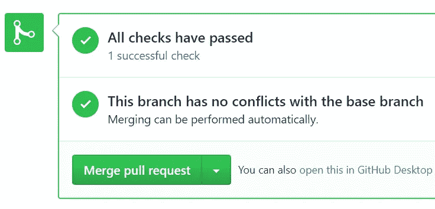

没有任何借口——在**的 15 分钟**里，我得到了对我们主要分支机构每个公关**的运行检查。而且是**免费**！**

GitHub check 是什么？这是一种自动检查源代码的方式。比如它**造**吗？它是否通过了**测试**？通过林挺的了吗？做所有电脑**擅长**和人**容易**错过**的繁琐工作。**

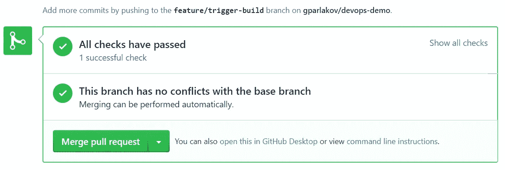

一个拉取请求，它触发了一个检查并返回 OK

我们使用**检查**的**项目**是一个有角度的单页应用程序。它使用 [Node.js](https://nodejs.org/en/) 和 [TypeScript](https://www.typescriptlang.org/) ， [Jest](https://jestjs.io/) 进行单元测试，使用 [TSlint](https://palantir.github.io/tslint/) 捕捉类似于`[fit](https://jasmine.github.io/2.1/focused_specs.html)`、`[fdescribe](https://jasmine.github.io/2.1/focused_specs.html)`、`console.log`之类的东西以及类似的错误检入的代码。

**检查**的**目标**是让构建、**单元测试**和**林挺**在之前运行****PR**(拉请求)已经被**合并**。所以它会在每个人的签出代码结束之前捕捉到一个坏的构建。或者是一个失败的测试。还是一辆`debugger`入住。
如果代码审查已经完成，那么**审查者**将能够专注于更**高层次的**东西，并确信计算机完成了令人厌烦的部分。**

酷，那我们怎么做？

这个项目是利用**詹金斯**的工作建立起来的，有几天，我努力让詹金斯在新的公关事件上做点什么。**做不到**做不到。我更习惯于 Azure DevOps(以前的 VSTS)，我决定尝试一下。去了[https://github.com/marketplace?category = continuous-integration&query = azure](https://github.com/marketplace?category=continuous-integration&query=azure)并搜索“azure”:

点击了 Azure 管道。

 [## 这是 GitHub Marketplace 中 Azure 管道的链接

### 持续构建、测试和部署到任何平台和云

github.com](https://github.com/marketplace/azure-pipelines) 

注意:如果已经安装了 Azure Pipelines，你会看到文章末尾显示的屏幕。*

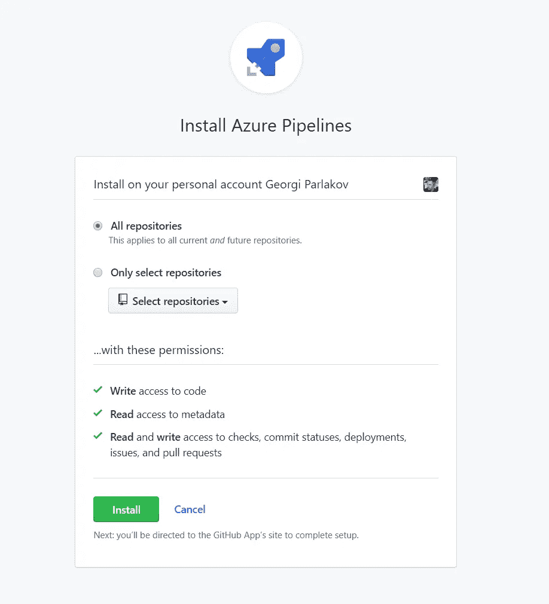

为所有项目安装或只选择一个项目。

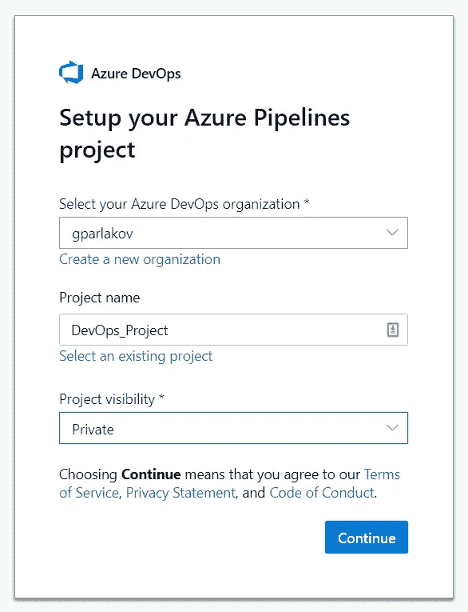

登录后看到这个。选择“创建新项目”。

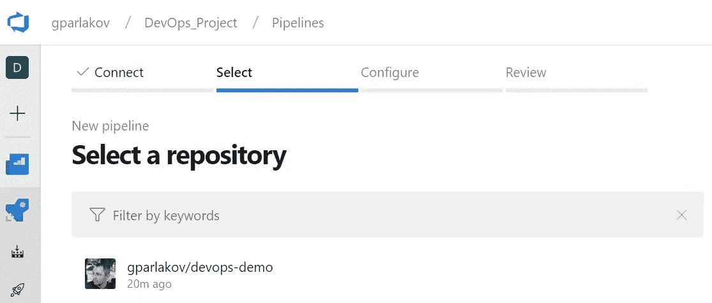

我将在这里选择我的回购— devops-demo。

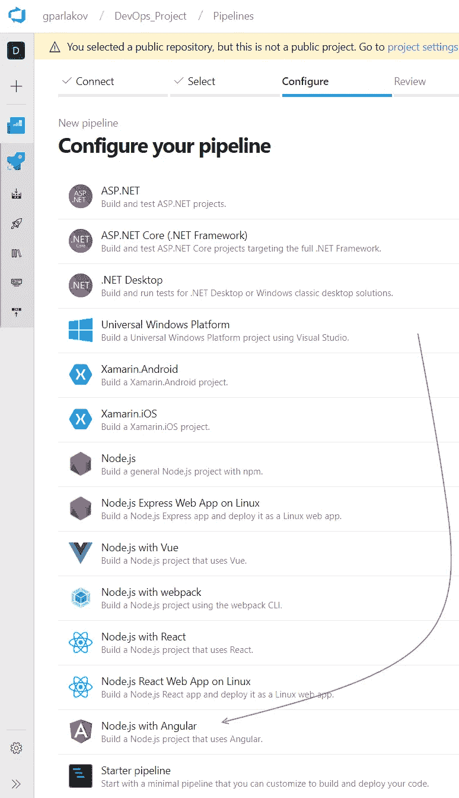

下一步是选择一个模板。在我的例子中， **Angular** 是显而易见的选择。下一步，我们可以**定制**模板

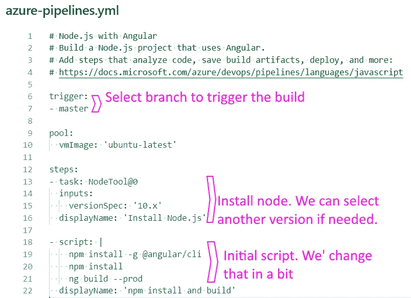

是它最初的样子。

给定这个脚本—对 master 的任何更改都将触发构建。这可能是我们在某些情况下需要的——例如**持续集成**。在我们的情况下，我们需要别的东西。稍后会有更多的介绍。首先—点击右侧的“**保存并运行**”按钮，这将让您选择是提交给*主*还是用`azure-pipelines.yml`文件开始一个拉取请求。**或者**起作用，你最终将管道**配置为代码**检入**沿着**以**代码**构建！干净利落。这是我的第一个版本。

接下来，让我们将脚本`azure-pipelines.yml`更改为仅在 pull 请求时触发:

我留下了一些详细描述步骤的评论。

请注意，我们在签入和合并时显式地停止了构建。只在 PR-s 上触发它。这将**只**做**检查**。在工作中，我们在 AWS 机器上进行由 Jenkins 编排的实际持续集成构建。

## 开始公关

启动 PR 后，我们可以看到，几秒钟后检查就开始了:

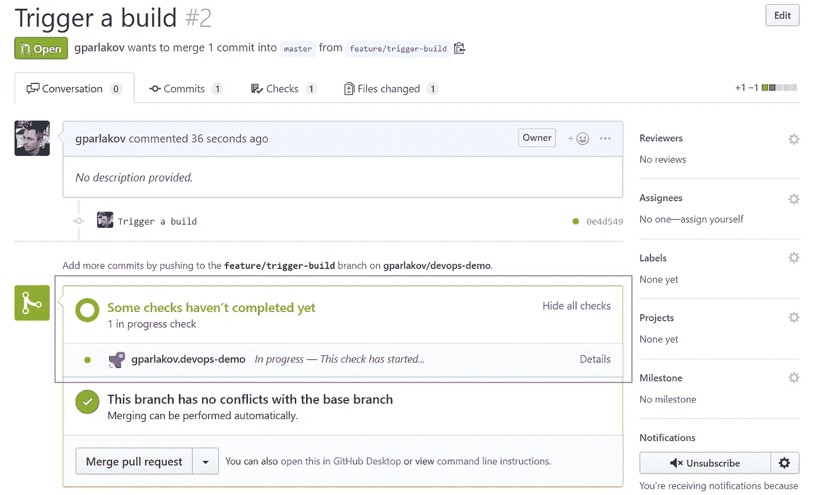

如果一切顺利，我们可以看到舒缓的绿色滴答声:)

[这是实际公关检查的链接](https://github.com/gparlakov/devops-demo/pull/2/checks)

## 断裂的棉绒

当我们打破一个测试，或者构建，或者我们的一个林挺规则，我们会看到一些即时的反馈。例如，我忘记了一个[公关#3](https://github.com/gparlakov/devops-demo/pull/3/checks?check_run_id=128845520) 中的`fit`电话:

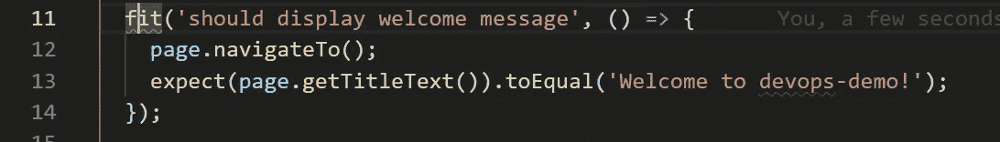

在支票中，在到达主分支之前，我们看到:

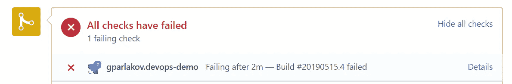

[https://github.com/gparlakov/devops-demo/pull/3](https://github.com/gparlakov/devops-demo/pull/3)

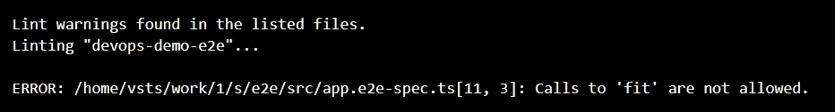

[https://dev . azure . com/gparlakov/devo PS _ Project/_ build/results？buildId=10](https://dev.azure.com/gparlakov/DevOps_Project/_build/results?buildId=10)

我真的很喜欢这个反馈！

> …该检查仅在 **PR** 上**执行，并且**不会影响**您可能拥有的任何其他持续集成或部署**

总而言之，该检查仅在 **PR** 上**执行，并且**不会影响**您可能拥有的任何其他持续集成或部署。它旨在提供快速反馈。**

这是 Azure 项目[链接](https://dev.azure.com/gparlakov/DevOps_Project/_build?definitionId=3)。这是公开的——去看看吧。https://github.com/gparlakov/devops-demo
和 GitHub 回购。

关于文章开头的免费部分。我知道这很难相信，但事实是这样的:

*   对于公共回购-像[这一个](https://github.com/gparlakov/devops-demo)-无限分钟 10 个并行作业
*   对于私人回购—每月 1 份工作和 1800 分钟。喜欢这个项目，我一开始就描述过。我们是一个由 5 人组成的团队，积极参与，每月做大约 1000 分钟。

*如果您的回购上预装了 pipeline 应用程序，您将会看到:

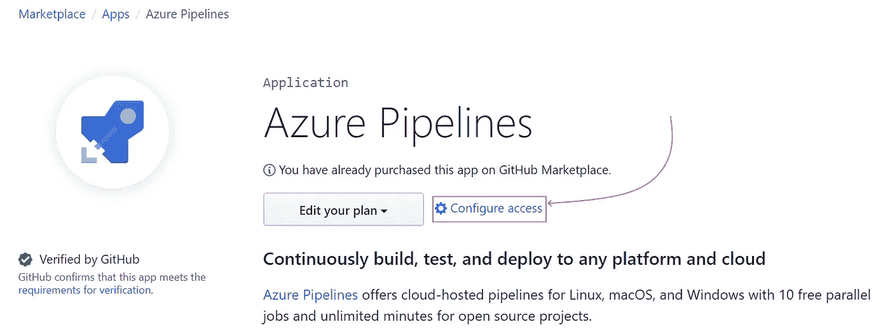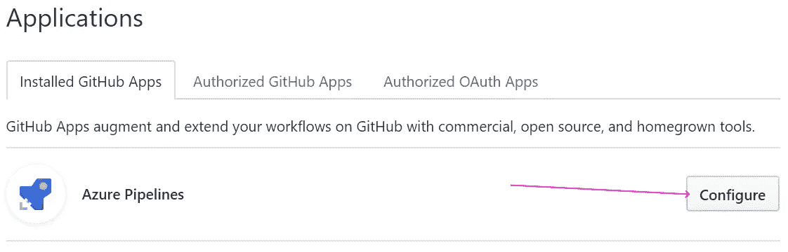

并继续到一个类似于上面的“安装 Azure Pipelines”的屏幕，在那里你选择应用程序将被安装到哪个仓库。

或者，如果开始一个全新的项目:

*   看一看[哟团队](http://donovanbrown.com/post/yo-Team)
*   如果只是创建 GitHub repo，并且已经安装了 Azure Pipelines GitHub 应用程序，您可以在 repo 创建时立即添加它:

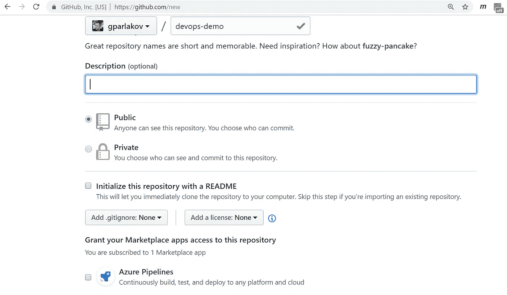

通过选中底部附近的复选框，在创建 repo 时添加 Azure 管道。