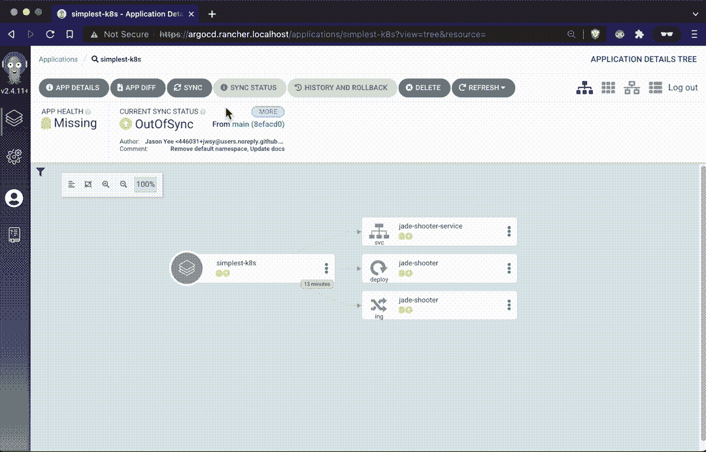
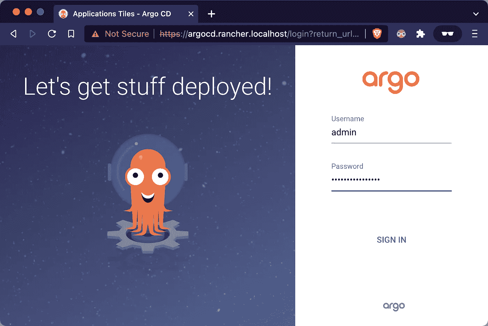
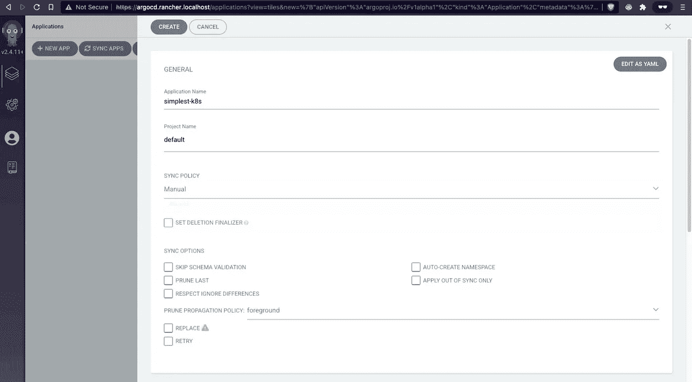
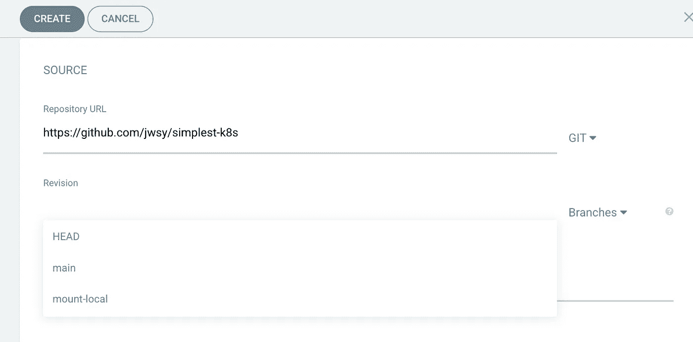
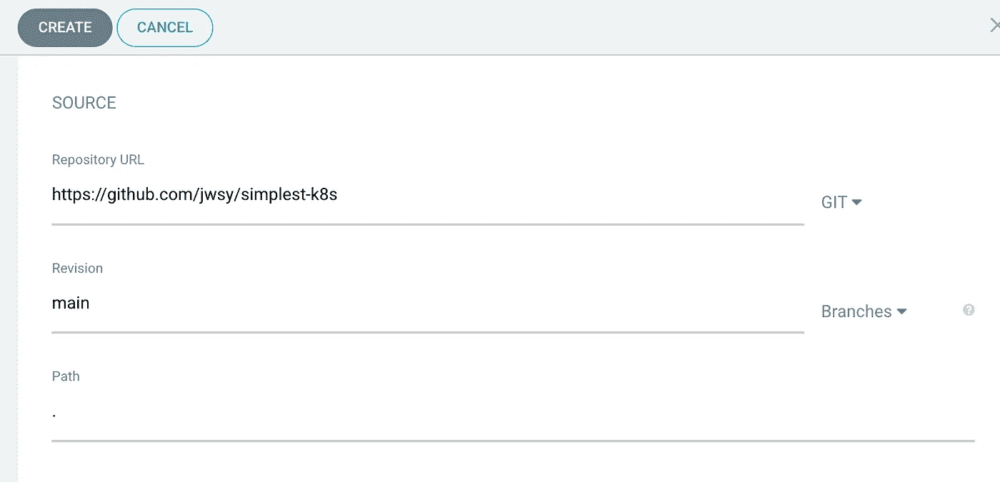
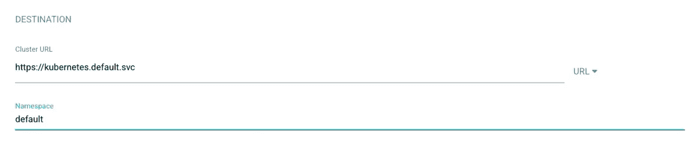
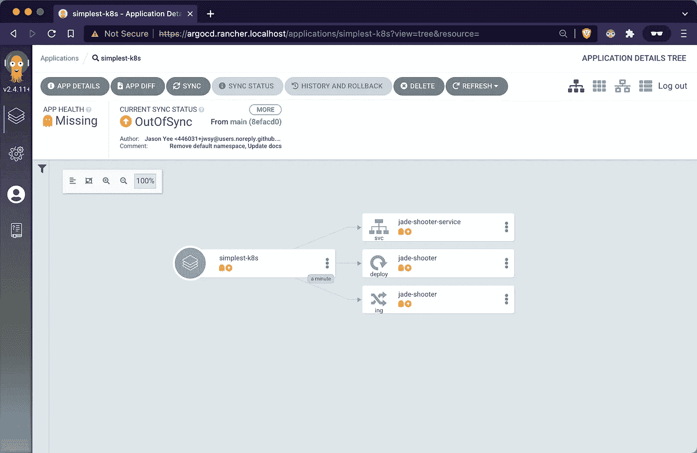
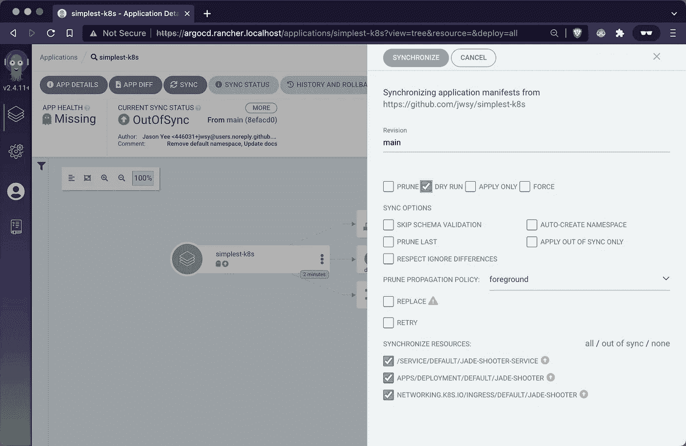

# 牧场主桌面上的 Argo CD 作为本地 GitOps K8s 实验室

> 原文：<https://itnext.io/argo-cd-rancher-desktop-for-a-local-gitops-lab-8d044089f50a?source=collection_archive---------2----------------------->



Argo CD 启用了 GitOps，其中实际部署的状态与源代码控制中的代码相匹配。对于 DevOps 工程师来说，这是令人惊讶的，因为在故障排除时您必须更改的所有配置都在**一个位置**，即您已经获得配置的 repo(通常是 Helm chart 的 values.yaml)。在本文中，我们将在本地 K8s 实验室上实现 GitOps 个步骤)并配置&部署一个基于 Github repo 的应用程序(3 个步骤)。

Argo CD 有很棒的 UX 和很棒的文档(特别是关于如何用像 Keycloak 这样的 IdAM 配置它)。为了更熟悉它，首先安装一个由 Rancher Desktop 提供的本地 K8s 集群(参见下面关于如何安装的链接)。

[](https://medium.com/macoclock/rancher-desktop-setup-for-k8s-on-your-macos-laptop-6f1c576ceb48) [## macOS 笔记本电脑上 K8s 的 Rancher 桌面设置

### 对于我在 MacBook 上的个人 K8s 测试实验室，我使用的是 Rancher Desktop。我试过 MiniKube(牛逼)和 K3d(也…

medium.com](https://medium.com/macoclock/rancher-desktop-setup-for-k8s-on-your-macos-laptop-6f1c576ceb48) 

## 1/4 安装 Argo 光盘

遵循 Argo CD 网站上的入门说明([https://argo-cd.readthedocs.io/en/stable/getting_started/](https://argo-cd.readthedocs.io/en/stable/getting_started/))。第一步是创建一个新的名称空间(`argocd`)，Argo CD 的资源将驻留在其中。

```
$ **kubectl create namespace argocd**
namespace/argocd created$ **kubectl apply -n argocd -f** [**https://raw.githubusercontent.com/argoproj/argo-cd/stable/manifests/install.yaml**](https://raw.githubusercontent.com/argoproj/argo-cd/stable/manifests/install.yaml)customresourcedefinition.apiextensions.k8s.io/applications.argoproj.io created
...
serviceaccount/argocd-application-controller created
...
serviceaccount/argocd-server created
role.rbac.authorization.k8s.io/argocd-application-controller created
...
networkpolicy.networking.k8s.io/argocd-server-network-policy created
```

## 2/4 部署额外的配置图并重新部署应用程序

> **在这里获得本教程的源代码:**[**https://github.com/jwsy/argocd-rd**](https://github.com/jwsy/argocd-rd)

提供的配置映射将服务器设置为不安全模式(因此我们不需要配置证书)，如 Argo CD 文档([https://Argo-CD . readthedocs . io/en/stable/operator-manual/ingress/](https://argo-cd.readthedocs.io/en/stable/operator-manual/ingress/))中所述。然后，重新启动 Argo 光盘服务器。您可以使用`rollout status`命令来跟踪重新部署。

```
$ **git clone** [**https://github.com/jwsy/argocd-rd.git**](https://github.com/jwsy/argocd-rd.git)
Cloning into 'argocd-rd'...
...
Resolving deltas: 100% (1/1), done.$ **cd argocd-rd**$ **kubectl -n argocd apply -f argocd-cmd-params-cm.yaml**
configmap/argocd-cmd-params-cm configured

$ **kubectl -n argocd rollout restart deployment argocd-server** deployment.apps/argocd-server restarted$ **kubectl -n argocd rollout status deployment argocd-server**
Waiting for deployment "argocd-server" rollout to finish: 1 old replicas are pending termination...
Waiting for deployment "argocd-server" rollout to finish: 1 old replicas are pending termination...
deployment "argocd-server" successfully rolled out
```

## 3/4 部署入口

部署入口有两种选择

**选项 1** : 使用正常入口。我喜欢这个，因为当我运行`kubectl get all,ing`时，它很好地显示了主机名

在`argocd-ingress-server.yaml`中，我使用了 Argo CD 文档提供的例子，并使用了主机名`argocd.rancher.localhost`

```
$ **kubectl -n argocd apply -f argocd-ingress-server.yaml** ingress.networking.k8s.io/argocd-server-ingress created
```

**选项二** : 如果你用的是 Rancher Desktop，可以用 Traefik ingress。我用`argocd.rancher.localhost`替换了默认的网址

```
$ **kubectl -n argocd apply -f traefik/argocd-ingress-server-traefik.yaml**
ingressroute.traefik.containo.us/argocd-server created
```

## 4/4 登录并了解 ArgoCD

使用用户名`admin`和密码`argocd-initial-admin-secret`登录应用程序。您可以从下面显示的文档([https://Argo-CD . readthedocs . io/en/stable/getting _ started/# 4-log in-using-the-CLI](https://argo-cd.readthedocs.io/en/stable/getting_started/#4-login-using-the-cli))中提供的命令中获得该信息

```
$ **kubectl -n argocd get secret argocd-initial-admin-secret -o jsonpath=”{.data.password}” | base64 -d**
khDCDlbb3nXQ7IKE%# I ignored the trailing `%` sign 
```

在 Powershell 中，您需要这两个命令

```
PS C:\Users\jyee\code\argocd-rd> **$argocdPasswd = kubectl -n argocd get secret argocd-initial-admin-secret -o jsonpath="{.data.password}"**PS C:\Users\jyee\code\argocd-rd> **[System.Text.Encoding]::UTF8.GetString([System.Convert]::FromBase64String($argocdPasswd))**
khDCDlbb3nXQ7IKE 
```

**开始 Argo CD 吧！**

当你浏览到位于[https://argocd . rancher . localhost](https://argocd.rancher.localhost/login?return_url=https%3A%2F%2Fargocd.rancher.localhost%2Fapplications)的 GUI 时，输入用户名`admin`和你刚刚得到的 K8s 秘密的密码。

> *你做* ***不是*** *必须改变你的* `*/etc/hosts*` *如果你* ***使用基于 Chrome 或 Firefox 的浏览器像 Brave/Canary*** *(即不是 Safari)因为我们会使用*`*.localhost*`*[*DNS magic*](https://en.wikipedia.org/wiki/.localhost)*让你的浏览器自动路由任何否则，你需要更新* `*/etc/hosts*` *来拥有条目* `*127.0.0.1 jade-shooter.rancher.localhost*`*

**

## *使用 Argo CD 部署应用程序*

*就像阿尔戈吉祥物说的，让我们把东西部署好！我将从本文中找到的最简单的 K8s 部署开始部署玩具射击游戏，并在 GitHub[https://github.com/jwsy/simplest-k8s](https://github.com/jwsy/simplest-k8s)托管*

*[](/simplest-minimal-k8s-app-tutorial-with-rancher-desktop-in-5-min-5481edb9a4a5) [## 最简单的 K8s 应用程序教程，5 分钟内完成

### 本文为一个应用程序提供了最简单、最容易、最小化的 Kubernetes (K8s)集群和清单，您可以…

itnext.io](/simplest-minimal-k8s-app-tutorial-with-rancher-desktop-in-5-min-5481edb9a4a5) 

## 1/3 配置应用程序

我需要将应用程序名称设置为有效的 K8s 名称，如`simplest-k8s`，然后选择一个项目，在本教程中是`default`(漂亮的智能下拉菜单！).我会将其余的复选框留空。



接下来，我将存储库的 URL 设置为[https://github.com/jwsy/simplest-k8s](https://github.com/jwsy/simplest-k8s)，这样做之后，分支就会自动为我填充。我可以手动输入`main`或删除默认值`HEAD`，然后使用下拉菜单选择`main`分支。



由于清单文件在 repo 的根目录下，所以路径是`.`。



通过从下拉菜单(`https://kubernetes.default.svc`)中选择缺省值来选择目标集群 URL，并为此部署指定名称空间`default`(因为我们知道名称空间已经存在)。将其余部分留空，然后单击顶部的“创建”按钮



## 2/3 将应用程序同步到 Argo 的“工作目录”

您将被带到应用程序平铺视图，在那里您将看到您刚刚配置的应用程序。单击图标，您将进入应用程序详细信息网络视图。一旦应用程序被部署，这个视图是惊人的，所以点击同步按钮将你的清单拷贝到 Argo 的“工作目录”,在那里它将自动为你运行一个`helm install`或`kubectl apply -f .`。



一个窗格从右侧滑入，让您选择想要同步的内容。在这种情况下，我选择了“模拟运行”复选框，以便 Argo CD simulates 使用部署的实际值生成模板清单。



点击同步按钮后，你会在右边看到最新的同步结果“同步”，然后显示“同步成功”。这意味着清单看起来不错，我们已经准备好部署了！


## 3/3 同步！

单击同步，然后在滑出的面板中单击同步，观看魔术！我想不出更方便的方法来可视化所有不同类型的 K8s 资源。


如果你和我一样，从其他人写的 Medium 文章中受益匪浅，也可以考虑加入 Medium，并使用我下面的推荐链接。

[](https://jyeee.medium.com/membership) [## 通过我的推荐链接加入 Medium-Jason Yee

### 看别人的媒介文章我学到了很多，你也可以！你的会员资格直接支持我和其他…

jyeee.medium.com](https://jyeee.medium.com/membership)*