# ArgoCD:一个舵图表部署，并通过自动气象站 KMS 与舵的秘密

> 原文：<https://itnext.io/argocd-a-helm-chart-deployment-and-working-with-helm-secrets-via-aws-kms-96509bfc5eb3?source=collection_archive---------0----------------------->

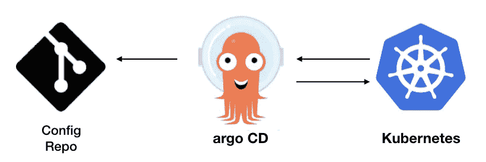

在之前的文章 [ArgoCD:概述、SSL 配置和应用程序部署](https://rtfm.co.ua/en/argocd-an-overview-ssl-configuration-and-an-application-deploy/)中，我们简要概述了如何使用 ArgoCD，现在让我们尝试部署一个导航图。

这其中最有趣的部分是如何启用[掌舵秘笈](https://rtfm.co.ua/en/helm-helm-secrets-sensitive-data-encryption-with-aws-kms-and-use-it-from-jenkins/)。使用它有些困难，但最终，它像预期的那样工作了。

# 内容

*   [ArgCD:舵图展开](https://rtfm.co.ua/en/argocd-a-helm-chart-deployment-and-working-with-helm-secrets-via-aws-kms/#ArgCD_a_Helm_chart_deployment)
*   [ArgoCD:添加私有 Github 库](https://rtfm.co.ua/en/argocd-a-helm-chart-deployment-and-working-with-helm-secrets-via-aws-kms/#ArgoCD_adding_a_private_Github_repository)
*   [Github SSH 密钥](https://rtfm.co.ua/en/argocd-a-helm-chart-deployment-and-working-with-helm-secrets-via-aws-kms/#Github_SSH_key)
*   [ArgoCD 储存库](https://rtfm.co.ua/en/argocd-a-helm-chart-deployment-and-working-with-helm-secrets-via-aws-kms/#ArgoCD_repositories)
*   [添加 ArgoCD 应用程序](https://rtfm.co.ua/en/argocd-a-helm-chart-deployment-and-working-with-helm-secrets-via-aws-kms/#Adding_an_ArgoCD_application)
*   [ArgoCD 和舵的秘密](https://rtfm.co.ua/en/argocd-a-helm-chart-deployment-and-working-with-helm-secrets-via-aws-kms/#ArgoCD_and_Helm_Secrets)
*   [使用共享卷初始化容器](https://rtfm.co.ua/en/argocd-a-helm-chart-deployment-and-working-with-helm-secrets-via-aws-kms/#InitContainer_with_a_sharedvolume)
*   [在安装了头盔秘密插件的情况下构建 ArgoCD Docker 镜像](https://rtfm.co.ua/en/argocd-a-helm-chart-deployment-and-working-with-helm-secrets-via-aws-kms/#Building_ArgoCD_Docker_image_with_the_helmsecrets_plugin_installed)
*   [KMS SOPS 和 AWS 认证](https://rtfm.co.ua/en/argocd-a-helm-chart-deployment-and-working-with-helm-secrets-via-aws-kms/#SOPS_and_AWS_KMS_%E2%80%93_authentification)
*   [AWS IAM 用户](https://rtfm.co.ua/en/argocd-a-helm-chart-deployment-and-working-with-helm-secrets-via-aws-kms/#AWS_IAM_User)
*   [AWS 凭证和配置](https://rtfm.co.ua/en/argocd-a-helm-chart-deployment-and-working-with-helm-secrets-via-aws-kms/#AWS_credentials_and_config)
*   [添加 secrets.yaml](https://rtfm.co.ua/en/argocd-a-helm-chart-deployment-and-working-with-helm-secrets-via-aws-kms/#Adding_secrets_yaml)

# ArgCD:舵图部署

创建测试图表:

```
$ helm create test-helm-chart
Creating test-helm-chart
```

本地检查:

```
$ helm upgrade — install — namespace dev-1-test-helm-chart-ns — create-namespace test-helm-chart-release test-helm-chart/ — debug — dry-run
…
{}
NOTES:
1\. Get the application URL by running these commands:
export POD_NAME=$(kubectl get pods — namespace dev-1-test-helm-chart-ns -l “app.kubernetes.io/name=test-helm-chart,app.kubernetes.io/instance=test-helm-chart-release” -o jsonpath=”{.items[0].metadata.name}”)
export CONTAINER_PORT=$(kubectl get pod — namespace dev-1-test-helm-chart-ns $POD_NAME -o jsonpath=”{.spec.containers[0].ports[0].containerPort}”)
echo “Visit [http://127.0.0.1:8080](http://127.0.0.1:8080) to use your application”
kubectl — namespace dev-1-test-helm-chart-ns port-forward $POD_NAME 8080:$CONTAINER_PORT
```

好的——它工作了，把它推到 Github 库。

## ArgoCD:添加私有 Github 存储库

## Github SSH 密钥

我们有一个 Github 组织。稍后将为 ArgoCD 创建一个专门的 Github 用户，但现在，我们可以为我们的帐户添加一个新的 RSA-key。

实际上，我们可以通过使用 login:token 来配置访问，但是 key 似乎是更好的选择。

生成密钥:

```
$ ssh-keygen -f ~/.ssh/argocd-github-key
Generating public/private rsa key pair.
…
```

添加到 Github — *设置> SSH 按键*:

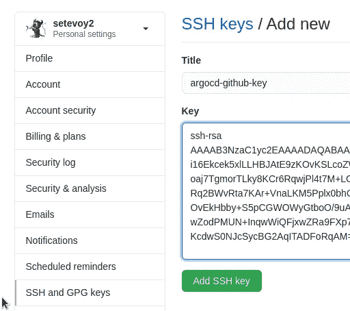

## ArgoCD 存储库

转到*设置—存储库*:


选择*使用 SSH 连接回购*:

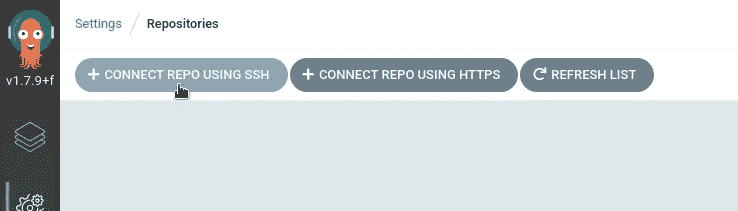

设置名称、URL，添加私钥:

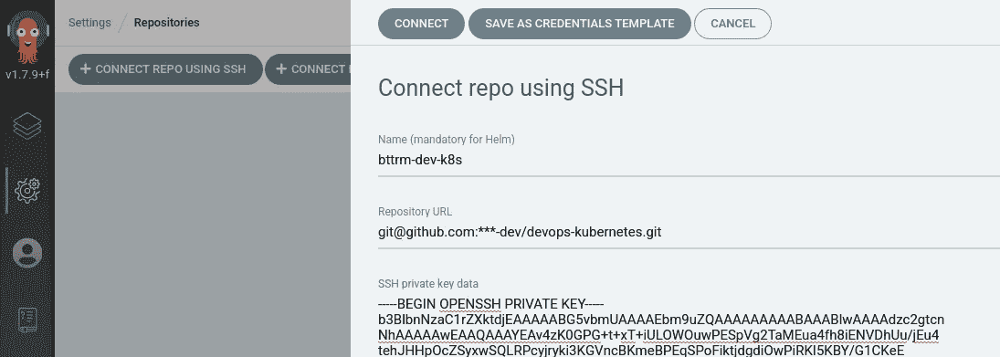

密钥将存储在一个 Kubernetes 的秘密中:

```
$ kk -n dev-1-devops-argocd-ns get secrets
NAME TYPE DATA AGE
argocd-application-controller-token-mc457 kubernetes.io/service-account-token 3 45h
argocd-dex-server-token-74r75 kubernetes.io/service-account-token 3 45h
argocd-secret Opaque 5 45h
argocd-server-token-54mfx kubernetes.io/service-account-token 3 45h
default-token-6mmr5 kubernetes.io/service-account-token 3 45h
repo-332507798 Opaque 1 13m
```

*回购-332507798* —在这里。

点击*连接*。

## 添加 ArgoCD 应用程序

创建新应用程序:

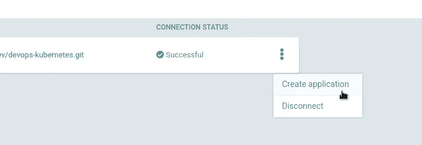

设置其名称，项目保留*默认*，在*同步策略*中*自动创建命名空间*可以启用:

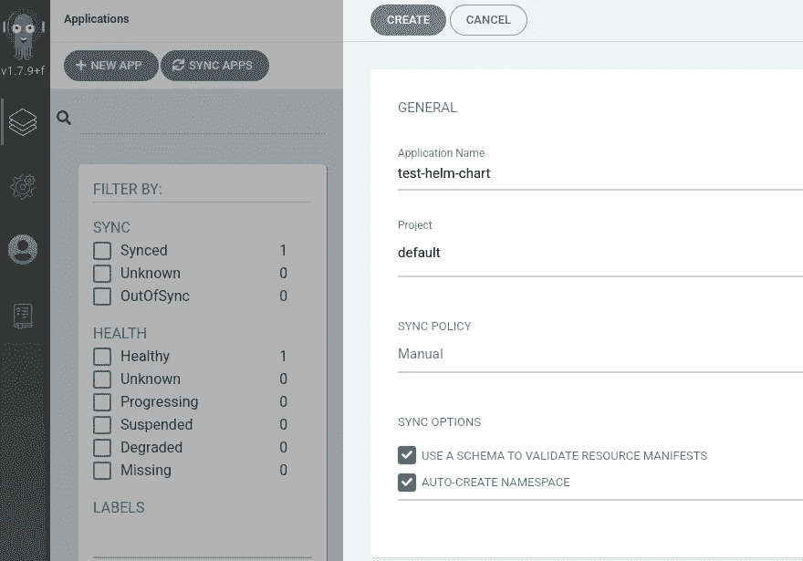

在*Source*leave*Git*中，设置一个资源库的 URL，在 *Revision* 中指定一个分支，在 *Path* — path 中加入我们的图表目录。

在当前情况下，存储库是 *devops-kubernetes* ，图表的目录—*tests/test-helm-chart/*，ArgoCD 将扫描存储库并建议您选择其中的可用目录:

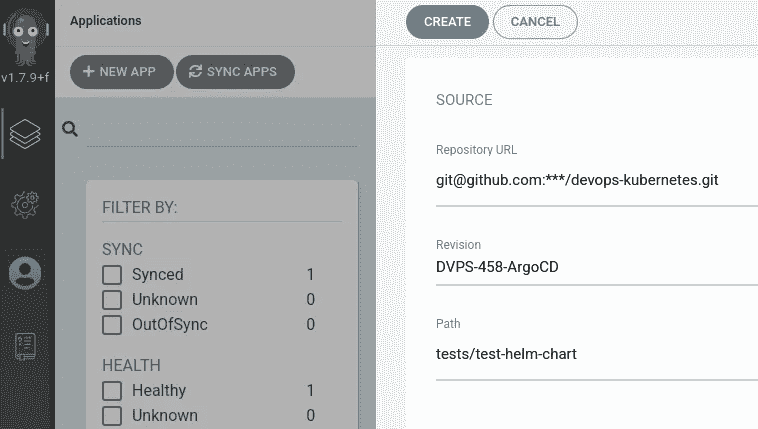

在*目的地*选择本地 Kubernetes 集群中，为将要部署图表的位置设置一个名称空间:

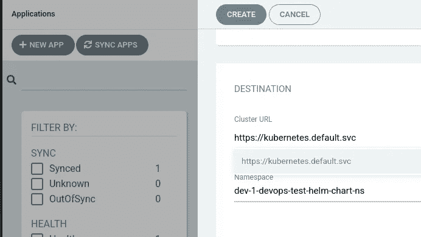

在*目的地*而不是*目录*中设置*舵*，尽管 Argo 发现这是存储库中的舵图目录，并且已经设置了舵本身，并且已经扫描了来自`values.yaml`的值。

可以保留默认值，稍后我们将在这里添加我们的`secrets.yaml`:

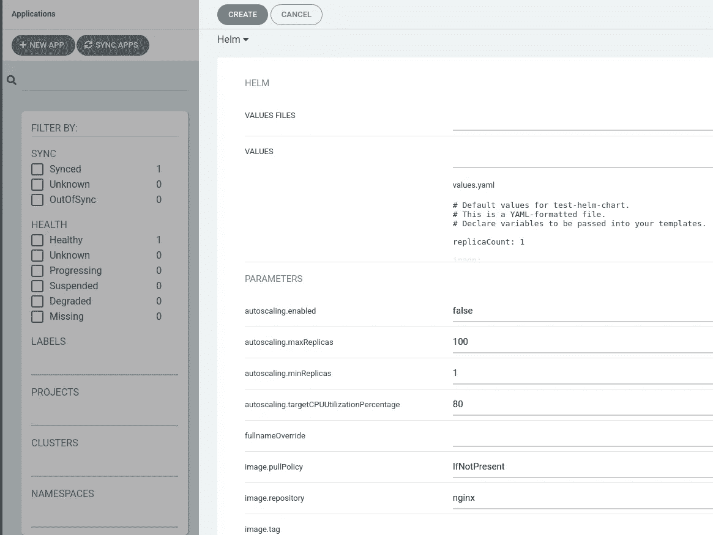

完成:

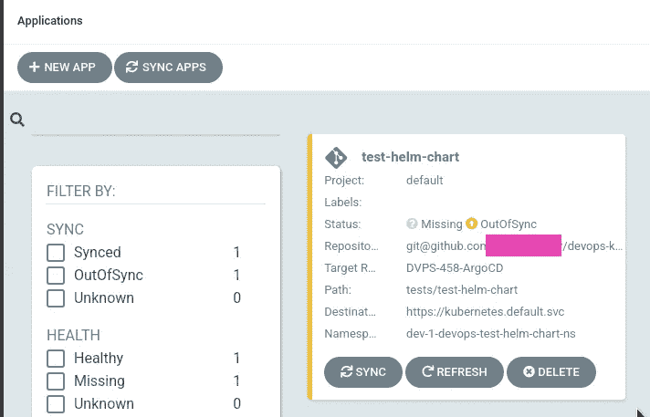

如果您现在单击该应用程序，您将看到 ArgoCD 已经扫描了模板并创建了一个清单来显示将从该 Helm 图表中部署哪些资源:

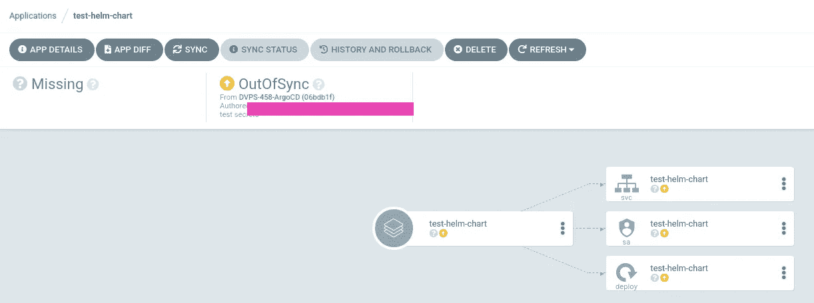

点击*同步*，这里可以看到可用的选项，如*修剪*和*试运行*:

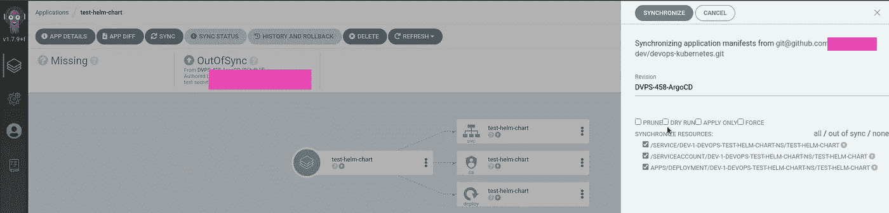

点击*同步*——部署开始:

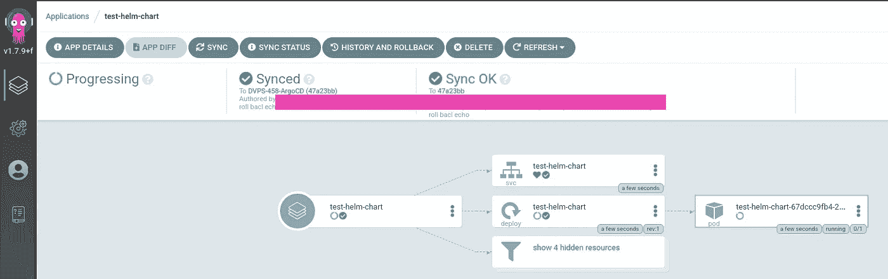

完成—一切正常运行:

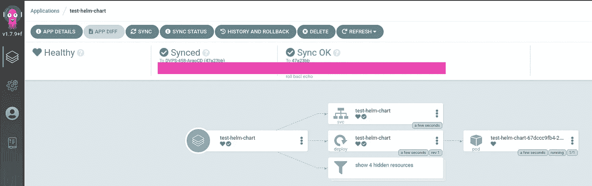

立即查看应用程序列表:

```
$ argocd app list
NAME CLUSTER NAMESPACE PROJECT STATUS HEALTH SYNCPOLICY CONDITIONS REPO PATH TARGET
guestbook [https://kubernetes.default.svc](https://kubernetes.default.svc) default default Synced Healthy <none> <none> [https://github.com/argoproj/argocd-example-apps.git](https://github.com/argoproj/argocd-example-apps.git) guestbook HEAD
test-helm-chart [https://kubernetes.default.svc](https://kubernetes.default.svc) dev-1-devops-test-helm-chart-ns default Synced Healthy <none> <none> git@github.com:***/devops-kubernetes.git tests/test-helm-chart DVPS-458-ArgoCD
```

命名空间中的窗格:

```
$ kubectl -n dev-1-devops-test-helm-chart-ns get pod
NAME READY STATUS RESTARTS AGE
test-helm-chart-67dccc9fb4–2m5rf 1/1 Running 0 2m27s
```

而现在我们可以去[掌舵秘笈](https://rtfm.co.ua/helm-helm-secrets-shifrovanie-sensitive-dannyx-s-aws-kms-i-deploj-iz-jenkins/)配置了。

# ArgoCD 和舵的秘密

所以，一切都很容易，直到我们不想使用我们的秘密，因为在 ArgoCD 头盔没有安装必要的插件。

可用选项是根据文档[此处> > >](https://argoproj.github.io/argo-cd/user-guide/helm/#helm-plugins) 用 ArgoCD 构建自定义 Docker 镜像，或者如[此处>>](https://argoproj.github.io/argo-cd/operator-manual/custom_tools/#adding-tools-via-volume-mounts)所述通过共享卷用 Kubernetes InitContainer 安装插件。

## 具有共享卷的 InitContainer

我尝试的第一个解决方案是具有共享卷的 InitContainer，一般来说，它工作得很好——插件被安装了。

下一步是部署 argocd-repo-server :

```
---
apiVersion: apps/v1
kind: Deployment
metadata:
  labels:
    app.kubernetes.io/component: repo-server
    app.kubernetes.io/name: argocd-repo-server
    app.kubernetes.io/part-of: argocd
  name: argocd-repo-server
spec:
  selector:
    matchLabels:
      app.kubernetes.io/name: argocd-repo-server
  template:
    metadata:
      labels:
        app.kubernetes.io/name: argocd-repo-server
    spec:
      automountServiceAccountToken: false
      initContainers:
      - name: argo-tools
        image: alpine/helm
        command: [sh, -c]
        args:
        - apk add git &&
          apk add curl &&
          apk add bash &&
          helm plugin install [https://github.com/futuresimple/helm-secrets](https://github.com/futuresimple/helm-secrets)
        volumeMounts:
        - mountPath: /root/.local/share/helm/plugins/
          name: argo-tools
      containers:
      - command:
        - uid_entrypoint.sh
        - argocd-repo-server
        - --redis
        - argocd-redis:6379
        image: argoproj/argocd:v1.7.9
        imagePullPolicy: Always
        name: argocd-repo-server
        ports:
        - containerPort: 8081
        - containerPort: 8084
        readinessProbe:
          initialDelaySeconds: 5
          periodSeconds: 10
          tcpSocket:
            port: 8081
        volumeMounts:
        - mountPath: /app/config/ssh
          name: ssh-known-hosts
        - mountPath: /app/config/tls
          name: tls-certs
        - mountPath: /app/config/gpg/source
          name: gpg-keys
        - mountPath: /app/config/gpg/keys
          name: gpg-keyring
        - mountPath: /home/argocd/.local/share/helm/plugins/
          name: argo-tools
      volumes:
      - configMap:
          name: argocd-ssh-known-hosts-cm
        name: ssh-known-hosts
      - configMap:
          name: argocd-tls-certs-cm
        name: tls-certs
      - configMap:
          name: argocd-gpg-keys-cm
        name: gpg-keys
      - emptyDir: {}
        name: gpg-keyring
      - emptyDir: {}
        name: argo-tools
```

这里有一个用 *argo-tools* 名称创建的`emptyDir`卷，然后一个名为 *argo-tools* 的`initContainer`从这个卷开始附加到`/root/.local/share/helm/plugins/`目录，然后安装`git`、`curl`和`bash`，最后执行`helm plugin install https://github.com/futuresimple/helm-secrets`。

与`/home/argocd/.local/share/helm/plugins/`目录相同的卷 *argo-tools* 被安装到 *argocd-repo-server* pod，并且 *argocd-repo-server* 容器中的`helm`可以看到插件并能够使用它。

但是问题来了:我们如何执行`helm secrets install`命令？默认情况下，ArgoCD 调用`/usr/local/bin/helm`二进制文件，没有办法给它指定额外的参数。

因此，必须使用第二个选项——构建一个安装了`helm-secrets`和`sops`的定制映像，并编写一个包装器脚本来执行`helm`二进制文件。

## 使用安装的`helm-secrets`插件构建 ArgoCD Docker 映像

解决方案是在这里搜索到的— [如何用 ArgoCD 和 Sops 处理 Kubernetes 的秘密](https://hackernoon.com/how-to-handle-kubernetes-secrets-with-argocd-and-sops-r92d3wt1)。

首先—需要编写我们的包装器脚本。

必须调用脚本，而不是带有已知参数`template`、`install`、`upgrade`、`lint`和`diff`的`/usr/local/bin/helm`二进制文件，которыепонимаетплаггн`helm-secrets`，并将带有所有参数的命令传递给`helm secrets`。

执行`helm secrets @arguments`后，输出被打印，删除了“*删除的‘secrets . YAML . dec*’”字符串:

```
#! /bin/sh

# helm secrets only supports a few helm commands
if [ $1 = "template" ] || [ $1 = "install" ] || [ $1 = "upgrade" ] || [ $1 = "lint" ] || [ $1 = "diff" ]
then 
    # Helm secrets add some useless outputs to every commands including template, namely
    # 'remove: <secret-path>.dec' for every decoded secrets.
    # As argocd use helm template output to compute the resources to apply, these outputs
    # will cause a parsing error from argocd, so we need to remove them.
    # We cannot use exec here as we need to pipe the output so we call helm in a subprocess and
    # handle the return code ourselves.
    out=$(helm.bin secrets $@) 
    code=$? 
    if [ $code -eq 0 ]; then
        # printf insted of echo here because we really don't want any backslash character processing
        printf '%s\n' "$out" | sed -E "/^removed '.+\.dec'$/d"      
        exit 0
    else
        exit $code
    fi
else
    # helm.bin is the original helm binary
    exec helm.bin $@
fi
```

下一件事是用`helm-scerets`和`sops`构建自己的 Docker 映像，并用我们的包装器替换`/usr/local/bin/helm`。

找到最新版 SOPS——[https://github.com/mozilla/sops/releases/](https://github.com/mozilla/sops/releases/)，以及最新版掌舵人秘笈——[https://github.com/zendesk/helm-secrets/releases](https://github.com/zendesk/helm-secrets/releases)。

写一个 Dockerfile 文件:

```
FROM argoproj/argocd:v1.7.9

ARG SOPS_VERSION="v3.6.1"
ARG HELM_SECRETS_VERSION="2.0.2" 

USER root  
COPY helm-wrapper.sh /usr/local/bin/
RUN apt-get update  --allow-insecure-repositories --allow-unauthenticated && \
    apt-get install -y \
    curl \
    gpg && \
    apt-get clean && \
    rm -rf /var/lib/apt/lists/* /tmp/* /var/tmp/* && \
    curl -o /usr/local/bin/sops -L [https://github.com/mozilla/sops/releases/download/${SOPS_VERSION}/sops-${SOPS_VERSION}.linux](https://github.com/mozilla/sops/releases/download/${SOPS_VERSION}/sops-${SOPS_VERSION}.linux) && \
    chmod +x /usr/local/bin/sops && \
    cd /usr/local/bin && \
    mv helm helm.bin && \
    mv helm2 helm2.bin && \
    mv helm-wrapper.sh helm && \
    ln helm helm2 && \
    chmod +x helm helm2

# helm secrets plugin should be installed as user argocd or it won't be found
USER argocd
RUN /usr/local/bin/helm.bin plugin install [https://github.com/zendesk/helm-secrets](https://github.com/zendesk/helm-secrets) --version ${HELM_SECRETS_VERSION}
ENV HELM_PLUGINS="/home/argocd/.local/share/helm/plugins/"
```

构建图像——下面的存储库是公开的，因此您可以在这里使用图像。

用构建图像所用的 ArgoCD 加上您自己的内部版本号来标记图像，这里是 1:

```
$ docker build -t setevoy/argocd-helm-secrets:v1.7.9–1 .
$ docker push setevoy/argocd-helm-secrets:v1.7.9–1
```

现在，需要更新[上一篇文章](https://rtfm.co.ua/en/argocd-an-overview-ssl-configuration-and-an-application-deploy/)中用于部署 ArgoCD 的`install.yaml`。

## sop 和 AWS KMS —认证

在我们的例子中，我们使用来自 AWS 密钥管理服务的密钥，因此来自`setevoy/argocd-helm-secrets:v1.7.9-1`映像的容器中的 sop 必须能够访问 AWS 帐户和这个密钥。

SOPS [需要](https://github.com/mozilla/sops#2usage)我们将从 Kubernetes Secrets 安装到 pod 的`~/.aws/credentials`和`~/.aws/config`文件。

实际上，这可以通过一个 [ServiceAccount](https://rtfm.co.ua/en/kubernetes-serviceaccounts-jwt-tokens-authentication-and-rbac-authorization/) 和一个 IAM 角色来完成——但是现在，让我们先处理文件。

## AWS IAM 用户

创建一个专用的 AWS 用户来访问密钥—转到 AWS IAM，将其设置为*编程访问*:

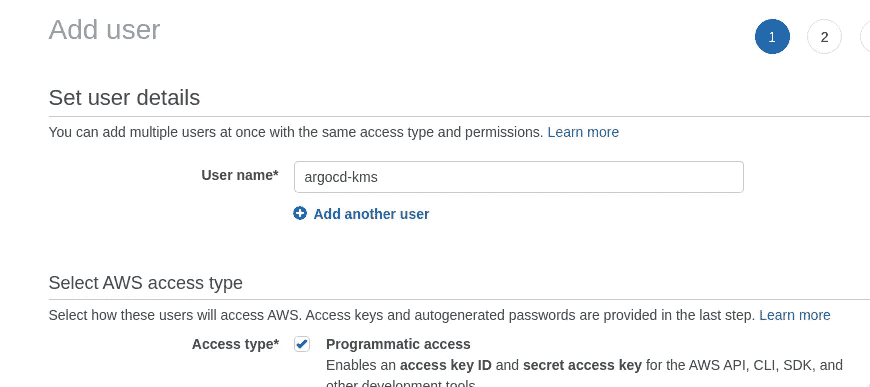

接下来，创建一个只读 IAM 策略，只允许 sop 使用这个键:

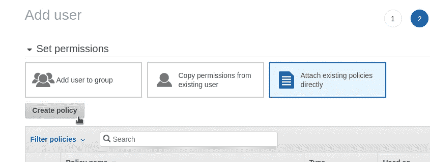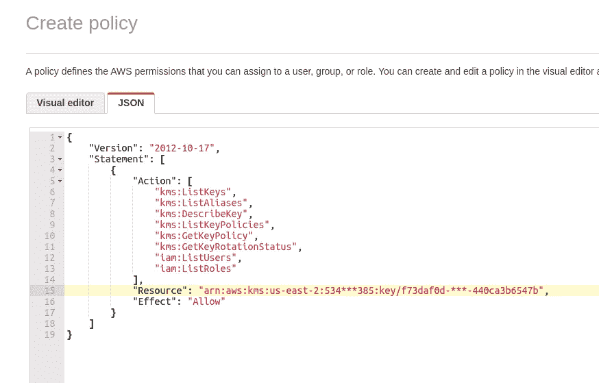

```
{
    "Version": "2012-10-17",
    "Statement": [
        {
            "Action": [
                "kms:ListKeys",
                "kms:ListAliases",
                "kms:DescribeKey",
                "kms:ListKeyPolicies",
                "kms:GetKeyPolicy",
                "kms:GetKeyRotationStatus",
                "iam:ListUsers",
                "iam:ListRoles"
            ],
            "Resource": "arn:aws:kms:us-east-2:534***385:key/f73daf0d-***-440ca3b6547b",
            "Effect": "Allow"
        }
    ]
}
```

保存它并附加到用户:

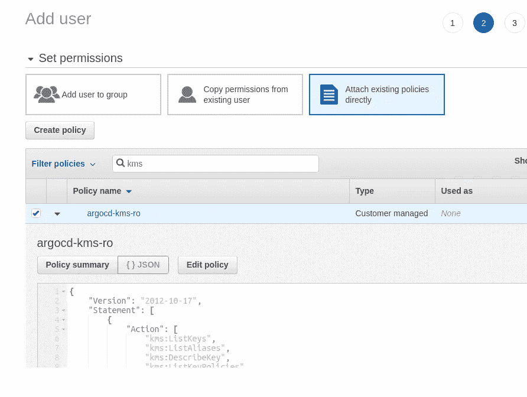

保存用户，转到 AWS KMS，添加一个关键用户:

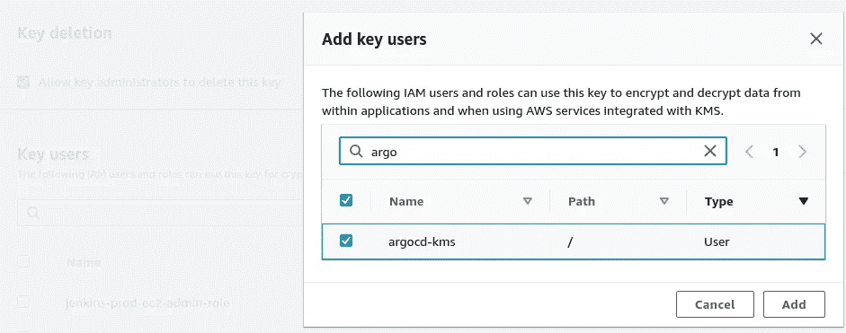

配置本地 AWS 配置文件:

```
$ aws configure — profile argocd-kms
AWS Access Key ID [None]: AKI***Q4F
AWS Secret Access Key [None]: S7c***6ya
Default region name [None]: us-east-2
Default output format [None]:
```

检查访问权限:

```
$ aws — profile argocd-kms kms describe-key — key-id f73daf0d-***-440ca3b6547b
{
“KeyMetadata”: {
“AWSAccountId”: “534***385”,
“KeyId”: “f73daf0d-***-440ca3b6547b”,
“Arn”: “arn:aws:kms:us-east-2:534***385:key/f73daf0d-***-440ca3b6547b”,
…
```

该配置文件将用于加密我们的秘密，并且该配置文件需要添加到 *argocd-repo-server* pod 中。

## AWS `credentials`和`config`

用`~/.aws/credentials`和`~/.aws/config`内容创建一个新的 Kubernetes Secret，然后它们将被映射到 *argocd-repo-server* pod:

```
---     
apiVersion: v1
kind: Secret
metadata:
  name: argocd-aws-credentials
  namespace: dev-1-devops-argocd-ns
type: Opaque
stringData: 
  credentials: |
    [argocd-kms]
    aws_access_key_id = AKI***Q4F
    aws_secret_access_key = S7c***6ya
  config: | 
    [profile argocd-kms]
    region = us-east-2
```

将文件添加到`.gitignore`:

```
$ cat .gitignore
argocd-aws-credentials.yaml
```

稍后，当将为 ArgoCD 的推出做一个自动化时，这个文件可以从 Jenkins Secrets 创建。

创造秘密:

```
$ kubectl apply -f argocd-aws-credentials.yaml
secret/argocd-aws-credentials created
```

更新`Deployment`*argocd-repo-server*-更改要使用的映像，从我们的 Secret 中添加一个新卷，并将其作为`/home/argocd/.aws`挂载到带有 Argo 的 pod:

```
---
apiVersion: apps/v1
kind: Deployment
metadata:
  labels:
    app.kubernetes.io/component: repo-server
    app.kubernetes.io/name: argocd-repo-server
    app.kubernetes.io/part-of: argocd
  name: argocd-repo-server
spec:
  selector:
    matchLabels:
      app.kubernetes.io/name: argocd-repo-server
  template:
    metadata:
      labels:
        app.kubernetes.io/name: argocd-repo-server
    spec:
      automountServiceAccountToken: false
      containers:
      - command:
        - uid_entrypoint.sh
        - argocd-repo-server
        - --redis
        - argocd-redis:6379
#        image: argoproj/argocd:v1.7.9
        image: setevoy/argocd-helm-secrets:v1.7.9-1
        imagePullPolicy: Always
        name: argocd-repo-server
        ports:
        - containerPort: 8081
        - containerPort: 8084
        readinessProbe:
          initialDelaySeconds: 5
          periodSeconds: 10
          tcpSocket:
            port: 8081
        volumeMounts:
        - mountPath: /app/config/ssh
          name: ssh-known-hosts
        - mountPath: /app/config/tls
          name: tls-certs
        - mountPath: /app/config/gpg/source
          name: gpg-keys
        - mountPath: /app/config/gpg/keys
          name: gpg-keyring
        - mountPath: /home/argocd/.aws
          name: argocd-aws-credentials
      volumes:
      - configMap:
          name: argocd-ssh-known-hosts-cm
        name: ssh-known-hosts
      - configMap:
          name: argocd-tls-certs-cm
        name: tls-certs
      - configMap:
          name: argocd-gpg-keys-cm
        name: gpg-keys
      - emptyDir: {}
        name: gpg-keyring
      - name: argocd-aws-credentials
        secret:
          secretName: argocd-aws-credentials
```

更新 ArgoCD 实例:

```
$ kubectl -n dev-1-devops-argocd-ns apply -f install.yaml
```

检查舱:

```
$ kubectl -n dev-1-devops-argocd-ns get pod
NAME READY STATUS RESTARTS AGE
…
argocd-repo-server-64f4bbf4b7-jcs6x 1/1 Terminating 0 19h
argocd-repo-server-7c64775679–9jjq2 1/1 Running 0 12s
```

检查文件:

```
$ kubectl -n dev-1-devops-argocd-ns exec -ti argocd-repo-server-7c64775679–9jjq2 -- cat /home/argocd/.aws/credentials
[argocd-kms]
aws_access_key_id = AKI***Q4F
aws_secret_access_key = S7c***6ya
```

让我们试着使用`helm-secrets`。

## 添加`secrets.yaml`

在带有图表的存储库中创建一个新的`secrets.yaml`文件:

```
somePassword: secretValue
```

用 KMS 键和 AWS 概要文件创建一个`.sops.yaml`文件:

```
---
creation_rules:
  - kms: 'arn:aws:kms:us-east-2:534****385:key/f73daf0d-***-440ca3b6547b'
    aws_profile: argocd-kms
```

加密文件:

```
$ helm secrets enc secrets.yaml
Encrypting secrets.yaml
Encrypted secrets.yaml
```

将我们的秘密的用法添加到测试图表中，例如—让我们创建一个名为`TEST_SECRET_PASSWORD`的环境变量—更新`templates/deployment.yaml`:

```
...
      containers:
        - name: {{ .Chart.Name }}
          securityContext:
            {{- toYaml .Values.securityContext | nindent 12 }}
          image: "{{ .Values.image.repository }}:{{ .Values.image.tag | default .Chart.AppVersion }}"
          imagePullPolicy: {{ .Values.image.pullPolicy }}
          env:
          - name: TEST_SECRET_PASSWORD
            value: {{ .Values.somePassword }}
...
```

将更改推送到存储库:

```
$ git add secrets.yaml templates/deployment.yaml
$ git commit -m “test secret added” && git push
```

进入应用程序设置— *应用程序详情>参数*，点击*编辑*，将`values.yaml`和`secrets.yaml`指定为*值文件*:

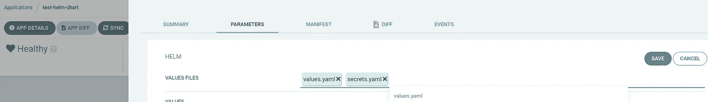

ArgoCD 现在发现应用程序与存储库中的数据不同步:


同步它:

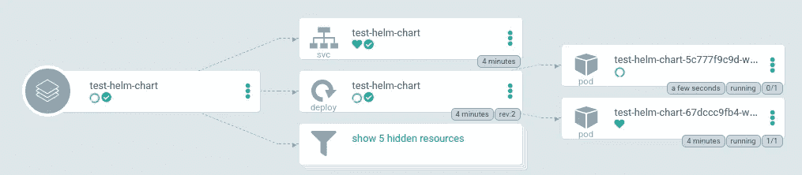

检查新 pod:

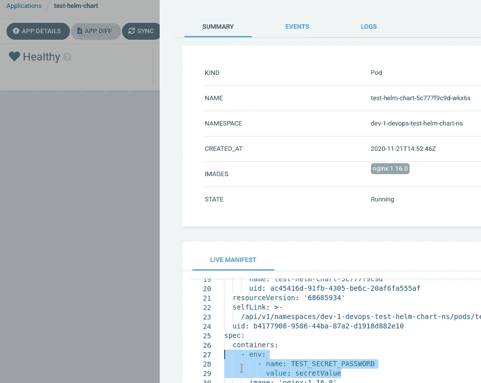

和数据直接存储在 pod 中:

```
$ kubectl -n dev-1-devops-test-helm-chart-ns exec -ti test-helm-chart-5c777f9c9d-wkx6s -- printenv | grep SECRET
TEST_SECRET_PASSWORD=secretValue
```

全部完成——秘密就在这里。

*最初发布于* [*RTFM: Linux，devo PSисистемноеадммитиииииованние*](https://rtfm.co.ua/en/argocd-a-helm-chart-deployment-and-working-with-helm-secrets-via-aws-kms/)*。*