# ArgoCD:概述、SSL 配置和应用程序部署

> 原文：<https://itnext.io/argocd-an-overview-ssl-configuration-and-an-application-deploy-89d8947d95cf?source=collection_archive---------3----------------------->


ArgoCD 通过使用 GitOps 方法帮助向 Kubernetes 交付应用程序，即当 Git-repository 用作信任源时，所有清单、配置和其他数据都存储在一个存储库中。

它可以和 Kubernetes manifest、 [kustomize](https://kustomize.io/) 、 [ksonnet](https://ksonnet.io/) 、 [jsonnet](https://jsonnet.org/) 以及我们在项目中使用的东西——舵图一起使用。

ArgoCD 在集群中旋转其控制器，并观察存储库中的变化，以将其与部署在集群中的资源进行比较，同步它们的状态。

一些真正有用的附加功能是带 SAML 的 SSO，因此我们可以将其与我们的 [Okta](https://rtfm.co.ua/en/what-is-saml-an-overview-its-structure-and-requests-tracing-between-a-jenkins-and-okta-sso/) 集成，它可以部署到多个集群，Kubernetes RBAC 支持，出色的 WebUI 和 CLI，Github，GitLab 等 webhooks 集成，加上开箱即用的 Prometheus metrics，以及出色的[文档](https://argoproj.github.io/argo-cd/)。

我正计划用詹金斯和赫尔姆来取代我们目前的部署流程，请参见[赫尔姆:пошаговое·созданиечартаиелокментаиаа詹金斯](https://rtfm.co.ua/helm-poshagovoe-sozdanie-charta-i-deplojmenta-iz-jenkins/)帖子(*俄罗斯*)。

# 内容

*   [组件](https://rtfm.co.ua/en/argocd-an-overview-ssl-configuration-and-an-application-deploy/#Components)
*   [ArgoCD CLI 安装](https://rtfm.co.ua/en/argocd-an-overview-ssl-configuration-and-an-application-deploy/#ArgoCD_CLI_installation)
*   [在 Kubernetes 中运行 ArgoCD](https://rtfm.co.ua/en/argocd-an-overview-ssl-configuration-and-an-application-deploy/#Running_ArgoCD_in_Kubernetes)
*   [负载平衡器、SSL 和 DNS](https://rtfm.co.ua/en/argocd-an-overview-ssl-configuration-and-an-application-deploy/#LoadBalancer,_SSL,_and_DNS)
*   [ArgoCD SSL:ERR _ TOO _ MANY _ REDIRECTS](https://rtfm.co.ua/en/argocd-an-overview-ssl-configuration-and-an-application-deploy/#ArgoCD_SSL_ERRTOOMANYREDIRECTS)
*   [ArgoCD:从 Github 库部署](https://rtfm.co.ua/en/argocd-an-overview-ssl-configuration-and-an-application-deploy/#ArgoCD_deploy_from_a_Github_repository)
*   [ArgocD: ComparisonError 加载资源初始状态失败](https://rtfm.co.ua/en/argocd-an-overview-ssl-configuration-and-an-application-deploy/#ArgocD_ComparisonError_failed_to_load_initial_state_of_resource)

# 成分

ArgoCD 由三个主要组件组成— API 服务器、存储库服务器和应用程序控制器。

*   API 服务器(pod: *argocd-server* ):控制整个 argocd 实例，它的所有操作、认证和存储为 Kubernetes 秘密的秘密访问等
*   存储库服务器(pod: *argocd-repo-server* ):存储和同步来自已配置的 Git 存储库的数据，并生成 Kubernetes 清单
*   应用程序控制器(pod:*argocd-application-Controller*):用于监控 Kubernetes 集群中的应用程序，使它们与存储库中描述的一致，并控制 PreSync、Sync、PostSync 挂钩

# ArgoCD CLI 安装

在 macOS 中:

```
$ brew install argocd
```

在 Linux 中—来自 Github 存储库:

```
$ VERSION=$(curl — silent “https://api.github.com/repos/argoproj/argo-cd/releases/latest" | grep ‘“tag_name”’ | sed -E ‘s/.*”([^”]+)”.*/\1/’)$ sudo curl -sSL -o /usr/local/bin/argocd [https://github.com/argoproj/argo-cd/releases/download/$VERSION/argocd-linux-amd64](https://github.com/argoproj/argo-cd/releases/download/$VERSION/argocd-linux-amd64)$ sudo chmod +x /usr/local/bin/argocd
```

检查一下:

```
$ argocd version
argocd: v1.7.9+f6dc8c3
BuildDate: 2020–11–17T23:18:20Z
GitCommit: f6dc8c389a00d08254f66af78d0cae1fdecf7484
GitTreeState: clean
GoVersion: go1.14.12
Compiler: gc
Platform: linux/amd64
```

# 在 Kubernetes 运行 ArgoCD

让我们旋转一个 ArgoCD 实例。我们可以使用文档中的清单来创建所有必要的资源，如 CRD、服务帐户、RBAC 角色和绑定配置映射、机密、服务和部署。

我很确定 ArgoCD 已经有一个现成的舵图，但是这次让我们按照[入门](https://argoproj.github.io/argo-cd/getting_started/)中的描述使用清单。

文档建议使用 *argocd* 名称空间，这样会更简单，但我们并不追求简单，所以让我们创建自己的名称空间:

```
$ kubectl create namespace dev-1-devops-argocd-ns
namespace/dev-1-devops-argocd-ns created
```

部署资源:

```
$ kubectl apply -n dev-1-devops-argocd-ns -f [https://raw.githubusercontent.com/argoproj/argo-cd/stable/manifests/install.yaml](https://raw.githubusercontent.com/argoproj/argo-cd/stable/manifests/install.yaml)
```

编辑 *argcd-server* 服务——将其类型更改为 LoadBalancer，以便从世界访问 WebUI:

```
$ kubectl -n dev-1-devops-argocd-ns patch svc argocd-server -p ‘{“spec”: {“type”: “LoadBalancer”}}’
service/argocd-server patched
```

找到它的网址:

```
$ kubectl -n dev-1-devops-argocd-ns get svc argocd-server
NAME TYPE CLUSTER-IP EXTERNAL-IP PORT(S) AGE
argocd-server LoadBalancer 172.20.142.44 ada***585.us-east-2.elb.amazonaws.com 80:32397/TCP,443:31693/TCP 4m21s
```

ArgoCD 的密码是自动生成的，设置为其 pod 的名称，使用下一个命令获取它:

```
$ kubectl -n dev-1-devops-argocd-ns get pods -l app.kubernetes.io/name=argocd-server -o name | cut -d’/’ -f 2
argocd-server-794857c8fb-xqgmv
```

通过 CLI 登录，不要注意证书错误:

```
$ argocd login ada***585.us-east-2.elb.amazonaws.com
WARNING: server certificate had error: x509: certificate is valid for localhost, argocd-server, argocd-server.dev-1-devops-argocd-ns, argocd-server.dev-1-devops-argocd-ns.svc, argocd-server.dev-1-devops-argocd-ns.svc.cluster.local, not ada***585.us-east-2.elb.amazonaws.com. Proceed insecurely (y/n)? y
Username: admin
Password:
‘admin’ logged in successfully
Context ‘ada***585.us-east-2.elb.amazonaws.com’ updated
```

更改密码:

```
$ argocd account update-password
*** Enter current password:
*** Enter new password:
*** Confirm new password:
Password updated
```

打开 WebUI，再次忽略 SSL 警告，我们将立即设置它，然后登录:

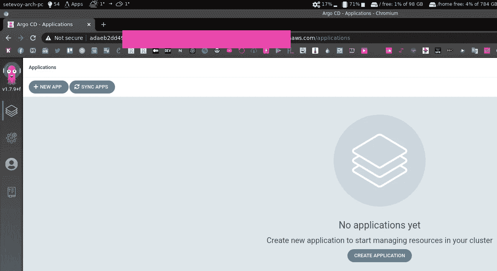

# 负载平衡器、SSL 和 DNS

酷—我们已经运行了所有服务，现在让我们配置一个 DNS 名称和一个 SSL 证书。

AWS ALB 和 ELB 不支持 gRPC，参见 [AWS 应用负载平衡器(ALBs)和经典 ELB (HTTP 模式)](https://argoproj.github.io/argo-cd/operator-manual/ingress/#aws-application-load-balancers-albs-and-classic-elb-http-mode)，因此这里我们不能使用 [ALB 入口控制器](https://rtfm.co.ua/en/aws-elastic-kubernetes-service-running-alb-ingress-controller/)。

让我们像上面一样保留负载平衡器类型的服务—它创建了一个 AWS 经典负载平衡器。

SSL 证书可以在创建我们的集群和负载平衡器并保存其 ARN 的同一区域使用 [AWS 证书管理器](https://aws.amazon.com/certificate-manager/)发布。

下载清单文件:

```
$ wget [https://raw.githubusercontent.com/argoproj/argo-cd/stable/manifests/install.yaml](https://raw.githubusercontent.com/argoproj/argo-cd/stable/manifests/install.yaml)
```

找到 *argocd-server* 服务:

```
---
apiVersion: v1
kind: Service
metadata:
  labels:
    app.kubernetes.io/component: server
    app.kubernetes.io/name: argocd-server
    app.kubernetes.io/part-of: argocd
  name: argocd-server
spec:
  ports:
  - name: http
    port: 80
    protocol: TCP
    targetPort: 8080
  - name: https
    port: 443
    protocol: TCP
    targetPort: 8080
  selector:
    app.kubernetes.io/name: argocd-server
```

在`spec.type`-`LoadBalancer`类型中添加`service.beta.kubernetes.io/aws-load-balancer-ssl-cert`，并用`loadBalancerSourceRanges`限制访问:

```
---
apiVersion: v1
kind: Service
metadata:
  labels:
    app.kubernetes.io/component: server
    app.kubernetes.io/name: argocd-server
    app.kubernetes.io/part-of: argocd
  name: argocd-server
  annotations:
    service.beta.kubernetes.io/aws-load-balancer-ssl-cert: "arn:aws:acm:us-east-1:534***385:certificate/ddaf55b0-***-53d57c5ca706"
spec:
  type: LoadBalancer
  loadBalancerSourceRanges:
  - "31.***.***.117/32"
  - "194.***.***.24/29"
  ports:
  - name: http
    port: 80
    protocol: TCP
    targetPort: 8080
  - name: https
    port: 443
    protocol: TCP
    targetPort: 8080
  selector:
    app.kubernetes.io/name: argocd-server
```

部署它:

```
$ kubectl -n dev-1-devops-argocd-ns apply -f install.yaml
```

检查 ELB 的 SSL:

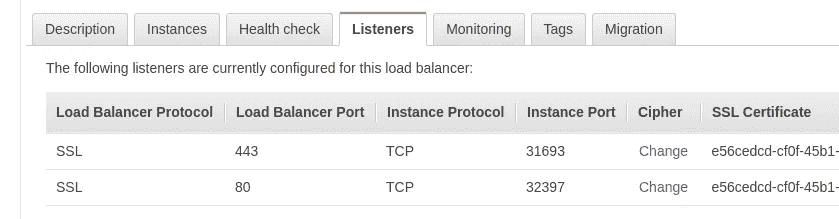

创建 DNS 记录:

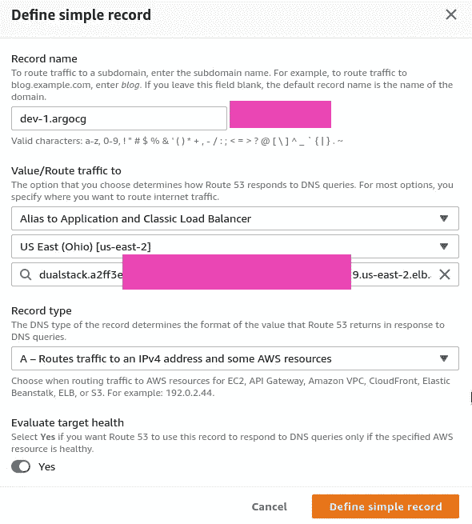

打开 URL —并获得***ERR _ TOO _ MANY _ REDIRECTS***error*:*

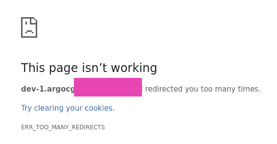

## ArgoCD SSL:ERR _ TOO _ MANY _ REDIRECTS

去谷歌上找这个话题——[https://github.com/argoproj/argo-cd/issues/2953](https://github.com/argoproj/argo-cd/issues/2953)。

回到`install.yaml`，在`Deployment` *argocd-server* 中添加`--insecure`标志:

```
---
apiVersion: apps/v1
kind: Deployment
metadata:
  labels:
    app.kubernetes.io/component: server
    app.kubernetes.io/name: argocd-server
    app.kubernetes.io/part-of: argocd
  name: argocd-server
spec:
  selector:
    matchLabels:
      app.kubernetes.io/name: argocd-server
  template:
    metadata:
      labels:
        app.kubernetes.io/name: argocd-server
    spec:
      containers:
      - command:
        - argocd-server
        - --staticassets
        - /shared/app
        - --insecure
...
```

部署它，并检查:

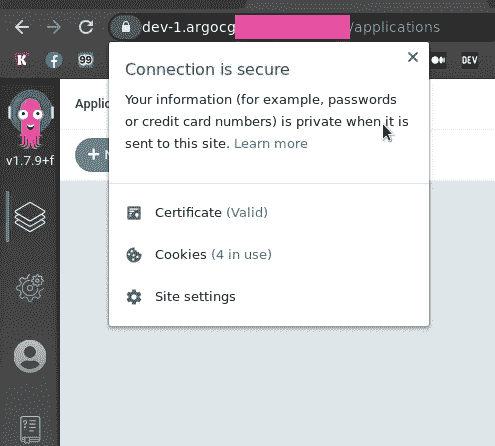

好了——我们到此为止。

# ArgoCD:从 Github 存储库部署

让我们从《入门指南》中的示例开始——在接下来的部分中，我们将观察 Helm 的部署。

点击*新建 App* ，指定名称，并设置*项目*=*默认*:

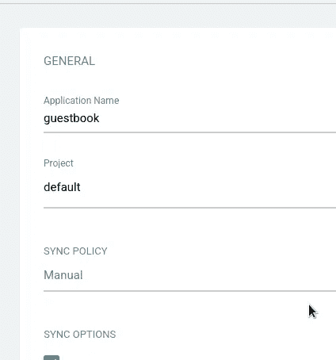

在 *Git* 中设置[https://github.com/argoproj/argocd-example-apps.git](https://github.com/argoproj/argocd-example-apps.gi)URL 和 repo — *留言簿*中的路径:

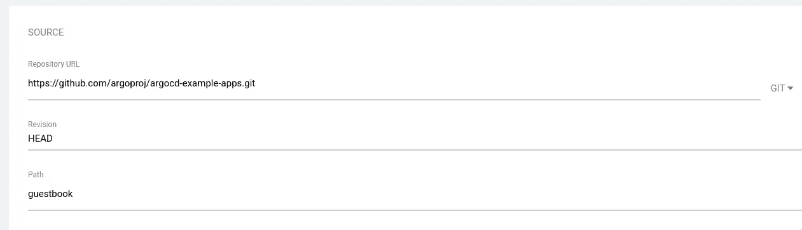

在目的地—[*https://kubernetes . default . SVC*](https://kubernetes.default.svc)和*默认*命名空间中，点击*创建*:

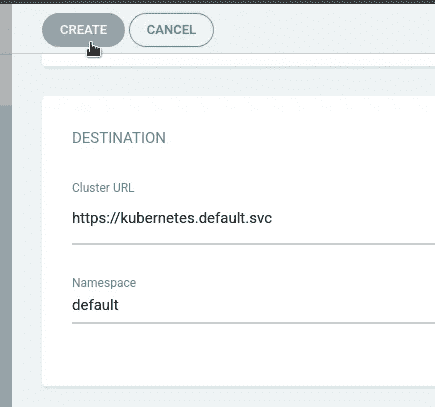

貌似是创建的，但是为什么它的同步状态是*未知*？

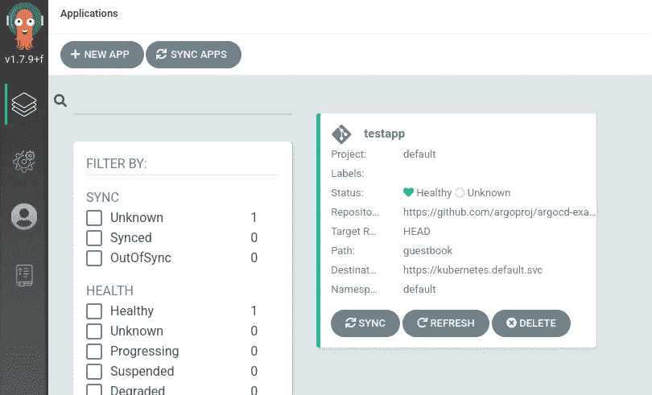

有些事情出错了:

```
$ argocd app get guestbook
Name: guestbook
Project: default
Server: [https://kubernetes.default.svc](https://kubernetes.default.svc)
Namespace: default
…
CONDITION MESSAGE LAST TRANSITION
ComparisonError failed to load initial state of resource PersistentVolumeClaim: persistentvolumeclaims is forbidden: User “system:serviceaccount:dev-1-devops-argocd-ns:argocd-application-controller” cannot list resource “persistentvolumeclaims” in API group “” at the cluster scope 2020–11–19 15:35:51 +0200 EET
ComparisonError failed to load initial state of resource PersistentVolumeClaim: persistentvolumeclaims is forbidden: User “system:serviceaccount:dev-1-devops-argocd-ns:argocd-application-controller” cannot list resource “persistentvolumeclaims” in API group “” at the cluster scope 2020–11–19 15:35:51 +0200 EET
```

从 CLI 尝试使用`sync`命令——也不起作用:

```
$ argocd app sync guestbook
Name: guestbook
Project: default
Server: [https://kubernetes.default.svc](https://kubernetes.default.svc)
Namespace: default
…
Sync Status: Unknown
Health Status: Healthy
Operation: Sync
Sync Revision:
Phase: Error
Start: 2020–11–19 15:37:01 +0200 EET
Finished: 2020–11–19 15:37:01 +0200 EET
Duration: 0s
Message: ComparisonError: failed to load initial state of resource Pod: pods is forbidden: User “system:serviceaccount:dev-1-devops-argocd-ns:argocd-application-controller” cannot list resource “pods” in API group “” at the cluster scope;ComparisonError: failed to load initial state of resource Pod: pods is forbidden: User “system:serviceaccount:dev-1-devops-argocd-ns:argocd-application-controller” cannot list resource “pods” in API group “” at the cluster scope
FATA[0001] Operation has completed with phase: Error
```

## ArgocD: ComparisonError 无法加载资源的初始状态

实际上，最好考虑一下“ ***用户“系统:服务帐户:dev-1-devo PS-argocd-ns:argocd-应用程序-控制器”无法在集群范围*** 列出 API 组中的资源“pods”错误。

检查*argocd-application-controller*service account(这里真正有用的是 [Kubernetes: ServiceAccounts、JWT-令牌、认证和 RBAC 授权](https://rtfm.co.ua/en/kubernetes-serviceaccounts-jwt-tokens-authentication-and-rbac-authorization/)帖子):

```
$ kubectl -n dev-1-devops-argocd-ns get serviceaccount argocd-application-controller
NAME SECRETS AGE
argocd-application-controller 1 36m
```

是的，我们已经创建了`User system:serviceaccount:dev1-devops-argocd-ns:argocd-application-controller`用户。

并且映射了*argocd-application-controller*ClusterRoleBinding:

```
$ kubectl -n dev-1-devops-argocd-ns get clusterrolebinding argocd-application-controller
NAME AGE
argocd-application-controller 24h
```

但是它不能执行`list pods`动作:

```
$ kubectl auth can-i list pods -n dev-1-devops-argocd-ns — as system:serviceaccount:dev-1-devops-argocd-ns:argocd-application-controller
no
```

尽管它的 ClusterRole 提供了所有权限:

```
---
apiVersion: rbac.authorization.k8s.io/v1
kind: ClusterRole
metadata:
  labels:
    app.kubernetes.io/component: application-controller
    app.kubernetes.io/name: argocd-application-controller
    app.kubernetes.io/part-of: argocd
  name: argocd-application-controller
rules:
- apiGroups:
  - '*'
  resources:
  - '*'
  verbs:
  - '*'
- nonResourceURLs:
  - '*'
  verbs:
  - '*'
```

再次检查 ClusterRoleBinding，但这次使用的是`-o yaml`输出:

```
$ kubectl get clusterrolebinding argocd-application-controller -o yaml
apiVersion: rbac.authorization.k8s.io/v1
kind: ClusterRoleBinding
…
roleRef:
apiGroup: rbac.authorization.k8s.io
kind: ClusterRole
name: argocd-application-controller
subjects:
- kind: ServiceAccount
name: argocd-application-controller
namespace: argocd
```

啊哈，我们到了。

在`install.yaml`-*argocd-应用程序-控制器*和*argocd-服务器*中找到两个 ClusterRoleBinding，更新它们的名称空间:

```
---
apiVersion: rbac.authorization.k8s.io/v1
kind: ClusterRoleBinding
metadata:
  labels:
    app.kubernetes.io/component: application-controller
    app.kubernetes.io/name: argocd-application-controller
    app.kubernetes.io/part-of: argocd
  name: argocd-application-controller
roleRef:
  apiGroup: rbac.authorization.k8s.io
  kind: ClusterRole
  name: argocd-application-controller
subjects:
- kind: ServiceAccount
  name: argocd-application-controller
  namespace: dev-1-devops-argocd-ns
---
apiVersion: rbac.authorization.k8s.io/v1
kind: ClusterRoleBinding
metadata:
  labels:
    app.kubernetes.io/component: server
    app.kubernetes.io/name: argocd-server
    app.kubernetes.io/part-of: argocd
  name: argocd-server
roleRef:
  apiGroup: rbac.authorization.k8s.io
  kind: ClusterRole
  name: argocd-server
subjects:
- kind: ServiceAccount
  name: argocd-server
  namespace: dev-1-devops-argocd-ns
```

这就是为什么我讲述了默认的 *argocd* 名称空间，以及为什么使用它更简单，就好像你正在使用一个定制的名称空间，然后你必须更新那些绑定。

所以，修复它，重新部署:

```
$ kubectl auth can-i list pods -n dev-1-devops-argocd-ns — as system:serviceaccount:dev-1-devops-argocd-ns:argocd-application-controller
yes
```

尝试再次执行`sync`:

```
$ argocd app sync guestbook
TIMESTAMP GROUP KIND NAMESPACE NAME STATUS HEALTH HOOK MESSAGE
2020–11–19T15:47:08+02:00 Service default guestbook-ui Running Synced service/guestbook-ui unchanged
2020–11–19T15:47:08+02:00 apps Deployment default guestbook-ui Running Synced deployment.apps/guestbook-ui unchanged
Name: guestbook
Project: default
Server: [https://kubernetes.default.svc](https://kubernetes.default.svc)
…
Sync Status: Synced to HEAD (6bed858)
Health Status: Healthy
Operation: Sync
Sync Revision: 6bed858de32a0e876ec49dad1a2e3c5840d3fb07
Phase: Succeeded
Start: 2020–11–19 15:47:06 +0200 EET
Finished: 2020–11–19 15:47:08 +0200 EET
Duration: 2s
Message: successfully synced (all tasks run)
GROUP KIND NAMESPACE NAME STATUS HEALTH HOOK MESSAGE
Service default guestbook-ui Synced Healthy service/guestbook-ui unchanged
apps Deployment default guestbook-ui Synced Healthy deployment.apps/guestbook-ui unchanged
```

它正在起作用:

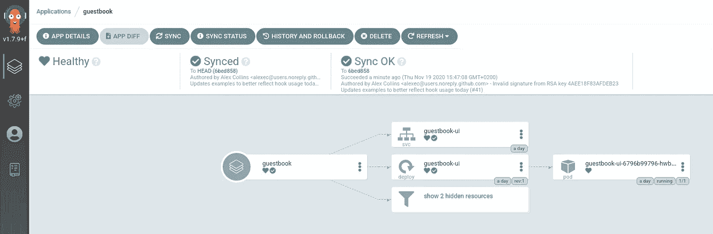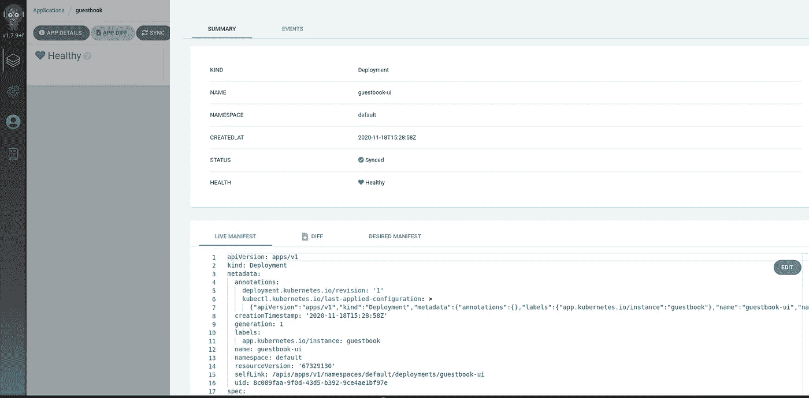

pod 的日志:

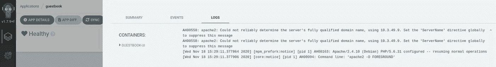

下一步将是部署一个舵图，并找出如何与[舵秘密](https://rtfm.co.ua/en/helm-helm-secrets-sensitive-data-encryption-with-aws-kms-and-use-it-from-jenkins/)合作。

*原发表于* [*RTFM: Linux，devo PSисистемноеадммитииииииованниое*](https://rtfm.co.ua/en/argocd-an-overview-ssl-configuration-and-an-application-deploy/)*。*