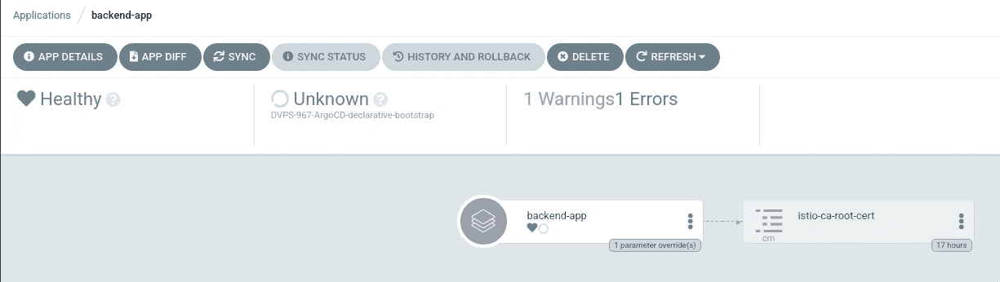
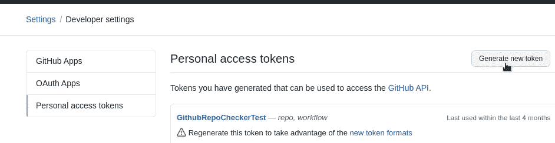
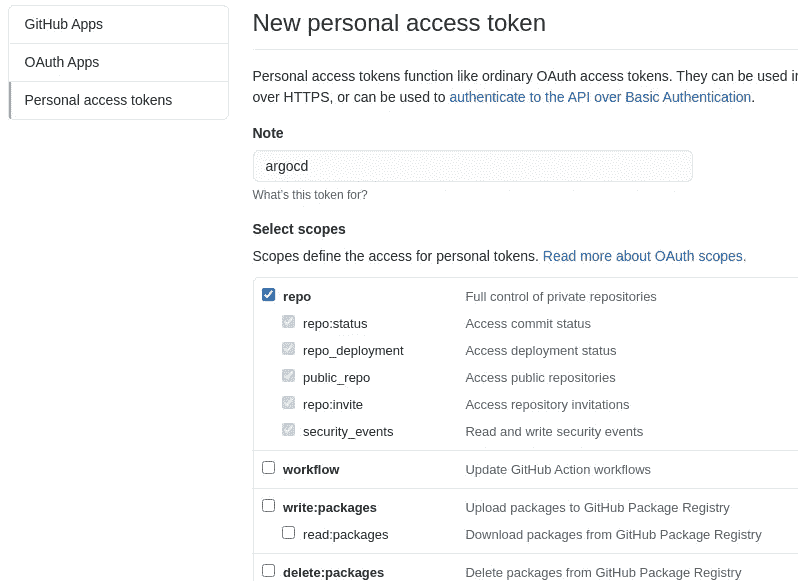
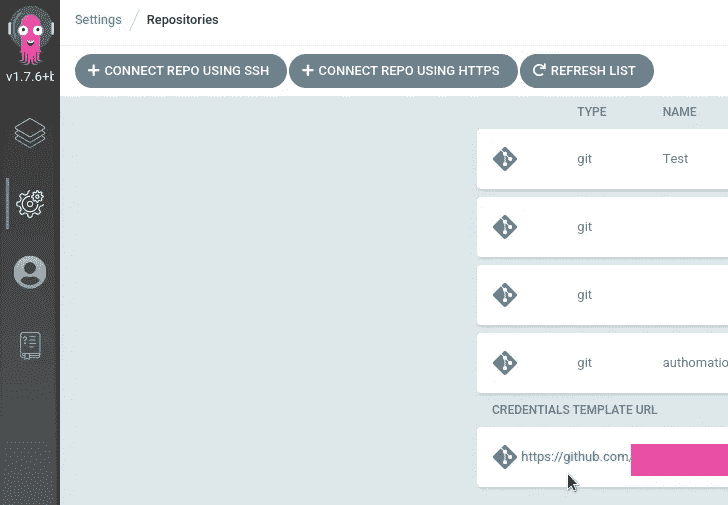
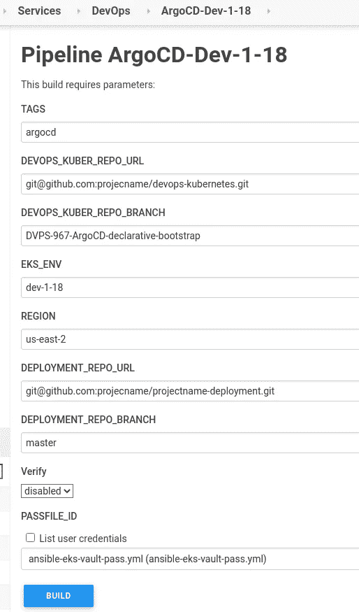
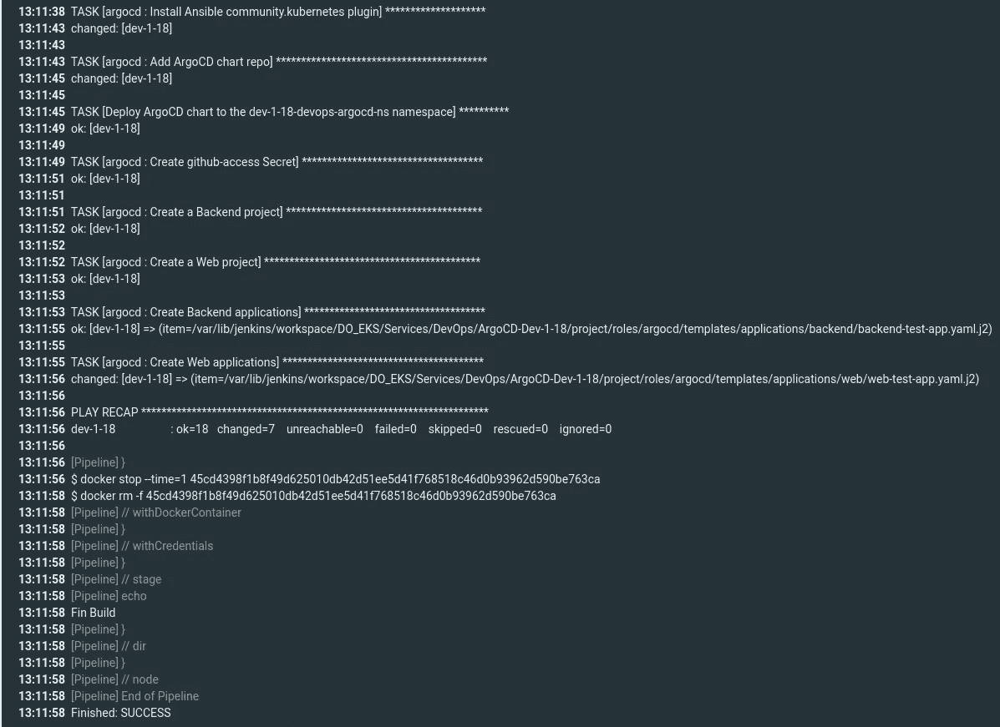
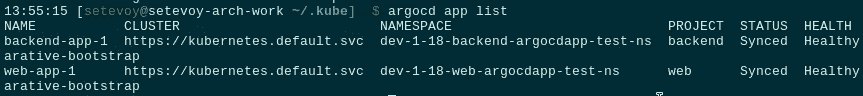

# ArgoCD:从 Jenkins 部署声明性项目、应用程序和 ArgoCD

> 原文：<https://itnext.io/argocd-declarative-projects-applications-and-argocd-deploy-from-jenkins-6dda3cf51f74?source=collection_archive---------2----------------------->


在 ArgoCD 中，可以从 WebUI、CLI 创建应用程序、集群或存储库，也可以通过编写 Kubernetes 清单来创建，然后将清单传递给`kubectl`来创建资源。

例如，应用程序是 Kubernetes CustomResources，并在 Kubernetes CRD `[applications.argoproj.io](https://github.com/argoproj/argo-cd/blob/master/manifests/crds/application-crd.yaml)`中进行了描述:

```
$ kubectl get crd applications.argoproj.io
NAME CREATED AT
applications.argoproj.io 2020–11–27T15:55:29Z
```

并且可以在 ArgoCD 的名称空间中作为公共 Kubernetes 资源进行访问:

```
$ kubectl -n dev-1–18-devops-argocd-ns get applications
NAME SYNC STATUS HEALTH STATUS
backend-app OutOfSync Missing
dev-1–18-web-payment-service-ns Synced Healthy
web-fe-github-actions Synced Healthy
```

这种方法能够在创建新的 ArgoCD 实例时创建所有必要的应用程序。例如，当我们在 AWS Elastic Kubernetes 服务上升级 Kubernetes 版本时，我们正在使用 Jenkins、Ansible 和 Helm 创建一个新的集群(查看 [AWS Elastic Kubernetes 服务:集群创建自动化，第 1 部分—云形成](https://rtfm.co.ua/en/aws-elastic-kubernetes-service-a-cluster-creation-automation-part-1-cloudformation/)和 [AWS Elastic Kubernetes 服务:集群创建自动化，第 2 部分— Ansible，eksctl](https://rtfm.co.ua/en/aws-elastic-kubernetes-service-a-cluster-creation-automation-part-2-ansible-eksctl/) 了解更多详细信息)。我们在那里安装了所有必要的控制器和操作器，包括 ArgoCD。

通过使用 ArgoCD 的声明性方法，我们还可以创建在新的 EKS 集群供应期间配置的所有应用程序和其他设置。

所以，我们现在的任务是创造:

*   具有名称空间后端和 Web 团队的角色和权限的项目
*   应用程序——用于我们的后端和 Web 项目
*   存储库—为 Github 存储库设置身份验证

首先，让我们通过手动创建清单和资源来了解它的一般工作方式，然后将它应用到 Ansible 角色，并创建一个 Jenkins 作业。

*   [项目](https://rtfm.co.ua/en/argocd-declarative-projects-applications-and-argocd-deploy-from-jenkins/#Projects)
*   [应用](https://rtfm.co.ua/en/argocd-declarative-projects-applications-and-argocd-deploy-from-jenkins/#Applications)
*   [储存库](https://rtfm.co.ua/en/argocd-declarative-projects-applications-and-argocd-deploy-from-jenkins/#Repositories)
*   [储存库机密](https://rtfm.co.ua/en/argocd-declarative-projects-applications-and-argocd-deploy-from-jenkins/#Repository_Secret)
*   詹金斯、安西布尔和阿尔戈德
*   [不可思议的库伯内特的秘密](https://rtfm.co.ua/en/argocd-declarative-projects-applications-and-argocd-deploy-from-jenkins/#Ansible_Kubernetes_Secret)
*   [可行的 ArgoCD 项目和应用](https://rtfm.co.ua/en/argocd-declarative-projects-applications-and-argocd-deploy-from-jenkins/#Ansible_ArgoCD_Projects_and_Applications)
*   詹金斯

# 项目

文档— [项目](https://argoproj.github.io/argo-cd/operator-manual/declarative-setup/#projects)。

我们需要为我们的两个团队——后端和 Wb——准备两个项目，每个项目都需要对使用的名称空间进行限制，并且必须为访问这些项目中的应用程序配置一个角色。

用后端的项目创建一个新文件:

```
apiVersion: argoproj.io/v1alpha1
kind: AppProject
metadata:
  name: backend
  namespace: dev-1-18-devops-argocd-ns
  finalizers:
    - resources-finalizer.argocd.argoproj.io
spec:
  description: "Backend project"
  sourceRepos:
  - '*'
  destinations:
  - namespace: 'dev-1-18-backend-*'
    server: [https://kubernetes.default.svc](https://kubernetes.default.svc)
  clusterResourceWhitelist:
  - group: ''
    kind: Namespace
  namespaceResourceWhitelist:
  - group: "*"
    kind: "*"
  roles:
  - name: "backend-app-admin"
    description: "Backend team's deployment role"
    policies:
    - p, proj:backend:backend-app-admin, applications, *, backend/*, allow
    groups:
    - "Backend"
  orphanedResources:
    warn: true
```

这里:

*   `sourceRepos`:允许从任何存储库部署到项目
*   `destinations`:允许部署到的集群和其中的名称空间。在上面的例子中，我们使用了 *dev-1-18-backend-** 掩码，因此后端团队将被允许部署到从该掩码开始的任何名称空间，对于 Web 项目，我们将使用类似的掩码 *dev-1-18-web-**
*   `clusterResourceWhitelist`:在集群级别上，只允许创建名称空间
*   `namespaceResourceWhitelist`:在名称空间级别允许创建任何资源
*   `roles`:创建一个*后端-应用-管理*角色，对这个项目中的应用程序有完全的访问权限。更多信息请参见 [ArgoCD:用户、访问和 RBAC](https://rtfm.co.ua/en/argocd-users-access-and-rbac/) 和 [ArgoCD: Okta 集成和用户组](https://rtfm.co.ua/en/argocd-okta-integration-and-user-groups/)
*   `orphanedResources`:启用陈旧资源通知，检查[孤立资源监控](https://argoproj.github.io/argo-cd/user-guide/orphaned-resources/)

部署它:

```
$ kubectl apply -f project.yaml
appproject.argoproj.io/backend created
```

并检查:

```
$ argocd proj get backend
Name: backend
Description: Backend project
Destinations: <none>
Repositories: *
Whitelisted Cluster Resources: /Namespace
Blacklisted Namespaced Resources: <none>
Signature keys: <none>
Orphaned Resources: enabled (warn=true)
```

# 应用程序

文档— [应用](https://argoproj.github.io/argo-cd/operator-manual/declarative-setup/#applications)。

接下来，让我们为后端项目中的测试应用程序添加一个清单:

```
apiVersion: argoproj.io/v1alpha1
kind: Application
metadata:
  name: backend-app
  namespace: dev-1-18-devops-argocd-ns
  finalizers:
    - resources-finalizer.argocd.argoproj.io
spec:
  project: "backend"
  source:
    repoURL: [https://github.com/projectname/devops-kubernetes.git](https://github.com/projectname/devops-kubernetes.git)
    targetRevision: DVPS-967-ArgoCD-declarative-bootstrap
    path: tests/test-svc
    helm:
      parameters:
      - name: serviceType
        value: LoadBalancer
  destination:
    server: [https://kubernetes.default.svc](https://kubernetes.default.svc)
    namespace: dev-1-18-backend-argocdapp-test-ns
  syncPolicy:
    automated:
      prune: false
      selfHeal: false
      allowEmpty: false
    syncOptions:
    - Validate=true
    - CreateNamespace=true
    - PrunePropagationPolicy=foreground
    - PruneLast=true
    retry:
      limit: 5
      backoff:
        duration: 5s
        factor: 2
        maxDuration: 3m
```

这里:

*   `finalizers`:设置从 ArgoCD 删除应用时删除所有 Kubernetes 资源(*级联删除*，参见[应用删除](https://argoproj.github.io/argo-cd/user-guide/app_deletion/))
*   `project`:要添加应用程序的项目，该项目将为应用程序设置限制(名称空间、资源等)
*   `source:`设置要部署的存储库和分支
*   в `helm.parameters` -设定舵图表的值(`helm --set`)
*   `destination`:要部署到的集群和名称空间。此处的命名空间必须在应用程序所属的项目中允许
*   `syncPolicy`:同步设置，检查[自动同步策略](https://argoproj.github.io/argo-cd/user-guide/auto_sync/)和[同步选项](https://argoproj.github.io/argo-cd/user-guide/sync-options/)

此外，ArgoCD 支持所谓的 App of Apps，当您为一个将创建一组其他应用程序的应用程序创建清单时。我们不会使用它 9)，但看起来很有趣，见[集群引导](https://argoproj.github.io/argo-cd/operator-manual/cluster-bootstrapping/)。

部署应用程序:

```
$ kubectl apply -f application.yaml
application.argoproj.io/backend-app created
```

检查一下:

```
$ kubectl -n dev-1–18-devops-argocd-ns get application backend-app
NAME SYNC STATUS HEALTH STATUS
backend-app Unknown Healthy
```

及其状态:

```
$ argocd app get backend-app
Name: backend-app
Project: backend
Server: [https://kubernetes.default.svc](https://kubernetes.default.svc)
Namespace: dev-1–18-backend-argocdapp-test-ns
URL: https://dev-1–18.argocd.example.com/applications/backend-app
Repo: [https://github.com/projectname/devops-kubernetes.git](https://github.com/projectname/devops-kubernetes.git)
Target: DVPS-967-ArgoCD-declarative-bootstrap
Path: tests/test-svc
SyncWindow: Sync Allowed
Sync Policy: Automated
Sync Status: Unknown
Health Status: HealthyCONDITION MESSAGE LAST TRANSITIONComparisonError rpc error: code = Unknown desc = authentication required 2021–05–18 09:11:13 +0300 EEST
OrphanedResourceWarning Application has 1 orphaned resources 2021–05–18 09:11:13 +0300 EEST
```



在这里，我们有"***comparison error = authentic ation required***"，因为 ArgoCD 不能连接到存储库，因为它是私有的。

让我们转到存储库身份验证。

# 仓库

文档— [存储库](https://argoproj.github.io/argo-cd/operator-manual/declarative-setup/#repositories)。

突然间，存储库被添加到`argocd-cm` ConfigMap 中，而不是一个专用的资源，比如应用程序或项目。

对我来说，没有太好的解决方案，如果一个开发人员想添加一个存储库，我必须给他访问“系统”配置图。

此外，Git 服务器的身份验证使用存储在 ArgoCD 的名称空间中的 Kubernetes 秘密，因此开发人员也需要访问那里。

尽管如此，ArgoCD 仍然有办法通过使用相同的认证设置在 Git 服务器上对不同的存储库进行认证，参见[存储库凭证](https://argoproj.github.io/argo-cd/operator-manual/declarative-setup/#repository-credentials)。

背后的想法是，我们可以为存储库设置一个“掩码”，即【https://github.com/projectname】[*，*](https://github.com/projectname,)*，并附加登录和密码或 SSK 私钥。然后，开发者可以设置一个像[*【https://github.com/orgname/reponame】*，](https://github.com/orgname/reponame,)和 ArgoCD 这样的库，将使用*github.com/projectname*掩码，并将在服务器上为*github.com/projectname/reponame*库执行认证。*

*通过这种方式，我们可以创建一个“单点认证”并且我们所有的开发人员都将使用它作为他们的存储库，因为我们所有的存储库都位于同一个 Github 组织 *orgname* 。*

## *仓库机密*

*这里，我们将使用 HTTPS 和 [Github 访问令牌](https://docs.github.com/en/github/authenticating-to-github/creating-a-personal-access-token)。*

*转到 Github 概要文件并创建一个令牌(最好为 ArgoCD 创建一个专用用户):*

**

*授予存储库权限:*

**

*在终端中用 base64 编码令牌，或者使用[https://www.base64encode.org](https://www.base64encode.org)编码令牌:*

```
*$ echo -n ghp_GE***Vx911 | base64
Z2h***xMQo=*
```

*和用户名:*

```
*$ echo -n username | base64
c2V***eTI=*
```

*在 ArgoCD 名称空间中添加 Kubernetes 秘密:*

```
*apiVersion: v1
kind: Secret
metadata:
  name: github-access
  namespace: dev-1-18-devops-argocd-ns
data:
  username: c2V***eTI=
  password: Z2h***xMQ==*
```

*创建它:*

```
*$ kubectl apply -f secret.yaml
secret/github-access created*
```

*将其用途添加到`argocd-cm`配置图:*

```
*...
  repository.credentials: |
    - url: [https://github.com/orgname](https://github.com/orgname)
      passwordSecret:
        name: github-access
        key: password
      usernameSecret:
        name: github-access
        key: username
...*
```

*检查:*

```
*$ argocd repocreds list
URL PATTERN USERNAME SSH_CREDS TLS_CREDS
[https://github.com/projectname](https://github.com/projectname) username false false*
```

**

*并尝试同步应用程序:*

```
*$ argocd app sync backend-app
…
Message: successfully synced (all tasks run)
GROUP KIND NAMESPACE NAME STATUS HEALTH HOOK MESSAGE
Service dev-1–18-backend-argocdapp-test-ns test-svc Synced Progressing service/test-svc created*
```

# *詹金斯、安西布尔和阿尔戈德*

*现在是时候考虑自动化了。*

*通过使用类似于 [Ansible: модуль社区的`community.kubernetes`模块，我们从其舵图安装了 ArgoCD，并具有 Ansible 角色。](https://rtfm.co.ua/ansible-modul-community-kubernetes-i-ustanovka-helm-charta-s-externaldns/#Ansible_%D1%80%D0%BE%D0%BB%D1%8C)*

*我们需要创造的是:*

*   *向 Ansible 角色添加 Github 的秘密*
*   *在 ArgoCD 设置中需要添加`repository.credentials`*
*   *为项目和应用程序清单创建目录，并在 Ansible 角色中添加将使用这些清单的`[community.kubernetes.k8s](https://docs.ansible.com/ansible/latest/collections/community/kubernetes/k8s_module.html)`。通过这种方式，在新的 ArgCD 实例供应期间将自动创建应用程序，并且开发人员将能够自己添加新的应用程序*

## *不可思议的库伯内特秘密*

*在变量文件中，在我们的例子中，这将是`group_vars/all.yaml`，添加两个新变量并用`[ansible-vault](https://rtfm.co.ua/ansible-ispolzovanie-vault-zashifrovannogo-xranilishha/)`加密它们。不要忘记在加密前将它们编码为 base64:*

```
*...
argocd_github_access_username: !vault |
          $ANSIBLE_VAULT;1.1;AES256
          63623436326661333236383064636431333532303436323735363063333264306535313934373464
          ...
          3132663634633764360a666162616233663034366536333765666364643363336130323137613333
          3636
argocd_github_access_password: !vault |
          $ANSIBLE_VAULT;1.1;AES256
          61393931663234653839326232383435653562333435353435333962363361643634626664643062
          ...
          6239623265306462343031653834353562613264336230613466
...*
```

*在角色任务中，在本例中为`roles/argocd/tasks/main.yml`，添加秘密创建:*

```
*...
- name: "Create github-access Secret"
  community.kubernetes.k8s:
    definition:
      kind: Secret
      apiVersion: v1
      metadata:
        name: "github-access"
        namespace: "{{ eks_env }}-devops-argocd-2-0-ns"
      data:
        username: "{{ argocd_github_access_username }}"
        password : "{{ argocd_github_access_password }}"
...*
```

*在舵图表中添加`repository.credentials`的值，参见 [values.yaml](https://github.com/argoproj/argo-helm/blob/master/charts/argo-cd/values.yaml#L574) :*

```
*...
- name: "Deploy ArgoCD chart to the {{ eks_env }}-devops-argocd-2-0-ns namespace"
  community.kubernetes.helm:
    kubeconfig: "{{ kube_config_path }}"
    name: "argocd20"
    chart_ref: "argo/argo-cd"
    release_namespace: "{{ eks_env }}-devops-argocd-2-0-ns"
    create_namespace: true
    values:
      ...
      server:
        service:
          type: "LoadBalancer"
          loadBalancerSourceRanges:
            ...
        config:
          url: "https://{{ eks_env }}.argocd-2-0.example.com"
          repository.credentials: |
            - url: "https://github.com/projectname/"
              passwordSecret:
                name: github-access
                key: password
              usernameSecret:
                name: github-access
                key: username
...*
```

## *可行的 ArgoCD 项目和应用*

*创建目录来存储清单文件:*

```
*$ mkdir -p roles/argocd/templates/{projects,applications/{backend,web}}*
```

*在`roles/argocd/templates/projects/`目录下为两个项目创建两个文件:*

```
*$ vim -p roles/argocd/templates/projects/backend-project.yaml.j2 roles/argocd/templates/projects/web-project.yaml.j2*
```

*描述后端项目:*

```
*apiVersion: argoproj.io/v1alpha1
kind: AppProject
metadata:
  name: "backend"
  namespace: "{{ eks_env }}-devops-argocd-2-0-ns"
  finalizers:
    - resources-finalizer.argocd.argoproj.io
spec:
  description: "Backend project"
  sourceRepos:
  - '*'
  destinations:
  - namespace: "{{ eks_env }}-backend-*"
    server: "https://kubernetes.default.svc"
  clusterResourceWhitelist:
  - group: ''
    kind: Namespace
  namespaceResourceWhitelist:
  - group: "*"
    kind: "*"
  roles:  
  - name: "backend-app-admin"
    description: "Backend team's deployment role"
    policies:
    - p, proj:backend:backend-app-admin, applications, *, backend/*, allow
    groups:
    - "Backend" 
  orphanedResources:
    warn: true*
```

*对网页重复上述步骤*

*和创建应用程序。*

*添加一个`roles/argocd/templates/applications/backend/backend-test-app.yaml.j2`文件:*

```
*apiVersion: argoproj.io/v1alpha1
kind: Application
metadata:
  name: "backend-app-1"
  namespace: "{{ eks_env }}-devops-argocd-2-0-ns"
  finalizers:
    - resources-finalizer.argocd.argoproj.io
spec:
  project: "backend"
  source:
    repoURL: "https://github.com/projectname/devops-kubernetes.git"
    targetRevision: "DVPS-967-ArgoCD-declarative-bootstrap"
    path: "tests/test-svc"
    helm:
      parameters:
      - name: serviceType
        value: LoadBalancer
  destination:
    server: "https://kubernetes.default.svc"
    namespace: "{{ eks_env }}-backend-argocdapp-test-ns"
  syncPolicy:
    automated:
      prune: true
      selfHeal: false
    syncOptions:
    - Validate=true
    - CreateNamespace=true
    - PrunePropagationPolicy=foreground
    - PruneLast=true
    retry:
      limit: 2*
```

*在任务结束时，添加这些清单应用程序—首先是项目，然后是应用程序:*

```
*...
- name: "Create a Backend project"
  community.kubernetes.k8s:
    kubeconfig: "{{ kube_config_path }}"
    state: present
    template: roles/argocd/templates/projects/backend-project.yaml.j2

- name: "Create a Web project"
  community.kubernetes.k8s: 
    kubeconfig: "{{ kube_config_path }}"
    state: present
    template: roles/argocd/templates/projects/web-project.yaml.j2

- name: "Create Backend applications"
  community.kubernetes.k8s:
    kubeconfig: "{{ kube_config_path }}"
    state: present
    template: "{{ item }}"
  with_fileglob:
    - roles/argocd/templates/applications/backend/*.yaml.j2

- name: "Create Web applications"
  community.kubernetes.k8s:
    kubeconfig: "{{ kube_config_path }}"
    state: present
    template: "{{ item }}"
  with_fileglob:
    - roles/argocd/templates/applications/web/*.yaml.j2*
```

*对于应用程序，使用`[with_fileglob](https://rtfm.co.ua/ansible-with_fileglob-kopirovanie-neskolkix-shablonov-iz-direktorii/)`从`roles/argocd/templates/applications/`获取所有文件，因为计划为每个应用程序提供专用文件，以便于开发人员管理它们。*

## *詹金斯*

*参见[詹金斯:миграция RTFM 2.6 —詹金斯管道для Ansible](https://rtfm.co.ua/jenkins-migraciya-rtfm-2-6-jenkins-pipeline-dlya-ansible/) 和[赫尔姆:пошаговоесозданиечартаиелонивентаиз詹金斯](https://rtfm.co.ua/helm-poshagovoe-sozdanie-charta-i-deplojmenta-iz-jenkins/#Jenkins_job)(不幸的是，两者都在俄罗斯)。*

*我不会详细描述这一点，但简而言之，我们使用带有`provision.ansibleApply()`函数调用的脚本化管道:*

```
*...
            stage("Applly") {
                // ansibleApply((playbookFile='1', tags='2', passfile_id='3', limit='4')
                provision.ansibleApply( "${PLAYBOOK}", "${env.TAGS}", "${PASSFILE_ID}", "${EKS_ENV}")
            }
...*
```

*该函数如下:*

```
*...
def ansibleApply(playbookFile='1', tags='2', passfile_id='3', limit='4') {

    withCredentials([file(credentialsId: "${passfile_id}", variable: 'passfile')]) {

        docker.image('projectname/kubectl-aws:4.5').inside('-v /var/run/docker.sock:/var/run/docker.sock --net=host') {

            sh """
                aws sts get-caller-identity
                ansible-playbook ${playbookFile} --tags ${tags} --vault-password-file ${passfile} --limit ${limit}
            """ 
        }   
    }
}.
...*
```

*在这里，通过 Docker，我们用 AWS CLI 和 Ansible 为我们的映像构建了一个容器，它运行一个 Ansible 剧本，传递一个`tag`，并执行必要的 Ansible 角色。*

*在行动手册中，我们为每个角色设置了标记，因此只执行一个角色很容易:*

```
*...
    - role: argocd
      tags: argocd, create-cluster
...*
```

*结果，我们有一个带有这样参数的 Jenkins 作业:*

**

*运行它:*

**

*登录到新的 ArgoCD 实例:*

```
*$ argocd login dev-1–18.argocd-2–0.example.com --name admin@dev-1–18.argocd-2–0.example.com*
```

*检查应用程序:*

**

*完成了。*

**最初发布于* [*RTFM: Linux、DevOps、系统管理*](https://rtfm.co.ua/en/argocd-declarative-projects-applications-and-argocd-deploy-from-jenkins/) *。**