# ArgoCD: Okta 集成和用户组

> 原文：<https://itnext.io/argocd-okta-integration-and-user-groups-d6886633e71b?source=collection_archive---------7----------------------->


在之前的文章 [ArgoCD:用户、访问和 RBAC](https://rtfm.co.ua/en/?p=26033) 中，我们已经检查了如何在 ArgoCD 中管理用户及其权限，现在让我们添加一个 SSO 认证。

这个想法是，我们不在 ArgoCD 的配置图中本地添加用户帐户，而是使用我们的 Okta 用户数据库，Okta 将执行他们的身份验证。并且在 ArgoCD 端将进行用户授权，即，将检查他们的许可边界。

此外，通过使用 SSO，我们将能够创建用户组，这些用户组将具有与特定项目相关的各种角色。

我们将使用 [SAML(带 Dex)](https://argoproj.github.io/argo-cd/operator-manual/user-management/okta/#saml-with-dex) ，也可参见[什么是:SAML——概述、其结构和在 Jenkins 和 Okta SSO](https://rtfm.co.ua/en/what-is-saml-an-overview-its-structure-and-requests-tracing-between-a-jenkins-and-okta-sso/) 帖子之间的请求跟踪，以了解关于 SAML 的更多详细信息。

*   [Okta 配置](https://rtfm.co.ua/en/argocd-okta-integration-and-user-groups/#Okta_configuration)
*   [ArgoCD 配置](https://rtfm.co.ua/en/argocd-okta-integration-and-user-groups/#ArgoCD_configuration)
*   [ArgoCD 中的角色和用户组](https://rtfm.co.ua/en/argocd-okta-integration-and-user-groups/#Roles_and_user_groups_in_ArgoCD)
*   [ArgoCD CLI 登录](https://rtfm.co.ua/en/argocd-okta-integration-and-user-groups/#ArgoCD_CLI_login)
*   [错误和问题](https://rtfm.co.ua/en/argocd-okta-integration-and-user-groups/#Errors_and_problems)
*   [错误请求—用户会话错误](https://rtfm.co.ua/en/argocd-okta-integration-and-user-groups/#Bad_Request_-_User_session_error)
*   [验证失败:没有名为“组”的属性:【电子邮件】](https://rtfm.co.ua/en/argocd-okta-integration-and-user-groups/#Failed_to_authenticate_no_attribute_with_name_group_email)

# Okta 构型

转到您的 Okta 帐户，创建一个 SAML 应用程序:

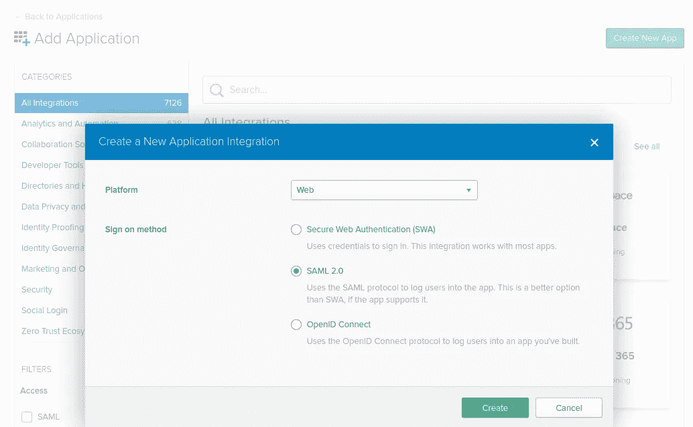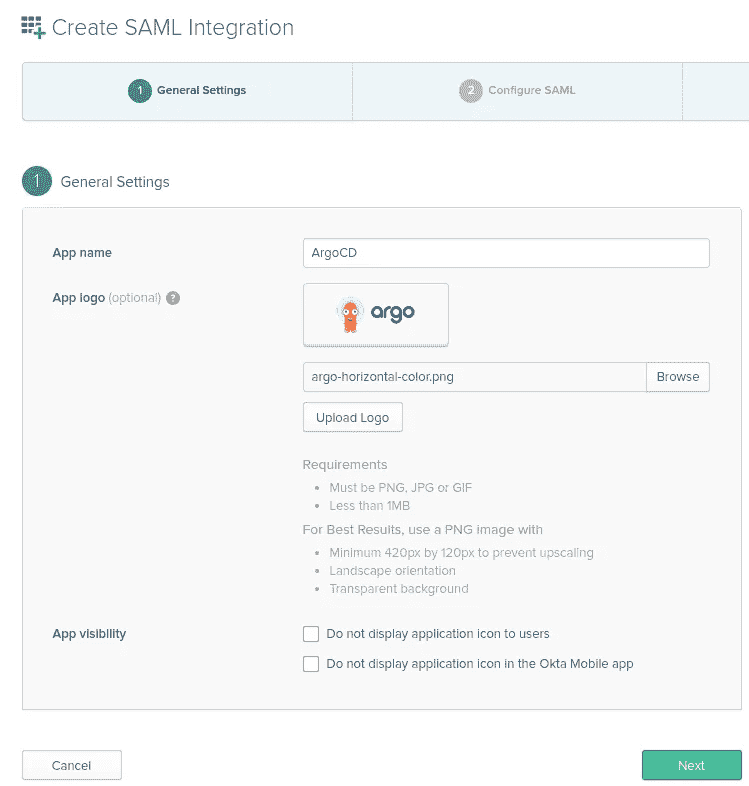

对于徽标，我使用了这张图片:


在下一页上，设置以下内容:

*   *单点登录网址*和
*   *观众 URI (SP 实体 ID)* :
*   你的 ArgoCD 网址像*argourl.com/api/dex/callback*
*   в *属性声明*:姓名— *邮箱*，格式基本，值— *用户.邮箱*
*   в *组属性语句* : name — *group* ，format Basic，在过滤器中您可以使用一个 regex，如[文档](https://argoproj.github.io/argo-cd/operator-manual/user-management/okta/#saml-with-dex)中所示—然后，在[认证上下文](https://rtfm.co.ua/en/what-is-saml-an-overview-its-structure-and-requests-tracing-between-a-jenkins-and-okta-sso/#Authentication_context)期间，Okta 组在被传递到 ArgoCD 之前将被过滤，或者通过将 regex 设置为“*”不过滤任何内容:

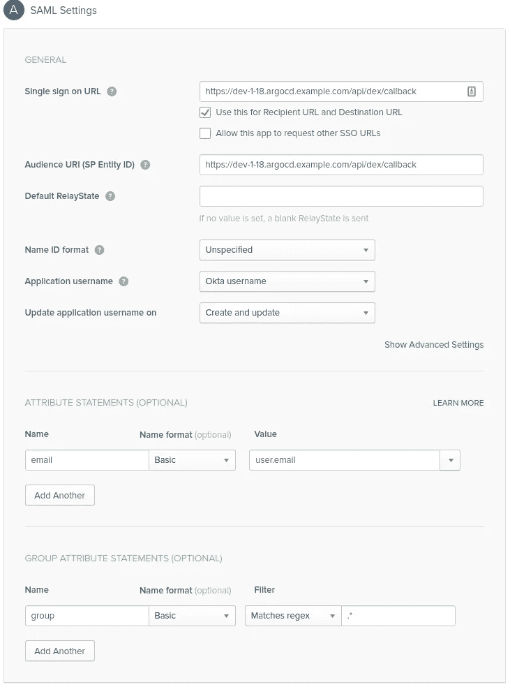

或者您可以使用`|`来过滤组列表:

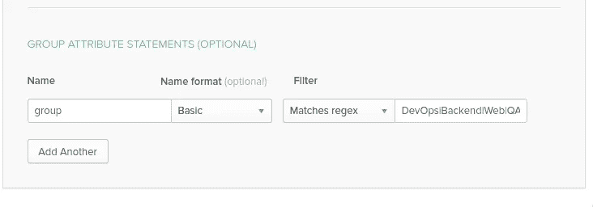

在下一页，设置*我是 Okta 客户添加内部 app* ，点击完成:

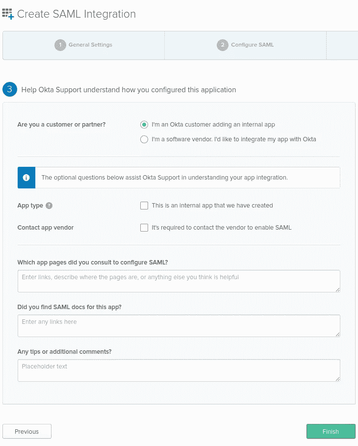

将应用程序分配给用户或组:

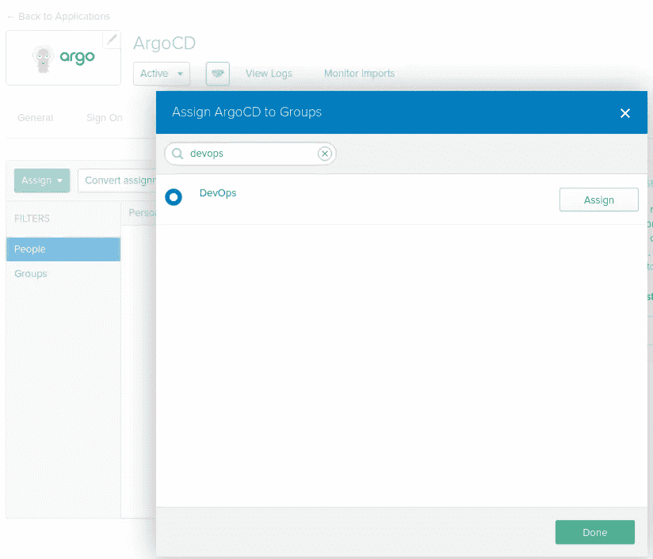

切换到登录选项卡，点击*查看设置说明*按钮:

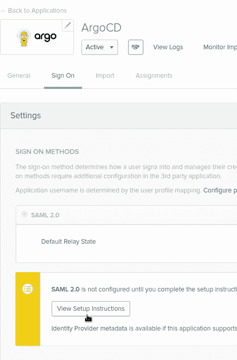

现在，让我们转到 ArgoCD 实例。

# ArgoCD 配置

编辑`argocd-cm`配置图:

```
$ kubectl -n dev-1–18-devops-argocd-ns edit configmap argocd-cm
```

设置:

*   *url* :(可以已经设置，只需检查其值)— ArgoCD 的实例外部 url
*   *ssoURL* :点击*查看设置说明*按钮后打开的页面中的身份提供者单点登录 URL
*   *caData* :来自同一页面的 Okta 证书，用 base64 编码，例如在[https://www.base64encode.org](https://www.base64encode.org/)网站上

现在，您的配置将如下所示:

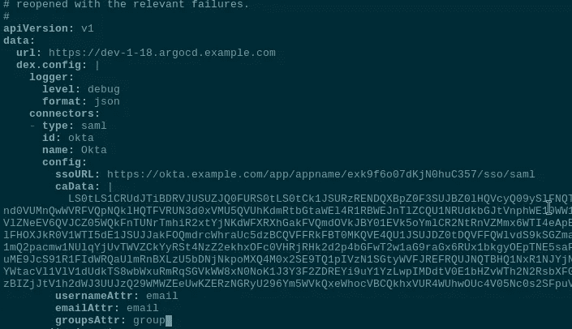

```
apiVersion: v1
data:
  url: [https://dev-1-18.argocd.example.com](https://dev-1-18.argocd.example.com)
  dex.config: |
    logger:
      level: debug
      format: json
    connectors:
    - type: saml
      id: okta
      name: Okta
      config:
        ssoURL: [https://okta.example.com/app/appname/exk9f6o07dKjN0huC357/sso/saml](https://okta.example.com/app/appname/exk9f6o07dKjN0huC357/sso/saml)
        caData: |
          LS0tLS***FLS0tLS0=
        usernameAttr: email
        emailAttr: email
        groupsAttr: group
...
```

## ArgoCD 中的角色和用户组

编辑`argocd-rbac-cm`配置映射，添加 *DevOps* 组(将从 Okta 获得)映射到`role:admin`:

```
g, DevOps, role:admin
```

此外，在这里您可以禁用 *admin* 用户，并将后端和 Web 组绑定添加到他们项目中的应用程序:

```
...
data:
  admin.enabled: "false"
  policy.csv: |
    p, role:backend-app-admin, applications, *, Backend/*, allow
    p, role:web-app-admin, applications, *, Web/*, allow
    g, DevOps, role:admin
  policy.default: role:''
  scopes: '[email,groups]'
...
```

请记住，RBAC 是区分大小写的，所以 DevOps！= devops。因此，您必须在这里指定一个与 Okta 中设置的组相同的组。

保存，并尝试登录:

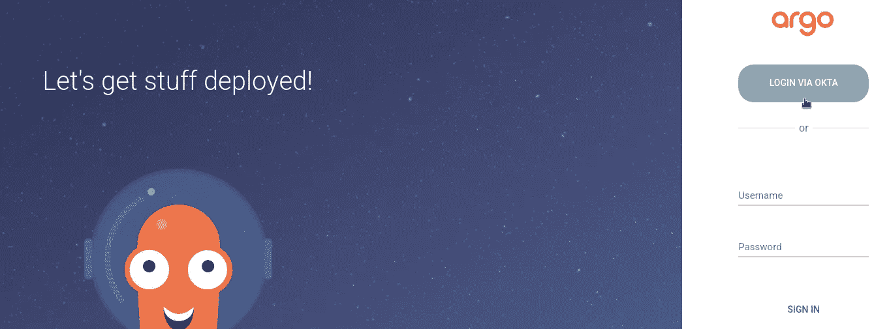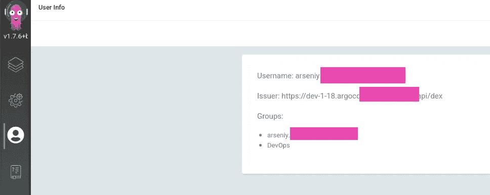

## ArgoCD CLI 登录

要在 SSO 中使用 CLI，只需添加`--sso`选项，并在`--username`中指定您的 Okta 的登录名:

```
$ argocd login dev-1–18.argocd.example.com --sso --username arseniy@example.com
Opening browser for authentication
…
Authentication successful
‘arseniy@example.com’ logged in successfully
Context ‘dev-1–18.argocd.example.com’ updated
```

将会打开一个默认的浏览器，向 Okta 验证您的身份。

# 错误和问题

## 错误的请求—用户会话错误

使用 [Dex](https://dexidp.io/docs/connectors/saml/) 时，请记住，它不允许提供者启动的登录，也就是说，您可以从 Okta 登录到 ArgoCD 实例，您将得到 400 错误:

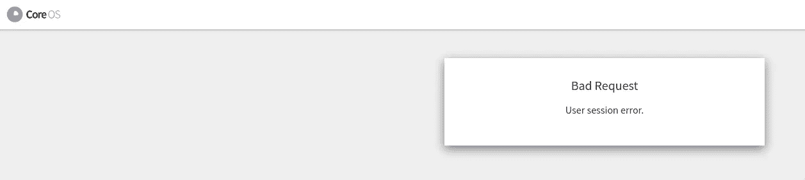

因此，对用户隐藏应用程序是值得的:

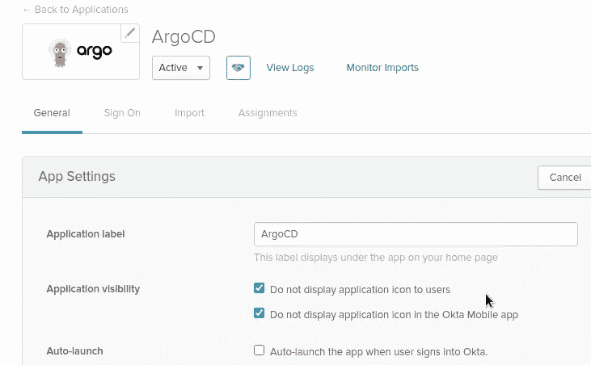

## 验证失败:没有名为“组”的属性:[电子邮件]

如果出现“**认证失败:没有名为“组”的属性:【电子邮件】**”:

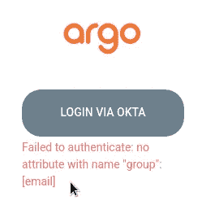

使用 [saml-chrome-panel](https://chrome.google.com/webstore/detail/saml-chrome-panel/paijfdbeoenhembfhkhllainmocckace) ，检查从 Okta 的`AttributeStatement`中发送的属性:

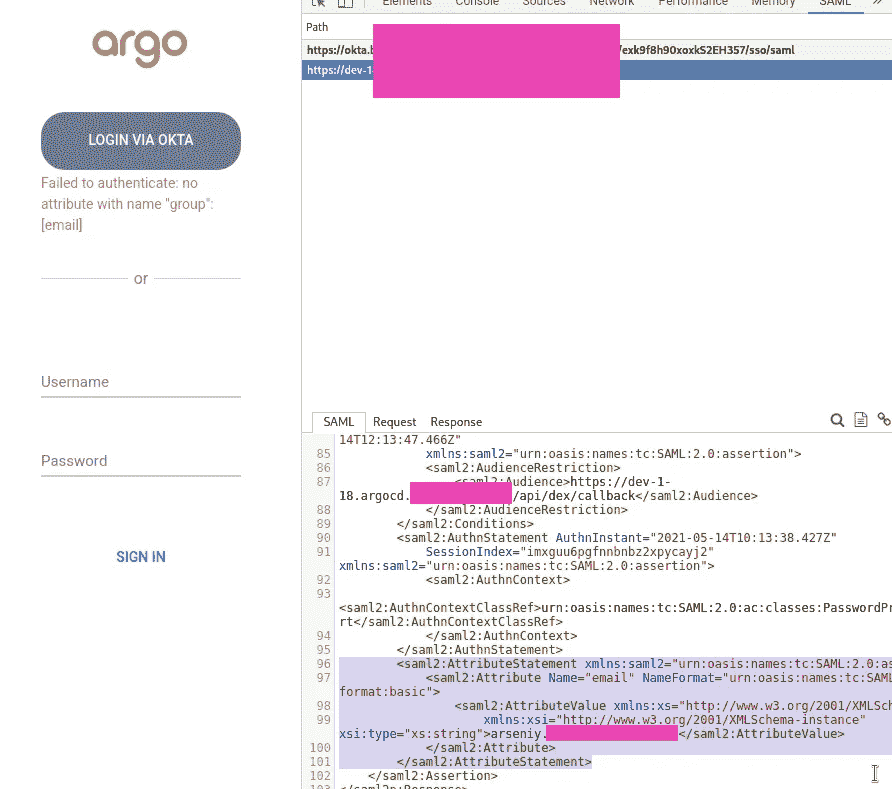

```
<saml2:AttributeStatement xmlns:saml2="urn:oasis:names:tc:SAML:2.0:assertion">
    <saml2:Attribute Name="email" NameFormat="urn:oasis:names:tc:SAML:2.0:attrname-format:basic">
        <saml2:AttributeValue xmlns:xs="http://www.w3.org/2001/XMLSchema"
            xmlns:xsi="http://www.w3.org/2001/XMLSchema-instance" xsi:type="xs:string">arseniy@example.com</saml2:AttributeValue>
    </saml2:Attribute>
</saml2:AttributeStatement>
```

在这个例子中，我在 Okta 配置中犯了一个错误，它没有发送`<saml2:Attribute Name="group"`属性。

条目必须如下所示:

```
<saml2:AttributeStatement xmlns:saml2="urn:oasis:names:tc:SAML:2.0:assertion">
    <saml2:Attribute Name="email" NameFormat="urn:oasis:names:tc:SAML:2.0:attrname-format:basic">
        <saml2:AttributeValue xmlns:xs="http://www.w3.org/2001/XMLSchema"
            xmlns:xsi="http://www.w3.org/2001/XMLSchema-instance" xsi:type="xs:string">arseniy@example.com</saml2:AttributeValue>
    </saml2:Attribute>
    <saml2:Attribute Name="group" NameFormat="urn:oasis:names:tc:SAML:2.0:attrname-format:basic">
        <saml2:AttributeValue xmlns:xs="http://www.w3.org/2001/XMLSchema"
            xmlns:xsi="http://www.w3.org/2001/XMLSchema-instance" xsi:type="xs:string">DevOps</saml2:AttributeValue>
    </saml2:Attribute>
</saml2:AttributeStatement>
```

完成了。

*最初发布于* [*RTFM: Linux、DevOps、系统管理*](https://rtfm.co.ua/en/argocd-okta-integration-and-user-groups/) *。*