# 用 argocd-vault-plugin 解决 ArgoCD 秘密管理

> 原文：<https://itnext.io/argocd-secret-management-with-argocd-vault-plugin-539f104aff05?source=collection_archive---------0----------------------->


* *更新:我们已经将 argocd-vault-plugin 库转移到 argoproj-labs 组织，您现在可以在这里找到用途[https://github.com/argoproj-labs/argocd-vault-plugin](https://github.com/argoproj-labs/argocd-vault-plugin)

GitOps 已经迅速成为 DevOps 领域的热门话题之一。GitOps 是由 [Weaveworks](https://www.weave.works/) 在 [2017](https://www.weave.works/blog/gitops-operations-by-pull-request) 推出的，此后一直呈上升趋势。我不会在本文中深入讨论为什么要使用 GitOps，但是你可以在这里阅读更多关于它的内容。在讨论 GitOps 时总会出现的一个问题是秘密管理。每次涉及 GitOps 的演讲、演示或演示，总有人会提出这样的问题:“你如何用 GitOps 处理秘密？”，这是一个非常好的问题。

当我们的团队评估迁移到 GitOps 时，我们决定使用 [ArgoCD](https://argoproj.github.io/argo-cd/) 作为我们的 GitOps 解决方案。ArgoCD 提供了一个稳定的工具，可以快速可靠地处理在许多不同的 [Kubernetes](https://kubernetes.io/) 集群上部署数百个微服务。

一旦我们选择了 GitOps 工具，就该考虑如何解决秘密问题了。与此同时，我们开始将我们的秘密转移到 [HashiCorp 保险库](https://www.vaultproject.io/)，所以我们知道我们需要一些东西来弥合 ArgoCD 和保险库之间的差距。我们查看了一些现有的工具，我们发现的一个问题是，这个问题的潜在解决方案有很高的准入门槛。无论是必须手动加密机密还是部署操作员来做一些工作，这些解决方案都不太适合我的团队正在尝试做的事情。

因此，我们决定构建自己的工具，名为 argocd-vault-plugin。

# 什么是 argocd-vault-plugin？

argocd-vault-plugin 是一个定制的 argocd 插件，用于从 HashiCorp Vault 中检索机密，并将它们注入到 Kubernetes YAML 文件中。在 ArgoCD 中，如果您需要内置的受支持工具之外的东西，有一种方法可以集成自定义插件，我们希望利用这种模式。这个插件背后的一个想法是以一种不需要操作员或自定义资源的方式编写它。这使得我们能够参数化任何 Kubernetes 资源，甚至自定义资源，而不仅仅是秘密。

该插件的工作方式是，首先基于一个路径从 Vault 中检索值，该路径可以被指定为环境变量或 yaml 文件中的注释，然后将值注入到模板化的输出 YAML 中，该模板化的输出 YAML 使用`<>`作为模板标记。例如:

```
kind: Secret
apiVersion: v1
metadata:
  name: example-secret
  annotations:
    avp.kubernetes.io/path: "path/to/secret"
type: Opaque
stringData:
  password: <password-vault-key>
```

在上面的 yaml 中，你可以看到我们有一个普通的 Kubernetes 秘密定义。然而，有些事情不太正常。在数据下面，我们有一个名为`password`的秘密，但是它的值是`<password-vault-key>`，如果插件在 Vault 中找到`password-vault-key`密钥，它将在这里注入一个值。

因此，当插件运行时，它将从 yaml 中获取`avp.kubernetes.io/path`注释，并使用它来寻找我们想要注入到这个 Kubernetes 秘密中的秘密。因此，我们采用了`avp.kubernetes.io/path`注释，并将其与`<>`符号中的值相结合。因此，这个场景中的最终路径将是带有保险库密钥`password-vault-key.`的`path/to/secret`，因此当插件完成运行时，我们将得到如下所示的 yaml:

```
kind: Secret
apiVersion: v1
metadata:
  name: example-secret
  annotations:
    avp.kubernetes.io/path: "path/to/secret"
type: Opaque
stringData:
  password: some-password # From the key password-vault-key in Vault
```

可以在这里查看所有支持的后端和认证类型，[https://argocd-vault-plugin . readthe docs . io/en/stable/back ends/](https://argocd-vault-plugin.readthedocs.io/en/stable/backends/)。

# 如何安装和使用插件

## 先决条件

在开始本教程之前，请确保您已经部署/启用了这三样东西。我们不会在本文中向您展示如何做到这一点，但是您可以在下面找到关于如何部署必要工具的文档。

*   ArgoCD—[https://argoproj.github.io/argo-cd/getting_started/](https://argoproj.github.io/argo-cd/getting_started/)
*   跳马—[https://www.vaultproject.io/docs/platform/k8s/helm/run](https://www.vaultproject.io/docs/platform/k8s/helm/run)
*   批准启用—[https://www.vaultproject.io/docs/auth/approle](https://www.vaultproject.io/docs/auth/approle)

## 使插件可供 ArgoCD 使用

为了使用该插件，我们首先需要下载该插件，然后向 ArgoCD 注册该插件以用作自定义插件。有几种不同的方法可以做到这一点，您可以在这里阅读但是对于这个例子，我们将使用卷装载策略。为此，我们必须定制 argocd-repo-server 部署:

```
containers:
- name: argocd-repo-server
  volumeMounts:
  - name: custom-tools
    mountPath: /usr/local/bin/argocd-vault-plugin
    subPath: argocd-vault-plugin
volumes:
- name: custom-tools
  emptyDir: {}
initContainers:
- name: download-tools
  image: alpine:3.8
  command: [sh, -c]
  args:
    - wget -O argocd-vault-plugin
      https://github.com/argoproj-labs/argocd-vault-plugin/releases/download/v1.6.0/argocd-vault-plugin_1.6.0_linux_amd64

      chmod +x argocd-vault-plugin &&\
      mv argocd-vault-plugin /custom-tools/
  volumeMounts:
    - mountPath: /custom-tools
      name: custom-tools
```

回头看看这段代码，很少有事情发生。首先，我们创建一个名为`custom-tools`的空白卷，用于将 argocd-vault-plugin 二进制文件从 initContainer 移动到主容器。然后，我们通过 InitContainer 下载 argocd-vault-plugin 二进制文件，然后将二进制文件移动到一个路径`custom-tools`中，稍后将会用到这个路径。然后我们在`custom-tools`路径上安装了一个卷，这样我们就可以在主容器中访问它。现在，在 argocd-repo-server 容器中，我们添加了一个卷挂载，指向我们之前创建的`custom-tools`卷，并在`usr/local/bin`中挂载该卷，以使插件对容器可用。至此，您应该能够通过 exec 或 ssh 进入 argocd-repo-server pods 并看到以下内容:

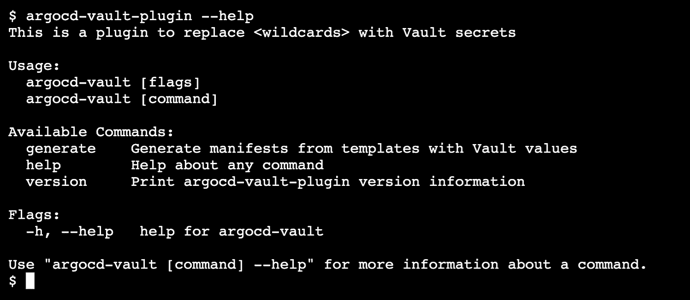

一旦插件可用，下一步就是向 ArgoCD 本身注册插件。这是非常直接的一步。有一个名为 argocd-cm 的配置图。只需转到该配置图并添加:

```
data:
  configManagementPlugins: |-
    - name: argocd-vault-plugin
      generate:
        command: ["argocd-vault-plugin"]
        args: ["generate", "./"]
```

在添加了`configManagementPlugins`部分并保存了配置图之后，您可以重启 argocd-repo-server 部署，然后您应该会在 argocd 中看到作为选项的插件:


## 配置插件

此时，我们应该已经安装并注册了 argocd-vault-plugin 来运行 ArgoCD。下一步是配置插件指向你的 Vault 实例。

有几种不同的方法来配置插件(环境变量、Kubernetes Secret、配置文件)，但是为了本教程的缘故，我们将继续使用环境变量。将 AppRole 配置为身份验证方法需要 5 个变量。这些是:

```
VAULT_ADDR: "http://vault:8082"     # Path to your Vault Instance
AVP_TYPE: vault                     # The Backend Type
AVP_AUTH_TYPE: approle              # Auth method we are using
AVP_ROLE_ID: role_id                # AppRole Role ID
AVP_SECRET_ID: secret_id            # AppRole Secret ID
```

我们将把这些内容作为一个秘密添加到 Kubernetes 的 argocd 名称空间中。创建一个名为`argocd-vault-plugin-credentials.yaml`的文件，并将其粘贴到该文件中。请确保用您的实际保管库值替换这些值。

```
kind: Secret
apiVersion: v1
metadata:
  name: argocd-vault-plugin-credentials
  namespace: argocd
type: Opaque
data:
  AVP_AUTH_TYPE: approle
  AVP_ROLE_ID: your_role_id
  AVP_SECRET_ID: your_secret_id
  AVP_TYPE: vault
  VAULT_ADDR: your_vault_addr
```

然后，您希望在 Kubernetes 中创建秘密，您可以通过运行以下命令来实现(确保您的 Kubernetes 上下文指向正确的集群):

```
kubectl apply -f argocd-vault-plugin-credentials.yaml -n argocd
```

剩下唯一要做的事情就是让这个秘密作为 argocd-repo-server pod 中的环境变量可用。回到最初添加 initContainer 的 argocd-repo-server 部署，并添加一个指向刚刚创建的秘密的`envFrom`。

```
containers:
- name: argocd-repo-server
  volumeMounts:
  - name: custom-tools
    mountPath: /usr/local/bin/argocd-vault-plugin
    subPath: argocd-vault-plugin
  **envFrom:
    - secretRef:
        name: argocd-vault-plugin-credentials**
```

就是这样！现在，您应该有一个指向您的保管库的已配置插件。我们现在已经准备好测试插件了！

## 使用插件部署 ArgoCD 应用程序

我们要做的第一件事是在 Vault 中创建一个秘密。因此，转到您的保险库，用密钥`sample`和值`secret.`在名为`avp/test`的路径下创建一个秘密。您要做的第一件事是启用保险库 kv-v2 存储。您还需要授予您适当的角色 id 权限，以便能够访问`avp`路径。你可以在 https://www.vaultproject.io/docs/concepts/policies[找到文档。](https://www.vaultproject.io/docs/concepts/policies)

```
vault secrets enable -version=2 avp
```

然后:

```
vault kv put avp/test sample=secret
```

如果您接下来阅读相同的路径，您应该会看到如下内容:

```
====== Metadata ======
Key             Value
---             -----
version         1====== Data ======
Key          Value
---          -----
sample       secret
```

现在我们可以转到 ArgoCD，使用 argocd-vault-plugin 部署应用程序。

打开 ArgoCD 并创建新的应用程序

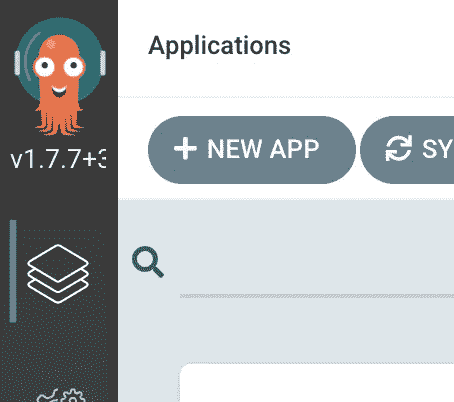

我们将把它命名为`sample-secret`,并放在默认项目中

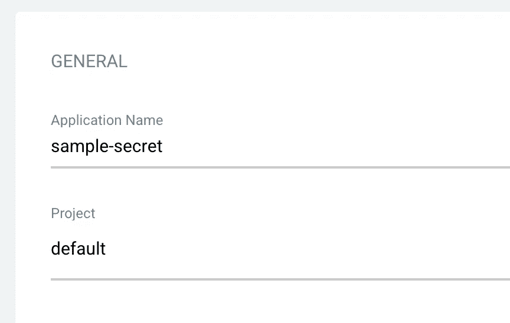

我有一个样本回购，我们将使用拉在[https://github.com/werne2j/arogcd-vault-plugin-demo](https://github.com/werne2j/arogcd-vault-plugin-demo)一个示例秘密文件

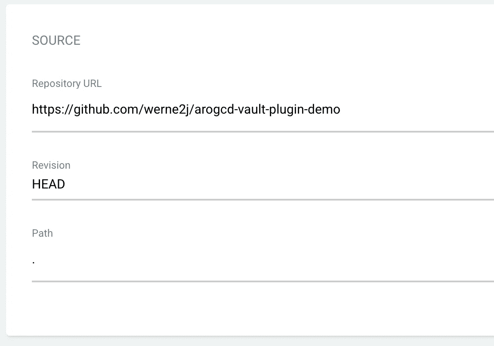

我们将把秘密放在集群中(在安装 ArgoCD 的集群中)和默认的名称空间中

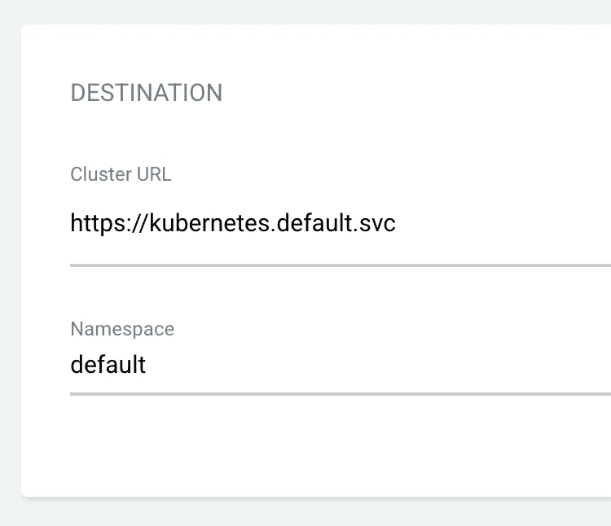

最后需要的是指定要使用的 argocd-vault-plugin 插件

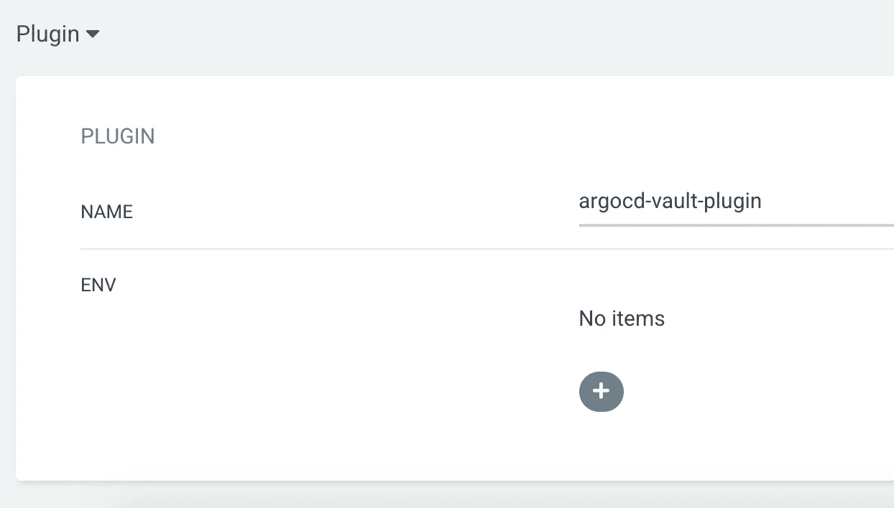

现在我们可以点击创建按钮，看看它是否工作！

您应该会看到在 ArgoCD UI 中创建了一个应用程序

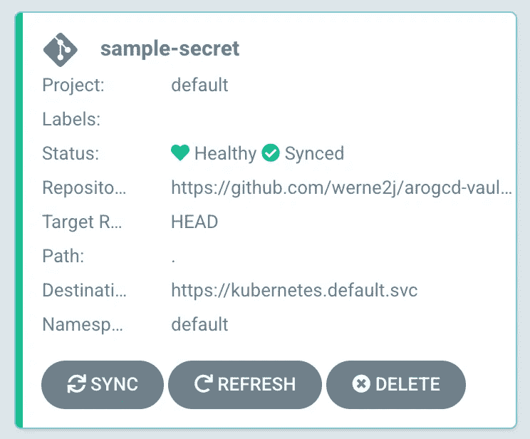

如果你点击这个应用程序，你会看到这个:

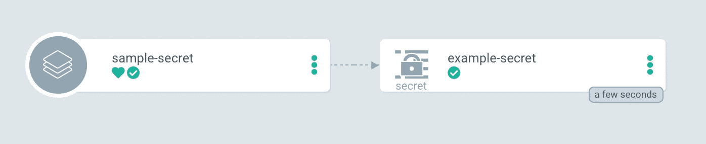

如果是的话，你已经成功地使用了 argocd-vault-plugin！我们可以通过寻找 Kubernetes 中的秘密并检查其价值来证实这一点:

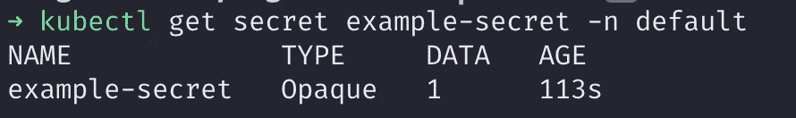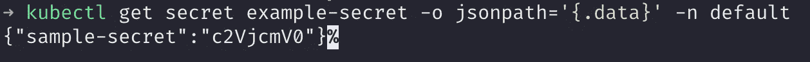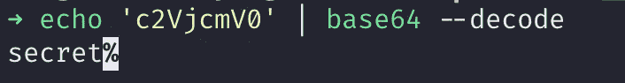

然而，我们还没有完成！该插件的一个优点是，如果 Vault 中的值发生变化，我们可以毫不费力地更新集群中的值。因此，更新 vault 中的值:

```
vault kv put avp/test sample=new_secret
```

现在在 ArgoCD 中，你可以进行一次硬刷新，这将执行一次插件的预演


现在，您应该注意到应用程序不同步:

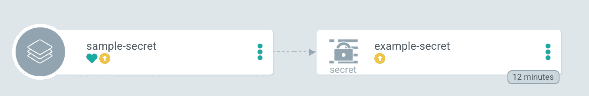

这意味着插件执行了模拟运行，并确定输出与集群中当前的输出不同。现在我们要做的就是同步应用程序，我们应该看到应用程序变回绿色！

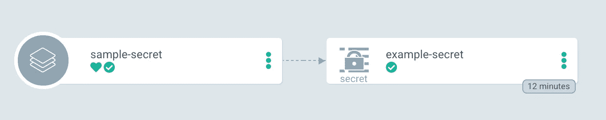

感谢您的阅读！我真的希望这个工具能在你的 GitOps 之旅中帮助你！如果你对 argocd-vault-plugin 感兴趣，并且你想了解更多或者为这个项目做贡献，你可以在 Github 上找到我们！

[](https://github.com/argoproj-labs/argocd-vault-plugin) [## GitHub-argoproj-labs/argocd-vault-plugin:一个 argocd 插件，用于从 Secret…

### 一个 Argo CD 插件，用于从各种秘密管理工具(HashiCorp Vault，IBM Cloud Secrets Manager…

github.com](https://github.com/argoproj-labs/argocd-vault-plugin)