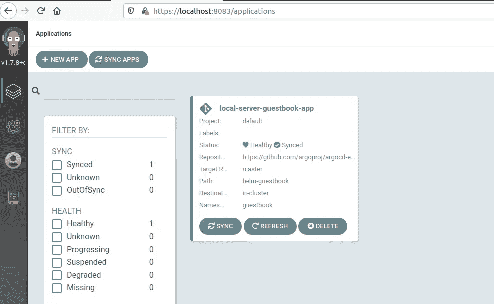
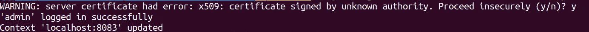
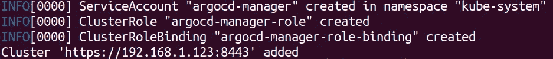
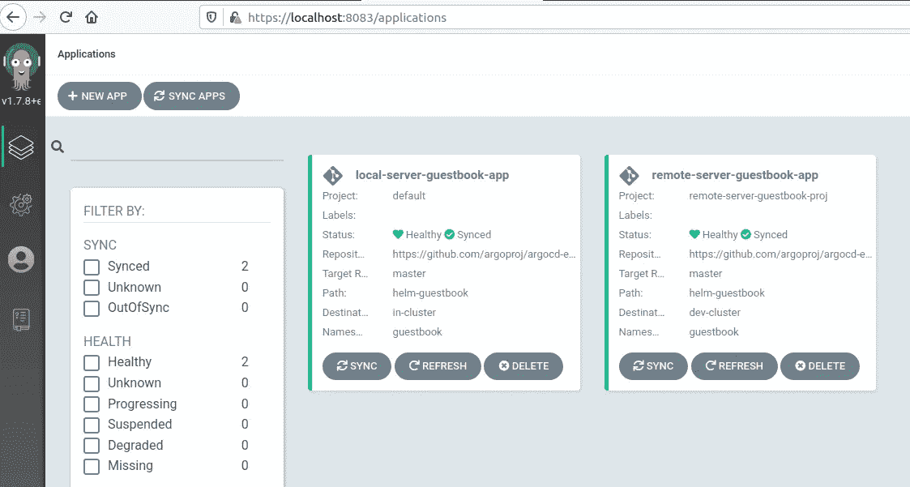

# ArgoCD:按名称设置外部集群

> 原文：<https://itnext.io/argocd-setup-external-clusters-by-name-d3d58a53acb0?source=collection_archive---------0----------------------->

ArgoCD 可能是我们目前可以使用的最先进的 GitOps 工具。它出现在 2020 年 5 月版的 [Thoughtworks 雷达的试验象限中，也是从 2020 年 6 月](https://www.thoughtworks.com/radar/platforms/argo-cd)开始在 ass 上的 [CNCF 连续交付雷达的一部分。该项目于 2020 年 4 月](https://radar.cncf.io/2020-06-continuous-delivery)获准进入 [CNCF，此后吸引了越来越多的用户和贡献者。](https://www.cncf.io/blog/2020/04/07/toc-welcomes-argo-into-the-cncf-incubator/)


当我写这篇文章时，ArgoCD 的最新版本是 2020 年 8 月 25 日发布的 [1.7.0](https://github.com/argoproj/argo-cd/releases/tag/v1.7.0) 。它有许多新特性，其中两个似乎更有趣:只使用签名提交应用状态更改的能力，并允许应用程序目标使用集群名称(在以前的版本中，您只能使用集群 url)。接下来，我将通过一些例子来说明如何使用集群名称来代替 url。这可以提供更好的用户体验，因为在使用 EKS 或 AKS 等托管服务时，有时会生成集群 URL，所以很难知道这是您应用的开发集群还是生产集群。虽然这个特性看起来很容易使用，只需传递集群名称而不是 url，但是它有一些需要注意的问题。

以下命令所需的所有文件都可以在这个报告中找到:[https://github.com/lcostea/argocd-cluster-name-article](https://github.com/lcostea/argocd-cluster-name-article)。所以请克隆它，然后 cd 到它:

```
git clone [https://github.com/lcostea/argocd-cluster-name-article.git](https://github.com/lcostea/argocd-cluster-name-article.git)
cd [argocd-cluster-name-article](https://github.com/lcostea/argocd-cluster-name-article.git)
```

## 安装 ArgoCD 1.7.8

首先，让我们安装 ArgoCD 1.7.8，这是最新的补丁。我在本地安装了 kind，所以我将运行一个新的集群。如果你没有 kind，[这里有安装说明](https://kind.sigs.k8s.io/docs/user/quick-start/#installation)。

```
kind create cluster --name argocd1.7
```

在集群启动并运行并且您的上下文指向它之后，我们将安装 argocd，首先创建“argocd”命名空间，然后我们将应用 1.7.8 清单(请坚持使用此 ArgoCD 命名空间，其他名称将在直接使用清单而不是 kustomize 时产生问题):

```
kubectl create namespace argocdkubectl apply -n argocd -f https://raw.githubusercontent.com/argoproj/argo-cd/v1.7.8/manifests/install.yaml
```

接下来，让我们检查所有的 pod 是否都已启动并运行，一旦它们启动，我们就可以尝试连接到 ArgoCD UI

```
#wait for all pods to be running
kubectl get pod -n argocd
kubectl port-forward svc/argocd-server -n argocd 8083:80
```

在 localhost:8083 上打开浏览器，如果证书上有任何警报，应该没问题，因为它是自己生成的。在用户名上输入“admin”，而密码可以通过运行该命令获得(它是服务器 pod 的名称):

```
kubectl get pods -n argocd -l app.kubernetes.io/name=argocd-server -o name | cut -d’/’ -f 2
```

## 第一个具有群集名称的应用程序

在用户界面上，你应该会看到一条类似“还没有应用程序”的消息。因此，让我们创建一个，我们将使用集群名称，而不是 url。即使在本地集群上部署应用程序，我们也可以使用这个名称。该应用程序将如下所示:

```
kubectl create namespace guestbook# the file is located in the repo you cloned when we started
kubectl apply -n argocd -f local-server-guestbook-app.yaml
```



ArgoCD 用户界面中显示的本地服务器留言簿应用程序

因此，您可以看到如何为本地集群使用 name:

```
name: in-cluster
```

这应该比

```
server: [https://kubernetes.default.svc](https://kubernetes.default.svc)
```

现在，您可以在 ArgoCD UI 中看到状态为 OutOfSync 的应用程序。你可以等待 ArgoCD 自动同步它，或者如果你不想等待，请使用应用程序上的同步按钮。同步后，您可以在 UI 中看到所有组件，如部署、服务、复制集、pod。

## 使用 cli 连接到 ArgoCD

在创建第二个集群之前，我们将使用 cli 连接到我们的 1.7.8 实例。首先让我们下载 argocd cli，您可以在此页面找到所有操作系统的[说明。在我们有了可用的 cli 之后，我们将把它连接到我们的 argocd 1.7.8 安装(我们假设端口转发仍然在工作)。您将使用设置与 UI 中使用的密码相同的密码:](https://argoproj.github.io/argo-cd/cli_installation/)

```
argocd login localhost:8083 --username admin --password <same_password_used_in_ui>
```



您可能会得到一个关于服务器证书的错误，在这种情况下，可以继续操作(通过键入“*y”*)，因为 ArgoCD 生成了自己的证书。我们可以通过列出实例上安装的应用程序来测试我们是否已连接:

```
argocd app list
```

我们应该会看到*本地服务器留言簿应用*条目。

## 将外部集群添加到 ArgoCD

接下来，我们将需要一个新的集群，ArgoCD 可以在其中安装应用程序，所以让我们用 kind 创建一个新的集群。但在此之前，我们需要为第二个集群创建一个配置文件，以便 ArgoCD(安装在第一个集群中)可以连接到它的控制平面。

带有 kind 配置的文件看起来像这样，您可以在名为*kind-dev-cluster-config . YAML*的 repo 中找到它。您需要更新 apiServerAddress 中的值以匹配您的私有 ip。要找到你的 IP 地址，你可以在 Windows 上使用 *ipconfig* 或者在 Linux/MacOS 上使用 *ifconfig* 。

在您更新文件之后，我们可以创建第二个集群，我们还将在其中添加一个留言簿名称空间。

```
kind create cluster --name dev-cluster --config kind-dev-cluster-config.yaml
```

集群创建完成后，您可以将其添加到 argocd。如果您在上面的配置文件中设置的 IP 不正确，此步骤将不会成功。请注意，我们将 argocd 上的集群名称从 *kind-dev-cluster* 更新为 *dev-cluster* 。因此上下文名称仍然是 *kind-dev-cluster* ，而 ArgoCD 上的集群可以使用 *dev-cluster 进行寻址。如果一切正常，我们可以从 argocd 查询集群列表，在那里我们可以看到新添加的集群。*

```
argocd cluster add kind-dev-cluster --name dev-cluster
argocd cluster list
```



向 ArgoCD 添加新集群

接下来，我们将把安装在本地集群上的相同应用程序应用到外部集群上。但在此之前，我们需要通过运行以下命令将上下文改回 argocd 集群:

```
kubectl config use-context kind-argocd1.7
```

## 将应用程序添加到外部集群

在应用我们的应用程序之前，我们将使用一个 [AppProject](https://argoproj.github.io/argo-cd/operator-manual/declarative-setup/#projects) 。这是一个自定义资源，允许我们对一组应用程序设置一些约束。在我们的例子中，我们将允许使用这个 AppProject 的应用程序只在我们的*开发集群*中部署清单，在*留言簿*名称空间中，这是在*目的地*中指定的部分。但是这里要提到的最重要的一点是，appproject 文件中不支持集群名称，这里我们仍然使用集群 url。原因是名称可以很容易地更新，而 url 应该是唯一的(或者至少非常接近)。因此，当我们应用这样一个 appproject 时，我们希望清楚地识别带有约束的目标集群。

当然你不需要使用一个特定的 appproj，你可以一直依赖默认的那个(就像我们在本地 app 中使用的)。对于生产安装，仍然推荐使用它们，这是又一层预防措施，不要与其他集群或名称空间混淆。

带有 appproject 的文件是*remote-server-guest book-proj . YAML*，而应用程序可以在*remote-server-guest book-app . YAML*中找到，因此我们可以继续应用它们:

```
kubectl apply -n argocd -f remote-server-guestbook-proj.yaml
kubectl apply -n argocd -f remote-server-guestbook-app.yaml
```

如果你给它几分钟，这个应用程序将自动同步，用户界面应该是这样的:



包含本地和远程应用程序的 ArgoCD

大概就是这样，现在你已经在 ArgoCD 中添加了一个外部集群，并且应用了一个以它的名字命名的应用。因此，您可以尝试添加更多的应用程序。