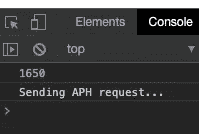

# Array.prototype.reduce 和一些健身房重量

> 原文：<https://itnext.io/array-prototype-reduce-and-some-gym-weights-1748c6fd3c6?source=collection_archive---------8----------------------->

最近，我在市场上为我的家庭健身房买了一套哑铃。我在网上到处搜寻，终于找到了一套我喜欢的。这一套从 50 英镑开始，一直涨到 100 英镑。这正是我要找的。

我完成了我的订单，放松地靠在我的办公椅上，想象着自己使用新的重量时发出的声音和出汗的样子。

就在那时，我想到了一个想法。

我碰巧住在一条长车道的尽头。准确地说，车道有 1/4 英里长，有点窄。送货卡车不喜欢到我家来，大多数司机也不愿意从车道上下来。

很多时候，司机会把他们所有的东西卸在车道的尽头，笑着开走了。然后就靠我把快递送到家了。

我不得不移动所有这些新买的砝码的真实可能性让我开始思考我实际上买了多少砝码。

我开始做心算，并在脑子里记下总数，但很快我就用光了手指和脚趾。😃

就在这时，它像一个扔得很糟糕的棒球一样击中了我——array . prototype . reduce！

这个真实的场景可能是创建一个简单的例子来展示 reduce 如何在 JavaScript 中工作的完美方式。

## 什么是 Array.prototype.reduce？

Reduce 是 JavaScript 数组对象的一部分。MDN 文档中的官方定义如下:

> `**reduce()**`方法对数组的每个元素执行一个**缩减器**函数(您提供的),产生一个输出值。

你可以在这里查看完整的文档:

 [## Array.prototype.reduce()

### reduce()方法对数组的每个元素执行一个 reducer 函数(您提供的),产生一个…

developer.mozilla.org](https://developer.mozilla.org/en-US/docs/Web/JavaScript/Reference/Global_Objects/Array/Reduce) 

好吧，听起来很简单。让我们来看看一些代码。

我买了多少重量的？

在第 3 行，我定义了我的权重数组。

然后在第 6 行，我定义了一个函数，并将其保存到 myMath 常量中。请记住，JavaScript 中的函数是一级对象，因此它们可以保存到常量、变量或传递。

这个函数被写成一个 lambda 表达式，但是我们也可以像这样用传统的方式写出来:

老派功能定义

这两种方法完全相同，但是现在所有酷孩子都在使用 lambda 表达式。最后，它归结为可读性，所以选择一个最适合你的团队。

如果我们拆开数学函数，我们会看到它接受两个参数，一个累加器和一个值。

累加器就是这么做的。它累计一个运行总数。这个函数将为数组中的每个元素调用，累加器将在每次调用之间记住它的值。相当酷。

如果我们看第 9 行，我们会看到奇迹发生的地方。我们在传递 myMath 函数的数组上调用 reduce 方法。

完成后，我们将总数保存到*权重*变量中。由于哑铃是 2 个一组的，我们将*重量*乘以 2，得到控制台中显示的所有哑铃的总重量。

搬完这些哑铃我会很累的。

这就是我们对应用于真实场景的 Array.prototype.reduce 函数的快速而轻松的回顾。

reduce 函数是所谓的*高阶函数*，这意味着它接受其他函数作为输入。它更符合函数式编程风格的编码。如果你对函数式编程(也称为 FP)及其好处不熟悉，可以看看我在 medium 上发表的另一篇关于 FP 的文章。

 [## JavaScript 函数式编程的简明介绍

### 如何写出更好的代码

itnext.io](/a-gentle-introduction-to-functional-programming-in-javascript-21ce4988af73) 

每当您需要遍历数组中的每个元素并获得单个值作为输出时，请记住 reduce 方法。

一如既往，感谢您的阅读，请务必查看我在 Medium 上的其他帖子。

 [## 亚历克斯·里茨科万-中等

### 阅读 Alex Ritzcovan 在媒体上的文章。前 CTO、IT 总监、软件开发人员、健身爱好者和…

medium.com](https://medium.com/@aritzcovan)