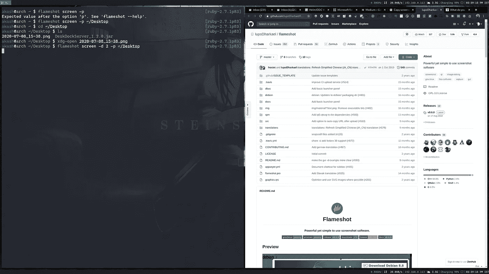
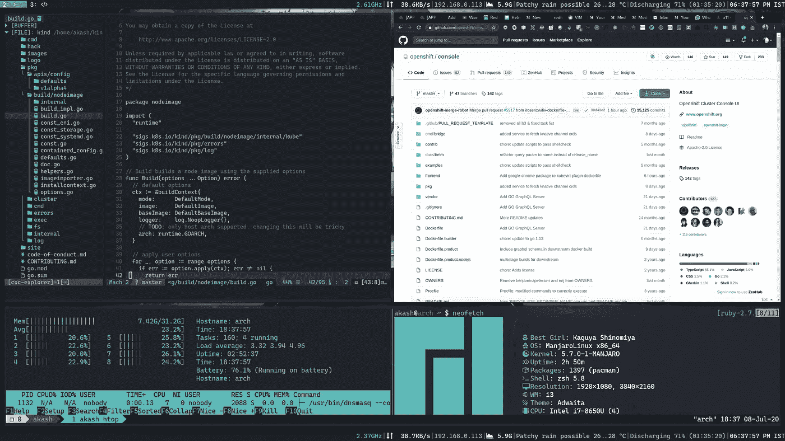
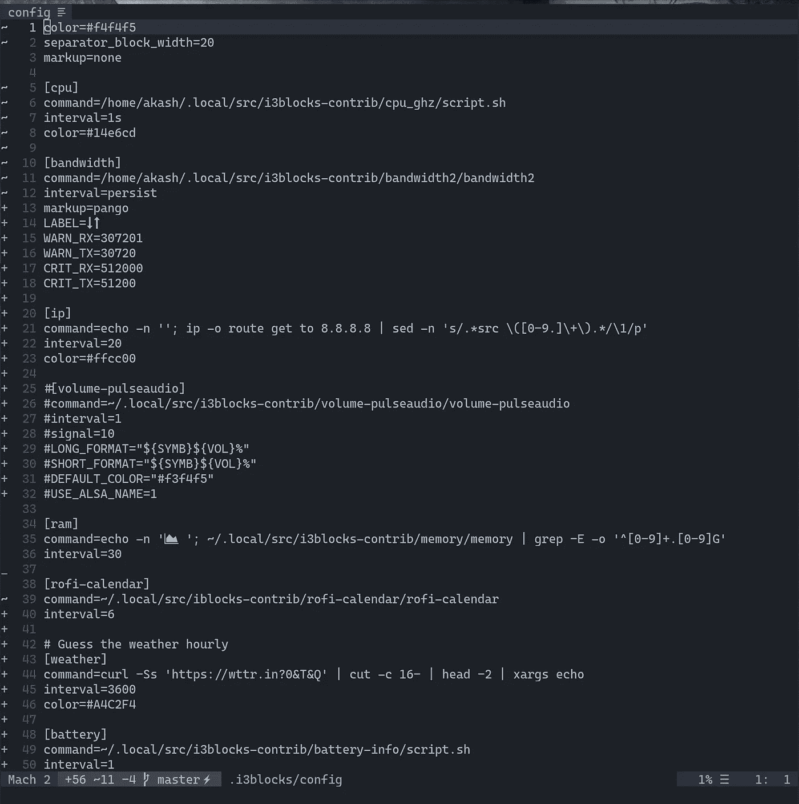
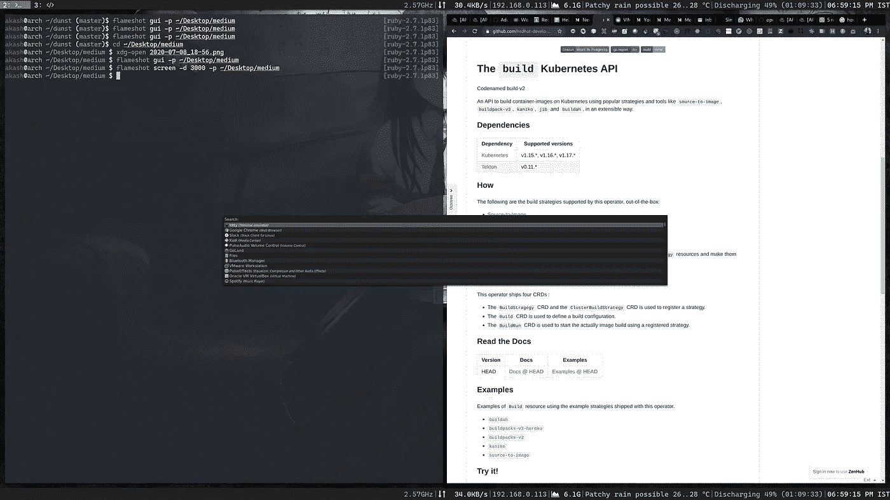

# 提高生产率的系统配置艺术。

> 原文：<https://itnext.io/art-of-configuring-system-to-boost-the-productivity-da756b8d3791?source=collection_archive---------3----------------------->

由于这些天我们中的许多人都在家里工作，我们都看到了许多关于我们应该如何布置房间，我们应该购买哪张桌子或椅子的文章。也有一些有趣的文章谈论在这样的疫情时期保持工作与生活的平衡。

这些实实在在的变化让我们感觉置身于办公环境中。

除了所有这些，还有一个重要的方面无疑会提高生产力，那就是重新配置我们工作的计算机。

特别是如果你是一个程序员并且你是一个懒惰的人，我有一些有趣的东西给你:)

本文的要点不是展示如何安装我谈到的所有东西，而是展示一个配置更好的系统是什么样子。

# arch & i3wm——选择合适的操作系统，美化它。

我的 i3wm 设置

这是我的系统完全根据我的需要定制的样本截图。

当我们不得不长途旅行，但又不想累的时候，我们总是希望坐在自己喜欢的车里，这辆车有合适的悬挂、座椅调节和良好的音乐播放列表。

同样，我们工作的系统决定了我们的生产力。

如果你能在你现有的系统上安装操作系统，我强烈推荐你使用 Manjaro linux 和 i3 窗口管理器。

> 为什么选择 Manjaro Linux？
> 
> 它是基于 Arch linux 的，所以可以肯定地说它总是在更新。
> 
> 我真的很喜欢它的软件包管理器(pacman 和 yay)。更容易安装任何软件包，而不需要像 Debian 那样添加/更新 repo。
> 
> 为什么是 i3wm？
> 
> 这是另一个桌面环境，像 Gnome，KDE，XFCE，但是它特别关注于那些喜欢使用键盘而不是鼠标在窗口之间切换的用户，打开新的应用程序和执行各种窗口操作。

# i3 块—配置面板(状态栏)

屏幕上另一个我们日常使用的重要组件是面板(顶部/底部条)，但它被低估了。

面板是了解系统信息的绝佳方式，只需点击几下鼠标。我们每天都用它来了解今天的日期、笔记本电脑的电池以及更多信息。说到配置这个面板，大多数操作系统都不支持定制。XFCE/KDE 确实提供了一些定制的方法，但是它只支持很少的插件。

如果我们想要自己的面板组件，我们需要使用各自的插件 SDK 编写。

这就是 [i3blocks](https://github.com/vivien/i3blocks) 前来救援的地方。i3blocks 与 i3 窗口管理器无缝协作。

你可以从我上面的顶部面板截图中看到，我添加了以下组件。

1.  当前 CPU 频率。
2.  网络监视器
3.  系统的 IP 地址
4.  使用的内存
5.  简短的天气信息
6.  笔记本电脑充电状态
7.  带时区的日期

你可能会问，添加这些是否容易？答案是肯定的，你只需要更新一个配置文件。

i3 块配置文件

这是 **i3blocks 配置**文件，其中有小部件信息列表。

每个小部件运行指定的脚本，并在面板上提供输出。我们也可以指定定制颜色。

# rofi——一个窗口切换器、应用程序启动器和菜单替代品。

我使用 [rofi](https://github.com/davatorium/rofi) dmenu 替换来打开应用程序，轻松切换窗口。

window + d 打开 rofi

我已经将`rofi`映射到了`window + d`，使用键盘打开任何带有`rofi`的应用程序比使用鼠标导航更容易。

如果你想定制外观和感觉，它支持添加自定义配色方案。

# 参考

1.  [https://github.com/vivien/i3blocks](https://github.com/vivien/i3blocks)
2.  [https://manjaro.org/](https://manjaro.org/)
3.  [https://i3wm.org/](https://i3wm.org/)
4.  [https://github.com/Anachron/i3blocks](https://github.com/Anachron/i3blocks)
5.  [https://github.com/davatorium/rofi](https://github.com/davatorium/rofi)