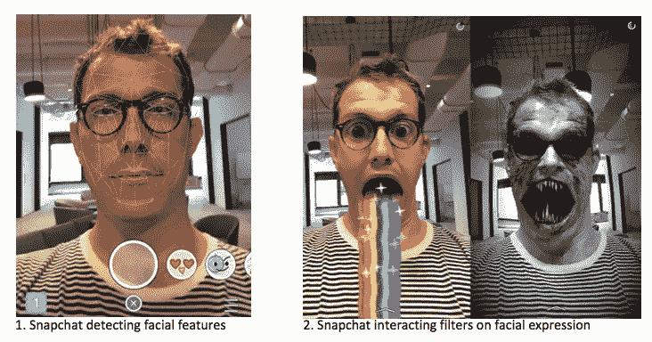
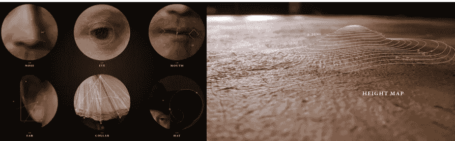
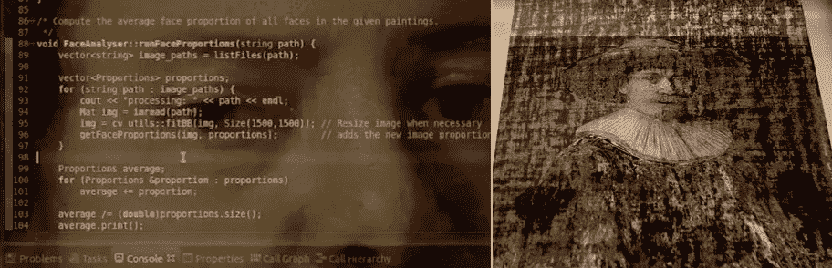
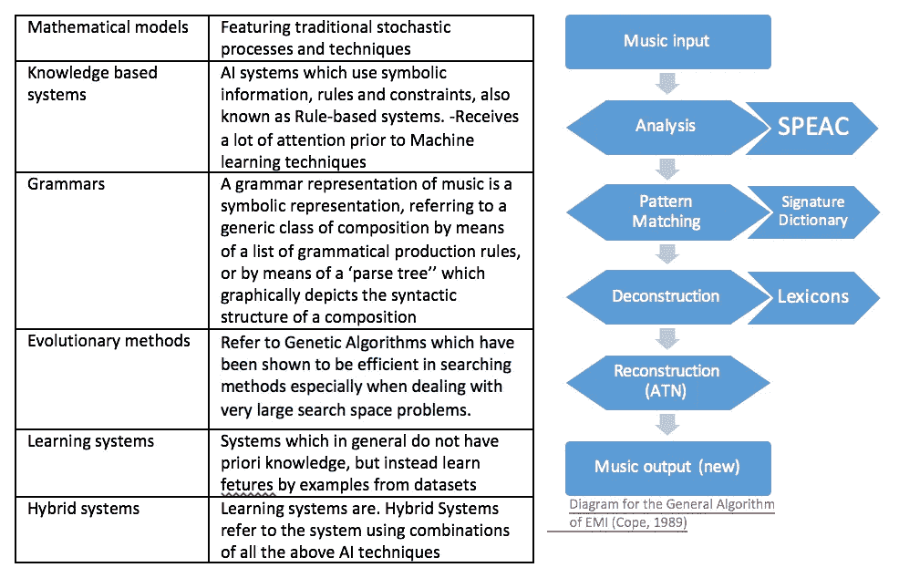

# 人工智能丰富了生活的光明面

> 原文：<https://itnext.io/artificial-intelligence-enriching-the-bright-side-of-life-f388d2d62d7?source=collection_archive---------0----------------------->

潮流观察家正在调查。据 Gartner [称，人工智能](http://www.dictionary.com/browse/artificial--intelligence)，机器学习和深度学习将成为 2017 年的趋势。聚会、博客(深度学习、人工智能和黑盒子)和一些基于社区的运动和倡议的热门话题。人工智能是机器表现出来的智能。它们的互动应该尽可能模仿人类的行为，因此它们被设计成做出尽可能最好的决定，并根据它们的数据分析得出结论——这应该使它们比人类更有效率。

有人认为，AI 将是 [*人类的末日*](http://www.bbc.com/news/technology-37713629) 。然而，人工智能正在到来，我们正处于它的黎明。所以，让我们摘下锡纸帽，来谈谈生活中重要的事情。*艺术*。*音乐。*和*啤酒*。

## 艺术和算法

艺术和技术之间的界限变得越来越模糊。但是，当我们将一个主脑的创造力与人工智能结合起来时，会发生什么呢？

多亏了使用人工智能技术的 [Snapchat](https://www.snapchat.com/) 过滤器——检测面部表情并[与之互动——我们可以通过两次点击与整个世界分享我们的日常创作。在众多功能中，人工智能的交互使你张开嘴或把眼睛变成破坏性的激光武器时吐彩虹成为可能。](https://petapixel.com/2016/06/30/snapchats-powerful-facial-recognition-technology-works/)

Snapchat 过滤器由 [Gizmodo](https://ex1.linkit.nl/owa/redir.aspx?C=5X400IS9Y8mHhdpdhG-s5qWaiYzCNU4f-WbuD6Cm2-AQieFcUJzUCA..&URL=http%3a%2f%2fgizmodo.com%2fsnapchats-new-lenses-feature-is-utterly-horrifying-1730812605) 提供

其他例子是照片编辑应用程序。有几个照片应用程序使用人工智能算法进行[物体识别](http://people.cs.ubc.ca/~lowe/papers/iccv99.pdf)以某种艺术风格重建目标图像，包括像文森特·梵高和巴勃罗·毕加索这样的知名艺术家。

当我们在自拍并自称为真正的艺术家时，Bas Korsten(执行创意总监)和 Emmanuel Flores(技术主管)在 [J. Walter Thomson](http://jwt.amsterdam/en/home) 有一个更大的计划:[下一个伦勃朗](https://www.nextrembrandt.com/)

这幅杰作——它不是伦勃朗的真迹，也不是复制品——就是结果。这也不一定意味着如果伦勃朗还活着，他就会画这幅画。那么，*这幅画是怎么出现的呢？*

要回答这个问题，我们需要知道他们是如何教会一台计算机创作出像伦勃朗那样的画作的？它分四个主要步骤完成:收集数据、确定主题、生成特征和执行。

> 正如代尔夫特大学(TU Delft)教授乔里斯·迪克(Joris Dik)描述的那样，“有很多伦勃朗的数据可用，你可以从各种收藏的所有这些画作中获得大量的技术数据”。

一种面部识别算法，识别并分类了伦勃朗用来描绘人类特征的大多数图案。它学会了它的原则，并复制了他的风格，从而产生了一幅新的画。

一个包含伦勃朗画作的庞大数据库被建立起来，并被逐个像素地检查。[150 GB 的数字渲染图形花费了 500 多个小时才完成，并通过高分辨率 3D 扫描和数字文件等广泛的材料收集，通过深度学习算法进行分析和升级，以最大限度地提高分辨率和质量。他们注意到伦勃朗的大部分艺术创作于 1632 年至 1642 年之间。为了进一步确定主题，对人口统计细分进行了分析。根据调查结果，49%是女性，51%是男性。进一步的数据导致一个面部有毛发的白人男性的肖像，年龄在 30 到 40 岁之间，穿着黑色衣服，带着白色衣领和帽子，面向右侧。](https://www.nextrembrandt.com/chapter01)

在微软、代尔夫特理工大学、Mauritshuis 和 Het Rembrandthuis 博物馆的建议和帮助下，设计了一个软件系统来掌握他的风格。它被用来分析和理解伦勃朗使用构图、几何学、颜料的使用和材料的选择。一种[面部识别算法](https://www.nextrembrandt.com/chapter01)识别并分类了伦勃朗使用的最典型的几何图案。伦勃朗被称为光影大师，因为他创新性地使用灯光来塑造和描绘人类的特征。该算法甚至掌握了决定让这些特征清晰对焦还是柔和模糊的知识。

**如果艺术是由数据分析和人工智能产生的，我们还能称之为艺术吗？**

为了创作这幅作品，两家大公司(ING 和微软)、[一所大学](http://www.tudelft.nl/en/)和一个[文化遗产](http://www.rembrandthuis.nl/en/)基金会走到了一起——尽管他们都热爱艺术、可视化数据和人工智能——他们使用 [3D 技术](https://www.nextrembrandt.com/)读取[每层的高度和结构](https://www.nextrembrandt.com/)以模仿笔触，并扫描了 168，263 幅画作；因此，我称之为艺术。

[*伦勃朗是我的妻子。我和他一起生活，一起睡觉，一起做梦。*](https://news.microsoft.com/europe/features/the-next-rembrandt-blurring-the-lines-between-art-technology-and-emotion-2/#hjKfi3gsRHEko1lA.99)——伊曼纽尔·弗洛雷斯。

音乐制作机器
被称为[算法作曲](https://www.cambridge.org/core/journals/organised-sound/article/algorithmic-composition-as-a-model-of-creativity/8C72F68D73DD7E57E1D6C5546CE68D0E)的技术提供了利用算法创作音乐的可能性。与下一个伦勃朗的创作类似，它从创建一个数据库开始——它不是将绘画作为输入，而是从歌曲中收集数据。算法作曲有[几种模式](http://www.doc.gold.ac.uk/~mas02gw/papers/AISB99b.pdf)和[按](http://www.doc.gold.ac.uk/~mas02gw/papers/AISB99b.pdf)[结构对每首歌的成分进行分类](http://www.doc.gold.ac.uk/~mas02gw/papers/AISB99b.pdf)。数据处理方式就是其中之一。[在这种对人工智能组合模型进行分类的方法中，基于其最](https://books.google.nl/books?id=0I9JDAAAQBAJ&pg=PA152&lpg=PA152&dq=mathematical+models+knowledge+based+systems+grammars+evolutionary+methods&source=bl&ots=_IrExbrEcO&sig=nf0iYgoNojVAEGNcIuArtCkpnTg&hl=nl&sa=X&ved=0ahUKEwid4-LdjaDTAhXhCMAKHR9sCbAQ6AEIKDAA#v=onepage&q=mathematical%20models%20knowledge%20based%20systems%20grammars%20evolutionary%20methods&f=false)[突出的特征](https://books.google.nl/books?id=0I9JDAAAQBAJ&lpg=PA152&ots=_IrExbrEcO&dq=mathematical%20models%20knowledge%20based%20systems%20grammars%20evolutionary%20methods&hl=nl&pg=PA152#v=onepage&q=mathematical%20models%20knowledge%20based%20systems%20grammars%20evolutionary%20methods&f=false)采用不同人工智能方法的系统的例子如下。

[索尼在巴黎的计算机科学实验室](https://www.csl.sony.fr/music.php)的研发团队选择混合系统和他们的 [Flow Machines](http://www.flow-machines.com/) 通过使用算法，与音乐人合作，用 AI 创作音乐。分析了 13000 张纸来创作一首特别的歌。因为这篇文章的重点是将技术与生活中更美好的事物结合起来，所以这一段是献给摇滚时代最有影响力和最受欢迎的乐队披头士。

机器能帮助我们变得更有创造力吗？

人工智能程序编写了甲壳虫乐队的灵感之歌《爸爸的车》

FlowMachines 是一个系统，可与 art(？？我可以这么说吗)，但这个系统不是分析成千上万幅画，(你在引言中将音乐制作机器与下一个伦勃朗进行了比较)而是从一个巨大的歌曲数据库中收集数据，从中它*学习*音乐风格，[利用风格转移、优化和交互技术的独特组合](http://www.flow-machines.com/)——这个系统创作了许多风格的新颖歌曲【你用同样的短语来描述 Benoit Carré case】。这使得它能够自主或与人类艺术家合作创作音乐。【这是一个案例——陈述它】[Benoit carré——法国作曲家](https://benoitcarre.wordpress.com/)和艺术总监，在人工智能作曲后，负责歌词和制作歌曲。[将这句话链接到上一句话]在“利用了[风格转移、优化和交互技术](http://www.digitaltrends.com/music/sony-composes-music-artificial-intelligence-style-the-beatles/)的独特组合”之后，据说它可以以任何风格创作。

FlowMachines 是一个拥有巨大歌曲数据库的系统，它从这个数据库中模仿、探索和结合其他人的风格。它允许你尝试各种约束，直到你形成自己的风格。这使得它能够自主或与人类艺术家合作创作音乐。
音乐现在会成为计算对象吗？音乐行业正经历一段艰难的时期，主要是因为技术创新，从下载、流媒体和音乐工作者开始的(这个词对吗？)已经在尝试寻找销售他们音乐的新方法。人工智能可能被视为对该行业的威胁，福布斯甚至表示它可能会摧毁它。在我看来，即使音乐风格的 DNA 来自(of？)有才华的个人，这种发展仍然侧重于保持人类作为创作的中心部分，但 FlowMachines AI 为其提供了进一步增强音乐作品、原创性和艺术创造力的可能性，这主要是因为使用该系统的音乐家的风格具有领先性。

现在怎么办？音乐会成为计算对象吗？

音乐产业正处于艰难时期，主要是因为技术进步。它始于下载和流媒体，并持续到今天，因为各公司都在探索销售音乐的新途径[。人工智能可能会对这个行业构成威胁，甚至福布斯认为它“人工智能可能会摧毁音乐”。](http://tech.co/tech-music-industry-evolution-2015-02)

然而，在我看来，尽管所有的发展，人类仍然是创造的核心。尽管 FlowMachines AI 提供了音乐风格——这是有才华的个人的 DNA 但它提供了增强音乐作品、原创性和艺术创造力的可能性。这位音乐家的风格仍然领先。

**由算法制作的啤酒**
伦敦的一家初创公司 IntelliigentX 决定在复杂的啤酒酿造艺术中加入自己的特色。他们发明了一种算法，可以确定啤酒配方中啤酒花、水、酵母和谷物的含量。基于消费者的偏好，来自用户的关于每个版本的反馈被算法调整。瓶子上贴有网站链接，你可以在那里对你的啤酒提供反馈。然后，该数据被用作算法的输入，以酿造更好的下一批。

这些机器人可以与机器人的 Facebook Messenger 相媲美，并向客户询问一系列关于他们对人工智能生产的啤酒的看法和体验的问题。这些问题可以用 1 到 10 分、是或否或多项选择来回答。

该算法每月都会产生新的食谱[，并结合反馈](https://www.engadget.com/2016/07/07/intelligentx-brewing-beer-with-ai/)-碳酸化、苦味和酒精含量的水平都会根据人们的反应而变化。

因为系统不断对用户的反馈做出反应，所以可以比其他方法更快地酿造出符合你口味的啤酒。这意味着更多的数据和更好的啤酒符合你的口味。

*这里的例子都是 AI 吗？自动化、助手、机器人和 AI 之间有界限吗？你怎么想呢?*