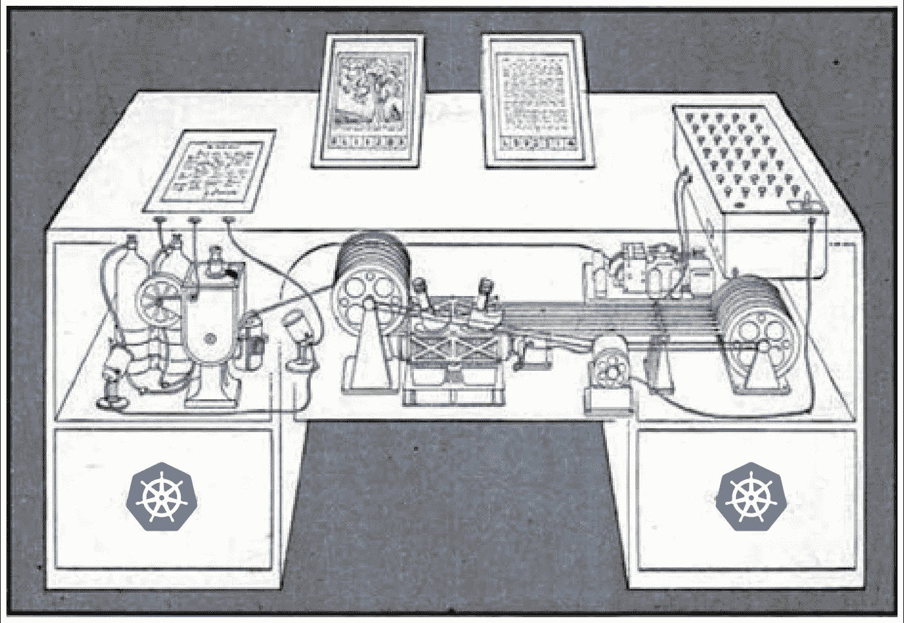
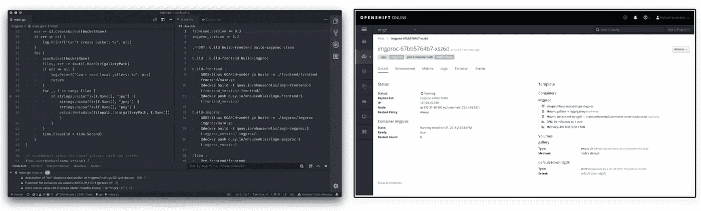
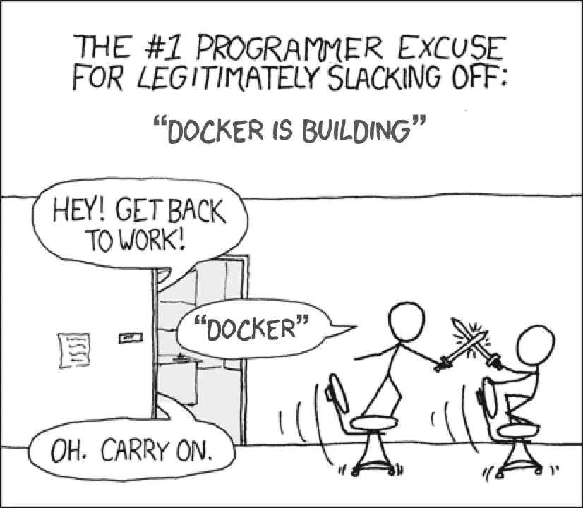
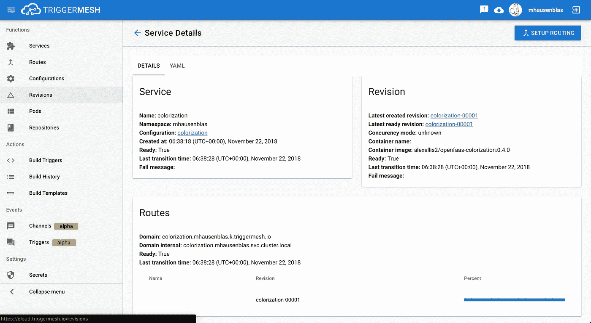
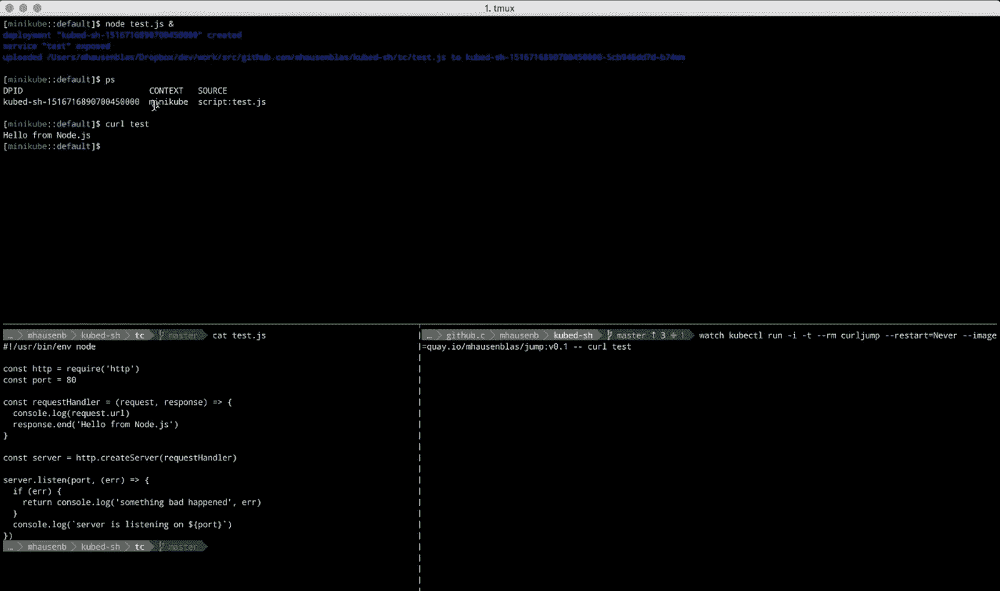

# 正如我们可能 Kube*

> 原文：<https://itnext.io/as-we-may-kube-293b30c0a365?source=collection_archive---------4----------------------->

万尼瓦尔·布什的 Memex。

我们使用不同的编程语言和开发环境来编写应用程序。每种语言都有不同的流程，我们通常会经历不同的阶段，从原型开发到集成级活动，再到在应用程序投入生产后逐步添加功能或修复错误。现在，来自“传统”环境的开发人员对 Kubernetes 的期望*通常是，他们自然的和众所周知的*工作流程尽可能少地改变*。这篇文章回顾了我们在 Kubernetes-land 开发应用程序方面的现状，以及我们可能的发展方向。*

为了发布特性，我们使用不同的编程语言。有时我们会使用多种语言，这取决于我们所处的阶段，有时我们会针对不同的问题同时使用不同的语言(锤子碰钉子？).不管你使用哪种语言——可能有很多原因让你选择一种语言——你都在以某种方式或风格使用编程语言:如果你是一名 Java 开发人员，你可能会(直接或间接地)使用 Maven 或 Gradle 来构建一个类似 JAR 的人工制品。您可能习惯于等待，比如说，两分钟，直到您可以启动那个 JAR 并看到您的最新迭代的源代码变更的效果。另一方面，如果你正在使用 Python 或 Node.js，你会习惯于立即看到代码中更新的行为，就像，在你点击保存按钮之后？

我的观点是，无论你使用哪种编程语言，你都有一定的流程。让我稍微扩展一下这一点…

## 基线

我们通常会花一些时间来设置和定制我们喜欢的编辑器或 IDE，从字体大小到像 Git 这样的源代码控制或首选键盘快捷键集这样的集成。一旦我们对编程环境——编辑器或 IDE 和编程语言——感到“如鱼得水”,就会出现某种流程。例如，这个流程可能是:1。添加几行代码，2。保存源代码(可能此时单元测试也会自动运行)，3 .所产生的人工制品被重新执行(取决于这里的语言，在解释语言的情况下可能是热重新加载，可能需要杀死并重新启动二进制文件)，4。查看代码更改的结果和/或调试代码。

**左**—我的编辑展示了一个[集装箱化的围棋 app](https://github.com/mhausenblas/imgn/tree/master/containers) 。| **右**—表示在 Kubernetes 环境下运行的 Go app。

有趣的是，当涉及到流程中的(强制)变更时，开发人员似乎是敏感的生物。这就引出了一个问题…

> …当你开发一个在 Kubernetes 上运行的应用程序时，一个既定的开发流程会有什么变化？

## Kubernetes 和开发者体验(DX)

L et 来说说[开发者体验](https://hackernoon.com/developer-experience-dx-devs-are-people-too-6590d6577afe) (DX)。令人震惊的是，开发者也是用户。编辑器、构建工具、测试工具等开发工具的用户。—你猜怎么着，DX 很重要！现在，Kubernetes 作为一个平台来自一个规模很重要的环境，运营问题是 DNA 的一部分。例如，谷歌创造并拥有 [SRE](https://landing.google.com/sre/) 迷因是有原因的。

> 我尽可能用政治上正确的措辞来表达:开发人员不一定像运营人员那样喜欢 Kubernetes 的一个原因是，这是建立在相互的基础上的。

向 jonahbinario 致敬。

好的，那么 Kubernetes 的默认 DX 是多少？很高兴你问了，我们开始吧:

1.  您通常的工作流，如前面的*基线*部分所建立的，会产生一个或多个组成应用程序的工件:对于基于 JVM 的系统，可能是一个 JAR 或 WAR 文件，对于 Python 或 Node.js，可能是一堆脚本，或者对于 Go 或 Rust 二进制文件。
2.  为了在 Kubernetes 上运行任何东西，您必须创建一个包含应用程序的容器映像，打包您的工件(JAR 文件、脚本、二进制文件)。构建这样一个应用程序映像可以通过几种不同的方式来实现:
    a)通过本地构建，使用一个好的旧的 [Make 文件和 Docker](https://github.com/mhausenblas/imgn/blob/master/containers/Makefile) 或者使用更轻量级的替代方法，比如 [buildah](https://buildah.io/) 。
    b)使用远程构建，通过成熟的 CI/CD 管道，如 GitLab 提供的[或更轻量级的东西，如](https://about.gitlab.com/product/continuous-integration/) [GitHub Actions](https://developer.github.com/actions/) 或可能是 100%开源的 sr.ht 环境。
    请注意，我们已经浏览了一遍，为了创建应用程序映像，需要首先选择一个基础映像。这可以是像`alpine:3.5`或`centos:7`这样简单的东西，也可以是像`python:3`或`amazon-corretto-8,`这样特定于语言的东西，但是无论你选择哪一个，都必须有人负责维护这个东西。
3.  接下来，应用程序容器映像必须放入 Kubernetes 的[容器注册表](https://www.slant.co/topics/2436/~best-docker-image-private-registries)中，或者更准确地说，放入`kubelet`容器注册表中，以便从中提取映像并启动应用程序容器，从技术上讲，应用程序容器是在 pod 的上下文中运行的。请注意，在这一点上，我们还没有考虑更高级别的管理抽象，如[部署](https://kubernetes.io/docs/concepts/workloads/controllers/deployment/)和[有状态集](https://kubernetes.io/docs/concepts/workloads/controllers/statefulset/)或其他通信抽象，如[服务](https://kubernetes.io/docs/concepts/services-networking/service/)或存储抽象，例如[持久卷](https://kubernetes.io/docs/concepts/storage/persistent-volumes/)。

**左**—[Sr . ht 建造](https://builds.sr.ht/)系统在运行。| **右**—git lab 的 CI 中我的 Go 容器化 app。

你也许可以想象，从你的编辑器/IDE 中的代码改变到 Kubernetes 在上面概述的流程中部署你的应用程序的新版本的时间比你习惯的要长得多。根据我的经验，这可能需要几分钟的时间，这取决于所使用的 CI 管道和注册表。现在想象一下，每次你修改一两行代码，你必须等待，比如说，5 分钟才能看到结果。不酷。

那么，如何才能缩短这个周期呢？目前的方法大致可分为以下几类:

*   在本地构建的上下文中，您可以简化注册表推送部分，例如，通过直接使用 Minikube 中的[容器引擎。](https://abhishek-tiwari.com/local-development-environment-for-kubernetes-using-minikube/)
*   有一些基于同步的工具可以替换正在运行的容器中的新制品(JAR、脚本、二进制文件),并可能执行热重载，例如 [ksync](https://vapor-ware.github.io/ksync/) 或 [Odo](https://github.com/redhat-developer/odo) 。这简化了构建和注册表推送阶段。
*   您可以使用基于代理的工具，比如 [Telepresence](https://www.telepresence.io/) ，它将运行在本地机器上的服务公开到(远程)Kubernetes 集群中，反之亦然，将运行在集群中的服务带到您的机器上。这在微服务设置中特别有用，在这种设置中，您的应用程序或服务可能是请求路径的一部分，而其他一些请求路径可能取决于您的请求路径，或者您可能正在调用其他请求路径。

平心而论，人们在野外使用[还有许多其他方法](https://www.reddit.com/r/golang/comments/9z0vpi/developing_locally_with_docker_vs_deploying_with/)来缩短从代码更改到更新的应用程序在容器中运行的周转时间:

*   将 Docker Compose 用于开发，将 Kubernetes 仅用于集成级/产品级阶段。由于缺乏开发-生产奇偶校验，不建议使用。
*   更复杂的混合工具，如 [Skaffold](https://github.com/GoogleContainerTools/skaffold) 或 [Draft](https://draft.sh/) ，通常采用多种技术来实现流畅的流程。很好，但是有些学习曲线和固执己见的流程。
*   无服务器解决方案，即功能即服务(Function-as-a-Service，FaaS)框架，如 Kubeless、OpenFaaS 或 Apache OpenWhisk，所有的[都运行在 Kubernetes](https://go-talks.appspot.com/github.com/mhausenblas/2018-state-of-faas-on-kube/main.slide#1) 之上。在这个上下文中特别有趣的是 [Knative](https://cloud.google.com/knative/) ，它为构建和服务提供了原语。此外，有第一次提供，如 TriggerMesh，使 Knative 可访问；或者，您现在可以通过前面提到的 FaaS 产品越来越多地使用它。

[TriggerMesh](https://triggermesh.com/) ，云原生构建和部署平台。可以把它看作是一种“Knative-as-a-Service ”,可以用它来构建容器映像，也可以用它来调用容器的功能即服务(Function-as-a-Service，FaaS)风格。

2018 年初，我和 Weaveworks 的 Ilya Dmitrichenko 仔细研究了在 Kubernetes 上开发应用的主题，我们在博客文章[中写下了在 Kubernetes](https://kubernetes.io/blog/2018/05/01/developing-on-kubernetes/) 上开发应用的经验教训，包括一些环境的实际操作。

考虑到我们正在处理一个分布式系统和远程进程，还有一个有趣的问题是如何[调试一个在 Kubernetes](/development-and-debugging-with-kubernetes-296bb60d9549) 中运行的应用程序。这个领域已经有了一些工具，比如 [KubeSquash](https://github.com/solo-io/kubesquash) 或者最近由 Rookout 推出的[产品，但是总体来说还处于早期阶段。](https://techcrunch.com/2018/11/15/rookout-launches-its-live-kubernetes-debugger/)

## 从这里去哪里？

很长一段时间以来，我一直在问自己这个问题:*有没有更好的方法？开发人员在 Kubernetes 有宾至如归的感觉；或者也许是错误的抽象层次，也许开发者*不应该*直接暴露给 Kubernetes？*

2018 年初，我和 [kubed-sh](http://kubed.sh) 尝试了一种不同的范式。本质上，这个工具提供了一个交互式的、基于 shell 的环境，该环境提供了对 Kubernetes 集群的访问。它允许你启动应用程序，而不需要接触 pod、部署或服务。[看这个演示](https://www.useloom.com/share/441a97fd48ae46da8d786194f93968f6)(或者[自己试试](https://katacoda.com/mhausenblas/scenarios/kubed-sh_hotreload)):

使用中的 [kubed-sh 热重装](https://www.useloom.com/share/441a97fd48ae46da8d786194f93968f6)功能。

有趣的是，`kubed-sh`概念验证主要受到那些以前没有或很少使用过 Kubernetes，特别是 FWIW `kubectl`的人的赞赏和欢迎。相反，更熟悉 Kubernetes 流程的人——构建容器映像，将它推送到容器注册中心，用容器部署 pod 常常很难看到`kubed-sh`的价值。这本身就是一个宝贵的教训。

> 总结一下:我不知道我们要去哪里。我所知道的是，我们在 Kubernetes-land 面临着 DX-wise 的挑战，目前我所能做的就是努力提高对我在野外目睹的问题的认识。

我可以记录现状，包括良好的实践和工具，[探索](https://www.youtube.com/watch?v=1otz8iXrq1w)方法，如[云本地编程语言](https://hackernoon.com/the-rise-of-cloud-native-programming-languages-211a5081f1b2)，基于 FaaS 的方法，如 [duct.cloud](https://duct.cloud/) 或 TriggerMesh，以及集成产品，包括 GitHub Actions 或 [Gitpod](https://www.gitpod.io/) 。

你也可以这样做:)

热心的读者当然已经意识到这个标题是对 1945 年的伟大文章 [*的无耻抄袭，正如我们可能认为的那样*](https://www.theatlantic.com/magazine/archive/1945/07/as-we-may-think/303881/) *作者是有远见的万尼瓦尔·布什。*