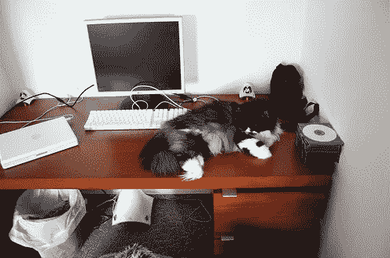
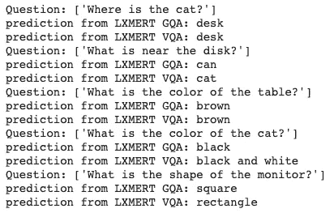

# 使用 NLP 和 Python 向图像提问(第 1 部分)

> 原文：<https://itnext.io/ask-questions-to-your-images-using-nlp-and-python-7940c534d26c?source=collection_archive---------3----------------------->

你好，

今天，我们将学习如何使用自然语言处理，以图像作为我们的真理来源来提问。

此案例在以下方面非常有用:

*   视频监控
*   智能搜索 Instagram、Pinterest 等网站
*   对 Sharepoint、GDrive 等文件存储系统的搜索功能。
*   集成人工智能的高级增强现实系统
*   更多

在这篇文章中，我们正在通过实践的道路，但对于更多的理论问题，这里是论文。

 [## LXMERT:从变压器学习跨通道编码器表示

### 视觉和语言推理需要理解视觉概念、语言语义，最重要的是…

arxiv.org](https://arxiv.org/abs/1908.07490) 

我们开始吧！

**笔记本**

和几乎所有的 NLP 问题一样，我们将使用 HuggingFace 的神奇变形金刚库:)

```
!git clone https://github.com/huggingface/transformers%cd transformers/examples/lxmert%pip install -r requirements.txt
```

导入 LxmertForQuestionAnswering 和 LxmertTokenizer

```
from IPython.display import clear_output, Image, displayimport PIL.Imageimport ioimport jsonimport torchimport numpy as npfrom processing_image import Preprocessfrom visualizing_image import SingleImageVizfrom modeling_frcnn import GeneralizedRCNNfrom utils import Configimport utilsfrom transformers import LxmertForQuestionAnswering, LxmertTokenizerimport wgetimport pickleimport os# URL = "https://raw.githubusercontent.com/airsplay/py-bottom-up-attention/master/demo/data/images/input.jpg",URL = "https://vqa.cloudcv.org/media/test2014/COCO_test2014_000000262567.jpg"OBJ_URL = "https://raw.githubusercontent.com/airsplay/py-bottom-up-attention/master/demo/data/genome/1600-400-20/objects_vocab.txt"ATTR_URL = "https://raw.githubusercontent.com/airsplay/py-bottom-up-attention/master/demo/data/genome/1600-400-20/attributes_vocab.txt"GQA_URL = "https://raw.githubusercontent.com/airsplay/lxmert/master/data/gqa/trainval_label2ans.json"VQA_URL = "https://raw.githubusercontent.com/airsplay/lxmert/master/data/vqa/trainval_label2ans.json"def showarray(a, fmt='jpeg'):a = np.uint8(np.clip(a, 0, 255))f = io.BytesIO()PIL.Image.fromarray(a).save(f, fmt)display(Image(data=f.getvalue()))
```

加载对象、属性和答案标签。

```
objids = utils.get_data(OBJ_URL)attrids = utils.get_data(ATTR_URL)gqa_answers = utils.get_data(GQA_URL)vqa_answers = utils.get_data(VQA_URL)
```

加载模型和模型组件。

```
frcnn_cfg = Config.from_pretrained("unc-nlp/frcnn-vg-finetuned")frcnn = GeneralizedRCNN.from_pretrained("unc-nlp/frcnn-vg-finetuned", config=frcnn_cfg)image_preprocess = Preprocess(frcnn_cfg)lxmert_tokenizer = LxmertTokenizer.from_pretrained("unc-nlp/lxmert-base-uncased")lxmert_gqa = LxmertForQuestionAnswering.from_pretrained("unc-nlp/lxmert-gqa-uncased")lxmert_vqa = LxmertForQuestionAnswering.from_pretrained("unc-nlp/lxmert-vqa-uncased")
```

**测试**！



这是加载的图像，现在我们可以就它提出问题。



很棒吧？

在下一篇文章中，我们将构建 Docker 文件。

更多信息请访问官方网站【https://github.com/airsplay/lxmert 