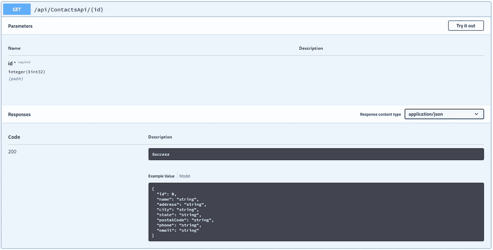

# ASP.NET 核心 2.1:行动结果

> 原文：<https://itnext.io/asp-net-core-2-1-actionresult-3e031e90cee5?source=collection_archive---------1----------------------->

这篇文章将从我的 ASP.NET 基础系列文章中提取联系人 API，并将其从使用 IActionResult 转移到 2.1 版本中引入的 ActionResult <t>。这些变化真的很简单，但是如果你使用 OpenAPI/Swagger，我会在文章后面提到我注意到的一些事情。之前的代码任何改动都可以在[这里](https://github.com/elanderson/ASP.NET-Core-Basics/tree/d64360a3688b648b574b9354675029cc51bf9e8d)找到。</t>

## IActionResult vs ActionResult

[官方文档](https://docs.microsoft.com/en-us/aspnet/core/web-api/action-return-types?view=aspnetcore-2.1)解释了在 API 中返回数据的三种不同方式，即特定类型、IActionResult 类型或 ActionResult < T >类型。

如果您不需要进行任何类型的验证或类似操作，那么特定的类型是很好的，但是一旦您需要返回不同的 HTTP 状态，OK 就不再足够了。这是您必须移动到 IActionResult 的地方。

IActionResult 允许返回不同的 HTTP 状态。在以下示例中，如果找不到具有所提供 ID 的联系人，则返回 NotFound 如果找到了联系人，则返回 OK(contact)。

```
public async Task<IActionResult> GetContact([FromRoute] int id)
{
     var contact = await _context.Contact
                                 .SingleOrDefaultAsync(m => m.Id == id);

     if (contact == null)
     {
        return NotFound();
     }

     return Ok(contact);
}
```

ActionResult <t>它的优点是函数的返回类型很明确。在下面的例子中，您可以看到 GetContact 已经改为使用 ActionResult <t>，如果一切顺利，您最终将处理一个 Contact 对象，而不需要将结果包装在 OK 中。</t></t>

```
public async Task<ActionResult<Contact>> GetContact([FromRoute] int id)
{
     var contact = await _context.Contact
                             .SingleOrDefaultAsync(m => m.Id == id);

     if (contact == null)
     {
        return NotFound();
    }

    return contact;
}
```

## OpenAPI/Swagger

如果您在您的项目中使用 OpenAPI/Swagger，并且函数具有以下定义，那么当您切换到使用 ActionResult <t>时，它将自动选择返回类型。</t>

```
public async Task<ActionResult<Contact>> GetContact([FromRoute] int id)
```

上述函数在 OpenAPI/Swagger UI 中产生以下结果。



这太棒了，让您不必为 API 函数生成 ResponseType 属性。请注意，一旦您为 NotFound 响应添加了 ProducesResponseType，您仍然需要用正确的类型包含 OK 响应，否则您将在 OpenAPI/Swagger UI 中丢失返回类型。

我调用最后一点是因为我花了时间试图弄清楚为什么我看到的所有返回类型的示例都被自动选取，但在我的示例应用程序中却没有。

## 包扎

我是 ActionResult <t>的超级粉丝，主要是因为它增加了 API 函数定义的清晰度。事实上，OpenAPI/Swagger 可以在简单的情况下使用它，这是一个额外的好处。</t>

如果您想了解更多信息，请查看由 [Joonas Westlin](https://twitter.com/JoonasWestlin) 发布的 ASP.NET 核心 2.1 中的[探索行动结果< T >，其中有更多关于该功能实际上是如何实现的信息。如果您还没有确定，请查看官方文档中的 ASP.NET 核心 Web API](https://joonasw.net/view/aspnet-core-2-1-actionresult-of-t) 页面中的[控制器动作返回类型，了解 API 返回类型选项的详细比较。](https://docs.microsoft.com/en-us/aspnet/core/web-api/action-return-types?view=aspnetcore-2.1)

完整的代码可以在这里找到[。](https://github.com/elanderson/ASP.NET-Core-Basics/tree/55f63d28df6e278efe3b714b4b5bdc3dc89b57b4)

*最初发表于* [*埃里克·安德森*](https://elanderson.net/2018/09/asp-net-core-2-1-actionresult/) *。*