# ASP.NET 核心 3.1 入门，PostgreSQL 数据库实体框架核心(代码优先方法)

> 原文：<https://itnext.io/asp-net-core-3-1-entity-framework-core-with-postgresql-with-code-first-approach-33b102e1734f?source=collection_archive---------0----------------------->

# PostgreSQL 是什么？

PostgreSQL 是一个强大的开源对象关系数据库系统，它使用并扩展了 SQL 语言，并结合了许多功能，可以安全地存储和扩展最复杂的数据工作负载。你可以在这里获得更多细节[。](https://www.postgresql.org/about/)

# 如何安装？

你可以从[这里](https://www.postgresql.org/download/)下载并安装 PostgreSQL。

# 。核心网(3.1)

可以下载。微软网站[的 NET Core SDK 这里](https://dotnet.microsoft.com/download/dotnet-core/3.1)。

我将在这篇文章中使用下面的内容，

> 微软 Visual Studio 代码(开源)
> 
> 。NET Core 3.1 SDK
> 
> PostgreSQL 12
> 
> pg admin 4——它是 PostgreSQL 的开源管理工具。您可以在安装 PostgreSQL 时通过选中复选框来安装它。

在撰写本文时，最新版本的。网芯是 3.1。我们将在中创建 ASP.NET Web API。网芯 3.1。

这篇文章将向您展示如何创建 ASP.NET Web API 项目与点网 CLI 和使用代码优先的方法连接到 PostgreSQL 数据库。在这篇文章中，我将使用 Windows 10，但是下面的代码将适用于任何操作系统，如果你有的话。安装了 NET Core 3.1 SDK 和 PostgreSQL。

考虑到您已经安装了上述所需的工具和 SDK，我们将继续创建 ASP.NET 核心 Web API 3.1 项目。

# 使用 dotnet CLI 创建 WebAPI 项目

打开命令提示符或 power shell。并导航到要在其中创建项目的目录。在我的例子中，我在 C:/ drive 中创建了目录 *ASPNetCoreAndPostgresql* 。

确保你有。已安装 NET Core 3.1 版本。

在命令下运行。它将在中创建 WebAPI 项目。网芯 3.1 版本。

> **dotnet 新 WebAPI -n ArticleApp。API**
> 
> 使用-n 为您的 API 项目提供名称。在我的例子中，它是 ArticleApp.API。

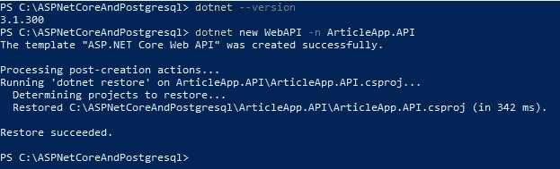

如果您想查看不同的可用项目选项。

> **运行 dotnet new -h**

它将列出所有可用的模板和短名称，您可以使用 dotnet new 命令来创建项目。

要在 Visual Studio 代码中打开项目，您可以编写下面的命令，它将在 Visual Studio 代码中打开当前目录。

> 代码。

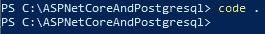

打开 Visual Studio 代码后，您会在 Visual Studio 代码的底部看到一个小弹出窗口，单击“是”。它将安装构建我们的项目所需的必要资产。

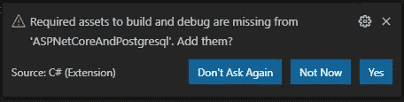

# 扩展ˌ扩张

在继续之前，请确保您已经在 Visual Studio 代码中安装了以下两个必需的扩展。安装 visual studio 代码后，您可能需要重新启动它们。

> Visual Studio 代码的 C#(由 OmniSharp 提供支持)
> 
> NuGet 包管理器

*其他扩展是可选的。*

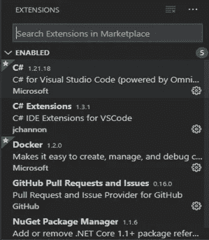

您的 Visual Studio 代码应该如下所示，

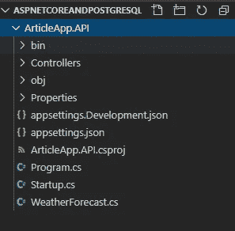

Program.cs -程序类有 main 方法。这是应用程序的起点。***【CreateHostBuilder()】方法创建通用主机。更多详情，请访问[本。](https://docs.microsoft.com/en-us/aspnet/core/fundamentals/?view=aspnetcore-3.1&tabs=windows)***

*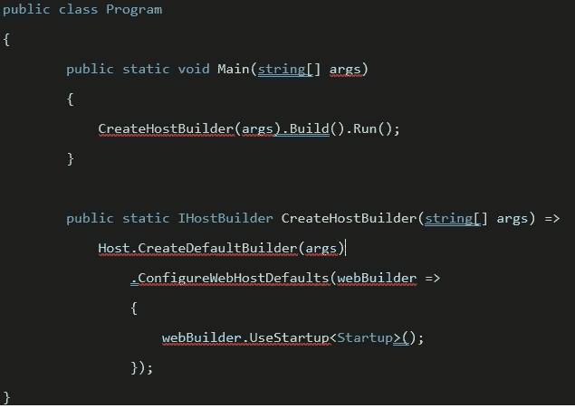*

*在 Startup 类中，我们配置应用程序中需要的服务。此外，我们可以定义应该如何处理 HTTP 请求管道。欲了解更多信息，请访问[。](https://docs.microsoft.com/en-us/aspnet/core/fundamentals/?view=aspnetcore-3.1&tabs=windows)*

*我们不需要默认创建***WeatherForecastController***和***WeatherForecast***类。我们可以删除它们。*

*下面我们将创建简单的模型。我不会深入模型和其他实体框架细节。本文的主要目的是了解如何使用实体框架核心来连接 PostgreSQL。网芯 3.1。*

*在根目录中添加文件夹模型。并将下面的类添加到模型文件夹中。*

*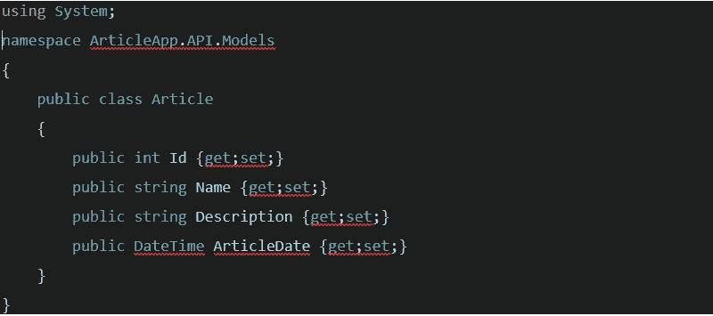*

*现在下一步是创建数据上下文类。*

*添加名为 Data 的新文件夹，并在其中添加以下类。*

*当我们添加新类并试图从 DbContext 继承它时，我们将得到下面的错误。*

*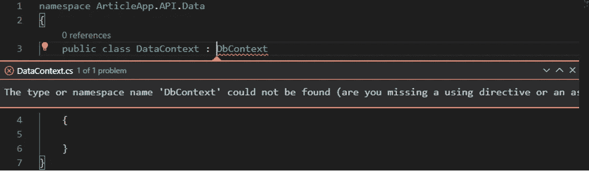*

*我们需要向我们的应用程序添加实体框架核心包。从。NET Core 3.0，EntityFrameworkCore 不是默认添加到我们的项目中的。请访问[本](https://docs.microsoft.com/en-us/ef/core/what-is-new/ef-core-3.0/breaking-changes#no-longer)了解更多详情。*

# *添加 EntityFrameworkCore 包引用*

*按 Ctrl + Shift + P 并选择 Nuget 包管理器。*

*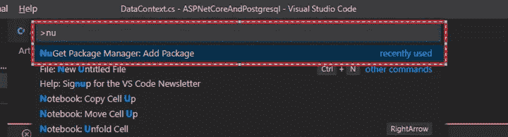*

*输入微软。EntityFrameworkCore 并按 enter 键。*

**

*它会显示以下选项。首先选择 Microsoft.EntityFrameworkCore。*

*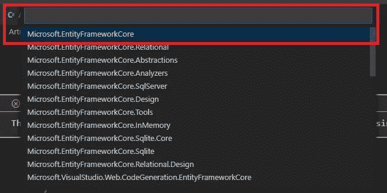*

*选择当前稳定版本，即 3.1.4*

*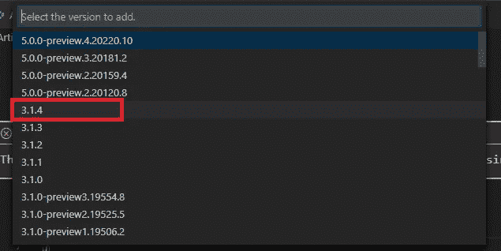*

*一旦安装成功，它会显示下面的确认。请点击恢复按钮。*

*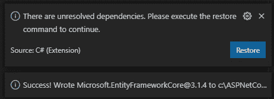*

*要确认所有安装是否正确，您可以打开项目文件，即 ArticleApp.API.csproj。它应该具有 EntityFrameworkCore 版本 3.1.4 的 PackageReference 条目。*

*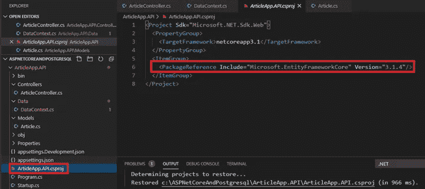*

*现在要解决 DataContext 错误，请单击 show fixes 或 Ctrl +。*

*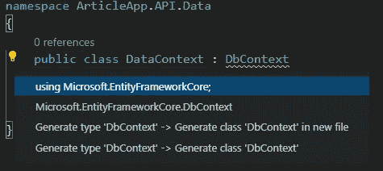*

*请选择 using Microsoft . entityframeworkcore。它应该可以解决该错误。在为文章实体添加构造函数和 DbSet 属性之后，我们最终的 DataContext 类应该如下所示:*

*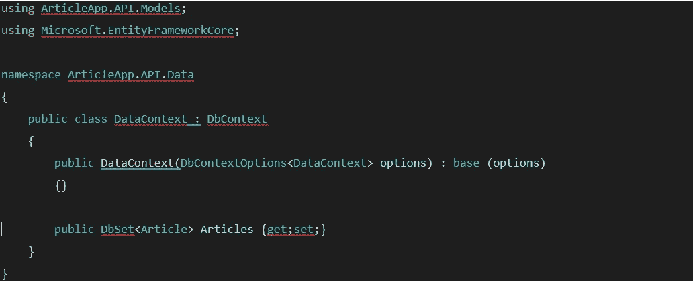*

*现在使用代码优先的方法，我们需要连接到 PostgreSQL 并创建带有文章表的数据库。*

*我们需要添加连接字符串。打开 Appsettings.json 并添加以下连接字符串。*

*请注意，我使用非常简单的密码，但在实际的生产代码，你应该加密它，并确保密码是复杂的。*

> *"连接字符串":{*
> 
> *" default connection ":" Server = 127 . 0 . 0 . 1；端口= 5432；用户 id =文章-用户；密码= 12345；database = ArticleDB 汇集=真"*
> 
> *},*

*文件应该是这样的。*

*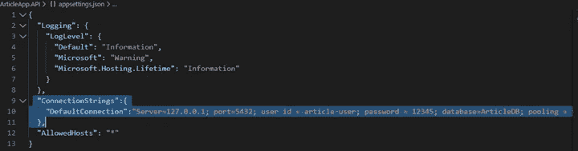*

*确保您已经创建了具有适当访问权限的用户文章-用户。*

***注:***

> *对于本文，我使用我的本地主机(127.0.0.1)。*
> 
> *如果您不知道 PostgreSQL 的端口号是什么。打开 C:\ Program Files \ PostgreSQL \ 12 \ data 并编辑 postgresql.conf 文件。请不要修改任何东西。你可以看到港口入口。如果您使用的不是 12 版本，那么您必须用您的版本号替换 12。*

*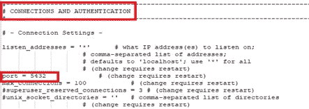*

*现在我们需要在启动类中添加和配置 EntityFrameworkCore 服务。*

*我们需要更新 ConfigureServices 方法。我们可以通过添加服务来添加 EntityFrameworkCore 服务。AddDbContext <datacontext>(…)如下图。但是我们需要配置 PostgreSQL 数据库连接。</datacontext>*

*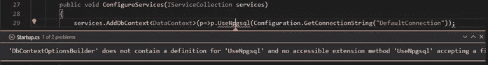*

*我们出现上述错误是因为我们尚未添加 EntityFrameworkCore 使用 PostgreSQL 所需的包。*

*更多信息请访问[这个](https://www.nuget.org/packages/Npgsql.EntityFrameworkCore.PostgreSQL/)。*

*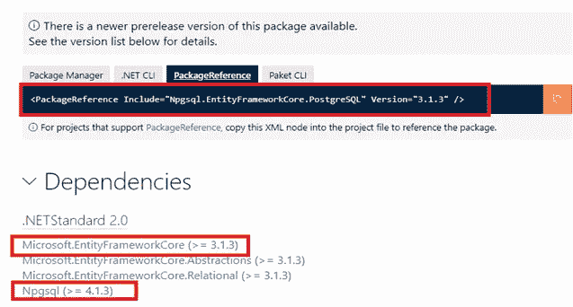*

*我们需要安装 Npgsql 4 . 1 . 3 版和 npg SQL。EntityFrameworkCore.PostgreSQL 版本 3.1.3。我们只考虑稳定版本。*

*要安装它们，我们将执行与安装 EntityFrameworkCore 相同的步骤，检查上面的 ***添加 EntityFrameworkCore 包引用*** 部分。*

*或者，您可以复制下面的内容并添加到文章中。API.csproj 文件。它应该会在您保存项目文件后更新项目中的包。*

> *<packagereference include="”Npgsql”" version="”4.1.3&quot;/"></packagereference>*
> 
> *<packagereference include="”Npgsql.EntityFrameworkCore.PostgreSQL”" version="”3.1.3&quot;/"></packagereference>*

*更新的项目文件*

*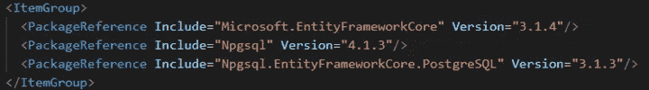*

*若要修复该错误，请使用语句添加以下内容。*

*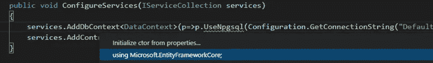*

*在“终端”窗口中，导航到您的项目 ArticleApp。API 和类型*

****dotnet ef*** 命令。*

*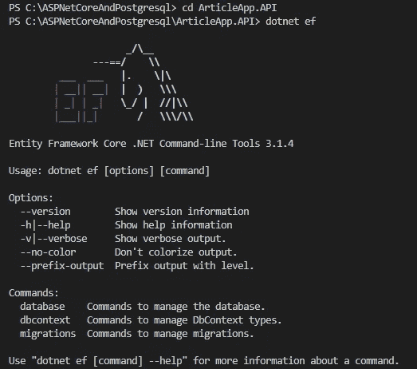*

*在代码优先的方法中，我们需要添加迁移。为此，请键入以下命令，*

> ***点网 ef 迁移添加初始创建***

*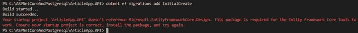*

*当我们尝试上述命令时，dotnet 抱怨缺少对 EntityFrameworkCore.Design 的引用。请更新项目文件并添加以下包引用。*

> *<packagereference include="”Microsoft.EntityFrameworkCore.Design”" version="”3.1.4&quot;/"></packagereference>*

*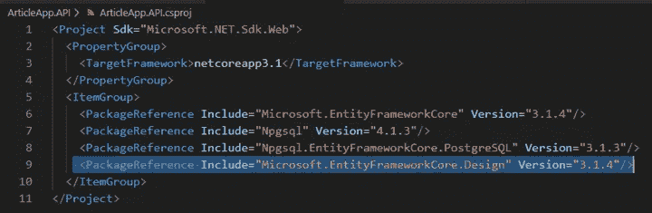*

*现在运行下面的命令，*

> ***net ef 迁移添加初始创建***

*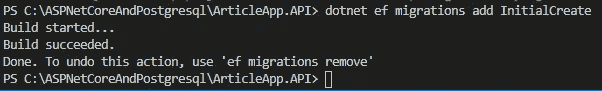*

*现在，您应该会看到 Done 消息，将会创建带有默认三个文件的迁移文件夹。*

*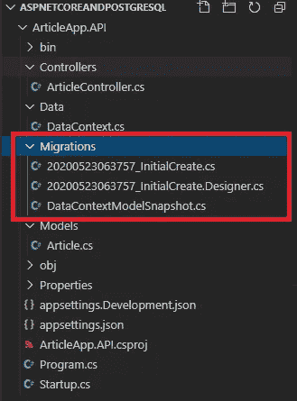*

# *PostgreSQL —下面是 pgAdmin 4 管理工具*

*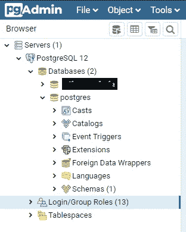*

*若要在数据库中创建文章表，请运行以下命令，*

> ***点网 ef 数据库更新***

*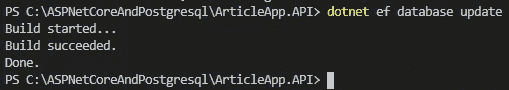*

*上述命令成功运行后。我们应该看到创建了 Articles 表的新数据库 ArticleDB。*

*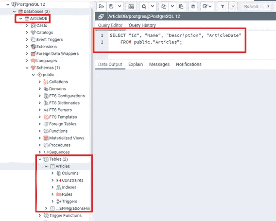*

*在表格中插入一些虚拟数据。*

*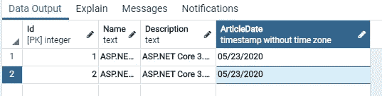*

*在下面添加 ArticleController.cs*

*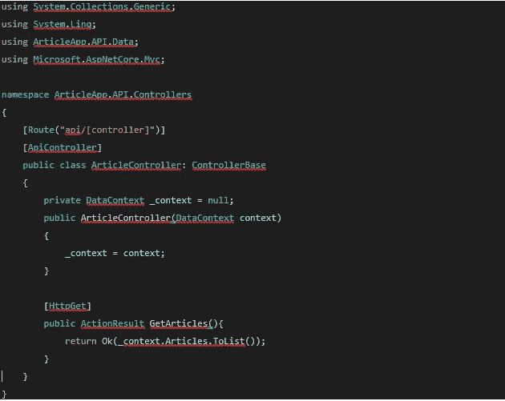*

*使用以下命令运行应用程序，*

> ***点网运行***

*导航到[https://localhost:5001/API/article](https://localhost:5001/api/article)*

*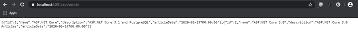*

*我们成功连接到 PostgreSQL，并能够显示数据库表中的数据。*

*几个要点-*

> *请确保使用正确版本的 EntityFrameworkCore、Npgsql 和 npg SQL . EntityFrameworkCore . PostgreSQL。否则，在运行迁移命令时可能会出现错误。*
> 
> *确保在 PostgreSQL 中创建具有适当访问权限的用户。在我的例子中，我已经创建了用户 article-user，并将他添加到 admin membership 下。您不必将他添加到管理员成员下，但用户应该拥有数据库和表创建权限。*

*如果您在阅读本文时遇到任何问题，请告诉我。如果您能提供任何反馈或改进，我将不胜感激。*

*感谢阅读。*