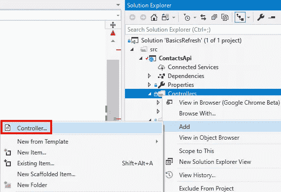
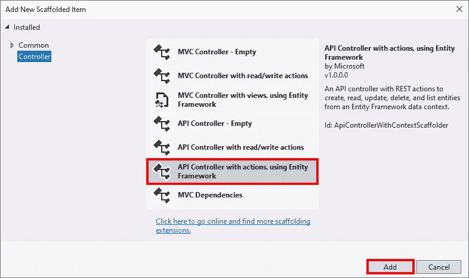
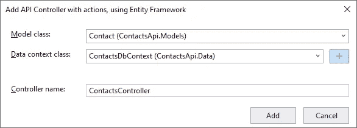
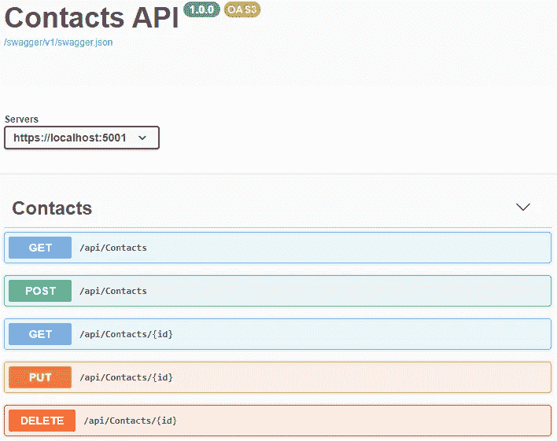

# ASP.NET 核心 3:向现有项目添加实体框架核心

> 原文：<https://itnext.io/asp-net-core-3-add-entity-framework-core-to-existing-project-ee4f08ff261a?source=collection_archive---------0----------------------->

上周，一个非官方的发布了一系列帖子，这些帖子与本博客中经常提到的[ASP.NET 基础报告](https://github.com/elanderson/ASP.NET-Core-Basics)的更新有关，以反映现在的事态。网芯 3 已经发布。新的回购协议是【ASP.NET 基础更新，因为命名很难。

这篇文章将采用上周为带有 NSwag 和 ASP.NET 核心 3 文章的 [Swagger/OpenAPI 创建的 API 项目，并将生成的数据替换为使用实体框架核心的数据库。如果你想继续关注这篇文章，可以在](https://elanderson.net/2019/10/swagger-openapi-with-nswag-and-asp-net-core-3/)[这里](https://github.com/elanderson/ASP.NET-Core-Basics-Refresh/tree/dbf8b0bb46811a7589fb0c1d6f1c591a86123b83)找到之前的文件。

## 添加 NuGet 包

实体框架核心不再包含在中。NET 核心，所以我们安装了几个 NuGet 包来开始。我要给。NET CLI 命令，但这也可以使用 Visual Studio NuGet 包管理器 UI 来完成。这篇文章也将使用 SQLite，但是 Entity Framework Core 支持多个数据库，您需要为您感兴趣使用的数据库安装软件包。

以下是安装我们将使用的软件包的命令。这还假设您的终端与项目文件位于同一个目录中。

```
dotnet add package Microsoft.EntityFrameworkCore.Sqlite
dotnet add package Microsoft.EntityFrameworkCore.Design
```

## 添加 DbContext

提醒一下，我们在 Models 目录中已经有了一个 Contact 类，其定义如下。

```
public class Contact
{
    public int Id { get; set; }
    public string Name { get; set; }
    public string Address { get; set; }
    public string City { get; set; }
    public string State { get; set; }
    public string PostalCode { get; set; }
    public string Phone { get; set; }
    public string Email { get; set; }
}
```

接下来，我向项目添加了一个**数据**目录，然后添加了一个名为 **ContactedDbContext** 的新类。DbContext 只为联系人公开一个 DbSet。

```
public class ContactsDbContext : DbContext
{
    public DbSet<Contact> Contacts { get; set; }

    public ContactsDbContext(DbContextOptions<ContactsDbContext> options) 
        : base(options)
    { }
}
```

## 连接字符串的配置

在 **appsettings.json** 文件中，我们将添加一个连接字符串部分来保存我们的默认连接。下面是我完整的 appsettings.json，带有 SQLite 的连接字符串。如果您使用不同的数据库提供程序，您的连接字符串可能会有很大的不同。

```
{
  "ConnectionStrings": {
    "DefaultConnection": "DataSource=app.db"
  },
  "Logging": {
    "LogLevel": {
      "Default": "Information",
      "Microsoft": "Warning",
      "Microsoft.Hosting.Lifetime": "Information"
    }
  },
  "AllowedHosts": "*"
}
```

查看 ASP.NET 核心中的[配置，了解处理配置的不同方式的更多详细信息。](https://docs.microsoft.com/en-us/aspnet/core/fundamentals/configuration)

## 向服务容器注册 DbContext

打开 **Startup.cs** ，在 **ConfigureServices** 函数中，我们将使用 **AddDbContext** 扩展方法添加我们的新 DbContext，并告诉它使用 SQLite 和来自我们 **appsettings.json** 的连接字符串。下面是完整的函数，前两行是我们添加的。

```
public void ConfigureServices(IServiceCollection services)
{
    services.AddDbContext<ContactsDbContext>(options =>
        options.UseSqlite(Configuration.GetConnectionString("DefaultConnection")));

    services.AddControllers();
    services.AddOpenApiDocument(document => 
        document.PostProcess = d => d.Info.Title = "Contacts API");
}
```

查看官方文档了解更多关于 ASP.NET 核心中[依赖注入的信息。](https://docs.microsoft.com/en-us/aspnet/core/fundamentals/dependency-injection)

## 创建并应用初始迁移

对于这一点，我们将回到命令行，打开包含我们正在处理的项目的 csproj 的目录。我们需要做的第一件事是使用下面的命令安装实体框架核心工具，该命令将全局安装该工具。

```
dotnet tool install --global dotnet-ef
```

接下来，我们将使用以下命令在 Data/Migrations 目录中创建一个名为 Initial 的迁移。

```
dotnet ef migrations add Initial -o Data/Migrations
```

现在我们有了一个迁移，让我们用它来创建我们的数据库。请注意，将来将迁移应用到现有数据库时，将使用相同的命令。

```
dotnet ef database update
```

查看官方文档，了解关于[实体框架核心工具](https://docs.microsoft.com/en-us/ef/core/miscellaneous/cli/dotnet)或[全局工具](https://docs.microsoft.com/en-us/dotnet/core/tools/global-tools)的更多信息。

## 搭建新的控制器

如果此时您正在使用来自 GitHub 的代码，您将需要删除 **ContactsController** ，因为它将使用 Visual Studio 的工具重新创建。

右键点击应该创建控制器的目录，本例中为**控制器**目录，选择**添加**，然后选择**控制器**。



在弹出的对话框中，我们要使用实体框架选择**带动作的 API 控制器，然后点击**添加**。**



在下一个屏幕上，在点击**添加**之前，指定**模型类别**、**数据上下文**和**控制器名称**。在示例案例中，我们将使用模型的 **Contact** 类，数据上下文的 **ContactDbContext** 来生成名为 **ContactController** 的控制器。



点击添加后，所请求的控制器将生成，并带有所选模型类的 [CRUD 操作](https://en.wikipedia.org/wiki/Create,_read,_update_and_delete)所需的所有功能。我们示例控制器的代码可以在[这里](https://github.com/elanderson/ASP.NET-Core-Basics-Refresh/blob/14d130df7102c0603d532a2aef4d459292359b9d/src/ContactsApi/Controllers/ContactsController.cs)找到。

## 尝试一下

在 NSwag 的帮助下，运行应用程序并点击我们的 [swagger UI，我们可以看到我们的 API 可用的所有选项，甚至可以尝试它们，这将点击我们应用程序的数据库。](https://elanderson.net/2019/10/swagger-openapi-with-nswag-and-asp-net-core-3/)



测试 API 的另一个很好的选择是 [Postman](https://www.getpostman.com/) ，它有很多非常棒的特性。这两种选择都允许您在不构建客户端的情况下尝试 API。

## 包扎

希望这篇文章能帮助你在 ASP.NET Core 3 应用程序中集成实体框架核心。提醒一下，实体框架核心支持许多不同的[数据库提供商](https://docs.microsoft.com/en-us/ef/core/providers/)。如果你有任何问题，我推荐你查看微软官方文档[实体框架核心](https://docs.microsoft.com/en-us/ef/core/get-started)入门。

以上所有修改的代码可以在[这里](https://github.com/elanderson/ASP.NET-Core-Basics-Refresh/tree/14d130df7102c0603d532a2aef4d459292359b9d)找到。

*最初发表于* [*埃里克·安德森*](https://elanderson.net/2019/11/asp-net-core-3-add-entity-framework-core-to-existing-project/) *。*