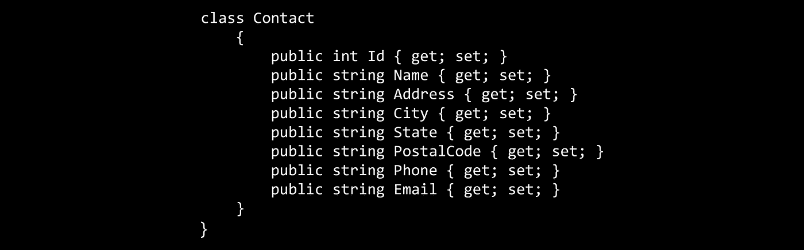

# ASP.NET 核心基础:Blazor

> 原文：<https://itnext.io/asp-net-core-basics-blazor-37ce0e8e4d97?source=collection_archive---------1----------------------->



Blazor 是一个单页面应用框架，使用。NET 通过 [WebAssembly](https://webassembly.org/) 和 [Mono](https://www.mono-project.com/news/2017/08/09/hello-webassembly/) 的魔力在浏览器中运行。看看 Blazor 是如何运行的。有关更多信息，请访问浏览器。你可以把 Blazor 想象成 Angular 或者 React，但是用. NET 编写。

请注意，这个项目仍然是一个不受支持的实验，不应该用于生产应用程序。这是我直到现在才尝试的部分原因。

我将把 Blazor 项目添加到我的[ASP.NET 核心基础](https://github.com/elanderson/ASP.NET-Core-Basics)回购中。之前的代码任何改动都可以在[这里](https://github.com/elanderson/ASP.NET-Core-Basics/tree/fb8cbd05af6453bc077c804c520fd6e15dd6b1ea)找到。

## 入门指南

作为一项实验，Blazor 已经有了一些非常好的文档。这篇文章的大部分内容都与 Blazor 的[入门](https://blazor.net/docs/get-started.html)文档页面相似，但我会尝试边走边记录。首先，确保你有最新版本的[。安装了 NET Core 2.1.x SDK](https://www.microsoft.com/net/download/dotnet-core/2.1) 。

如果你打算使用 Visual Studio，你至少需要 15.7 版本。此外，您还需要安装 [Blazor 语言服务扩展](https://marketplace.visualstudio.com/items?itemName=aspnet.blazor)。在 Visual Studio 中，这可以通过**工具>扩展和更新**菜单来完成。选择**在线**并搜索 **Blazor** 。它应该只显示一个项目，您可以单击**下载**开始安装过程。

## 项目创建

我们将使用。NET CLI 安装 Blazor 模板，并将生成的项目添加到 ASP.NET 核心基础解决方案中。首先，打开命令提示符，使用下面的命令安装 Blazor 模板。

```
dotnet new -i Microsoft.AspNetCore.Blazor.Templates
```

如果您使用的是示例代码，我将从现有的 **src** 目录中的一个新的 **Blazor** 目录运行命令。然后运行下面的命令来创建 Blazor 项目。

```
dotnet new blazor
```

下一个命令会将新项目添加到现有解决方案中。如果命令从与解决方案文件相同的目录中运行，则不需要解决方案文件的路径，但是在我们的示例中，我们是从解决方案文件所在的位置向下两级运行命令。

```
dotnet sln "../../ASP.NET Core Basics.sln" add Blazor.csproj
```

此时，您可以使用下面的命令来运行应用程序。

```
dotnet run
```

## 添加联系人列表

与 ASP.NET 基础知识类别中的另一篇文章一样，我们将添加一个联系人列表页面，从 API 中提取联系人列表。对于这个例子，API 是示例解决方案中已经存在的 **Contacts** 项目的一部分。该部分中的所有更改都发生在我们上面创建的 **Blazor** 项目中。

在**页面**目录下添加一个 **ContactList.cshtml** 文件，内容如下。这个文件的一些部分将会被分解。

```
@page "/contacts"
@inject HttpClient Http

<h1>Contact List</h1>

@if (contacts == null)
{
    <p><em>Loading...</em></p>
}
else
{
    <table class="table">
        <thead>
            <tr>
                <th>ID</th>
                <th>Name</th>
            </tr>
        </thead>
        <tbody>
            @foreach (var contact in contacts)
            {
                <tr>
                    <td>@contact.Id</td>
                    <td>@contact.Name</td>
                </tr>
            }
        </tbody>
    </table>
}

@functions {
    Contact[] contacts;

    protected override async Task OnInitAsync()
    {
        contacts = await Http.GetJsonAsync<Contact[]>("http://localhost:13322/api/contactsApi/");
    }

    class Contact
    {
        public int Id { get; set; }
        public string Name { get; set; }
        public string Address { get; set; }
        public string City { get; set; }
        public string State { get; set; }
        public string PostalCode { get; set; }
        public string Phone { get; set; }
        public string Email { get; set; }
    }
}
```

这有很多工作要做，所以我们将从函数部分开始，它本质上是一种屏蔽页面所需代码的方法。它可以包含函数、类或页面可能需要的任何其他 C#构造。下面只是上面页面的函数部分。

```
@functions {
    Contact[] contacts;

    protected override async Task OnInitAsync()
    {
        contacts = await Http.GetJsonAsync<Contact[]>("http://localhost:13322/api/contactsApi/");
    }

    class Contact
    {
        public int Id { get; set; }
        public string Name { get; set; }
        public string Address { get; set; }
        public string City { get; set; }
        public string State { get; set; }
        public string PostalCode { get; set; }
        public string Phone { get; set; }
        public string Email { get; set; }
    }
}
```

在我们的示例中，我们使用函数定义一个 Contact 类来保存从 OnInitAsync 函数的 API 调用中获取的数据。OnInitAsync 函数是 Blazor 组件提供的[生命周期函数](https://blazor.net/docs/components/index.html#lifecycle-methods)之一。我们不会深入组件，我建议您查看[组件文档](https://blazor.net/docs/components/index.html)以获取更多信息。

@page "/contacts "定义了该页面将被服务的路线。接下来，@inject HttpClient Http 展示了如何使用 ASP.NET 核心的依赖注入来获取 HttpClient 的实例。

文件的剩余位是正常的[剃刀](https://docs.microsoft.com/en-us/aspnet/core/mvc/views/razor?view=aspnetcore-2.1)。函数部分中定义的所有内容都可以在布局中使用。例如，我们使用 OnInitAsync 填充的联系人列表来循环并创建一个表来显示我们的联系人列表。

```
<h1>Contact List</h1>

@if (contacts == null)
{
    <p><em>Loading...</em></p>
}
else
{
    <table class="table">
        <thead>
            <tr>
                <th>ID</th>
                <th>Name</th>
            </tr>
        </thead>
        <tbody>
            @foreach (var contact in contacts)
            {
                <tr>
                    <td>@contact.Id</td>
                    <td>@contact.Name</td>
                </tr>
            }
        </tbody>
    </table>
}
```

## 包扎

Blazor 是一个非常有趣的概念。我希望它能够通过实验阶段成为一个受支持的项目。这似乎是一个很好的选择。NET 开发人员。最终参加选拔是一件非常有趣的事情。去试一试，确保并向微软提供反馈，以便他们可以就如何进行该项目做出明智的决定。

完成的代码可以在这里找到[。](https://github.com/elanderson/ASP.NET-Core-Basics/tree/ece8904816ea8224b97088c281505737ab7d867e)

*原载于* [*安德森*](https://elanderson.net/2018/08/asp-net-core-basics-blazor/) *。*