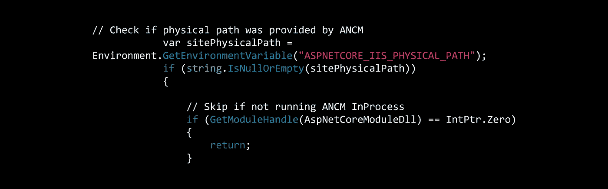

# 进程内托管的 ASP.NET 核心配置问题

> 原文：<https://itnext.io/asp-net-core-configuration-issue-with-in-process-hosting-bebbf9110a1b?source=collection_archive---------3----------------------->

自从[ASP.NET 核心 2.2 发布](https://blogs.msdn.microsoft.com/webdev/2018/12/04/asp-net-core-2-2-available-today/)以来，我一直致力于更新我所有不同的应用程序，并使用[进程内托管](https://docs.microsoft.com/en-us/aspnet/core/fundamentals/servers/index?view=aspnetcore-2.2&tabs=windows#in-process-hosting-model)。我很快就遇到了一个使用 SQLite 的应用程序的问题。当应用程序试图访问数据库时，我发现了下面的错误。



> SqliteException: SQLite 错误 14:“无法打开数据库文件”。微软。data . SQLite . sqliteexception . throwexceptionforrc(int RC，sqlite3 db)微软。data . SQLite . SQLite connection . open()微软。EntityFrameworkCore . storage . relational connection . opendb connection(预期出现布尔值错误)

## 问题

经过一番谷歌搜索，我在 GitHub 上发现了一个[问题，详细描述了这个问题。事实证明，当应用程序获取其当前目录时，它返回的是承载应用程序的 IIS 进程的路径，而不是应用程序所在的目录。](https://github.com/aspnet/AspNetCore/issues/4206)

## 变通一下

在另一个 [GitHub 问题](https://github.com/aspnet/AspNetCore/issues/6117)上，我找到了一个推荐解决方法的链接。在应用程序中的某个地方添加下面的类。这段代码来自[这里](https://github.com/aspnet/Docs/blob/master/aspnetcore/host-and-deploy/aspnet-core-module/samples_snapshot/2.x/CurrentDirectoryHelpers.cs)。

```
internal class CurrentDirectoryHelpers
{
    internal const string AspNetCoreModuleDll = "aspnetcorev2_inprocess.dll";

    [System.Runtime.InteropServices.DllImport("kernel32.dll")]
    private static extern IntPtr GetModuleHandle(string lpModuleName);

    [System.Runtime.InteropServices.DllImport(AspNetCoreModuleDll)]
    private static extern int http_get_application_properties(ref IISConfigurationData iiConfigData);

    [System.Runtime.InteropServices.StructLayout(System.Runtime.InteropServices.LayoutKind.Sequential)]
    private struct IISConfigurationData
    {
        public IntPtr pNativeApplication;
        [System.Runtime.InteropServices.MarshalAs(System.Runtime.InteropServices.UnmanagedType.BStr)]
        public string pwzFullApplicationPath;
        [System.Runtime.InteropServices.MarshalAs(System.Runtime.InteropServices.UnmanagedType.BStr)]
        public string pwzVirtualApplicationPath;
        public bool fWindowsAuthEnabled;
        public bool fBasicAuthEnabled;
        public bool fAnonymousAuthEnable;
    }

    public static void SetCurrentDirectory()
    {
        try
        {
            // Check if physical path was provided by ANCM
            var sitePhysicalPath = Environment.GetEnvironmentVariable("ASPNETCORE_IIS_PHYSICAL_PATH");
            if (string.IsNullOrEmpty(sitePhysicalPath))
            {
                // Skip if not running ANCM InProcess
                if (GetModuleHandle(AspNetCoreModuleDll) == IntPtr.Zero)
                {
                    return;
                }

                IISConfigurationData configurationData = default(IISConfigurationData);
                if (http_get_application_properties(ref configurationData) != 0)
                {
                    return;
                }

                sitePhysicalPath = configurationData.pwzFullApplicationPath;
            }

            Environment.CurrentDirectory = sitePhysicalPath;
        }
        catch
        {
            // ignore
        }
    }
}
```

最后，在**程序**类的**主**函数中，添加下面一行作为函数中的第一件事。

```
CurrentDirectoryHelpers.SetCurrentDirectory();
```

## 包扎

有了上述更改，一切都将按预期运行。我的理解是，这个问题将在未来的某个时候作为一个补丁来解决，所以这应该只是一个临时的修复。

*最初发表于* [*埃里克·安德森*](https://elanderson.net/2019/02/asp-net-core-configuration-issue-with-in-process-hosting/) *。*