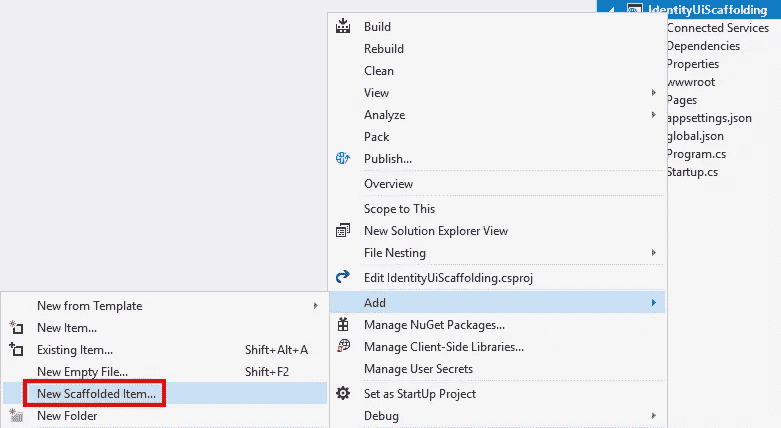
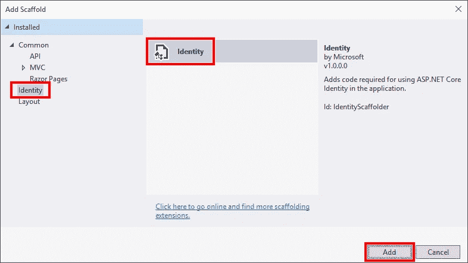
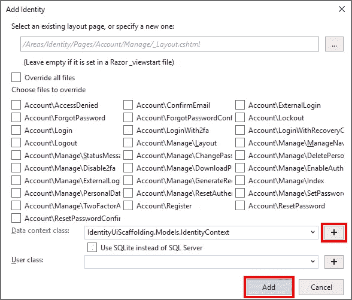

# ASP.NET 核心:身份脚手架

> 原文：<https://itnext.io/asp-net-core-identity-scaffolding-953b18a7777e?source=collection_archive---------6----------------------->

我相信我们都已经开始了一个新的 web 项目，然后需要在以后添加身份验证。这篇文章将介绍使用 Visual Studio 中的身份搭建特性的过程。

# 样品

对于这个例子，我从使用以下命令创建的新 web 应用程序开始。

```
dotnet new webapp
```

如果你有任何。NET Core 3 previews installed 我建议在运行应用程序创建之前，在要创建应用程序的目录中添加一个 **global.json** 文件。我在当前的预览版中遇到了一些脚手架的问题。以下是我的 **global.json** 的内容为例。

```
{ "sdk": { "version": "2.2.104" } }
```

# 脚手架

在 Visual Studio 中右键单击该项目并选择**添加>新的脚手架项目**。



在左侧列表的**添加脚手架**对话框中，选择我们想要的**标识**项的中间区域的**标识**，然后点击**添加**按钮。



接下来，在 **Add Identity** 对话框中，您可以选择想要覆盖所提供身份的哪些部分。我将对所有值采用默认值。一个例外是**数据上下文类**，我使用字段右侧的加号按钮添加一个新的，因为这个项目目前没有任何数据访问。完成后，点击**添加**按钮。



大约一分钟后，身份生成将完成，一个文本文件也将完成，并有一些后续步骤。由于项目类型的原因，我们开始时唯一需要做的事情就是实体框架迁移。以下是文件中的说明，该文件将使用支持 ASP.NET 核心的身份所需的新数据来创建/更新您的数据库。

> *生成的数据库代码需要实体框架核心迁移。运行以下命令:*
> 
> *1。dotnet ef 迁移添加 CreateIdentitySchema
> 2。dotnet ef 数据库更新*
> 
> 或者从 Visual Studio 包管理器控制台:
> 1。添加-迁移 CreateIdentitySchema
> 2。更新-数据库

最后，在 **Pages/Shared** 目录中，打开 **_Layout.cshtml** 文件，将以下内容添加到您想要显示注册和登录链接的位置。我在现有的导航链接之后添加了这个。

```
<partial name="_LoginPartial"/>
```

# 包扎

这是一个非常容易处理的功能，可以很容易地为现有项目添加标识。您仍然会错过从一开始就创建带有标识的项目所带来的一些好处，比如显示带有用户名的欢迎消息，但是如果您需要的话，可以添加这些内容。

关于这个主题的官方文件涵盖了比这篇文章更多的场景。

*原载于 2019 年 4 月 7 日*[*【elanderson.net*](https://elanderson.net/2019/04/asp-net-core-identity-scaffolding/)*。*