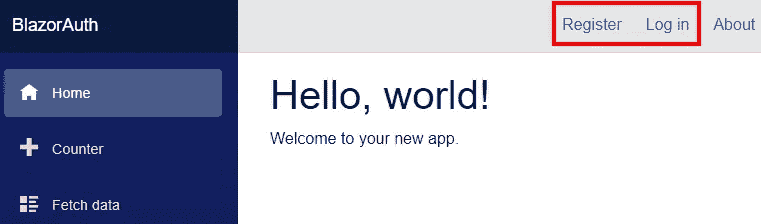

# 带认证的 ASP.NET 核心服务器端 Blazor

> 原文：<https://itnext.io/asp-net-core-server-side-blazor-with-authentication-2ffa37c37d8b?source=collection_archive---------3----------------------->

自从我在 Blazor 上写了第一篇帖子[ASP.NET 核心基础:Blazor](https://elanderson.net/2018/08/asp-net-core-basics-blazor/) 以来，已经过去了将近一年，很多事情都变了。最重要的事情是，它宣布[服务器端 Blazor 将与。网芯 3](https://devblogs.microsoft.com/aspnet/blazor-0-6-0-experimental-release-now-available/) 。这篇文章将介绍如何创建一个包含认证的服务器端 Blazor 应用程序。

## 服务器端 Blazor

什么是服务器端 Blazor，它与客户端 Blazor 有什么不同？简单的回答是客户端 Blazor 使用 [WebAssembly](https://webassembly.org/) 和 [Mono](https://www.mono-project.com/news/2017/08/09/hello-webassembly/) 来运行。使用服务器端 Blazor，应用程序在服务器上执行，并通过 SignalR 连接请求更新/处理。

要更深入地了解这些差异，请查看[ASP.NET Core Blazor 主机模型](https://docs.microsoft.com/en-us/aspnet/core/blazor/hosting-models?view=aspnetcore-3.0)文档。

## 先决条件

要开始，请确保安装至少的预览版 6。网芯 3。使用命令提示符，您可以运行以下命令来查看。NET Core SDK 已安装。

```
dotnet --list-sdks
```

的预演。网芯 3 可以从[这里](https://dotnet.microsoft.com/download/dotnet-core/3.0)下载。还有，一定要用 [Visual Studio 2019](https://visualstudio.microsoft.com/vs/preview/) 的最新预览版。

## 应用程序创建

我在命令提示符下使用下面的命令创建了一个使用个人身份验证的新 Blazor 应用程序。

```
dotnet new blazorserverside --auth Individual
```

如果您选择了**ASP.NET 核心 Web 应用**项目类型，Visual Studio 也有可用的模板，并且在选择 **Blazor 服务器应用**选项中有大约三个屏幕。

创建过程完成后，在 Visual Studio 中打开该项目。此时，如果您运行该应用程序，您将看到登录或注册的标准选项。



## 要求对页面进行授权

此时，应用程序允许帐户创建和登录，但是所有页面对所有用户都可用，即使他们没有登录。有多种方法可以解决这个问题。在这篇文章中，我将使用最接近我所习惯的 MVC 的方法，即使用 Authorize 属性。在 Pages 目录中打开 then **FetchData.razor** 文件，并进行以下更改，使页面要求用户获得授权。请注意，该方法只应用于页面组件。

之前:

```
@page "/fetchdata"
@using BlazorAuth.Data
@inject WeatherForecastService ForecastService
```

之后:

```
@page "/fetchdata"
@using BlazorAuth.Data
@using Microsoft.AspNetCore.Authorization
@attribute [Authorize]
@inject WeatherForecastService ForecastService
```

现在，如果您在未登录的情况下进入“获取数据”页面，您将会看到一条未授权的消息。可以使用 AuthorizeView 组件自定义此消息。你可以在[文件](https://docs.microsoft.com/en-us/aspnet/core/security/blazor/?view=aspnetcore-3.0&tabs=visual-studio#authorizeview-component)中找到更多细节。

## 包扎

很高兴看到自从我上次玩 Blazor 以来，它已经有了很大的进步。文档很棒，产品也有了很大的改进。我可能会在后续文章中更深入地介绍如何使用 AuthorizeView 组件。

请务必查看 [Blazor 认证和授权](https://docs.microsoft.com/en-us/aspnet/core/security/blazor/?view=aspnetcore-3.0)上的官方文档，以了解该主题的全貌。

*原载于* [*埃里克·安德森*](https://elanderson.net/2019/08/asp-net-core-server-side-blazor-with-authentication/) *。*