# 带有 Azure B2C 授权的 ASP.NET 核心

> 原文：<https://itnext.io/asp-net-core-with-azure-b2c-auth-8874650ba12e?source=collection_archive---------5----------------------->

不久前，我遇到了以前的一个同事，他们在谈论使用 Azure 的 B2C 来验证他们的应用程序。这听起来是个不错的解决方案。这篇博文将介绍如何获得 Azure B2C 设置，以及如何创建一个使用 B2C 进行授权的示例应用程序。

# 创建 Azure Active Directory B2C

这一切都假设你已经有一个 Azure 账户。如果你没有，你可以注册一个[免费试用](https://azure.microsoft.com/en-us/offers/ms-azr-0044p/)(不是附属链接)。注册后，前往[蔚蓝门户](https://portal.azure.com/)。

注意:如果要使用 Azure 帐户上的默认 Active Directory，可以跳过此部分。

在左上角点击**创建资源**链接。

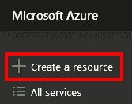

在搜索框中寻找 Azure Active Directory B2C 。

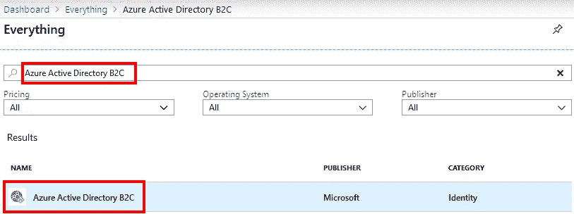

选择 Azure Active Directory B2C 后，更多信息将加载到新面板的右侧。点击**创建**按钮继续。


接下来，选择是创建新的 B2C 租户还是使用现有的租户。我没有现有的租户，因此下面的流程将用于创建新租户。

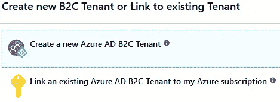

在下一个面板中，您需要输入组织名称和初始域名。输入有效值后，单击“创建”按钮。

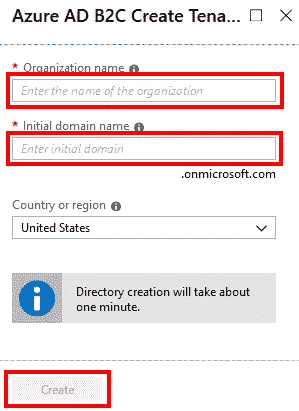

# 切换活动目录

既然新目录已经创建，我们需要切换到 Azure 门户中的新目录。在左侧面板中点击 **Azure Active Directory** 。

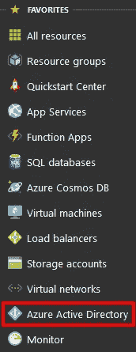

点击**开关目录**链接。

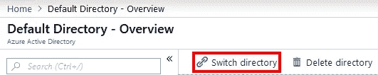

一个新的面板将显示在屏幕的右侧，其中列出了您可以使用的目录。选择您在上述步骤中创建的一个或您想要使用的现有的一个。

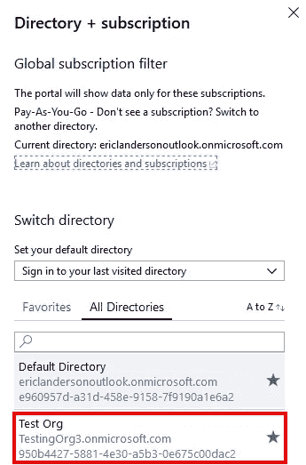

使用门户网站顶部中间的搜索框找到 **Azure AD B2C** 。

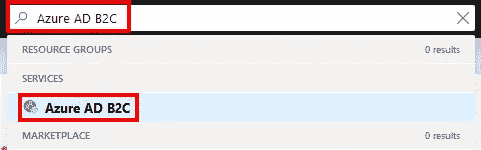

# 示例应用程序

在继续 Azure 方面之前，我们将创建我们的示例客户端应用程序。这个小小的迂回将使我更容易指出 Azure 中的哪些值需要放在应用程序配置中的什么位置。

要创建一个已经设置为使用 Azure B2C 的新 web 应用程序，请使用以下内容。在命令提示符下运行. NET CLI 命令。如果您喜欢这种方式，也可以使用 Visual Studio 模板。

```
dotnet new webapp --auth IndividualB2C
```

在生成的应用程序中，您的 **appsettings.json** 将包含以下用于 **AzureAdB2C** 的部分。

```
"AzureAdB2C": { 
    "Instance": "https://login.microsoftonline.com/tfp/",
    "ClientId": "11111111-1111-1111-11111111111111111",
    "CallbackPath": "/signin-oidc", 
    "Domain": "qualified.domain.name", 
    "SignUpSignInPolicyId": "", 
    "ResetPasswordPolicyId": "", 
    "EditProfilePolicyId": "" 
}
```

# Azure AD B2C 设置

回到 Azure 门户和 Azure 广告 B2C 服务页面。在**概述**页面中，我们需要注意的第一件事是**域名**，并使用它在我们的应用程序中设置一些配置值。

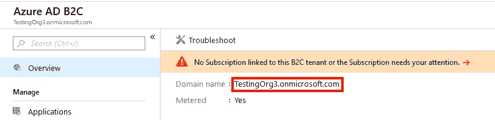

在 appsettings.json 文件中，使用这个值作为您的**域**值。

```
"Domain": "TestingOrg3.onmicrosoft.com"
```

子域也用于构建**实例**，如下所示。

```
"Instance": "https://TestingOrg3.b2clogin.com/tfp/"
```

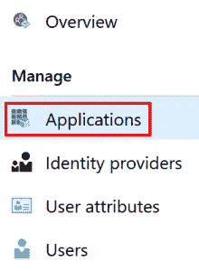

在加载面板上点击**添加**按钮。在新的应用程序面板上，我们需要给应用程序一个**名称**，选择客户端的类型，在我们的例子中是 **Web App / Web API** 。接下来是**回复 URL** ，默认设置是您的基本 url/sigin-oidc。我一开始把这个值弄乱了，得到了一些非常奇怪的错误。最后点击**创建**按钮。

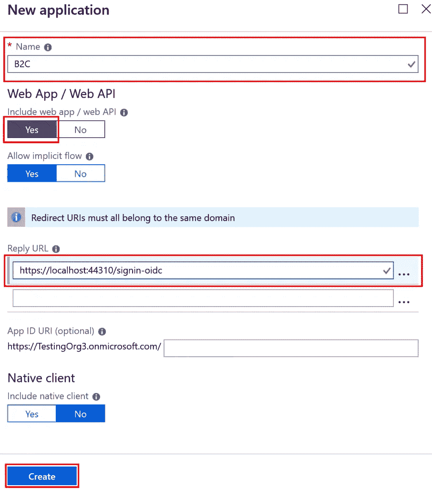

创建过程完成后，复制**应用程序 ID** 字段中的值，并将其用作 appsettings.json 文件中的 **ClientId** 。

回到 Azure，选择**用户流(策略)**选项。

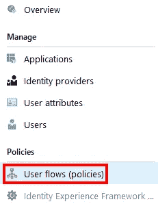

在加载面板的顶部，点击**新用户流**按钮。下一个面板显示了可以添加的流的选择。我们正在制作的应用程序将使用**注册和登录**流程和**密码休息**流程。我只打算浏览第一个，但第二个非常相似。点击**报名，签到**喜欢。

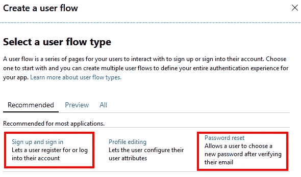

在创建过程中，您需要为流设置一个**名称**，并选择对流有效的**身份提供者**。您还可以选择随此流收集的字段，以及哪些字段应该随索赔一起返回。设置好这些选项后，点击**创建**按钮。

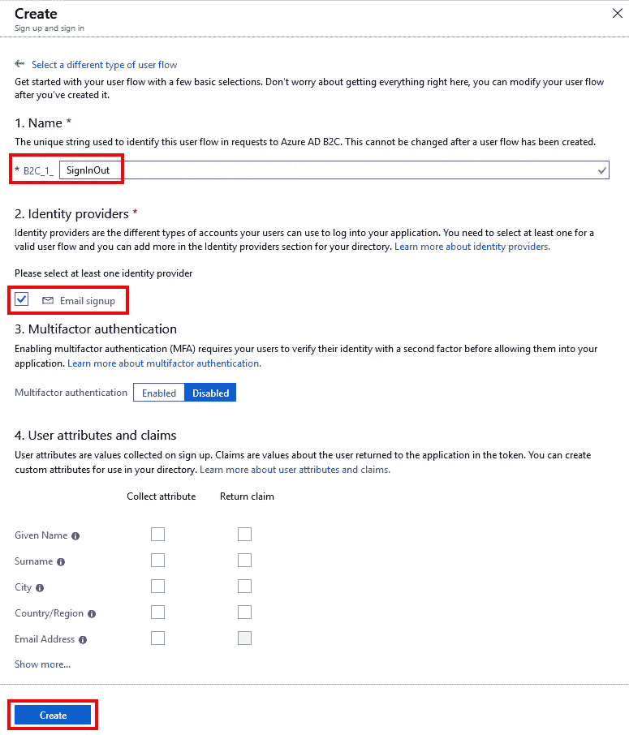

需要在 appsettings.json 文件中为**signussigninpolicyid**值输入该屏幕的**名称**。这是我在设置文件中设置的注册和重置密码策略。

```
"SignUpSignInPolicyId": "B2C_1_SignInOut", 
"ResetPasswordPolicyId": "B2C_1_PasswordReset"
```

# 运行示例

此时，您可以运行您的示例应用程序，并单击**登录**链接，您将看到一个类似下面的页面，该页面来自 Azure B2C。

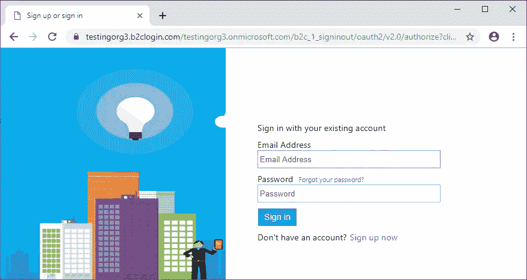

有很多方法可以定制用户将在 Azure 的相关流程下看到的页面。

# 包扎

我在设置 Azure B2C 时遇到了不少问题。我希望这篇文章能帮助你们绕过我提到的一些问题。

*原载于 2019 年 4 月 14 日 elanderson.net*[](https://elanderson.net/2019/04/asp-net-core-with-azure-b2c-auth/)**。**