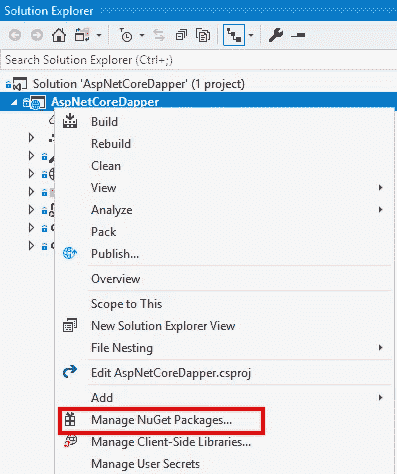
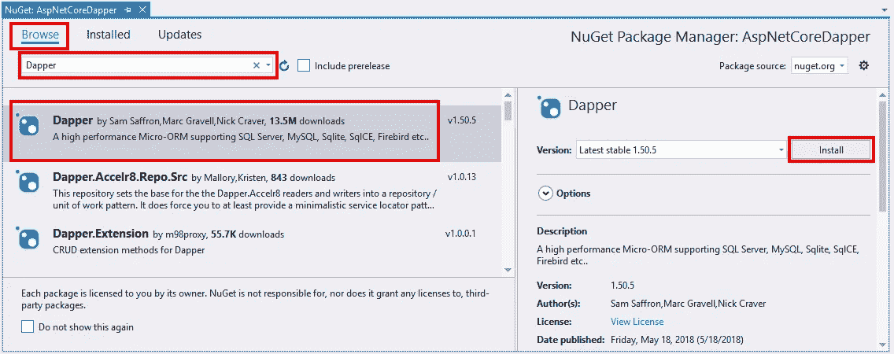

# 衣冠楚楚的 ASP.NET 核心

> 原文：<https://itnext.io/asp-net-core-with-dapper-e58ca796da2b?source=collection_archive---------5----------------------->

实体框架核心一直是我最近发表的许多文章的核心。我认为这将是一个很好的改变，尝试实体框架核心的替代方案之一，并尝试一下 [Dapper](https://github.com/StackExchange/Dapper) 。

我试图找到一个很好的例子来说明像 Dapper 这样的微 ORM 和像 Entity Framework Core 这样的完整 ORM 之间的区别，但是我找到的所有这些都以一个选项优于另一个选项而告终。我并不是想说一个比另一个好，而是想给我的工具箱增加一个新工具。

基本上，差异似乎可以归结为微型 ORM 提供的功能比完整 ORM 少得多，但性能却更高。哪个是正确的选择将因项目而异。

## 示例项目

我们将使用一个新的 Razor Pages 应用程序作为示例应用程序的起点。它目前没有任何数据库访问设置。样本的起点代码可以在[这里](https://github.com/elanderson/ASP.NET-Core-Dapper/tree/17b768f583d0572f19e306b4402ca2d8020eda35)找到。

我将使用为我的[实体框架示例项目](https://github.com/elanderson/ASP.NET-Core-Entity-Framework)中的 SQL Server 示例创建的现有数据库。下面是从该示例项目生成的 Contacts 表，以防您想要手动生成该表。

```
CREATE TABLE [dbo].[Contacts] (
    [Id]         INT            IDENTITY (1, 1) NOT NULL,
    [Name]       NVARCHAR (MAX) NULL,
    [Address]    NVARCHAR (MAX) NULL,
    [City]       NVARCHAR (MAX) NULL,
    [Subregion]  NVARCHAR (MAX) NULL,
    [PostalCode] NVARCHAR (MAX) NULL,
    [Phone]      NVARCHAR (MAX) NULL,
    [Email]      NVARCHAR (MAX) NULL,
    [Timestamp]  ROWVERSION     NULL
);
```

## 添加 Dapper Nuget 包

使用您最喜欢的方式添加 NuGet 包，添加对 Dapper 包的引用。我将使用 Visual Studio 右键单击项目并选择 **Manage NuGet Packages** 来完成此操作。



在下一个屏幕上，从**浏览**选项卡使用**搜索框**搜索 **Dapper** 。选择 **Dapper** 包，点击**安装**。



## 添加连接字符串配置

我们将把数据库连接字符串存储在 **appsettings.json** 文件中。打开文件并添加一个 **ConnectionString** 部分，其中的 **DefaultConnection** 包含数据库连接字符串。这种精确的设置不是必需的，我只是按照实体框架基础项目的配置方式进行设置。以下是我的完整配置文件，新的部分在顶部。

```
{
  "ConnectionStrings": {
    "DefaultConnection": "Your connection string"
  },
  "Logging": {
    "LogLevel": {
      "Default": "Warning"
    }
  },
  "AllowedHosts": "*"
}
```

## 接触模型

在 **Models** 文件夹中添加一个 **Contact** 类，用于表示我们的数据。下面是我将在这个例子中使用的完整模型类。

```
public class Contact
{
    public int Id { get; set; }
    public string Name { get; set; }
    public string Address { get; set; }
    public string City { get; set; }
    public string Subregion { get; set; }
    public string PostalCode { get; set; }
    public string Phone { get; set; }
    public string Email { get; set; }
}
```

## 测试设置

为了简单起见，除了作为运行 Dapper 相关代码的一种方式，我不会处理任何 UI。因此，我们将使用索引页面的页面模块来运行示例代码。这绝不是最佳实践设置的示例，只是为了在最简单的设置中演示 Dapper。

下面是通过构造函数注入的应用程序配置的完整页面模型。此时通过的所有更改都将在 **OnGet** 函数中。

```
public class IndexModel : PageModel
{
    private readonly IConfiguration _configuration;

    public IndexModel(IConfiguration configuration)
    {
        _configuration = configuration;
    }

    public void OnGet()
    {

    }
}
```

## 使用 Dapper

Dapper 提供了许多来自 **IDbConnection** 接口的扩展方法。对于本例，我们将使用这些扩展来检查特定的联系人是否存在，如果不存在，则插入它，最后从数据库中选择该联系人。

第一步是打开一个连接。在这个例子中，我们使用的是 SQL Server，但是 Dapper 并不在乎，它将与任何一个 ADO.NET 供应商合作。以下代码使用来自 **appsettings.json** 的连接字符串打开一个 SQL 连接。

```
using (var connection = new SqlConnection(_configuration.GetConnectionString("DefaultConnection")))
{
    connection.Open();
}
```

接下来，我们将在 Contacts 表中查询特定联系人的 ID。

```
if (connection.QueryFirstOrDefault<int?>(@"SELECT Id 
                                           FROM Contacts 
                                           WHERE Name = @Name",
                                         new {Name = "Charlie Plumber"}) == null)
{
}
```

正如你从上面看到的，你所写的 SQL 没有什么特别的。对于这个查询，我们使用一个匿名类型将查询传递给一个名称过滤器，该过滤器将被转换为一个 **SqlParameter** 以确保查询不会像 SQL 注入一样。请注意，SQL 字符串中的参数名必须与传递给查询的对象的相应属性名相匹配。

下一个例子是 contact insert，如果在前面的查询中没有找到该联系人。

```
connection.Execute(@"INSERT INTO Contacts (Name, Address, City, Subregion, Email)
                     VALUES (@Name, @Address, @City, @Subregion, @Email)",
                   new Contact
                   {
                       Name = "Charlie Plumber",
                       Address = "123 Main St",
                       City = "Nashville",
                       Subregion = "TN",
                       Email = "cplumber@fake.com"
                   });
```

同样，SQL 正是您所期望的，如果您熟悉 SQL，这是 Dapper 的一个伟大之处。

最后一个示例是前面所有示例的组合，其中一个 select 用于获取相关联系人的详细联系信息。

```
using (var connection = new SqlConnection(_configuration.GetConnectionString("DefaultConnection")))
{
    connection.Open();

    if (connection
           .QueryFirstOrDefault<int?>(@"SELECT Id 
                                        FROM Contacts 
                                        WHERE Name = @Name",
                                      new {Name = "Charlie Plumber"}) == null)
    {
        connection.Execute(@"INSERT INTO Contacts (Name, Address, City, 
                                                   Subregion, Email) 
                             VALUES (@Name, @Address, @City, 
                                     @Subregion, @Email)",
                           new Contact
                           {
                               Name = "Charlie Plumber",
                               Address = "123 Main St",
                               City = "Nashville",
                               Subregion = "TN",
                               Email = "cplumber@fake.com"
                           });
    }

    var charile = 
      connection.QueryFirstOrDefault<Contact>(@"SELECT Id, Name, Address, 
                                                       City, Subregion, Email 
                                                FROM Contacts 
                                                WHERE Name = @Name",
                                              new {Name = "Charlie Plumber"});
}
```

## 包扎

和达帕的第一轮比赛很有趣。我在日常工作中写了很多 SQL，所以看到显式的 SQL 和完整 ORM 的魔力还是挺不错的。我可以告诉你，通过做这个示例，我会想念 Entity Framework 的数据库创建和迁移功能。

最终状态的代码可以在这里找到。

*最初发表于* [*埃里克·安德森*](https://elanderson.net/2019/02/asp-net-core-with-dapper/) *。*