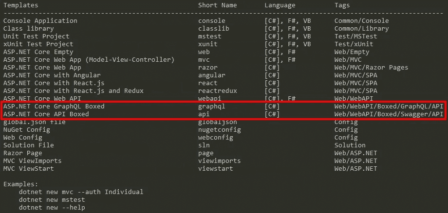
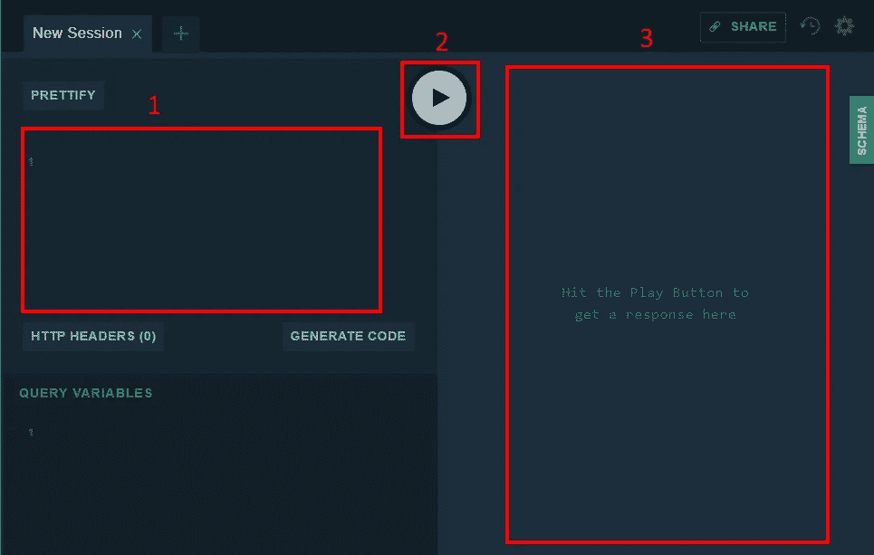

# 使用 GraphQL 的 ASP.NET 核心。网盒装

> 原文：<https://itnext.io/asp-net-core-with-graphql-using-net-boxed-f96a2aab6bde?source=collection_archive---------1----------------------->

GraphQL 是我一直想研究的东西，但一直没有时间。[穆罕默德·雷汉·赛义德](https://twitter.com/RehanSaeedUK)最近释放的[。NET Boxed](https://github.com/Dotnet-Boxed/Templates) ，它是他的 ASP.NET 核心样板模板的一个更名，包含一个 GraphQL 的模板。这让 GraphQL 回到了我的脑海中，所以这篇文章将介绍安装和使用。NET Boxed 来启动和运行 GraphQL 项目。

## 模板安装

与所有模板一样，使用。NET CLI。打开命令提示符，输入以下命令。

```
dotnet new --install "Boxed.Templates::*"
```

命令末尾的 ***** 只是确保安装了最新版本。安装完成后，你会得到一个你已经安装的所有模板的列表。提供的两个新的。网框在截图中突出显示。



## 项目创建

在这篇文章中，我们将使用 **graphql** 模板创建一个项目。提供的两个模板。NET Boxed 有许多可选标志，可用于配置生成的项目。确保为您正在使用的模板运行 **help** 命令，查看是否有您想要设置的选项。例如，下面的命令将列出 GraphQL 模板的所有选项。

```
dotnet new graphql --help
```

创建并导航到要创建新项目的目录，然后运行以下命令，使用默认设置创建项目，但关闭 HTTPS。对于生产应用程序来说，这不是您想要关闭的东西，但是它降低了初始探索的复杂性。

```
dotnet new graphql --https-everywhere false
```

创建项目后，从同一目录运行以下命令，在 Visual Studio 代码中打开它。

```
code .
```

## 一些项目笔记

项目生成在项目的根中创建一个**ReadMe.html**。确保并检查它。它列出了项目所需的先决条件，以及大量关于一般良好实践的有用信息。

在这篇文章中，我们不打算深入研究这个项目本身，但是当我们尝试一些 GraphQL 查询时，知道数据在哪里以及它看起来像什么是有帮助的。支持数据位于**Repositories/database . cs**文件中的静态类中。

这些数据以星球大战为主题，由两个角色列表组成，一个是机器人的，另一个是人类的，这两个列表合并成一个角色列表。下面是数据库类，供参考。

```
public static class Database
{
    static Database()
    {
        Droids = new List<Droid>()
        {
            new Droid()
            {
                Id = new Guid("1ae34c3b-c1a0-4b7b-9375-c5a221d49e68"),
                Name = "R2-D2",
                Friends = new List<Guid>()
                {
                    new Guid("94fbd693-2027-4804-bf40-ed427fe76fda"),
                    new Guid("c2bbf949-764b-4d4f-bce6-0404211810fa")
                },
                AppearsIn = new List<Episode>() { Episode.NEWHOPE,
                                                  Episode.EMPIRE,
                                                  Episode.JEDI, },
                PrimaryFunction = "Astromech"
            },
            new Droid()
            {
                Id = new Guid("c2bbf949-764b-4d4f-bce6-0404211810fa"),
                Name = "C-3PO",
                Friends = new List<Guid>(),
                AppearsIn = new List<Episode>() { Episode.NEWHOPE,
                                                  Episode.EMPIRE,
                                                  Episode.JEDI, },
                PrimaryFunction = "Protocol"
            }
        };
        Humans = new List<Human>()
        {
            new Human()
            {
                Id = new Guid("94fbd693-2027-4804-bf40-ed427fe76fda"),
                Name = "Luke Skywalker",
                Friends = new List<Guid>()
                {
                    new Guid("1ae34c3b-c1a0-4b7b-9375-c5a221d49e68"),
                    new Guid("c2bbf949-764b-4d4f-bce6-0404211810fa")
                },
                AppearsIn = new List<Episode>() { Episode.NEWHOPE,
                                                  Episode.EMPIRE,
                                                  Episode.JEDI, },
                HomePlanet = "Tatooine"
            },
            new Human()
            {
                Id = new Guid("7f7bf389-2cfb-45f4-b91e-9d95441c1ecc"),
                Name = "Darth Vader",
                Friends = new List<Guid>(),
                AppearsIn = new List<Episode>() { Episode.NEWHOPE,
                                                  Episode.EMPIRE,
                                                  Episode.JEDI, },
                HomePlanet = "Tatooine"
            }
        };
        Characters = Droids.AsEnumerable<Character>()
                           .Concat(Humans)
                           .ToList();
    }

    public static List<Character> Characters { get; }

    public static List<Droid> Droids { get; }

    public static List<Human> Humans { get; }
}
```

## 尝试一下

当你在开发模式(默认)下运行项目时，它会显示一个由[GraphQL.NET](https://github.com/graphql-dotnet/graphql-dotnet)提供的 GraphQL 操场。看起来是这样的。



框 1 是您输入想要对 GraphQL 后端执行的查询的区域。框 2 是 play 按钮，它将查询发送到后端。最后，框 3 是显示查询结果的地方。

以下查询要求提供 ID、名称，并出现在与提供的 ID 匹配的人的属性中。

```
query getHuman{
  human(id: "94fbd693-2027-4804-bf40-ed427fe76fda")
  {
    id,
    name,
    appearsIn    
  }
}
```

在我们的示例数据中，查询返回以下内容。

```
{
  "data": {
    "human": {
      "id": "94fbd693-2027-4804-bf40-ed427fe76fda",
      "name": "Luke Skywalker",
      "appearsIn": [
        "NEWHOPE",
        "EMPIRE",
        "JEDI"
      ]
    }
  }
}
```

现在让我们试着创造一个新的人类。清除查询区域并输入以下查询。

```
mutation createHuman($human: HumanInput!) {
  createHuman(human: $human) {
    id
    name
  }
}
```

如果你尝试运行上面的代码，它将会失败。为了让这个查询工作，我们需要定义$human 是什么。您可以在上面截图中框 1 正下方的**查询变量**区域中这样做。输入以下内容并点击播放按钮。

```
{
  "human": {
    "name": "Eric Anderson",
    "homePlanet": "Earth"
  }
}
```

这将导致以下结果。你的身份证当然会不同。

```
{
  "data": {
    "createHuman": {
      "id": "22297c0e-01b4-4322-8e25-16d455a0c8e2",
      "name": "Eric Anderson"
    }
  }
}
```

## 包扎

以上信息足以开始使用 ASP.NET 核心的 GraphQL。我想深入了解的还有很多，所以请寻找更多关于这些主题的帖子。代码可以在[这里](https://github.com/elanderson/ASP.NET-Core-GraphQl/tree/59792e870382dba7c6c40d444cfe573577b2569b)找到。

*原载于* [*埃里克·安德森*](https://elanderson.net/2018/07/asp-net-core-with-graphql-using-net-boxed/) *。*