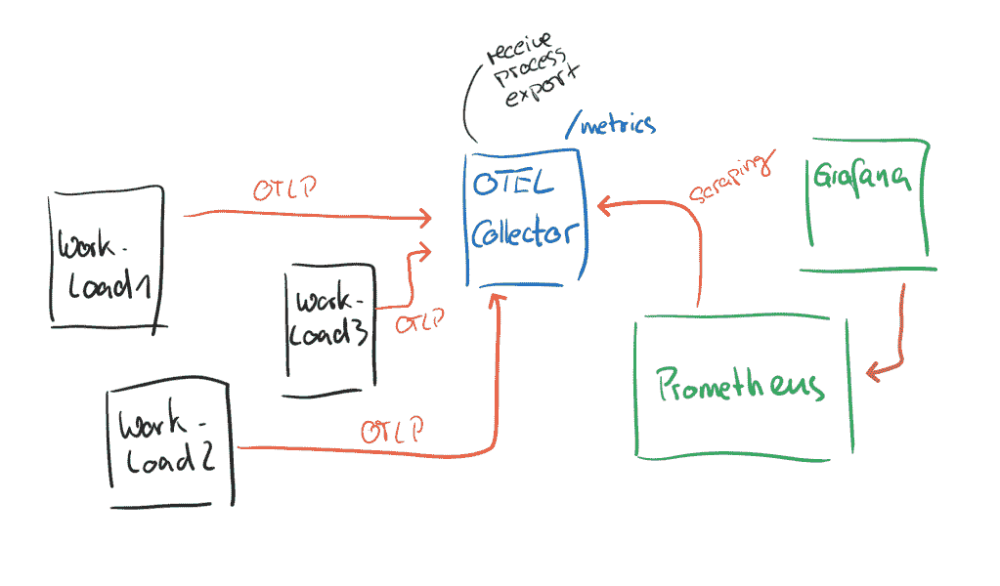
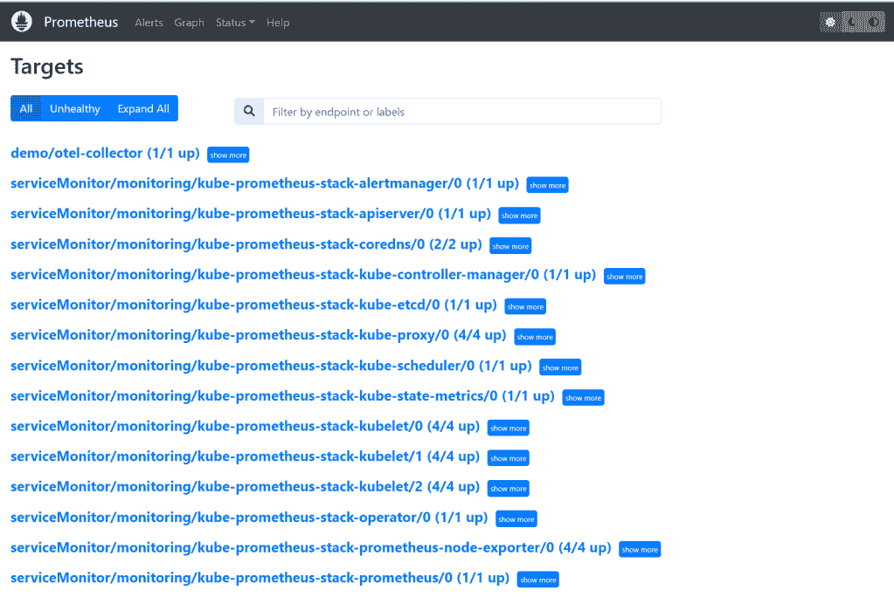
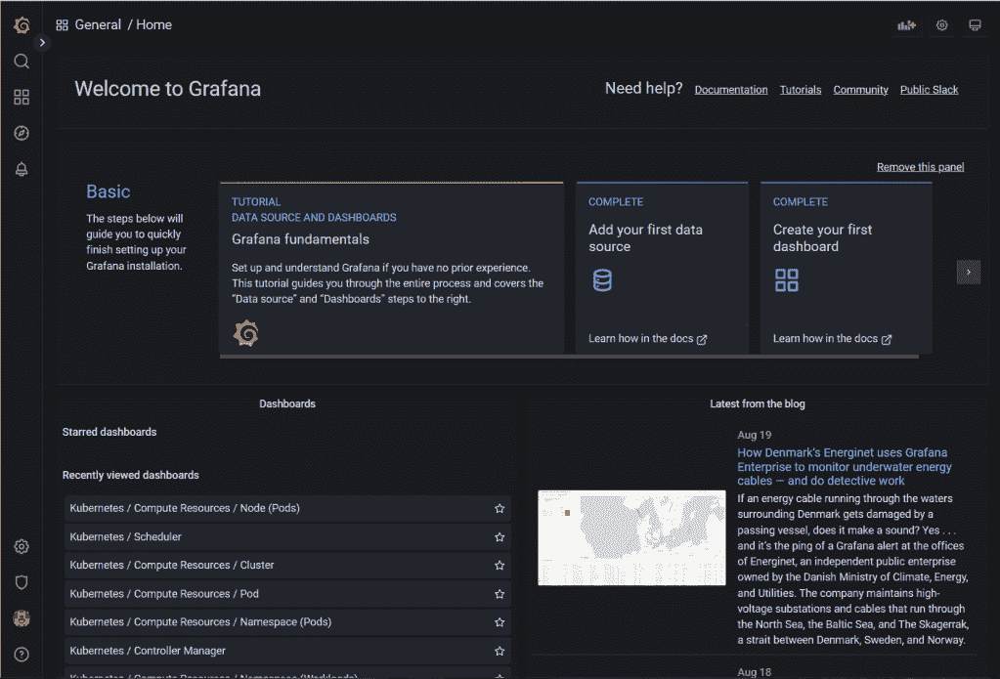
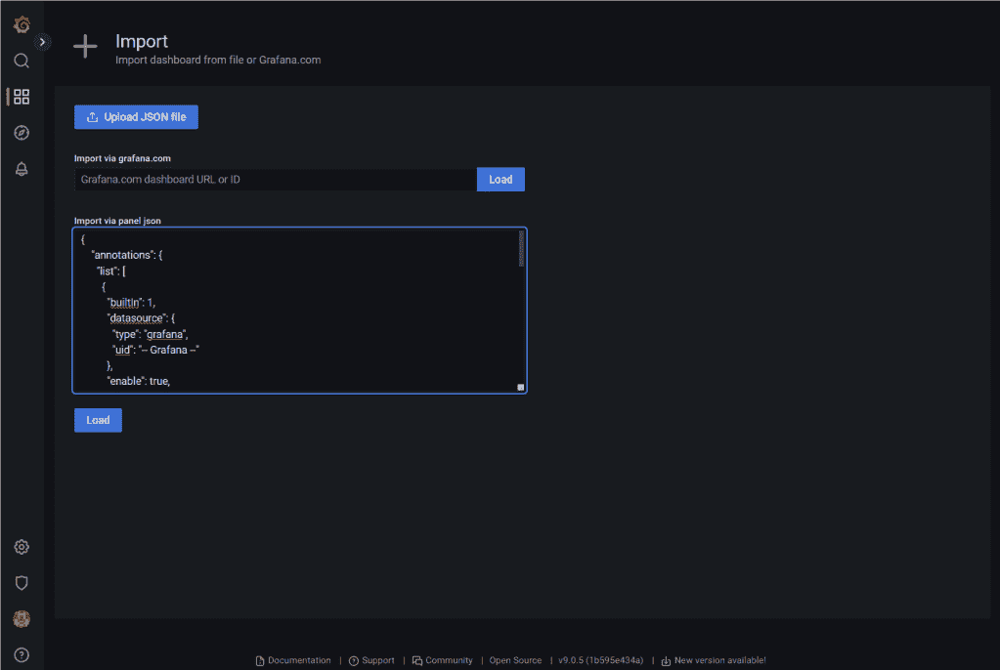
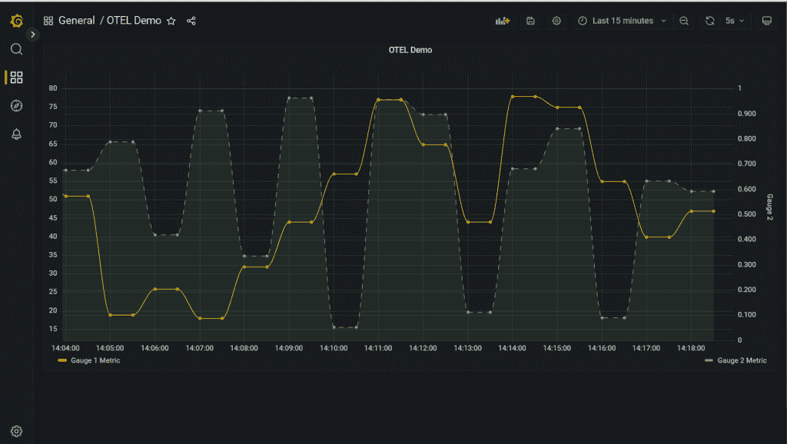

# 使用 open telemetry Collector & Prometheus/Grafana 的 ASP.NET 定制指标

> 原文：<https://itnext.io/asp-net-custom-metrics-with-opentelemetry-collector-prometheus-grafana-4b39b4a2b754?source=collection_archive---------2----------------------->

不时有人问我，在现代应用程序中应该使用哪种跟踪、日志记录或监控解决方案，因为可能性越来越大——至少，你可能会有这种感觉。为了尽可能灵活和依赖开放标准，建议更仔细地研究 OpenTelemetry。它变得越来越受欢迎，因为它提供了一个独立于供应商的解决方案，在您的服务中处理遥测数据，并将它们发送到您选择的后端(Prometheus、Jaeger 等)。).让我们看看如何在 space 服务中使用 OpenTelemetry 自定义指标，并结合云本地空间中可能最流行的监控堆栈:Prometheus / Grafana。

# TL；速度三角形定位法(dead reckoning)

你可以在 [GitHub](https://github.com/cdennig/otel-demo) 上找到演示项目。它使用一个本地 Kubernetes 集群([类](https://kind.sigs.k8s.io/))来设置环境，并部署一个生成一些样本指标的演示应用程序。这些指标被发送到作为 Prometheus 指标端点的 OTEL 收集器。最后，这些指标由 Prometheus 收集并显示在 Grafana 仪表板/图表中。



演示设置

# OpenTelemetry —它是什么，为什么您应该关注它？


开放式遥测

OpenTelemetry (OTEL)是一个开源的 CNCF 项目，旨在提供一个独立于供应商的解决方案，用于生成、收集和处理基础设施和服务的遥测数据。它能够接收、处理和导出跟踪、日志和指标到不同的后端，如[普罗米修斯](https://prometheus.io/)、[积家](https://www.jaegertracing.io/)或其他商业 SaaS 产品，而不需要您的应用程序依赖这些解决方案。虽然 OTEL 本身不提供后端甚至分析能力，但它充当了“中央监控组件”，知道如何通过使用所谓的“导出器”将收到的数据发送到不同的后端。

所以你为什么要在乎呢？在当今的分布式系统和微服务架构世界中，开发人员可以更快、更独立地发布软件和服务，可观察性成为您环境中最重要的特性之一。系统的可见性对于应用程序的成功至关重要，因为它有助于您扩展组件、发现错误和错误配置等。

如果您还没有决定在下一个应用中使用什么样的监控或跟踪解决方案，请查看 OpenTelemetry。它让您可以自由尝试不同的监控解决方案，甚至在生产后期替换您喜欢的方案。

# 打开遥测组件

OpenTelemetry 目前由几个组件组成，如用于接收、处理/转换和导出遥测数据的仪器和工具的[跨语言规范](https://opentelemetry.io/docs/reference/specification/)(API/SDK 和 OpenTelemetry 协议 OTLP)。SDK 有几种流行的语言版本，如 Java、C++、C#、Go 等。你可以在这里找到支持语言的完整列表[。](https://opentelemetry.io/docs/instrumentation/)

此外，还有一个名为“OpenTelemetry Collector”的组件，它是一个独立于供应商的代理，可以从不同的来源接收遥测数据，并在将数据发送到所需的后端解决方案之前对其进行转换。

让我们仔细看看收集器……*接收器、处理器*和*输出器*的组件:

*   *接收器*—open telemetry 中的接收器是负责将数据送入收集器的组件。它可以用于基于推或拉的方法。它可以支持 OLTP 协议，甚至可以抓取 Prometheus /metrics 端点
*   *处理器* —处理器是一种组件，在将采集器接收的遥测数据移交给*导出器*之前，可以对其进行批处理、采样、转换和/或丰富。您可以添加或删除属性，例如“个人身份信息”(PII)，或者基于正则表达式过滤数据。处理器是收集器管道中的可选组件。
*   *导出器* —导出器负责将数据发送到后端解决方案，如 Prometheus、Azure Monitor、DataDog、Splunk 等。

最终，它归结为配置带有接收者、(可选的)处理器和导出者的收集器服务，以形成一个功能齐全的收集器管道——官方文档可以在[这里](https://opentelemetry.io/docs/collector/configuration/)找到。此处演示的配置如下:

```
receivers:
  otlp:
    protocols:
      http:
      grpc:
processors:
  batch:
exporters:
  logging:
    loglevel: debug
  prometheus:
    endpoint: "0.0.0.0:8889"
service:
  pipelines:
    metrics:
      receivers: [otlp]
      processors: [batch]
      exporters: [logging, prometheus]
```

该配置包括:

*   一个开放式遥测协议(OTLP)接收器，用于 *http* 和 *gRPC* 通信
*   一个处理器，用默认值(例如 200 毫秒的`timeout`)批量处理遥测数据
*   两个导出器将数据传输到控制台(`logging`)，并在`0.0.0.0:8889`上暴露一个普罗米修斯`/metrics`端点(远程写入也是可能的)

# ASP。网络开放遥测

为了演示如何通过 OpenTelemetry 将自定义指标从 ASP.NET 应用程序发送到 Prometheus，我们首先需要一个公开这些指标的服务。在这个演示中，我们简单地创建了两个自定义指标`otel.demo.metric.gauge1`和`otel.demo.metric.gauge2`，它们将被发送到控制台(`AddConsoleExporter()`)并通过 OTLP 协议发送到一个收集服务程序(`AddOtlpExporter()`)，我们将在后面介绍这个收集服务程序。该应用程序使用 ASP.NET 最小 API，代码或多或少是不言自明的:

```
using System.Diagnostics.Metrics;
using OpenTelemetry.Resources;
using OpenTelemetry.Metrics;

var builder = WebApplication.CreateBuilder(args);

builder.Services.AddOpenTelemetryMetrics(metricsProvider =>
{
    metricsProvider
        .AddConsoleExporter()
        .AddOtlpExporter()
        .AddMeter("otel.demo.metric")
        .SetResourceBuilder(ResourceBuilder.CreateDefault()
            .AddService(serviceName: "otel.demo", serviceVersion: "0.0.1")
        );
});

var app = builder.Build();
var otel_metric = new Meter("otel.demo.metric", "0.0.1");
var randomNum = new Random();
// Create two metrics
var obs_gauge1 = otel_metric.CreateObservableGauge<int>("otel.demo.metric.gauge1", () =>
{
    return randomNum.Next(10, 80);
});
var obs_gauge2 = otel_metric.CreateObservableGauge<double>("otel.demo.metric.gauge2", () =>
{
    return randomNum.NextDouble();
});

app.MapGet("/otelmetric", () =>
{
    return "Hello, Otel-Metric!";
});

app.Run();
```

我们目前正在处理自定义指标。当然，ASP.NET 也提供了现成的指标供您使用。在配置指标提供者时，只需通过添加`AddAspNetCoreInstrumentation**()**`来使用 ASP.NET 工具特性——更多信息请点击[这里](https://github.com/open-telemetry/opentelemetry-dotnet-instrumentation)。

# 演示

是时候把事情联系起来了。首先，让我们使用创建一个 Kubernetes 集群，在这里我们可以发布演示服务，启动 OTEL 收集器实例并运行一个 Prometheus/Grafana 环境。如果你想跟随教程，从[https://github.com/cdennig/otel-demo](https://github.com/cdennig/otel-demo)克隆回购，并切换到`otel-demo`目录。

# 创建一个本地 Kubernetes 集群

要创建一个能够托管 Prometheus 环境的`kind`集群，请执行:

```
$ kind create cluster --name demo-cluster \ 
     --config ./kind/kind-cluster.yaml
```

YAML 配置文件(`./kind/kind-cluster.yaml`)调整 Kubernetes 控制平面的一些设置，以便 Prometheus 能够抓取控制器服务的端点。接下来，创建 OpenTelemetry 收集器实例。

# OTEL 收藏家

在`manifests`目录中，您会发现两个 Kubernetes 清单。一个包含收集器的配置(`otel-collector.yaml`)。它包括收集器配置的`ConfigMap`(它将作为一个卷安装到收集器容器中)，收集器本身的部署和一个公开数据接收端口的服务(`4318`用于`http`和`4317`用于`gRPC`)以及稍后将由 Prometheus 收集的指标端点(`8889`)。它看起来如下:

```
apiVersion: v1

kind: ConfigMap
metadata:
  name: otel-collector-config
data:
  otel-collector-config: |-
    receivers:
      otlp:
        protocols:
          http:
          grpc:
    exporters:
      logging:
        loglevel: debug
      prometheus:
        endpoint: "0.0.0.0:8889"
    processors:
      batch:
    service:
      pipelines:
        metrics:
          receivers: [otlp]
          processors: [batch]
          exporters: [logging, prometheus]
---
apiVersion: apps/v1
kind: Deployment
metadata:
  name: otel-collector
  labels:
    app: otel-collector
spec:
  replicas: 1
  selector:
    matchLabels:
      app: otel-collector
  template:
    metadata:
      labels:
        app: otel-collector
    spec:
      containers:
        - name: collector
          image: otel/opentelemetry-collector:latest
          args:
            - --config=/etc/otelconf/otel-collector-config.yaml
          ports:
            - name: otel-http
              containerPort: 4318
            - name: otel-grpc
              containerPort: 4317
            - name: prom-metrics
              containerPort: 8889
          volumeMounts:
            - name: otel-config
              mountPath: /etc/otelconf
      volumes:
        - name: otel-config
          configMap:
            name: otel-collector-config
            items:
              - key: otel-collector-config
                path: otel-collector-config.yaml
---
apiVersion: v1
kind: Service
metadata:
  name: otel-collector
  labels:
    app: otel-collector
spec:
  type: ClusterIP
  ports:
    - name: otel-http
      port: 4318
      protocol: TCP
      targetPort: 4318
    - name: otel-grpc
      port: 4317
      protocol: TCP
      targetPort: 4317
    - name: prom-metrics
      port: 8889
      protocol: TCP
      targetPort: prom-metrics
  selector:
    app: otel-collector
```

让我们应用清单。

```
$ kubectl apply -f ./manifests/otel-collector.yaml

configmap/otel-collector-config created
deployment.apps/otel-collector created
service/otel-collector created
```

检查一切是否按预期运行:

```
$ kubectl get pods,deployments,services,endpoints

NAME                                  READY   STATUS    RESTARTS   AGE
pod/otel-collector-5cd54c49b4-gdk9f   1/1     Running   0          5m13s

NAME                             READY   UP-TO-DATE   AVAILABLE   AGE
deployment.apps/otel-collector   1/1     1            1           5m13s

NAME                     TYPE        CLUSTER-IP     EXTERNAL-IP   PORT(S)                      AGE
service/kubernetes       ClusterIP   10.96.0.1      <none>        443/TCP                      22m
service/otel-collector   ClusterIP   10.96.194.28   <none>        4318/TCP,4317/TCP,8889/TCP   5m13s

NAME                       ENDPOINTS                                         AGE
endpoints/kubernetes       172.19.0.9:6443                                   22m
endpoints/otel-collector   10.244.1.2:8889,10.244.1.2:4318,10.244.1.2:4317   5m13s
```

既然 OpenTelemetry 基础设施已经就绪，让我们添加暴露定制指标的工作负载。

# ASP。净工作量

为了您的方便，演示应用程序已经被容器化并发布到 GitHub 容器注册中心。因此，要向集群添加工作负载，只需应用包含`Deployment`清单的`./manifests/otel-demo-workload.yaml`，并添加两个环境变量来配置 OTEL 收集器端点和要使用的 OTLP 协议——在本例中是`gRPC`。

相关部分如下:

```
spec:
  containers:
  - image: ghcr.io/cdennig/otel-demo:1.0
    name: otel-demo
    env:
    - name: OTEL_EXPORTER_OTLP_ENDPOINT
      value: "[http://otel-collector.default.svc.cluster.local:4317](http://otel-collector.default.svc.cluster.local:4317)"
    - name: OTEL_EXPORTER_OTLP_PROTOCOL
      value: "grpc"
```

立即应用清单。

```
$ kubectl apply -f ./manifests/otel-demo-workload.yaml
```

请记住，应用程序也会记录到控制台。让我们查询 ASP.NET 服务的日志(注意，在您的环境中，podname 会有所不同)。

```
$ kubectl logs po/otel-workload-69cc89d456-9zfs7

info: Microsoft.Hosting.Lifetime[14]
      Now listening on: [http://[::]:80](http://[::]:80)
info: Microsoft.Hosting.Lifetime[0]
      Application started. Press Ctrl+C to shut down.
info: Microsoft.Hosting.Lifetime[0]
      Hosting environment: Production
info: Microsoft.Hosting.Lifetime[0]
      Content root path: /app/
Resource associated with Metric:
    service.name: otel.demo
    service.version: 0.0.1
    service.instance.id: b84c78be-49df-42fa-bd09-0ad13481d826

Export otel.demo.metric.gauge1, Meter: otel.demo.metric/0.0.1
(2022-08-20T11:40:41.4260064Z, 2022-08-20T11:40:51.3451557Z] LongGauge
Value: 10

Export otel.demo.metric.gauge2, Meter: otel.demo.metric/0.0.1
(2022-08-20T11:40:41.4274763Z, 2022-08-20T11:40:51.3451863Z] DoubleGauge
Value: 0.8778815716262417

Export otel.demo.metric.gauge1, Meter: otel.demo.metric/0.0.1
(2022-08-20T11:40:41.4260064Z, 2022-08-20T11:41:01.3387999Z] LongGauge
Value: 19

Export otel.demo.metric.gauge2, Meter: otel.demo.metric/0.0.1
(2022-08-20T11:40:41.4274763Z, 2022-08-20T11:41:01.3388003Z] DoubleGauge
Value: 0.35409627617124295
```

同样，让我们检查数据是否将被发送到收集器。记住它在`0.0.0.0:8889/metrics`上公开了它的`/metrics`端点。让我们通过将服务端口转发到本地机器来查询它。

```
$ kubectl port-forward svc/otel-collector 8889:8889

Forwarding from 127.0.0.1:8889 -> 8889
Forwarding from [::1]:8889 -> 8889

# in a different session, curl the endpoint
$  curl [http://localhost:8889/metrics](http://localhost:8889/metrics)

# HELP otel_demo_metric_gauge1
# TYPE otel_demo_metric_gauge1 gauge
otel_demo_metric_gauge1{instance="b84c78be-49df-42fa-bd09-0ad13481d826",job="otel.demo"} 37
# HELP otel_demo_metric_gauge2
# TYPE otel_demo_metric_gauge2 gauge
otel_demo_metric_gauge2{instance="b84c78be-49df-42fa-bd09-0ad13481d826",job="otel.demo"} 0.45433988869946285
```

太好了，两个组件——指标生成器和收集器——都正常工作。现在，让我们启动 Prometheus/Grafana 环境，添加服务监视器来抓取`/metrics`端点并为其创建 Grafana 仪表板。

# 添加 Kube-Prometheus-Stack

将 Prometheus/Grafana stack 添加到您的 Kubernetes 集群的最简单方法是使用[kube-Prometheus-stack](https://github.com/prometheus-community/helm-charts/tree/main/charts/kube-prometheus-stack)Helm chart。我们将使用一个定制的`values.yaml`文件为名为`demo/otel-collector`的 OTEL 收集器自动添加静态 Prometheus 目标(仅在`kind`环境中需要`kubeEtc`配置):

```
kubeEtcd:
  service:
    targetPort: 2381
prometheus:
  prometheusSpec:
    additionalScrapeConfigs:
    - job_name: "demo/otel-collector"
      static_configs:
      - targets: ["otel-collector.default.svc.cluster.local:8889"]
```

现在，通过执行以下命令将舵图添加到集群中:

```
$ helm upgrade --install --wait --timeout 15m \
  --namespace monitoring --create-namespace \
  --repo [https://prometheus-community.github.io/helm-charts](https://prometheus-community.github.io/helm-charts) \
  kube-prometheus-stack kube-prometheus-stack --values ./prom-grafana/values.yaml

Release "kube-prometheus-stack" does not exist. Installing it now.
NAME: kube-prometheus-stack
LAST DEPLOYED: Mon Aug 22 13:53:58 2022
NAMESPACE: monitoring
STATUS: deployed
REVISION: 1
NOTES:
kube-prometheus-stack has been installed. Check its status by running:
  kubectl --namespace monitoring get pods -l "release=kube-prometheus-stack"
```

让我们来看看 Prometheus 目标，如果 Prometheus 可以抓取 OTEL 收集器端点—同样，将服务转发到您的本地机器，并在[http://localhost:9090/targets](http://localhost:9090/targets)打开浏览器。

```
$ kubectl port-forward -n monitoring svc/kube-prometheus-stack-prometheus 9090:9090
```



普罗米修斯目标

这看起来和预期的一样，现在转到 Grafana 并创建一个显示定制指标的仪表板。如前所述，将 Grafana 服务端口转发到您的本地机器，并在 [http://localhost:3000](http://localhost:3000) 打开一个浏览器。因为您需要用户名/密码组合来登录 Grafana，所以我们首先需要从 Kubernetes secret 中获取该信息:

```
# Grafana admin username
$ kubectl get secret -n monitoring kube-prometheus-stack-grafana -o jsonpath='{.data.admin-user}' | base64 --decode

# Grafana password
$ kubectl get secret -n monitoring kube-prometheus-stack-grafana -o jsonpath='{.data.admin-password}' | base64 --decode

# port-forward Grafana service
$ kubectl port-forward -n monitoring svc/kube-prometheus-stack-grafana 3000:80

Forwarding from 127.0.0.1:3000 -> 3000
Forwarding from [::1]:3000 -> 3000
```

在 [http://localhost:3000](http://localhost:3000) 打开浏览器并成功登录后，您应该会看到 Grafana 欢迎页面。



Grafana 欢迎页面

# 为自定义指标添加仪表板

转到[http://localhost:3000/dashboard/import](https://partlycloudy.blog/2022/08/22/asp-net-custom-metrics-with-opentelemetry-collector-prometheus-grafana/3000/dashboard/import)，从`./prom-grafana/dashboard.json`上传预先创建的仪表板(或者简单地将其内容粘贴到文本框中)。导入定义后，您应该会被重定向到仪表板，并看到显示的自定义指标。



导入 Grafana 仪表板



具有仪表 1 和仪表 2 指标的图表

# 总结

该演示展示了如何在 ASP.NET 服务中使用 OpenTelemetry 自定义指标，将遥测数据发送到由 Prometheus 实例收集的 OTEL 收集器实例。为了结束这个循环，这些定制指标最终会显示在 Grafana 仪表板中。这种解决方案的优点是，您可以使用 OpenTelemetry 这样的通用解决方案来生成和收集指标。通过 OTEL 导出器配置，可以轻松地交换数据最终发送到哪个服务以及使用哪个解决方案来分析数据——如果您不想使用 Prometheus，您只需修改 OTEL 管道并将遥测数据导出到 Azure Monitor 或 DataDog、Splunk 等。

我希望这个演示已经很好地向您介绍了 OpenTelemetry 世界。编码快乐！🙂

*原载于 2022 年 8 月 22 日*[*http://partly cloudy . blog*](https://partlycloudy.blog/2022/08/22/asp-net-custom-metrics-with-opentelemetry-collector-prometheus-grafana/)*。*