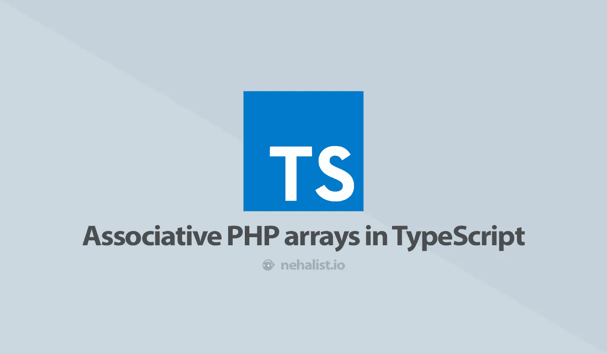

# TypeScript 中的关联 PHP 数组

> 原文：<https://itnext.io/associative-php-arrays-in-typescript-49cffc5a2051?source=collection_archive---------5----------------------->



PHP 中关联数组的概念有点不常见；大多数语言用地图、列表、字典或类似的结构来实现这个概念。而且，即使 PHP 中的关联数组是可能的(并且被大量使用)，但是一旦您想在 JSON API 中使用它们，它们就会变得有点混乱。

# JSON 中的关联数组

让我们看看 JSON 响应中的关联数组会发生什么。

```
$data = []; 
// Becomes [] in JSON$data = ["one", "two", "three"];
// Becomes ["one", "two, "three"] in JSON$data = [0 => "foo", 137 => "bar"];
// Becomes { "0": "foo", "137": "bar" } in JSON$data = ["foo", 3 => "bar", "hello" => "world"];
// Becomes { "0": "foo", "3": "bar", "hello": "world" } in JSON
```

正如您所看到的，JSON 中只有“真正的”数组才是数组，而关联项将数组转化为对象。

# 合适的类型

因为关联数组要么成为一个对象，要么成为一个数组，所以正确的类型应该是`object | []`。这实际上很简单，但是我们可以通过为关联数组引入我们自己的类型来做得更好——包括一个泛型来获取关于数组元素类型的信息。

```
type AssociativeArray<T = unknown> = {[key: string]: T | undefined} | T[];
```

`T`最终可能会被省略，但是为我们的数组提供了额外的类型信息。

这个[联合类型](https://www.typescriptlang.org/docs/handbook/advanced-types.html#union-types)告诉 TypeScript，我们要么处理一个由键-值对组成的对象，其中键是一个字符串，值是类型`T`、**或**一个包含元素`T`的简单数组(也包括空数组)。这听起来可能有点复杂，但是如果我们再看一个例子，一切都应该清楚了(假设`getData`从我们的 API 中检索数据):

```
// $data = [];
const data: AssociativeArray = getData(); 
// not specifying `T` means that the type remains unknown// $data = ["one", "two", "three"];
const data: AssociativeArray<string> = getData();
data[0]; // equals "one"
data[1].toFixed(); // error: `toFixed` does not exist on strings!// $data = [0 => "foo", 137 => "bar"];
const data: AssociativeArray<string> = getData();
data[0]; // equals "foo"
data[137]; // equals "bar"// $data = ["foo", 3 => "bar", "hello" => "world"]
const data: AssociativeArray<string> = getData();
data["0"]; // equals "foo"
data["3"]; // equals "bar"
data["hello"]; // equals "world"
data["hello"].toFixed(); // error: `toFixed` does not exist on strings!// $data = [1, 2, 3]
const data: AssociativeArray<number> = getData();
data[0]; // equals 1// $data = [[], [1, 2, 3]]
const data: AssociativeArray<number[]> = getData();
data[0]; // equals []
data[1]; // equals [1, 2, 3]
data[1][0]; // equals 1
data[1][0].substr(0, 5); // error: `substr` does not exist on numbers!
```

多亏了这个泛型，我们很容易就能知道数组里面有什么。

# 地图

正如开始时提到的，许多语言以映射(或列表，或任何你想叫它们的东西)的形式实现关联数组。[JavaScript](https://developer.mozilla.org/en-US/docs/Web/JavaScript/Reference/Global_Objects/Map)中也存在映射，因此我们也可以通过简单地使用`Object.entries`将我们的 JSON 响应转换成映射:

```
// Data from our API
const data =  {
  "foo": "bar",
  "hello": "world"
};const map = new Map<string, string>(Object.entries(data));map.get('foo'); // equals "bar"
map.get('hello'); // equals "world"
```

TypeScript 中的映射是通用的，允许我们指定键**和**值的类型

如果你喜欢这篇文章，请留下👏，关注我上 [*推特*](https://twitter.com/nehalist) *并订阅* [*我的快讯*](https://nehalist.io/newsletter/) *。原载于 2019 年 6 月 24 日*[*https://nehalist . io*](https://nehalist.io/associative-php-arrays-in-typescript)*。*