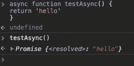
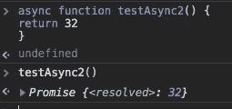
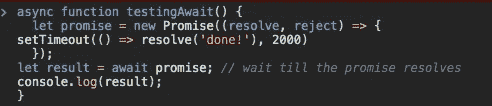
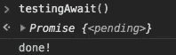
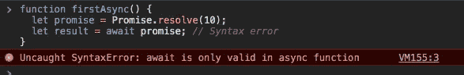

# JavaScript 中的 Async 和 Await，是对承诺的扩展。

> 原文：<https://itnext.io/async-and-await-in-javascript-the-extension-to-a-promise-f4e0048964ac?source=collection_archive---------0----------------------->

学习 JavaScript 中的承诺是我发现学习起来非常有趣的基础之一。我一直在练习面试问题，JavaScript 承诺是一个热门话题。在这段旅程中，我遇到了 Async 和 wait，它们是承诺的扩展，允许我们编写更干净、更可读的代码。如果你不知道什么是承诺，请看看我的另一篇文章[什么是真正的承诺？](https://medium.com/@mattdoering86/what-is-a-promise-really-9074e7526ec3)

via [giphy](https://giphy.com/gifs/life-interesting-footage-ZVik7pBtu9dNS/links)

# **异步**

我们可以从可以放在函数前面的特殊关键字 async 开始。该函数将通过事件循环异步操作一个函数，使用隐式承诺返回其结果。如果你需要一个事件循环的复习，看看这个非常棒的[视频](https://www.youtube.com/watch?v=8aGhZQkoFbQ)！一个异步函数仅仅意味着一个承诺将被返回，如果一个承诺没有被返回，JavaScript 将自动把它包装在一个解析的承诺中，返回值在那个函数中。这看起来就像写 return Promise.resolve('hello ')。您可以简单地通过将 async 关键字放在您正在创建的函数前面来编写一个异步函数。



您可以在上面看到，运行代码会给出一个承诺的输出以及异步函数中返回的值。你也可以明确地回复一个承诺，和下面写的一样。

```
async function foo() {
 return Promise.resolved('hello');
}foo().then(alert); // hello
```

很酷，async 关键字允许我们编写一个函数，返回一个承诺，并在其中包装一个非承诺。

# **等待**

关键字 await 用于等待承诺。它只能在异步函数中使用。这个关键字让 JavaScript 一直等到这个承诺实现并返回结果。这里有一个例子，承诺在 2 秒内解决。



与使用 promise.then 相比，这是一种更好的获得 promise 结果的方式。现在，我们可以将一个只使用 fetch 关键字的函数转换成一个异步函数，并看看它在清晰度上有什么不同。

```
function jsonData(url) {
  return fetch(url)
    .then(res => {
      if (res.status == 200) {
        return res.json();
      } else {
        throw new Error(res.status);
      }
    });
}

jsonData('non') /
  .catch(alert); // Error: 404
```

这可以使用 await 更新为下面的异步函数。

```
async function jsonData(url) { // (1)
  let res = await fetch(url); // (2)

  if (res.status == 200) {
    let json = await res.json(); // (3)
    return json;
  }

  throw new Error(res.status);
}

jsonData('no-such-user.json')
  .catch(alert); // Error: 404 (4)
```

# 需要注意的重要事项

不能在常规函数中使用 await 关键字。这将导致语法错误。Await 只需要在异步函数中使用。



尽管我们现在可以让代码看起来同步，但重要的是要记住执行仍然是异步的！这一点很重要，因为如果使用不当，会显著增加执行时间。下面的两个例子展示了使用异步函数的正确方法。如果我们在每个单独的函数上使用 await，JavaScript 编译器将在执行第二个函数之前等待第一个函数被解析。事件循环的要点是避免像第一个例子那样阻塞代码。如果我们需要等待多个承诺，我们可以将它们包装在一个 Promise.all 中，然后在 Promise 关键字之前使用 await。

```
// This would be the bad way to do this as you are blocking b from running until the a function returns. 
const makeSomething = async() => {
 const a = await getSomething('apples')
 const b = await getSomething('strawberry')
  return [a, b]
}// This is how you would allow your functions to run simultaneously 
const makeSomething = async() => {
 const a = getSomething(‘apples’)
 const b = getSomething(‘strawberry’)
   const result = await Promise.all([a, b]) return result;
}// wrapping our fetch in a Promise.all would allow them to run concurrently. 
let results = await Promise.all([
  fetch(url1),
  fetch(url2),
]);
```

# 结论

Async / await 允许我们编写读起来像同步代码的异步代码。当处理承诺时，它允许一些更好的可读性！为了在标记为 async 的函数中进行重述，可以将 await 关键字放在返回承诺的表达式前面。当您这样做时，异步函数的执行会暂停，直到承诺被解析。

# 参考

请检查所有写这篇博客的材料。有很多很棒的资料可以让你了解更多关于这种良好的语法糖方法的承诺和异步 JavaScript。

[](https://developer.mozilla.org/en-US/docs/Web/JavaScript/Reference/Statements/async_function) [## 异步功能

### 异步函数声明定义了一个异步函数，该函数返回一个异步函数对象。

developer.mozilla.org](https://developer.mozilla.org/en-US/docs/Web/JavaScript/Reference/Statements/async_function) [](https://javascript.info/async-await) [## 异步/等待

### 有一种特殊的语法以更舒适的方式处理承诺，称为“async/await”。令人惊讶的是…

javascript.info](https://javascript.info/async-await) [](https://hackernoon.com/javascript-async-await-the-good-part-pitfalls-and-how-to-use-9b759ca21cda) [## JavaScript async/await:优点、缺陷和使用方法

### ES7 引入的 async/await 是 JavaScript 异步编程的一个巨大改进。它提供了…

hackernoon.com](https://hackernoon.com/javascript-async-await-the-good-part-pitfalls-and-how-to-use-9b759ca21cda)