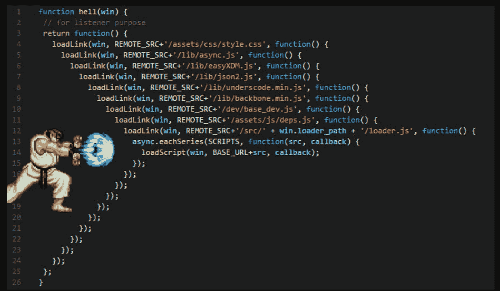
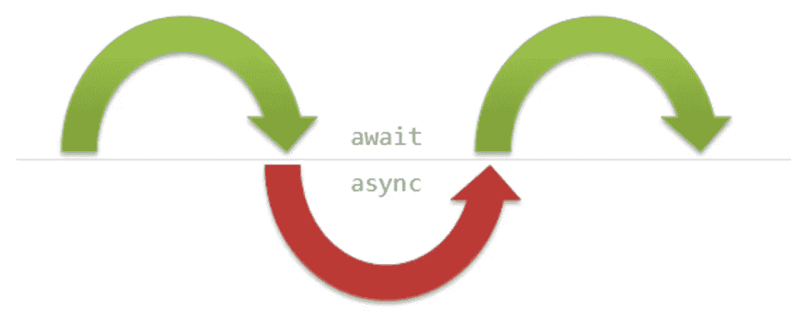

# 通向未来的异步方式

> 原文：<https://itnext.io/async-way-to-the-future-e299b4e0551b?source=collection_archive---------0----------------------->



让我们从 JS 中的异步操作开始，只是为了认识到异步一直在发生。所以，欢迎来到延时操作的美好世界。

JavaScript 程序几乎总是被分成几个部分，第一部分现在运行，下一部分稍后运行，以响应一个事件。尽管程序是一部分一部分地执行的，但它们都共享程序范围和状态。每当有事件要运行时， [*事件循环*](https://developer.mozilla.org/en/docs/Web/JavaScript/EventLoop) 就会运行，直到队列为空。In queue 包含用户交互处理程序、定时器事件、输入/输出操作等代码块。

但是在具体的时刻，一次只能从队列中处理一个事件。当一个事件正在执行时，它可能会引发一些后续事件。但是从高层次的角度来看，这些事件似乎是同时运行的，这被称为并发。在许多语言中，这个问题是通过同步和锁定代码的敏感部分来解决的。如此复杂的行为往往需要某种形式的交互协调来防止这种“竞态条件”。

## 复试


回调是 JS 中异步的基本单位。回调是描述现在应该做什么，以及在某种情况下以后应该做什么的最简单的方式。这种方法有几个缺点，尤其是在大型项目中。

1.  我们的大脑以顺序的、阻塞的、单线程的语义方式思考，但是回调以一种相当非线性的方式表达异步流，这使得对这样的代码进行正确的推理更加困难。我们需要一种方法，像我们的大脑一样，以更加同步、有序、阻塞的方式来表达异步。
2.  回调受到*控制反转的影响。它通常将控制权交给某个第三方库来调用你的程序的延续。这给我们带来了一系列令人不安的信任问题，比如回调被调用的次数是否比我们预期的要多。*

回调是我们长期做大事的武器，但是*未来*需要更加复杂和易于维护的模式。

但是如果我们能取消反转控制 的 [*反转会怎么样呢？如果我们不是将程序的延续交给另一方，而是期望它返回给我们一种能力，让我们知道它的任务何时完成，然后我们的代码可以决定下一步做什么，会怎么样？*](https://msdn.microsoft.com/en-us/library/ff921087.aspx)

## 承诺


promise——它是一个特殊的对象，包含关于自身状态的信息。最初，它具有*挂起*状态，在— *满足*或*拒绝*之后(取决于包含逻辑)。因此，您可以添加两种类型的回调:

```
 Promise         +----------+
+-------+        |fulfilled |
|pending|   =>   +----------+
+-------+        | rejected |
                 +----------+
```

承诺创建的主要语法

```
var promise = new Promise(function(resolve, reject) {
  // This function will be executed automatically
  // It's body may contain any async code. After successful
  // completion *resolve* should be called, after error - *reject*.
}).then(
  onFulfilled, // callback triggered if *resolve* action
  onRejected // callback triggered if *reject* action
);
```

它们并没有摆脱回调，只是将回调的编排重定向到一个位于我们和另一个实用程序之间的可信中介机制。

Promise 链向我们展示了在聚合数据序列中表达异步流的更好方式。这是我们大脑计划和维持延迟操作的一种常见方式。

但这不是结束。承诺成为了非常有趣的异步模式的基础，比如 [*异步/await*](https://developer.mozilla.org/en-US/docs/Web/JavaScript/Reference/Statements/async_function) 。

## 异步函数



有很多关于用 async/await 代替 promises 的传言。我们应该在开发过程中使用它吗？

规格 **ES2015** 内的所有特性可在 [*此处*](http://es6-features.org/#Constants) 查看。这个规范命名为 ES6。有时人们认为 ES6 中没有的东西都是 ES7 特性的一部分。是对周围事物的错误理解。你可以在这里找到关于 ES2016 [包含哪些内容的信息。所以一般只包含两个主要特性:*取幂运算符* ****** 和*array . prototype . includes*。而且完全没有提到这个列表中的 *async/await* 。](http://2ality.com/2016/01/ecmascript-2016.html)

那么，async/await 一般是什么？一般来说——这是一个**承诺**。

当你将一个函数标记为 async 时，它的返回值是一个承诺值。每一件东西，里面都标有 await，应该返回承诺值。这一时刻对于理解 async/await 主要原理至关重要。

```
export function getPayload = **async** (url) => {
  const {payload, success} = **await** fetch(url);
  if (success) {
    dispatch({type: 'SUCCESS'});
  } else {
    dispatch({type: 'FAILURE'});
  }
}
```

## 它是如何工作的

这里的要点是定义一个带有异步标志的函数，它不仅适用于一般函数，也适用于箭头函数、类、静态函数。主体中提到的 wait 标志表示主代码应该等待，直到某个事件发生。它应该是异步标记之前的承诺，应该被解决或拒绝。只有在这段主代码继续运行之后。Await 的作用与`.then`函数对 Promise 的作用完全相同。但是这种方法的主要好处是我们不需要任何回调来处理返回值。这给人一种使用同步代码的感觉。

这种同步的外观让你感觉很自然，你在家里就可以到处使用[](https://developer.mozilla.org/en-US/docs/Web/JavaScript/Reference/Statements/try...catch)***(这其实是真的)。这是捕捉错误的唯一方法。***

## **[为什么更好？](https://hackernoon.com/6-reasons-why-javascripts-async-await-blows-promises-away-tutorial-c7ec10518dd9)**

1.  ****简洁干净**。我们不必编写`.then`，创建一个匿名函数来处理响应，或者给一个我们不需要使用的变量起一个名字`data`。我们也避免嵌套我们的代码。**
2.  ****错误处理**。Async/await 使得用同一个构造处理同步和异步错误成为可能，古老的`try/catch`。**
3.  ****条件句。**构造条件逻辑要干净得多，在回调中实现它。所有筑巢的地狱。**
4.  ****中间值。**只需放入一个断点，就可以方便地操作中间异步数据。而且你可以确定代码会在那里停止(不是作为承诺的箭头函数回调)。**
5.  ****错误堆栈。**从承诺链返回的错误堆栈没有给出错误发生的线索。更糟糕的是，这是一种误导。然而，来自 async/await 的错误堆栈指向包含错误的函数。**
6.  ****调试。**有时，使用开发者工具按钮，如步入、步出、步出等，是捕捉 bug 的好机会。您可以通过 async/away 方法充分利用它们。但是当你用承诺的时候它们就没用了。**

**如果呢？…**

## ****等待失踪****

```
****async** function get(a) {
  return a;
}
get('hi'); // 'hi'
// behaves completely in sync way, just returns a**
```

## **顺序**

```
****async** function getResult() {
  const names = **await** getNames(); // wait till resolve
  const statuses = **await** getStatusesFor(names); // wait till resolve
  return statuses;
}
getResult();
// first waits for resolving getNames continue to run
// then resolving getStatusesFor, after resolving returns result
// such code will be executed step by step**
```

## **平行的**

```
****async** getAggregatedData() {
  const [names, profiles] = **await** Promise.all([getNames(), getProfiles()]);
  return {names, profiles};
}**
```

## **现代浏览器**

****

**在现代浏览器中，大约 93%-99%的 ES2015 实现已经完成(Safari 现在是[和](https://kangax.github.io/compat-table/es6/)的领导者)。当你开始一个新项目时，这是一个好兆头。但是，不幸的是，对于 async/await 实现，您总是需要使用外部工具(如 Babel)来编译这样的代码。有时这会增加多余的复杂性。使用 [*生成器*](https://medium.com/javascript-scene/the-hidden-power-of-es6-generators-observable-async-flow-control-cfa4c7f31435) 可以有效解决大多数异步问题。但这是一个不同的故事。**

## **NodeJS**

**它是在 v.7.6 中正式引入的。所以，是时候开箱即用了:)**