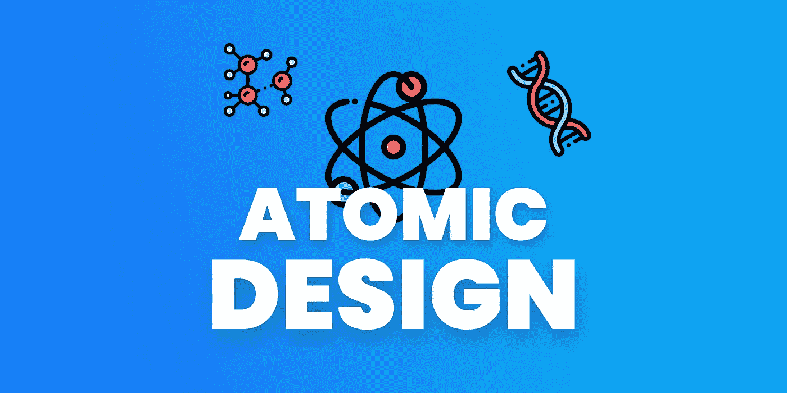
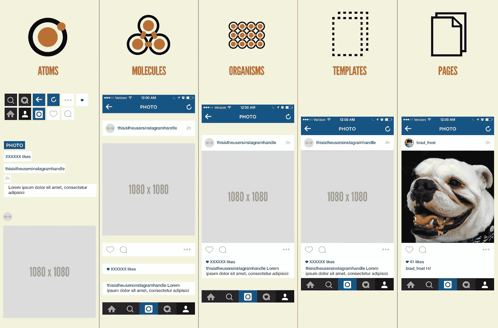
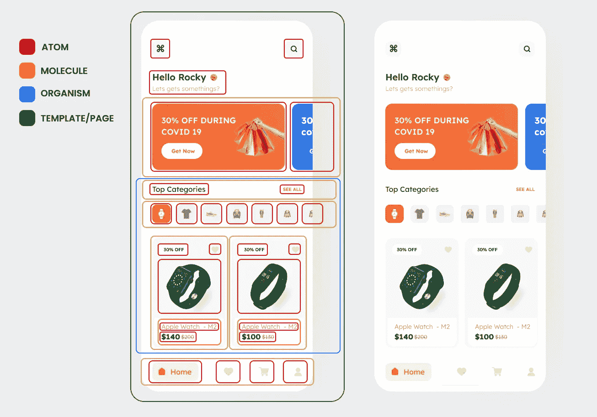
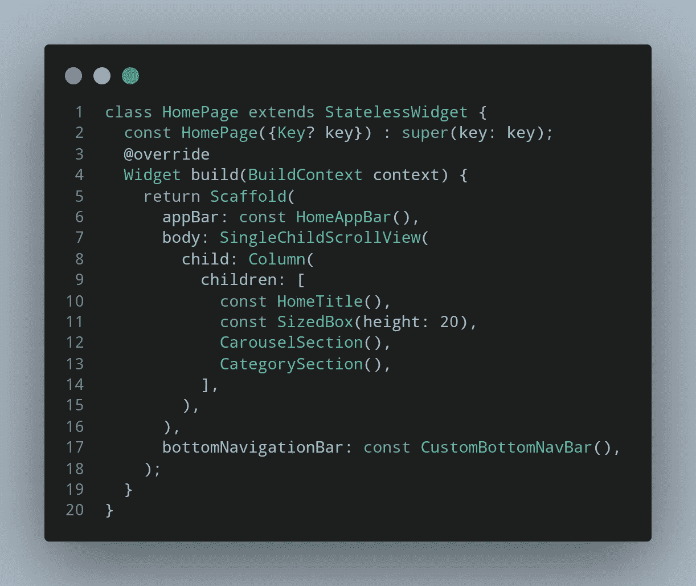

# 颤动原子设计

> 原文：<https://itnext.io/atomic-design-with-flutter-11f6fcb62017?source=collection_archive---------2----------------------->

## 管理 IU 设计的好方法

即使这是 React Native 中一个非常受欢迎的话题，但 Flutter 开发人员对此了解不多。所以这就是为什么我想谈论它，让人们更加关注它，并展示如何在 Flutter 中实现它

## 什么是原子设计？

原子设计是一种创建设计系统的方法。

> 我们不是在设计页面，而是在设计组件系统。——[*斯蒂芬干草*](http://bradfrost.com/blog/mobile/bdconf-stephen-hay-presents-responsive-design-workflow/)

众所周知，一切都是由原子构成的，原子构成分子，分子构成有机体，有机体构成生命

但是在 Flutter 世界里没有原子，只有部件！所以这意味着

*   原子=部件
*   分子=部件组
*   有机体=一组分子
*   模板=包含虚拟数据的页面
*   page =包含动态数据的页面

以这种方式分解它给了我们更好的 UI 管理、可重用和独立的小部件，并防止了代码重复。

那我们来说说这个逻辑怎么用在颤振上？

## 让我用一个简单的例子来解释一下

如你所见，这样我们的代码更加清晰易读。

# 遗言

> 请停止在一页文件中创建所有的小部件。即使你把所有的部件分成不同的功能，也没关系！！太恶心了！！—有人

# 参考

 [## 原子设计

### 你好。我写了一本名为《原子设计》的书，更详细地探讨了这个话题，你可以买一本…

bradfrost.com](https://bradfrost.com/blog/post/atomic-web-design/)  [## 电子商务-移动应用程序

### 电子商务-由 Masum Billah 设计的移动应用程序。在 Dribbble 上与他们联系；设计师和……

dribbble.com](https://dribbble.com/shots/15550702-E-commerce-Mobile-App) 

# 感谢您的阅读！

如果你喜欢这篇文章，请点击👏按钮(你知道你可以升到 50 吗？)