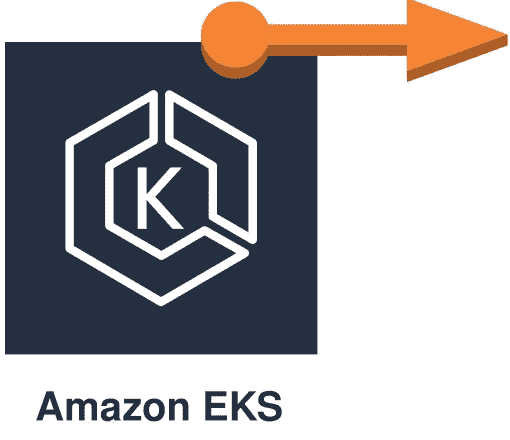

# 将弹性 IP 连接到 EKS 工作节点

> 原文：<https://itnext.io/attaching-an-elastic-ip-to-eks-worker-node-f69b9d8fa521?source=collection_archive---------1----------------------->



嗨，我还面临一个有趣的任务，在 Kubernetes 中运行 STUN 服务器。

STUN 服务器需要通过整个`1024-65535` udp 端口范围，但是 Kubernetes [不支持在服务](https://github.com/kubernetes/kubernetes/issues/23864)中指定端口范围。解决方案看起来很简单，用`hostNetwork: true`运行 pod，并把它分配给具有弹性 IP 的独立 EC2 实例。

问题是 EKS 不允许您创建单独的实例，而是指导您使用自动缩放组。因此，您没有机会静态地将弹性 IP 分配给特定的 EKS 工作者，但是您可以动态地这样做。

实现这一点的最简单方法是将以下 initContainer 放入 pod 定义中:

不要忘记创建具有以下权限的特定 aws 帐户:

```
{
  "Version": "2012-10-17",
  "Statement": [
    {
      "Effect": "Allow",
      "Action": [
        "ec2:AssociateAddress",
        "ec2:DisassociateAddress"
      ],
      "Resource": "*"
    }
  ]
}
```

这个应用的秘密是: