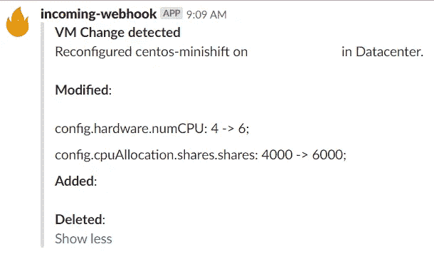
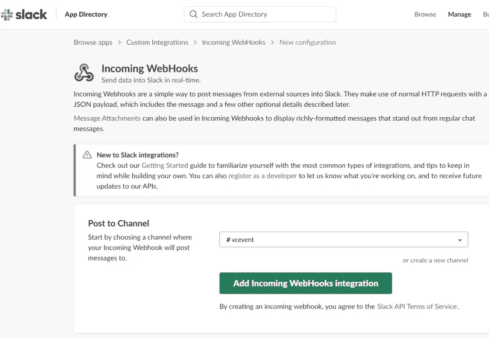
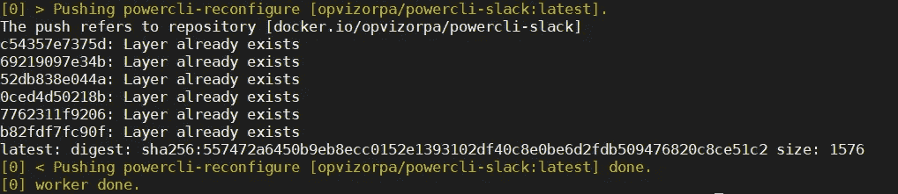
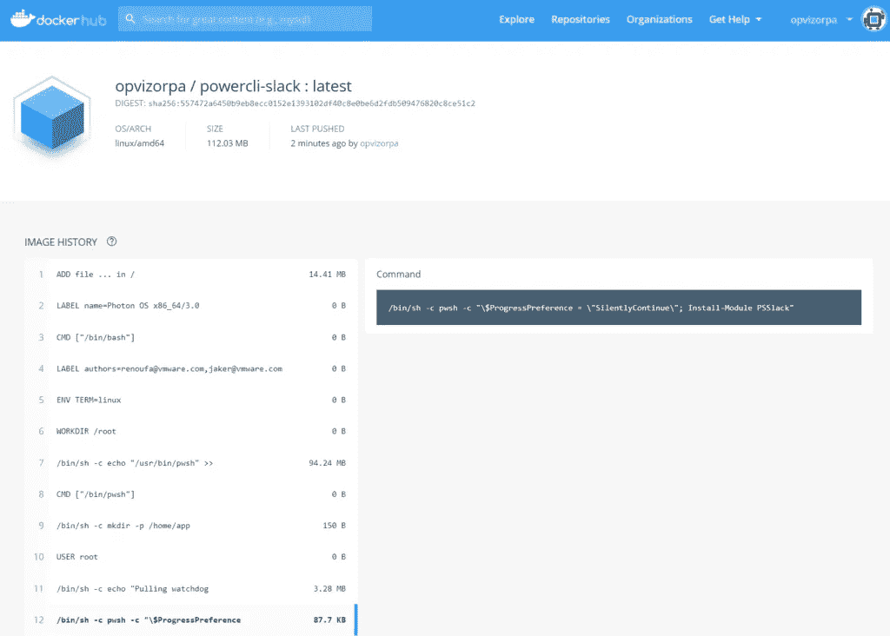

# 使用 vCenter 事件代理审核虚拟机配置更改

> 原文：<https://itnext.io/audit-vm-configuration-changes-using-the-vcenter-event-broker-45f9f5ba21f2?source=collection_archive---------4----------------------->

# 使用 vCenter 事件代理审核虚拟机配置更改

你可能已经见过甚至使用过 vCenter Event Broker 设备，它在几周前作为一个临时项目发布，上周由[迈克尔·加什](https://twitter.com/embano1)和[林柏希](https://twitter.com/lamw)的优秀团队在[完全开源发布。](https://github.com/vmware-samples/vcenter-event-broker-appliance)

**VEBA 虚拟设备是使用 Kubernetes** **上流行的开源包** [**OpenFaaS 以及由**](https://docs.openfaas.com/deployment/kubernetes/)[**OpenFaaS**](https://github.com/openfaas/faas)**社区创建的**[**vcenter-connector**](https://github.com/openfaas-incubator/openfaas-vcenter-connector)**构建的。**

虽然项目附带的标签示例以及手册中的内容是一个不错的开端，但它并不是最有用的东西。但是这很容易改变。考虑基于重新配置事件采取行动，并将虚拟机配置更改推送到 Slack:审计虚拟机配置！这样，您就可以使用 Slack 服务记录和搜索所有的变更。



# 设置 vCenter 事件代理应用装置(VEBA)

我不会在这里赘述，因为我们已经在前一篇博文中讨论过了。

你可以在这里阅读:

[https://it next . io/VMware-fling-vcenter-event-broker-appliance-c 97514 c9e 902](/vmware-fling-vcenter-event-broker-appliance-c97514c9e902)

# 审核虚拟机配置要求

要使服务能够审计虚拟机配置，我们需要添加或更改以下内容:

*   创建一个松弛的网钩
*   vcconfig.json 包含时差详细信息
*   包含时差的模板
*   stack.yml 使用不同的容器映像并检测虚拟机重新配置事件
*   将虚拟机更改信息发送到 Slack 的处理程序函数

您也可以加快速度，使用我们已经包含示例的存储库:[https://github.com/opvizor/vcenter-event-broker-appliance](https://github.com/opvizor/vcenter-event-broker-appliance)

你可以在**examples/power CLI/HW change-slack**下找到一切。

要快速开始，只需克隆原始的或分叉的存储库:

**原始存储库:**

[https://github . com/VMware-samples/vcenter-event-broker-appliance](https://github.com/vmware-samples/vcenter-event-broker-appliance)

在这种情况下，我建议将示例/powercli/tagging 复制到另一个目录中，以自定义文件。

快速入门使用的是**分叉库**，包括审计虚拟机配置示例:

[https://github.com/opvizor/vcenter-event-broker-appliance](https://github.com/opvizor/vcenter-event-broker-appliance)

```
git clone https://github.com/vmware-samples/vcenter-event-broker-appliance.git # or forkedgit clone [https://github.com/opvizor/vcenter-event-broker-appliance.git](https://github.com/opvizor/vcenter-event-broker-appliance.git)
```

# 设置松弛时间

要生成 Slack webhook，只需在登录 Slack 时访问以下链接:[https://my.slack.com/services/new/incoming-webhook/](https://my.slack.com/services/new/incoming-webhook/)



只需创建并选择一个用于审计虚拟机配置消息的 Slack 通道。

复制 Webhook URI 和通道名，并在您的 [vcconfig.json](https://github.com/opvizor/vcenter-event-broker-appliance/blob/master/examples/powercli/hwchange-slack/vcconfig.json) 中进行配置。

# 新的审计虚拟机配置功能

# vcconfig.json

我们要更改的第一个文件是包含 vCenter 连接详细信息和 Slack 的凭据文件。

```
{
    "VC" : "my-vCenter",
    "VC_USERNAME" : "user@vsphere.local",
    "VC_PASSWORD" : "userpassword",
    "SLACK_URL"   : "https://my.slack.com/services/new/incoming-webhook/",
    "SLACK_CHANNEL" : "vcevent"
}
```

# stack.yml

该文件包含稍后将被推送到 OpenFaaS 服务的栈定义。重要的线是:网关，图像，和主题。

```
provider:
  name: openfaas
  gateway: https://veba.mynetwork.local
functions:
  powercli-reconfigure:
    lang: powercli
    handler: ./handler
    image: opvizorpa/powercli-slack:latest
    environment:
      write_debug: true
      read_debug: true
      function_debug: false
    secrets:
      - vcconfig
    annotations:
      topic: vm.reconfigured
```

*   网关:VEBA 电器的 FQDN
*   图像:要使用的图像(最好是使用您自己的 Docker Hub 帐户)
*   主题:vm.reconfigured 涵盖了 vm 的所有配置更改

# handler/script.ps1

这是用 PowerShell 编写的函数:

```
# Process function Secrets passed in
$VC_CONFIG_FILE = "/var/openfaas/secrets/vcconfig"
$VC_CONFIG = (Get-Content -Raw -Path $VC_CONFIG_FILE | ConvertFrom-Json)
if($env:function_debug -eq "true") {
    Write-host "DEBUG: `"$VC_CONFIG`""
}

# Process payload sent from vCenter Server Event
$json = $args | ConvertFrom-Json
if($env:function_debug -eq "true") {
    Write-Host "DEBUG: `"$json`""
}

$eventObjectName = $json.objectName

# import and configure Slack
Import-Module PSSlack | Out-Null

Set-PowerCLIConfiguration -InvalidCertificateAction Ignore  -DisplayDeprecationWarnings $false -ParticipateInCeip $false -Confirm:$false | Out-Null

# Connect to vCenter Server
Write-Host "Connecting to vCenter Server ..."
Connect-VIServer -Server $($VC_CONFIG.VC) -User $($VC_CONFIG.VC_USERNAME) -Password $($VC_CONFIG.VC_PASSWORD)

# Retrieve VM changes
$Message = (Get-VM $eventObjectName | Get-ViEvent -MaxSamples 1).FullFormattedMessage

# Bold format for titles
[string]$Message = $Message -replace "Modified","*Modified*" -replace "Added","*Added*" -replace "Deleted","*Deleted*"

# Send VM changes
Write-Host "Detected change to $eventObjectName ..."

New-SlackMessageAttachment -Color $([System.Drawing.Color]::red) `
                           -Title 'VM Change detected' `
                           -Text "$Message" `
                           -Fallback 'ouch' |
    New-SlackMessage -Channel $($VC_CONFIG.SLACK_CHANNEL) `
                     -IconEmoji :fire: |
    Send-SlackMessage -Uri $($VC_CONFIG.SLACK_URL)

Write-Host "Disconnecting from vCenter Server ..."
Disconnect-VIServer * -Confirm:$false
```

每当函数被触发时，我们接收对象作为有效载荷。基于该对象，我们获取最新的事件。如果在很短的时间内对同一个虚拟机进行了太多的更改，就有可能捕获到错误的事件。

好消息是 event 的家伙们已经知道了这一点，并且计划进行一项改变来增强带有事件 id 的有效载荷。

# OpenFaaS PowerCLI 模板

这一点非常重要，因为我们使用它来构建容器映像并将其推送到我们的容器映像注册中心。最好是在 hub.docker.com 上创建自己的账户，并在本地登录: **docker 登录**

如果您不使用分叉存储库，请从这里将 PowerCLI 模板复制到您的工作目录，并对其进行更改以添加 Slack:[https://github . com/VMware-samples/vcenter-event-broker-appliance/tree/master/examples/power CLI/tagging/template/power CLI](https://github.com/vmware-samples/vcenter-event-broker-appliance/tree/master/examples/powercli/tagging/template/powercli)

# 模板/powercli/Dockerfile

我们只需添加以下部分:

```
# Add PSSlack https://github.com/RamblingCookieMonster/PSSlack 
RUN pwsh -c "\$ProgressPreference = \"SilentlyContinue\"; Install-Module PSSlack"
```

完整的文件内容:

```
FROM vmware/powerclicore:latest

RUN mkdir -p /home/app
USER root
RUN echo "Pulling watchdog binary from Github." \
    && curl -sSL https://github.com/openfaas/faas/releases/download/0.9.14/fwatchdog > /usr/bin/fwatchdog \
    && chmod +x /usr/bin/fwatchdog \
    && cp /usr/bin/fwatchdog /root

# Add PSSlack https://github.com/RamblingCookieMonster/PSSlack
RUN pwsh -c "\$ProgressPreference = \"SilentlyContinue\"; Install-Module PSSlack"

WORKDIR /root

USER root

# Populate example here - i.e. "cat", "sha512sum" or "node index.js"
SHELL [ "pwsh", "-command" ]
ENV fprocess="xargs pwsh ./function/script.ps1"
COPY function function
# Set to true to see request in function logs
ENV write_debug="true"

EXPOSE 8080

HEALTHCHECK --interval=3s CMD [ -e /tmp/.lock ] || exit 1
CMD [ "fwatchdog" ]
```

# 构建、推送和发布功能

现在是简单的部分，因为我们只需要运行几个命令:

# FaaS-CLI —配置 OpenFaaS

```
# set up faas-cli for first use 
export OPENFAAS_URL=https://VEBA_FQDN_OR_IP faas-cli login -p VEBA_OPENFAAS_PASSWORD --tls-no-verify # create the secret based on the local file 
faas-cli secret create vcconfig --from-file=vcconfig.json --tls-no-verify
```

# 构建和部署

```
# Build the new container based on the Template 
faas-cli build -f stack.yml # Push the container to the registry 
faas-cli push -f stack.yml # Deploy the function to the OpenFaaS service 
faas-cli deploy -f stack.yml --tls-no-verify
```



您可以检查 Dockerhub repo 上的容器映像，以及 Slack 集成是否有效。



确保您在部署该功能时收到一个 **200** 代码！

# 闲置产量

OpenFaaS 现在配置为监视虚拟机重新配置事件以触发 PowerCLI 脚本。

就这样，您应该会在您选择的 Slack 通道中看到一条类似的消息来审计 VM 配置更改。


*原载于 2019 年 11 月 25 日*[*【https://www.opvizor.com】*](https://www.opvizor.com/audit-vm-configuration-changes-using-the-vcenter-event-broker)*。*