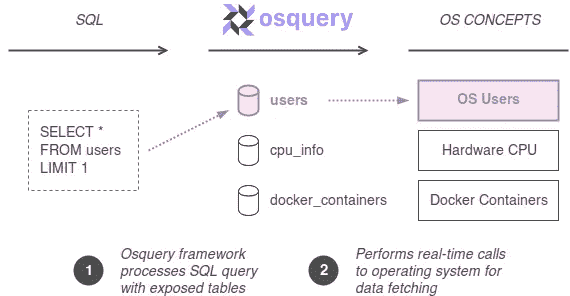
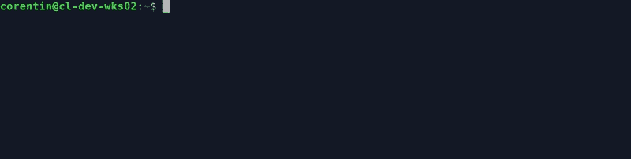

# 用 osquery 审计容器

> 原文：<https://itnext.io/auditing-containers-with-osquery-389636f8c420?source=collection_archive---------2----------------------->

使用 Docker 在生产环境中运行容器时，糟糕的配置很容易导致易受攻击的环境:特权容器、以 root 用户身份运行的容器内的进程或者缺乏针对安全限制的 AppArmor 配置文件都是常见的例子。利用容器中的应用程序漏洞的攻击者可以利用这种限制来访问主机或网络上的其他服务器。使用 osquery，我们将像查询关系数据库一样查询 Docker 守护进程，并快速识别这些安全缺陷。

# osquery 快速介绍

📌*如果您已经熟悉 osquery，请随意跳到下一章“休斯顿，我们有一个易受攻击的容器”，从实际例子开始。*

[osquery](https://osquery.io/) 框架将您的操作系统**公开为一个关系数据库**，您可以在其上执行 SQL 查询来查找关于您系统的特定数据。诸如用户、网络路由、CPU 和 Docker 容器之类的操作系统概念以可查询的表格的形式公开。这种创新的方法允许使用一种单一的查询语言，使用 SQL 来选择、过滤和聚集关于操作系统及其周围组件的数据。



osquery 的一个主要优势是它的**广泛的支持**:它可以在每一个主要的操作系统(Linux、Windows、macOS 甚至 FreeBSD)上执行，并提供各种现成的表来查询您的操作系统(服务、用户、硬件、内核……)。是的，这还包括容器、图像、网络和卷等概念的 Docker 表。

在下面的例子中，我们使用 [osquery 交互式 shell](https://osquery.readthedocs.io/en/stable/introduction/using-osqueryi/) 来检索系统中使用 SQL 查询的第一个用户。请注意，osquery 提供的交互式 shell 是一个独立的 CLI 工具(它只使用内存数据库)，因此非常适合进行查询实验。



使用 osquery 交互式 shell 的查询示例

当调用`user`表时，实时执行相应的操作系统调用来检索系统上的用户，SQL 引擎根据查询`SELECT * FROM users LIMIT 1`处理您的数据。当使用 osquery 编写 SQL 时，SQL 语言实际上是 SQLite 的超集，其他动词如`INSERT`、`UPDATE`或`DELETE`对您的操作系统没有影响(因此查询`DELETE FROM users`不会删除您系统中的用户)。

# 休斯顿，我们有一个易受攻击的集装箱

📌*对于本文的下一部分，我强烈建议在您的工作站上安装 Docker 和 osquery，以便在您自己的操作系统上尝试这些示例。这将使结果更有意义，并有助于理解 osquery 是如何工作的。*

我们现在将切换到一个实际的例子来演示 osquery 如何帮助我们审计一些 Docker 容器的安全缺陷。在这个例子中，我们有一个运行 Docker 守护进程的 Linux 服务器。让我们假设有人使用下面的命令在我们的服务器上运行一个新容器:

```
docker run -d --name web01 --privileged --user root nginx:latest
```

我们现在在系统上有一个名为`web01`的 NGINX 容器，它以 root 用户的特权模式运行，没有任何安全约束，比如 AppArmor。换句话说，容器现在可以访问所有内核功能，并且可以做几乎所有主机可以做的事情。因此，这个容器`web01`是一个主要的安全漏洞，我们现在将使用 osquery 追踪它。

Osquery 为 Docker 组件定义了下面的 **SQL 表，这对我们的审计很有用:`docker_containers`列出了主机上所有没有停止或终止的容器，`docker_images`提供了存储在服务器上的所有图像的视图，`docker_container_processes`深入到一个特定的容器中，列出了他所有正在运行的进程。**

📌*还有更多的可用表，要深入了解，您可以参考* [*完整 osquery 表参考*](https://osquery.io/schema/) *或使用 osquery 交互 shell 中的* `*.tables*` *命令。*

# 查询 Docker 容器

让我们从第一个审计例子开始。使用 osquery 交互式 shell 和`docker_containers`表，我们现在将执行我们的第一个 SQL 查询来跟踪容器，比如作为**特权**运行的`web01`。该查询将主机上运行的容器的名称、映像和状态作为特权给出。

我们将继续使用`docker_containers`表来**跟踪环境变量**。使用带有`%`的 SQL `LIKE`语法，我们可以检查包含容器中所有可用环境变量的整个`env_variables`列。在上面的查询中，我们将只匹配具有`NGINX_VERSION`环境变量的容器。这是一个非常简单的例子，但是我们也可以跟踪具有`PASSWORD`、`SECRET`或`TOKEN`变量的容器，从而导致敏感信息的潜在泄露。

在生产中运行容器时，Docker 还提供了使用 [AppArmor](https://docs.docker.com/engine/security/apparmor/) 增强安全性的可能性。使用 AppArmor，您可以为每个容器定义并实施一个安全配置文件:这将限制容器的能力，并确保它只能访问有限的资源集。上面定义的 SQL 查询使用`security_options`列跟踪所有**没有 AppArmor 概要文件**的容器。

# 更多高级查询

使用 Docker 的一个重要方面是确保只有有限的**用户组可以访问守护进程**。对于这个稍微复杂一点的查询，我们将使用包含所有用户的`users`表、`groups`表和`user_groups`表，它们将用户与其对应的组进行映射。如您所见，我们选择名为`docker`的组，并列出属于该组的所有用户名。

这个查询强调了使用 osquery 的一个主要优势:我们可以轻松地从不同的表中聚集数据，并快速获得关于我们系统的不同概念的更多见解。

现在，我们已经在前面的查询中使用了子查询和 SQL join 来获得关于多个表的更多信息，我们将继续沿着这条路径，跟踪使用根进程运行的**容器。使用 osquery 表`docker_container_processes`，我们可以找到使用 root 用户运行 NGINX 进程的`web01`容器。**

在 osquery 中，有些表需要一个参数才能工作:例如,`file`表需要一个`path`参数来避免对文件系统的彻底探索。因为 Docker 进程表也需要一个容器`id`参数才能工作，所以我们使用了一个选择所有容器标识符的子查询。

最后但同样重要的是，我们还可以使用`docker_images`表列出没有被活动容器使用的**图像。这使我们能够审核并从我们的服务器中删除未使用的映像。根据记录，该查询获取与`docker image prune -a`命令相同的图像，但不删除它们。**

# 下一步是什么？


照片由 [chuttersnap](https://unsplash.com/@chuttersnap?utm_source=medium&utm_medium=referral) 在 [Unsplash](https://unsplash.com?utm_source=medium&utm_medium=referral) 上拍摄

使用这些查询，您现在能够审计一些 Docker 安全配置，并跟踪可能对您的服务器造成危险的容器。

尝试改变上面的一些查询，并开始用 osquery 提供的其他表[进行试验。如果您想比 Docker 审计更进一步，请确保查看 osquery 文档，它将指导您从基础到更高级的用例。关于](https://osquery.io/schema)[异常检测](https://osquery.readthedocs.io/en/stable/deployment/anomaly-detection/)和[流程审计](https://osquery.readthedocs.io/en/stable/deployment/process-auditing/)的章节对于获得 osquery 审计的更多见解尤其重要。

*我希望你喜欢这篇文章，并准备好接受更多 osquery 审计。如果你发现了错误，不要犹豫给我留言或者通过 Twitter，希望分享关于这个内容的建议或者问题*👍

👏*特别感谢* [*阿诺·德玛特*](https://twitter.com/adematte) *对本帖的校对。*