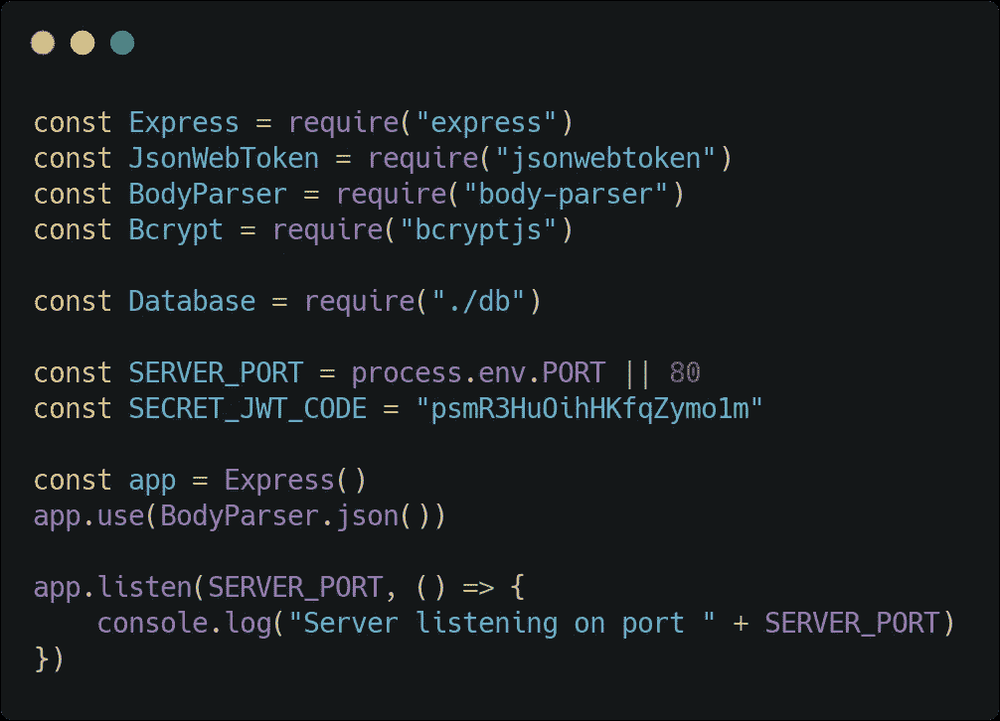
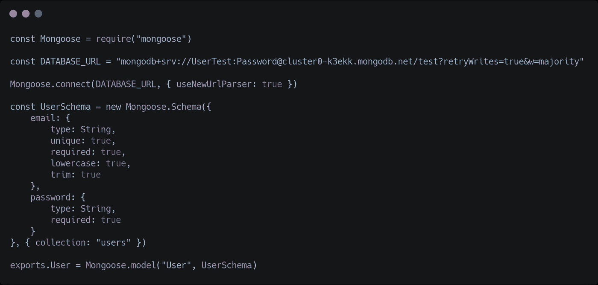
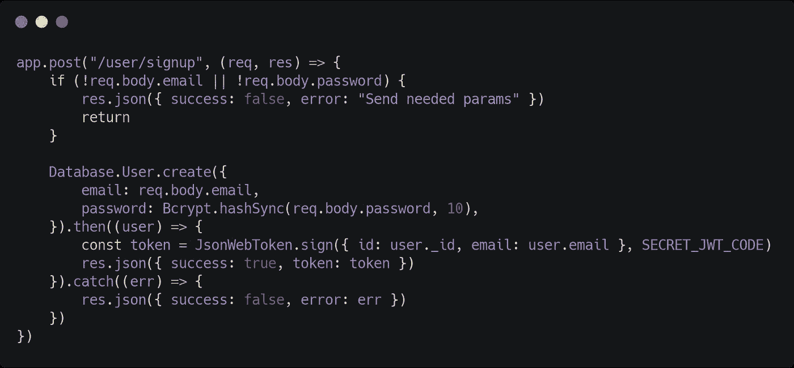
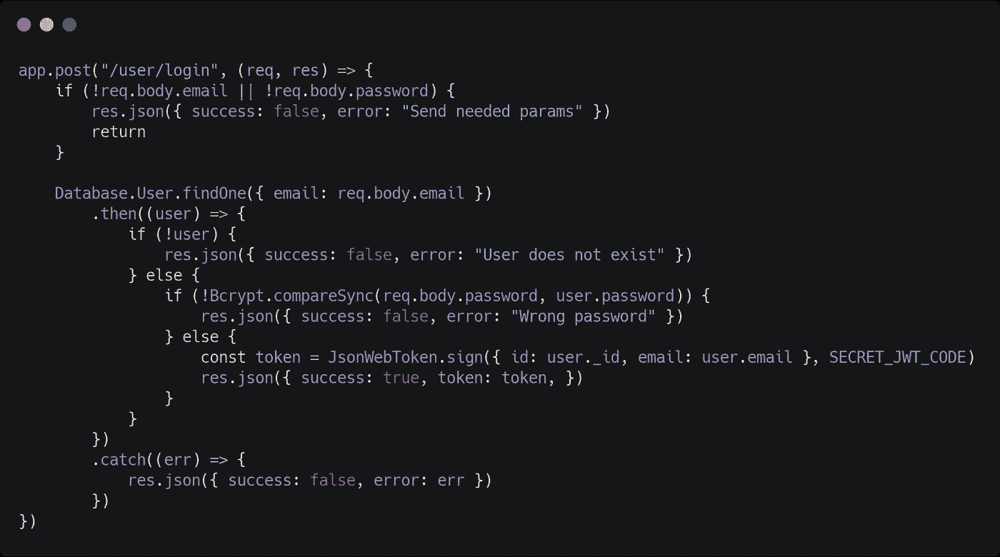
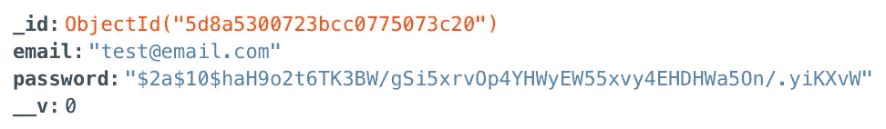
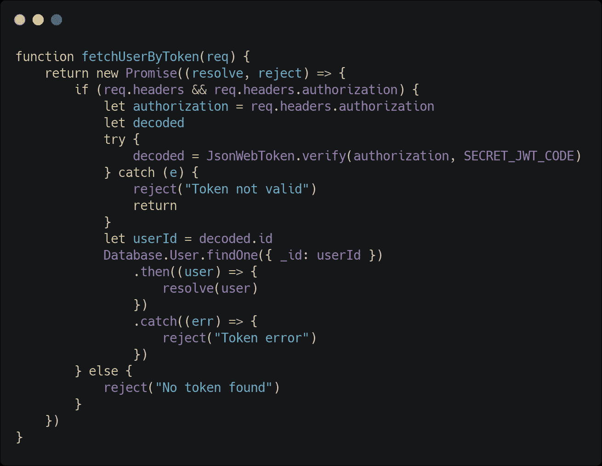
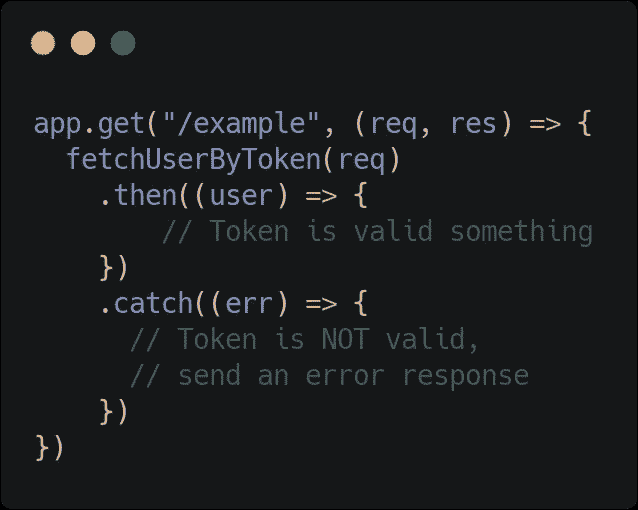

# 使用 NodeJS、Express、Mongoose 和 JWT 进行验证

> 原文：<https://itnext.io/auth-with-nodejs-express-mongoose-and-jwt-577aa3f2f707?source=collection_archive---------1----------------------->

数据库的安全性是构建新项目时要考虑的最重要的因素之一。

有几种方法可以实现可靠的**认证**系统。
在这篇文章中，我将向你展示如何使用 JWT，完全从零开始，不需要使用第三方服务。

# 我们将使用哪些技术？

*   **NodeJS** :服务器端执行 JavaScript 代码的工具。
*   **Express** :让服务器开发更快的微框架。
*   **mongose**:帮助我们连接到 MongoDB 实例的库。
*   **JWT** (JSON Web Token):由服务器生成并由客户端存储的加密字符串。对于每个请求，该字符串将由客户端发送，并由服务器验证。
*   **Bcrypt** :我们将用来[散列](https://www.quora.com/What-is-a-hashed-password)我们的密码的库。
*   **BodyParser** :将帮助我们在处理请求时检索主体参数。

# 设置我们的环境

首先，一定要安装 NodeJS。如果你还没有，看看这个链接。然后，创建一个新的 MongoDB 实例。你可以在这里免费创建一个。
最后，通过命令行在我们的项目文件夹中安装 NPM 包。

```
npm install express jsonwebtoken body-parser bcryptjs
```

# 准备编码！

现在，我们需要创建我们的服务器脚本:

*   app.js ，我们将在其中处理所有的服务器请求。
*   db.js ，它将包含我们的数据库模型。

让我们创建一个非常简单的 **Express** 应用程序:它将是我们应用程序的基本结构。



“秘密 JWT 代码”是我们在生成令牌时将使用的加密密钥。

在继续实现我们的端点之前，我们应该看一下 **db.js** 文件。



**db.js**

这个文件实际上创建了我们的 DB 模型模式。这意味着每个用户相关的数据将被保存在一个名为“用户”的文档(集合)下，并具有两个属性，“电子邮件”和“密码”。当然，你可以创建任意数量的*模型*，以及任意数量的*属性*。

现在我们需要实现我们的**路由**系统。该应用程序本质上将有两个端点，第一个用于注册**的**，第二个用于登录**。**

****

****app.js —报名****

****

****app.js —登录****

# **有用！**

****

**在呼叫我们的/user/signup 端点之后，保存在我们的 DB 上的数据的屏幕截图**

# **最后的步骤**

**我们成功地实现了我们的认证系统。现在，客户端应该在登录后**保存**令牌，并且**在每次发出新请求时将令牌发送回**。**

**记住 Json Web 令牌有一个**到期**时间。有许多方法可以让用户保持登录状态。例如，每当发生这种情况，**客户端**可以**刷新**令牌，进行新的登录调用。**

**在**后端**，您可以通过以下方式检查令牌是否**有效**:**

****

****app.js****

****

****app.js****

**你可以在这里找到 Github 要点！😊**