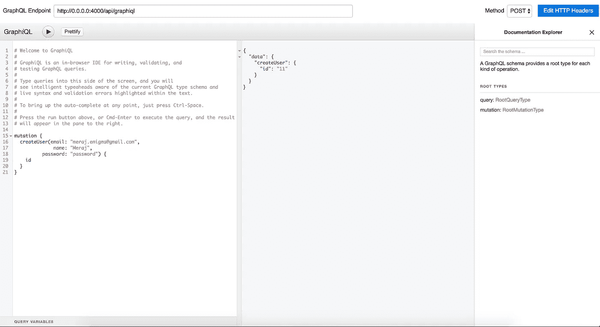
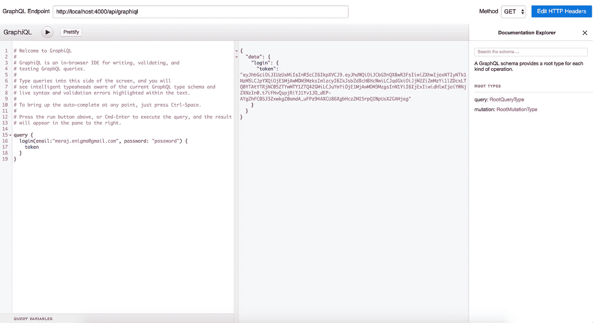
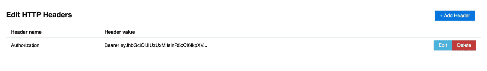
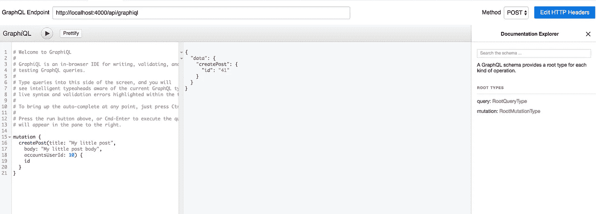
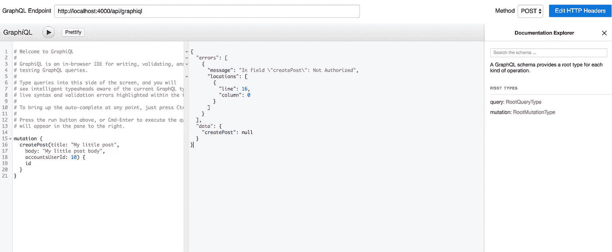
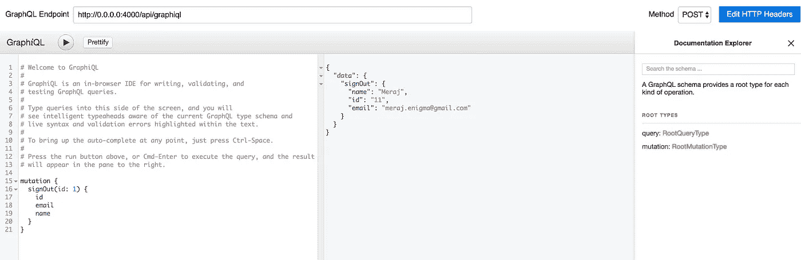

# 《卫报》对凤凰城苦艾酒原料药的鉴定

> 原文：<https://itnext.io/authenticating-absinthe-graphql-apis-in-phoenix-with-guardian-d647ea45a69a?source=collection_archive---------2----------------------->

[*点击这里在 LinkedIn* 上分享这篇文章](https://www.linkedin.com/cws/share?url=https%3A%2F%2Fitnext.io%2Fauthenticating-absinthe-graphql-apis-in-phoenix-with-guardian-d647ea45a69a)

在我的前两篇文章中，我重点介绍了在 Phoenix 中编写 GraphQL APIs 以及用 Guardian 认证 REST APIs。你可以在这里阅读这两篇文章——[graph QL with Elixir/Phoenix and absinie](/graphql-with-elixir-phoenix-and-absinthe-6b0ffd260094)和[Guardian for Phoenix 1.3 Web Apps 的用户认证](/user-authentication-with-guardian-for-phoenix-1-3-web-apps-e2064cac0ec1)。在本文中，我将在之前文章的基础上使用 Guardian 认证 GraphQL APIs。

# **我们需要什么**

1.  [Phoenix Web 框架](http://phoenixframework.org) —用于编写 Web 应用
2.  [苦艾酒](http://absinthe-graphql.org) — GraphQL 编写查询/突变的灵丹妙药工具包
3.  [GraphQL](https://github.com/graphql/graphiql)—一个用于探索 graph QL 的浏览器内集成开发环境。你可以把它想象成休息的邮递员。我们将在这里使用来自[的 mac 应用](https://github.com/skevy/graphiql-app)，它是 GraphiQL 的一个包装器。
4.  [Guardian](https://github.com/ueberauth/guardian) —用于 Elixir 应用程序的认证库

# 应用概述

我们将使用的 Phoenix 应用程序是一个简单的博客应用程序，Phoenix 1.3 有两个模式，分别在帐户和博客上下文中定义用户和帖子。这与前一篇文章中使用的相同——graph QL 与酏剂/凤凰和苦艾酒。完整代码可从 github [这里](https://github.com/imeraj/Phoenix_Playground/tree/master/1.3/blog_app_gql)获得。我们将扩展这个应用程序来支持一些新的基于令牌的认证 API。

# **添加依赖关系**

首先，我们需要将 Guardian 和其他一些库作为依赖项添加到我们的应用程序中—

```
defp deps **do** [
    {:guardian, "~> 1.0"},
    {:comeonin, "~> 4.0"},
    {:bcrypt_elixir, "~> 1.0"}
  ]
**end**
```

这里—

一、 [guardian](https://github.com/ueberauth/guardian) :是认证库

二。是仙丹的密码哈希库

三。[bcrypt _ elixir](https://github.com/riverrun/bcrypt_elixir):comeon 使用的是密码哈希算法吗

# **新的原料药**

我们将在以前的 GraphQL 文章中开发的应用程序的基础上添加以下新的 GraphQL APIs

I .创建用户——注册新用户

二。登录—允许用户登录

三。注销—让用户注销

此外，我们将使用身份验证来保护上一篇文章中开发的所有 API。

# 注册用户

为了让用户使用名称、电子邮件和密码进行注册，我们需要将 password_hash 添加到 DB 中。所以，让我们首先创建一个如下的迁移—

```
defmodule BlogAppGql.Repo.Migrations.AddPasswordHashToAccountsUser **do** use Ecto.Migration

  def change **do** alter table(:accounts_users) **do** add :password_hash, :string
    **end
  end
end**
```

并将用户模式更改为 password 虚拟字段和 password_hash 字段。

```
schema "accounts_users" **do** field(:email, :string)
  field(:name, :string)
  **field(:password, :string, virtual: true)
  field(:password_hash, :string)** 
  has_many(:blog_posts, BlogAppGql.Blog.Post, foreign_key: :accounts_user_id)

  timestamps()
**end**
```

现在我们需要把我们的突变写成如下—

```
field :create_user, type: :accounts_user **do** arg(:name, non_null(:string))
 arg(:email, non_null(:string))
 arg(:password, non_null(:string))

 resolve(&BlogAppGql.Accounts.UserResolver.create/2)
**end**
```

解析器功能看起来像—

```
def create(params, _info) **do** Accounts.create_user(params)
**end**def create_user(attrs \\ %{}) **do** %User{}
  |> User.changeset(attrs)
  |> Repo.insert()
**end**
```

变更集看起来如下—

```
def changeset(%User{} = user, attrs) **do** user
  |> cast(attrs, [:name, :email, :password])
  |> validate_required([:name, :email, :password])
  |> validate_length(:name, min: 3, max: 10)
  |> validate_length(:password, min: 5, max: 20)
  |> unique_constraint(:email, downcase: **true**)
  |> **put_password_hash()**
**end**defp put_password_hash(changeset) **do** case changeset **do** %Ecto.Changeset{valid?: **true**, changes: %{password: pass}} ->
      put_change(changeset, :password_hash, Comeonin.Bcrypt.hashpwsalt(pass))

    _ ->
      changeset
  **end
end**
```

**put_password_hash()** 负责在注册过程中创建 password_hash，并将其放入变更集中，以便数据库只包含哈希后的密码。

启动 GraphiQL，让我们测试新的 API(不要忘记运行 DB 迁移和 phoenix 服务器:)。



创建用户 API

请注意，我使用了端点—[http://0 . 0 . 0 . 0:4000/API/graphiql](http://0.0.0.0:4000/api/graphiql)而不是[http://0 . 0 . 0 . 0:4000/graphiql。](http://0.0.0.0:4000/graphiql.)这将在后面解释。

既然 createUser (registration)正在工作，我们将需要配置 Guardian 并实现身份验证机制。

# 配置挂点

在 config/config.exs 中添加以下内容以配置 Guardian —

```
# configures Guardian
config :blog_app_gql, BlogAppGql.Guardian,
  # optional
  allowed_algos: ["HS512"],
  # optional
  verify_module: Guardian.JWT,
  issuer: "BlogAppGql",
  ttl: {30, :days},
  allowed_drift: 2000,
  # optional
  verify_issuer: **true**,
  ***# generated using: JOSE.JWK.generate_key({:oct, 16}) |> JOSE.JWK.to_map |> elem(1)***
  **secret_key: %{"k" => "3gx0vXjUD2BJ8xfo_aQWIA", "kty" => "oct"},** serializer: BlogAppGql.Guardian
```

大多数字段都是可选的，可以省略。

secret_key 可以在 iex 会话(iex -S mix)中使用上面一行中的命令生成。

我们需要添加序列化器模块**blogapgql。卫报**包含一些回调—

```
defmodule BlogAppGql.Guardian **do** use Guardian, otp_app: :blog_app_gql
 alias BlogAppGql.Accounts

 def subject_for_token(user, _claims) **do** # You can use any value for the subject of your token but
  # it should be useful in retrieving the user later, see
  # how it being used on `user_from_claims/1` function.
  # A unique `id` is a good subject, a non-unique email address
  # is a poor subject.
  sub = to_string(user.id)
  {:ok, sub}
 **end** def resource_from_claims(claims) **do** # Here we'll look up our resource from the claims, the subject can be
  # found in the `"sub"` key. In `above subject_for_token/2` we returned
  # the resource id so here we'll rely on that to look it up.
  user = claims["sub"] |> Accounts.get_user!
  {:ok,  user}
 **end
end**
```

# **登录/验证用户**

现在，我们准备创建我们的登录 API。为此，我们需要在用户表中创建一个令牌字段。让我们创建另一个迁移，如下所示—

```
defmodule BlogAppGql.Repo.Migrations.AddTokenToAccountsUsers **do** use Ecto.Migration

  def change **do** alter table(:accounts_users) **do** add :token, :text
   **end
  end
end**
```

并修改用户模式，使其具有令牌字段—

```
schema "accounts_users" **do** field(:email, :string)
  field(:name, :string)
  field(:password, :string, virtual: **true**)
  field(:password_hash, :string)
  **field(:token, :string)**

  has_many(:blog_posts, BlogAppGql.Blog.Post, foreign_key: :accounts_user_id)

  timestamps()
**end**
```

现在让我们创建登录查询—

```
field :login, type: :session **do** arg(:email, non_null(:string))
  arg(:password, non_null(:string))

  resolve(&BlogAppGql.Accounts.UserResolver.login/2)
**end**
```

登录解析器功能如下所示—

```
def login(%{email: email, password: password}, _info) **do** with {:ok, user} <- **login_with_email_pass(email, password)**,
       {:ok, jwt, _} <- **BlogAppGql.Guardian.encode_and_sign(user)**,
       {:ok, _ } <- **BlogAppGql.Accounts.store_token(user, jwt)** **do** {:ok, %{token: jwt}}
  **end
end**
```

这里—

i. **login_with_email_pass(电子邮件，密码)** —将根据电子邮件和密码验证用户的身份

二。**blogapgql。guardian . encode _ and _ sign(user)**—将生成令牌(jwt，即 JSON Web 令牌)

三。**blogapgql。Accounts.store_token(user，jwt)** —将生成的令牌存储在数据库中

**登录电子邮件通行证(电子邮件，密码)**的代码如下所示—

```
defmodule BlogAppGql.AuthHelper **do** @moduledoc **false** import Comeonin.Bcrypt, only: [checkpw: 2]
  alias BlogAppGql.Repo
  alias BlogAppGql.Accounts.User

  def login_with_email_pass(email, given_pass) **do** user = Repo.get_by(User, email: String.downcase(email))

    cond **do
      user && checkpw(given_pass, user.password_hash)** ->
        {:ok, user}

      user ->
        {:error, "Incorrect login credentials"}

      **true** ->
        {:error, :"User not found"}
    **end
  end
end**
```

还有**blogapgql。Accounts.store_token(user，jwt)** 看起来像是——

```
def store_token(%User{} = user, token) **do** user
  |> User.store_token_changeset(%{token: token})
  |> Repo.update()
**end**
```

这应该足以在成功登录时向我们发放令牌。让我们试试这个—



登录 API

我们已经能够成功地向登录用户颁发令牌。

现在，我们希望使用身份验证来保护我们的 API(在上一篇文章中开发),以便只有登录的用户才能访问这些 API。

# **写上下文插**

我们需要编写这个上下文插件，并将其挂接到 graphql API 管道( **router.ex** )中，这样，如果有人登录，我们的解析器函数就可以使用登录的用户信息。

我们的**上下文**插件看起来如下—

```
defmodule BlogAppGql.Context **do** @behaviour Plug

 import Plug.Conn
 import Ecto.Query, only: [where: 2]

 alias BlogAppGql.Repo
 alias BlogAppGql.Accounts.User

 def init(opts), **do**: opts

 def call(conn, _) **do** case build_context(conn) **do** {:ok, context} ->
    **put_private(conn, :absinthe, %{context: context})**
   _ ->
    conn
  **end
 end** defp build_context(conn) **do** with ["Bearer " <> token] <- **get_req_header(conn, "authorization")**,
       {:ok, current_user} <- **authorize(token)** **do** {:ok, %{current_user: current_user, token: token}}
  **end
 end** defp authorize(token) **do** User
    **|> where(token: ^token)**
    |> Repo.one()
  |> case **do
       nil** -> {:error, "Invalid authorization token"}
    user -> {:ok, user}
     **end
 end
end**
```

在这里，粗线很重要。 **get_req_header** 将从 conn 检索授权承载令牌。然后使用 **authorize** 函数中的令牌检索用户信息，并且 **put_private** 将当前用户和令牌放入上下文中。

# **路由器中的修改**

接下来，我们需要在 **router.ex** 中进行修改，以便将上下文插件放在 api 管道中

```
defmodule BlogAppGql.Web.Router **do** use BlogAppGql.Web, :router

  pipeline :graphql **do** plug BlogAppGql.Context
  **end** scope "/api" **do** pipe_through(:graphql)

    forward("/", Absinthe.Plug, schema: BlogAppGql.Web.Schema)
    forward("/graphiql", Absinthe.Plug.GraphiQL, schema: BlogAppGql.Web.Schema)
  **end
end**
```

*我们创建了一个作用域“api ”,并将我们的 graphql 路由放在该作用域中。这就是为什么我们需要访问端点作为—*[*http://0 . 0 . 0 . 0:4000/API/graphiql。*](http://0.0.0.0:4000/api/graphiql.)

现在，我们需要修改现有的解析器函数，使用上下文信息来防止未经授权的访问。我将展示一个 API createPost 的例子。其余的类似，可以在源代码库中找到。

# 修改授权访问的 createPost API

我们现在必须写两个函数如下—

```
def create(args, %{context: %{current_user: _current_user}}) **do** Blog.create_post(args)
**end** def create(_args, _info) **do** {:error, "Not Authorized"}
**end**
```

如果找到当前用户并且允许访问，则第一个将匹配。

如果找不到 current_user，第二个将匹配。在这种情况下，它会给出“未授权”的错误信息。

让我们为这两种场景运行 API



在标题中设置标记



创建发布 API(带有访问令牌)

但是如果我们不给出访问令牌，输出将如下所示—



创建发布 API(无访问令牌)

完成这些工作后，我们的最后一步是实现注销/退出功能。

# **退出/注销用户:**

注销非常简单。我们只需要在用户注销时从数据库中删除令牌。让我们先创建一个标记突变—

```
field :sign_out, type: :accounts_user **do** arg(:id, non_null(:id))
 resolve(&BlogAppGql.Accounts.UserResolver.logout/2)
**end**
```

解析器功能看起来像—

```
def logout(_args,  %{context: %{current_user: current_user, token: _token}}) **do
  BlogAppGql.Accounts.revoke_token(current_user, nil)**
  {:ok, current_user}
**end** def logout(_args, _info) **do** {:error, "Please log in first!"}
**end**
```

还有**blogapgql。accounts . revoke _ token(current _ user，nil)** 看起来像是—

```
def revoke_token(%User{} = user, token) **do** user
  |> User.store_token_changeset(%{token: token})
  |> Repo.update()
**end**
```

让我们现在试试这个。因为我们必须先登录才能注销，所以我们必须传递授权头中的访问令牌—



注销 API

在本文中，我们用代码示例演示了如何在用苦艾酒库编写的 Phoenix Web 应用程序的 GraphQL APIs 中实现身份验证。我希望它能帮助一些读者。

*更多详细和深入的未来技术帖子请关注我这里或点击* [*twitter*](https://twitter.com/meraj_enigma) *。*