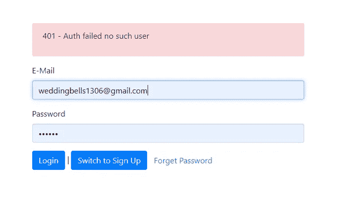
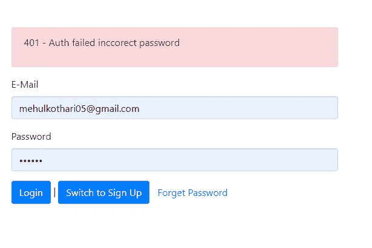

# 在均值堆栈中使用 JWT 的认证

> 原文：<https://itnext.io/authentication-using-jwt-in-mean-stack-6b425247b7d8?source=collection_archive---------2----------------------->

GitHub 网址:[T3【https://github.com/mehulk05/Blog-using-mean】T5](https://github.com/mehulk05/Blog-using-mean)

现场试玩:[**https://mehulk05.github.io/Blog-using-mean/#/**](https://mehulk05.github.io/Blog-using-mean/#/)

博客:**[**https://blogs-by-mehul . blogspot . com/2021/01/authentic ation-using-jwt-in-mean-stack . html**](https://blogs-by-mehul.blogspot.com/2021/01/authentication-using-jwt-in-mean-stack.html)**

# **现场演示**

****

**认证演示**

**[JSON Web Token](https://jwt.io/) 是在你的 MEAN stack 应用中实现认证系统的最佳标准之一。在这篇文章中，我们将只是看看在平均堆栈应用程序中使用 JWT 认证。**

# **什么是 JSON Web Token？**

**JSON Web Token (JWT)是一个开放标准( [RFC 7519](https://tools.ietf.org/html/rfc7519) )，它定义了一种紧凑且独立的方式，以 JSON 对象的形式在各方之间安全地传输信息**

# **什么时候应该使用 JSON Web 令牌？**

**以下是 JSON Web 令牌有用的一些场景:**

*   **授权:这是使用 JWT 最常见的场景。用户登录后，每个后续请求都将包含 JWT，允许用户访问该令牌允许的路由、服务和资源。单点登录是目前广泛使用 JWT 的一个特性，因为它的开销很小，并且能够很容易地跨不同的域使用。**
*   ****信息交换** : JSON Web 令牌是一种安全传输信息的好方法。**

**在其紧凑的形式中，JSON Web 令牌由点(`.`)分隔的三个部分组成，它们是:**

*   **页眉**
*   **有效载荷**
*   **签名**

**因此，JWT 通常如下所示。**

**`xxxxx.yyyyy.zzzzz`**

**因为 jwt 可以被签名——例如，使用公钥/私钥对——所以您可以确保发送者就是他们所说的那个人。此外，由于签名是使用头部和有效载荷计算的，因此您还可以验证内容没有被篡改。**

# **服务器端部分:创建一个 JWT**

**所以代码片段有一个注册路径，它将检查用户是否存在。如果用户不存在，它将进一步使用 bycrypt 模块加密密码，并在创建完用户后返回 200 状态码。**

**下一步是登录路径，这里它将检查用户的电子邮件和密码是否匹配。如果在这里找到匹配的用户，我们将执行一个重要的步骤。在这里，我们将创建我们的 JWT 令牌。**

```
const token = jwt.sign(
        { email: fetchedUser.email, userId: fetchedUser._id },
        "secret_this_should_be_longer",
        { expiresIn: "1h" }
      );res.status(200).json({
        token: token,
        expiresIn: 3600,
        userId: fetchedUser._id
      });
```

*   **因此，我们在这里创建 JWT 令牌，其中“sign”方法的第一个参数是需要放入有效负载(然后放入令牌本身)的信息。**
*   **第二个参数是用于创建摘要的密钥。**
*   **第三是期权表示。在本例中，我以秒为单位设置了令牌的到期日期。**

# **服务器端部分:检查和验证一个 JWT(中间件)**

```
// **check-auth.js** 
const jwt = require("jsonwebtoken");module.exports = (req, res, next) => {
  try { const token = req.headers.authorization.split(" ")[1];
 const decodedToken = jwt.verify(
   token,
   "secret_this_should_be_longer"
); req.userData = {
         email: decodedToken.email,
         userId: decodedToken.userId 
   }; next();
  } catch (error) {
    res.status(401).json({ message: "Auth failed!" });
  }
};
```

**这里是另一个 Node.js 片段，用 [Express.js](https://expressjs.com/) 中间件实现，它拦截所有请求并检查 JWT 的存在。**

**我们使用一个常见的实现，它期望将 JWT 传递到 HTTP 头中，以检查令牌是否包含所需的数据**

**作为验证例程的结果，如果令牌过期，我们将发送 HTTP 401 Unauthorized，如果报头中缺少令牌，我们将发送 HTTP 400 Bad 请求。**

# **客户端部分:**

**在客户端，我们使用 angular 作为我们的前端。这里我们有两个选择。首先，我们可以使用 HTTP 拦截器将令牌附加到每个 Http 请求上。第二，我们可以在服务文件中附加令牌，仅用于登录和注册请求。此后，我们可以有身份验证，对于 post 请求，我们可以在后端使用我们的中间件。**

# **通过 AJAX 通信，使用角度拦截器添加 JWT**

**在这个代码片段中，我们使用了一个[角度拦截器](https://angular.io/api/common/http/HttpInterceptor)，这是一个将令牌附加到每个 HTTP 请求的好方法。**

**有一些关于如何使用拦截器的注释，所有的注释都是依赖于应用程序上下文的，所以把这个片段看作是一个关于如何添加它的例子。**

**正如您所看到的，我们使用了名为“authorization”的 HTTP 头和“Bearer”前缀，因为服务器希望它后面跟着我们从后端接收到的令牌。**

**在本例中，我们在本地存储中存储和读取令牌。像以前一样，这只是一个想法，你可能更喜欢一个`SessionStorage`或其他东西。**

# **如果用户通过身份验证，将后端限制为只能读写**

**此外，如果我们想限制我们的后端只读写数据库，只有当用户被认证，我们可以使用我们创建的中间件做到这一点。查看下面的片段。**

```
router.get("/mypost", 
checkAuth,
(req, res, next) => {
    Post.find({creator: req.userData.userId}).then(post => {
      if (post) {
        res.status(200).json({
            message: "Posts fetched successfully!",
            posts: post
        });
      }
    })
    .catch(e=>{
        console.log(e)
    });
  }); 
```

**这里的 **checkAuth** 是我们已经创建的中间件，它将检查请求中的令牌。**

```
{creator: req.userData.userId}
```

**在上面的代码行中，我们从中间件中获取创建者，我们将解码后的令牌存储在 userID 中。如果令牌存在，则只处理请求。**

# **演示:**

****

**认证演示**

****

**演示:用户名或密码不正确**

****

**演示:登录后的令牌**

# **结论**

**JSON Web Token 得到了很好的支持。在[官网](https://jwt.io/)上，你可以找到几乎任何语言的库和工具来使用它，从 [Python](https://www.python.org/) 到。NET apps，以及 [Java](https://www.java.com/) 到 Node.js .这里我们已经使用 MEAN stack app 完成了完整的认证系统。**

**您将需要几个小时来实现一个健壮的身份验证方法，但这绝对是值得的。您可以在下面找到相同代码的 Github repo**

**[](https://github.com/mehulk05/Blog-using-mean) [## mehulk 05/博客使用均值

### 此时您不能执行该操作。您已使用另一个标签页或窗口登录。您已在另一个选项卡中注销，或者…

github.com](https://github.com/mehulk05/Blog-using-mean) 

**此外，阅读使用平均堆栈的 CRUD 操作**

[](https://medium.com/@mehulkothari05/crud-operation-using-mean-stack-7dfa2f51ec8c) [## 使用平均堆栈的 CRUD 操作

### github:https://github . com/me hulk 05/Blog-using-mean

medium.com](https://medium.com/@mehulkothari05/crud-operation-using-mean-stack-7dfa2f51ec8c)**