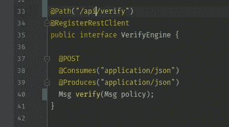

# (基本)使用 MicroProfile Rest 客户端进行身份验证

> 原文：<https://itnext.io/authentication-with-microprofile-rest-client-d1e9da774f70?source=collection_archive---------3----------------------->



Eclipse micro profile[Rest-Client](https://github.com/eclipse/microprofile-rest-client)是一款非常棒的软件。到处添加一些注释，你就有了一个类型安全的 REST 客户端。忘记所有 http 连接等低级的混乱。让我们来看看一些代码。首先是要调用的接口的定义:

```
@Path("/api/verify")
**@RegisterRestClient**
public interface VerifyEngine {

  @POST
  @Consumes("application/json")
  @Produces("application/json")
  public Msg **verify**(Msg policy);
}
```

在代码中使用它很简单。让 CDI 用@Inject @RestClient 注入上述客户机，然后像使用任何其他方法调用一样使用它。

```
public class PolicyCrudService {

  @Inject
  **@RestClient**
  VerifyEngine engine;

  public Msg verifyTheMessage(Msg msg) {
    return engine.**verify**(msg);
  }
}
```

如果你看了上面的内容，你可能想知道代码如何知道被调用的服务实际上在哪里。您可以通过 MicroProfile config 设置基本 URL 例如，如果您在 [Quarkus](https://quarkus.io/) 上，则在文件 application.properties 中:

```
**org.acme.VerifyEngine/mp-rest/url**=http://localhost:8083
```

config 键以具有@RegisterRestClient 注释的接口的完全限定类名开始。

现在，一些服务存在于授权检查之后。根据您想要的类型，您也可以通过声明的方式进行设置:

```
@Path("/api/verify")
@RegisterRestClient
**@ClientHeaderParam**(name = "Authorization", value = "{**lookupAuth**}")
public interface VerifyEngine {

  default String **lookupAuth**() {
    return "Basic " + 
         Base64.*getEncoder*().encodeToString("user:pass".getBytes());
  }
```

当然，您不必硬编码用户名和密码，但是可以通过 MicroProfile Config 再次获得它们，其中一个 ConfigSources 可以从 Kubernetes 秘密中获得它们。

## 更多？

如果你想了解更多关于 Eclipse MicroProfile 的知识，可以看看我也是合著者的书“ [**用 Eclipse MicroProfile**](https://www.packtpub.com/web-development/hands-on-enterprise-java-microservices-with-eclipse-microprofile) 实践企业 Java 微服务”。

