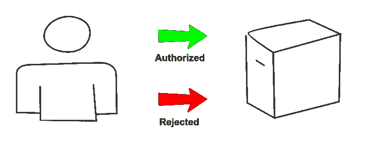
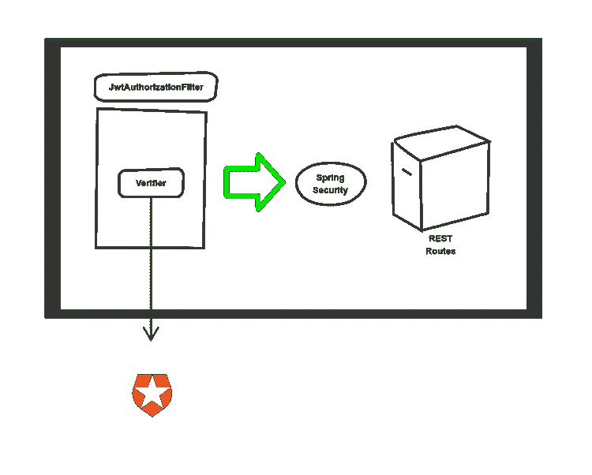
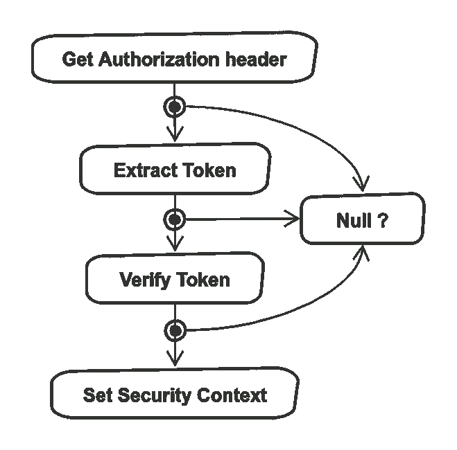

# 使用 JSON Web 令牌对 Kotlin Spring 后端进行授权

> 原文：<https://itnext.io/authorization-for-a-kotlin-spring-backend-using-json-web-tokens-9f3c7b0d1ee7?source=collection_archive---------5----------------------->

在我之前的文章中，我写了关于使用 Terraform 设置 Auth0 的[。在本文中，我想使用](https://hceris.com/setting-up-auth0-with-terraform/) [SpringBoot](https://spring.io/) 将该设置用于授权对用 *Kotlin* 编写的后端 API 的请求。

这个 API 用于上传食谱。它通过前端应用程序使用。可以选择登录来查看它们。但是，我想授权创建新的请求。这就是我们现在要做的，感谢 [JSON Web 令牌](https://en.wikipedia.org/wiki/JSON_Web_Token)。



# JSON Web 令牌

我将用户管理委托给 *Auth0* 。我们的前端使用 [OAuth](https://auth0.com/docs/api-auth/which-oauth-flow-to-use) 与其通信，以获得[承载令牌](https://tools.ietf.org/html/rfc6750)，但这超出了本文的目的。我们将假设这一步已经发生，并且对我们后端的请求带有一个*授权*头。

令牌以 base64 编码，可以使用 [jwt.io](https://jwt.io/) 方便地解码。解码后，我们可以看看有效载荷，它只是一个 JSON 对象:

因此，我们有一个发布者(`iss`)、一个受众(`aud`)、一个到期时间(`exp`)和被授予的范围(`scope`)。所有这些都是我们可以验证的领域。这将如何工作？这里有一个图表:



为了授权请求，我们需要三个组件:

*   一个*验证器*，用于检查令牌是否有效，如果有效，则从中提取信息
*   一个 *JwtAuthorizationFilter* ，它在每个后端请求之前运行，并运行*验证器*
*   与 *Spring Security* 的连接，如果请求无效，则拒绝该请求

让我们分别来看一看。

# 验证令牌

因此，我们的后端已经收到了一个请求，其中包括一个 *JWT* ，我们现在做什么？我们可以把它想象成两个不同的步骤。检查签名并验证令牌本身。我们将这两个步骤合并到一个接口(`Verifier`)中，该接口定义了一个方法:

我使用一个`Either`类型作为返回类型。我最近写了关于他们的。本质上，如果`verify`成功，我们将得到一个`TokenAuthentication`，如果不成功，我们将得到一个`JWTVerificationException`的实例。

# 签名

令牌由发行者签名(在我们的例子中是 *Auth0* )。签名确保令牌来自发行者，并且没有被篡改。

为了避免共享密钥，我们更喜欢使用公钥/私钥组合。这就是`JWKS`的用武之地。 *Auth0* 在[https://{ { auth 0 _ tenant } } . eu . auth 0 . com/下为您的租户发布密钥。知名/jwks.json](https://%7B%7Bauth0_tenant%7D%7D.eu.auth0.com/.well-known/jwks.json) 。我将那个键注入到我们的`RemoteVerifier`中，它实现了我上面定义的接口。我们将其作为`Bean`提供:

`Bean`是有条件的，这样我们可以为我们的测试提供一个替代实现，从而避免网络请求。

# 设置验证器

对于验证本身，我们将使用 auth0 的[自己的库](https://github.com/auth0/java-jwt)。首先，我们初始化一个`JWTVerifier`:

您可以看到，我们包括了之前获得的密钥，以及令牌到期时间的灵活限制。如果你想明确地测试发布者和受众，你可以在调用`build()`之前使用`withIssuer`和`withAudience`方法。在我的情况下，检查我的租户签署令牌感觉足够安全。

我们通过调用刚刚创建的`JWTVerifier`的`verify`方法来触发实际的验证，包装它以便它不会抛出异常。

等等，那个`asToken`方法在那里做什么？正如我提到的，我们希望从令牌中提取信息。我们稍后需要令牌中的作用域列表，我们获取并将其包含在我们的`TokenAuthentication`中

# 授权过滤器

验证器在一个过滤器中运行，该过滤器继承自`OncePerRequestFilter`。正如您可能猜到的，它在每个请求之前运行，但只运行一次。姑且称之为`JwtAuthorizationFilter`。它执行以下步骤:



我们在上一节中介绍了*验证令牌*的步骤。在此之前，我们必须从报头中提取令牌。如果验证成功，我们设置与*弹簧安全*相关的`SecurityContext`。代码如下所示:

这相当简单……等等，那个`Option.fx`是什么？括号呢？另外，根据图表，ever step 可能有一个空答案，我们在哪里处理它呢？

长篇大论，自成一篇。简而言之，由于有了*箭头*，我们可以使用[单子理解](https://arrow-kt.io/docs/patterns/monad_comprehensions/)来简化我们的代码，并使`Option`上的操作集合看起来像一个常规的代码块。

# 绑定弹簧安全性

我正在使用 [Spring Security](https://spring.io/projects/spring-security) 将我的过滤器集成到我的应用程序中。最简单的入门方法是使用这种依赖关系:

```
implementation 'org.springframework.boot:spring-boot-starter-security'
```

在配置中，我指定了以下内容:

*   我的`JwtAuthorizationFilter`将在每个请求之前运行
*   `GET`请求不需要授权
*   对于变化的请求(比如一个`POST`)，我们期望那里有`create:recipes`范围。记住，作为验证的一部分，我们将它映射到我们的`TokenAuthentication`中。

有一个流畅的界面可以在代码中进行配置，如下所示:

所以现在这三个部分终于连在一起了。我们定义了想要授权的请求。过滤器解析并验证令牌。如果这个令牌满足了我们的所有要求，请求就会通过。否则，它会因未授权的响应而失败。

# 摘要

如果你想确保你的后端正确地确保只有正确的一方被允许做某些事情，在你的 API 中建立授权是你需要做的事情。我为我参与的一个项目推出了一个定制的解决方案，但是如果你使用标准的工具和库，它会更方便，也更容易被其他人理解。

*原载于 2020 年 3 月 19 日 https://hceris.com**的* [*。*](https://hceris.com/authorize-spring-backend-with-jwt-in-kotlin/)