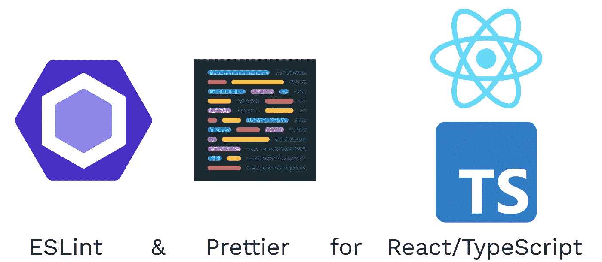
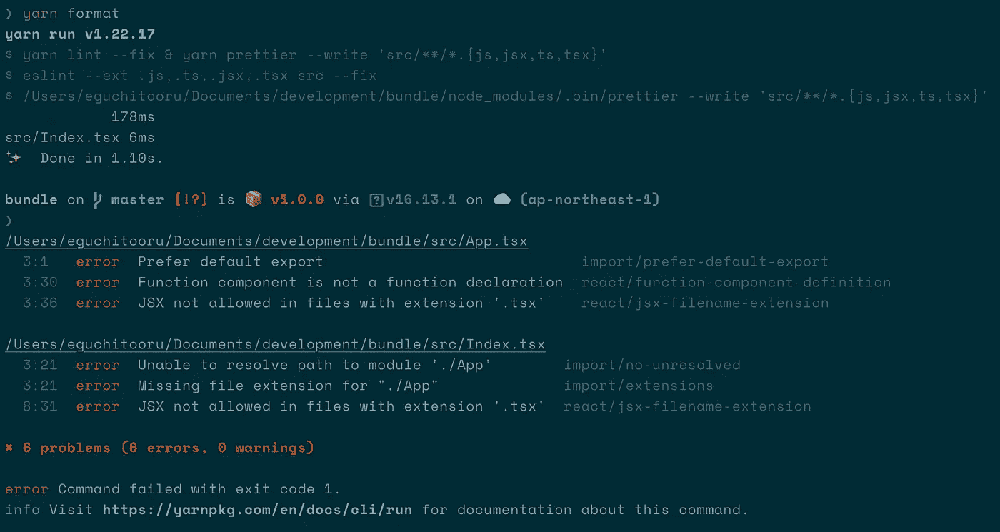

# React TypeScript 项目的 ESLint 和更漂亮的自动格式

> 原文：<https://itnext.io/auto-format-with-eslint-and-prettier-for-react-typescript-project-6526a9d44f81?source=collection_archive---------2----------------------->



图:React/TypeScript 的 ESLint 和更漂亮的设置

自动格式化是 DX 的一大改进。它节省了您的开发时间，并大大提高了您的生产力！特别是，它对前端有很大的影响，因为前端通常比后端有更多类型的扩展。

在前端世界中，ESLint 和 appelliter 作为 linter 和 formatter 的良好组合而闻名。然而，设置它们是你不想做的事情，因为它不是应用程序代码。

因此，这篇文章解释了如何设置自动格式与 ESLint 和漂亮的前端，特别是反应类型脚本项目。它的目的是当你在 VSCode 上保存一个文件时，文件会被 ESLint 和 appearlier 自动格式化。

# 埃斯林特和更漂亮的角色

在设定 [ESLint](https://eslint.org/) 和[beautiful](https://prettier.io/)之前，我们先明确一下他们的角色。

ESLint 是一个 linter，它可以在你的代码中发现问题，并显示错误和警告。因为是棉绒，所以有很多规矩。另一方面，[更漂亮的](https://prettier.io/)是格式化程序。

所以当你格式化代码时，Prettier 会基于 ESLint 进行格式化。

# 设置 ESLint

首先，让我们添加 ESLint。

```
$ yarn add -D eslint
```

！！2022-10-09 更新！

这篇文章本来是用 Airbnb 风格配置写的。但是因为 [airbnb 风格配置在 2022 年 8 月 14 日从](https://github.com/eslint/create-config/releases/tag/v0.3.1) `[@eslint/config](https://github.com/eslint/create-config/releases/tag/v0.3.1)`中移除，所以更容易使用`[eslint-config-react-app](https://www.npmjs.com/package/eslint-config-react-app)`。

```
$ yarn add -D eslint-config-react-app
```

`[eslint-config-react-app](https://www.npmjs.com/package/eslint-config-react-app)`已经有了很多对 React 有用的插件。所以你要做的只是创建一个 ESLint 配置。

```
// .eslintrc.json{
  "extends": [
    "eslint:recommended",
    "plugin:@typescript-eslint/recommended",    
    "react-app"
  ]
}
```

就是这样！简单的👏如果你想设置得更漂亮，请去更漂亮的部分！如果你想知道以前的设置，请随意阅读。

******** Airbnb 风格设置(不能再用了)********

安装后，可以通过交互模式进行配置。

```
$ yarn create @eslint/config✔ How would you like to use ESLint? · style
✔ What type of modules does your project use? · esm
✔ Which framework does your project use? · react
✔ Does your project use TypeScript? · No / Yes
✔ Where does your code run? · browser
✔ How would you like to define a style for your project? · guide
✔ Which style guide do you want to follow? · airbnb
✔ What format do you want your config file to be in? · JSON
✔ Would you like to install them now? · No / Yes
✔ Which package manager do you want to use? · yarn
```

在交互过程之后，您可以检查 package.json 中是否安装了 3 个包。

*   [@ TypeScript-eslint/eslint-plugin](https://github.com/typescript-eslint/typescript-eslint/tree/main/packages/eslint-plugin):提供 TypeScript linter 规则。
*   [@ typescript-eslint/parser](https://github.com/typescript-eslint/typescript-eslint/tree/main/packages/parser):将 TypeScript 转换为 ESLint 可解释代码
*   [eslint-config-airbnb](https://www.npmjs.com/package/eslint-config-airbnb) :是 airbnb 预定义的配置。
*   eslint-plugin-import :是用于导入/导出的插件
*   [eslint-plugin-jsx-a11y](https://www.npmjs.com/package/eslint-plugin-jsx-a11y) :是可访问性插件
*   [eslint-plugin-react](https://github.com/jsx-eslint/eslint-plugin-react) :是 react 的插件
*   [eslint-plugin-react-hooks](https://www.npmjs.com/package/eslint-plugin-react-hooks):是 react 钩子的插件

并且将创建 ESLint 配置文件`.eslintrc.json`。如果你检查配置文件，你可以理解一般设置是由交互模式。

```
// .eslintrc.json{
  "env": {
    "browser": true,
    "es2021": true
  },
  "extends": [
    "plugin:react/recommended",
    "airbnb"
  ],
  "parser": "@typescript-eslint/parser",
  "parserOptions": {
    "ecmaFeatures": {
      "jsx": true
    },
    "ecmaVersion": "latest",
    "sourceType": "module"
  },
  "plugins": [
     "react",
     "@typescript-eslint"
  ],
  "rules": {
  }
}
```

进口零件在下面。

*   [env](https://eslint.org/docs/latest/user-guide/configuring/language-options#specifying-environments) :是全局变量设置，也就是`browser`
*   [扩展](https://eslint.org/docs/latest/user-guide/configuring/configuration-files#extending-configuration-files):可以使用其他包的预定义设置。这里使用了 react 和 airbnb 预定义的配置
*   [解析器](https://eslint.org/docs/latest/user-guide/configuring/plugins#specifying-parser):这里是启用解析类型脚本的解析器设置
*   [插件](https://eslint.org/docs/latest/user-guide/configuring/plugins#configuring-plugins):指定为 TypeScript 和 React 设置的第三方插件

********** Airbnb 风格设置结束* * * * * * * * * *

# 设置更漂亮

设置好 linter 之后，让我们设置一个格式化程序。

```
$ yarn add -D prettier
```

并创建更漂亮的配置文件`.prettierrc.json`

```
// .prettierrc.json{
  "tabWidth": 2,
  "singleQuote": true,
}
```

漂亮本身有一个非常简单的配置👏

有些人想知道为什么 beauty 有 lint 规则🤔事实上，Prettier 有一些规则，这导致了一个问题，规则冲突。

# 与 ESLint 整合更漂亮

正如我在上一节所说的，Prettier 和 ESLint 的规则是相互冲突的。但幸运的是，你有一个很好的包，[eslint-config-prettle](https://github.com/prettier/eslint-config-prettier)。

```
$ yarn add -D eslint-config-prettier
```

它关闭了所有与漂亮相冲突的规则。要想完美的使用 ESLint 和 Prettier，应该在`.eslintrc.json`中增加一个配置。

```
// .eslintrc.json{
  ...
  "extends": [
    "eslint:recommended",
    "plugin:@typescript-eslint/recommended",    
    "react-app",
    "prettier"
  ]
  ...
}
```

一件重要的事情是，`"prettier"`设置必须作为`extends`的最后一个元素添加，以便用更漂亮的元素覆盖 ESLint 规则。

最后，ESLint 和更漂亮的设置完成了！我们来确认一下。`lint`命令仅用于获取错误和警告。`format`命令是用于格式化的。

```
// package.json{
  "scripts: {
    "lint": "eslint --ext .js,.ts,.jsx,.tsx src",
    "format": "yarn run lint --fix & yarn prettier --write 'src/**/*.{js,jsx,ts,tsx}'"
  }
}
```

现在，你可以像下面这样称呼它🎉



# VSCode 设置

到目前为止，您已经完成了 ESLint 和更漂亮的设置。最后是自动格式设置！幸运的是，VSCode editor 插件自动格式化文件保存。所以让我们来设置它！请安装下面的扩展。

*   [诚信通](https://marketplace.visualstudio.com/items?itemName=dbaeumer.vscode-eslint)
*   [更漂亮——代码格式化程序](https://marketplace.visualstudio.com/items?itemName=esbenp.prettier-vscode)

并创建 VSCode 设置文件。

```
// .vscode/settings.json{
  "editor.codeActionsOnSave": {
    "source.fixAll.eslint": true    // ESLint auto format on save
  },
  "editor.formatOnSave": true,      // Prettier auto format on save
  "editor.defaultFormatter": "esbenp.prettier-vscode"
}
```

就是这样！当你写代码和保存文件时，你可以看到自动格式化！

# 技巧

## 解析 react/jsx-文件名扩展


image:react/jsx-文件扩展名 lint 错误

因为 JSX 只允许在`.jsx`文件中被默认，所以出现这个错误。所以你也应该允许`.tsx`。

```
// .eslintrc.json{
  ...
  "rules": {
    "react/jsx-filename-extension": [
      "error",
      { "extensions": [".jsx", ".tsx"] }
    ],
  }
}
```

## 解决导入/否-未解决


图:无-未解决的 lint 错误

到目前为止，因为你安装了`@typescript-eslint/parser`和`@typescript-eslint/eslint-plugin`，格式化 TypeScript 是可能的。但是错误说它不能解析 typescript 文件导入。所以添加导入解析器设置。

```
// .eslintrc.json{
  ...
  "rules": {
    ...
  },
  "settings": {
    "import/resolver": {
      "node": {
        "extensions": [".js", ".jsx", ".ts", ".tsx"]
      }
    }
  }
}
```

## 解析导入/扩展


图:导入/扩展 lint 错误

该错误意味着 linter 无法解析没有`.tsx`扩展名的 tsx 文件。所以如果用`./App.tsx`写就可以避免。但是每次导入都要写扩展，很费时间。所以添加扩展设置。

```
// .eslintrc.json{
  ...
  "rules": {
    ...
    "import/extensions": [
      "error",
      "ignorePackages",
      {
        "js": "never",
        "jsx": "never",
        "ts": "never",
        "tsx": "never"
      }
    ]
  },
  "settings": {
    ...
  }
}
```

`ignorePackages`意味着您可以编写不带扩展名的 npm 包导入(例如`import path from “path”;`)。而且你再也不用写`.js`、`.jsx`、`.ts`和`.tsx`扩展了。

本文解释了 React TypeScript 项目的 ESLint 和更漂亮的简单设置！

如果你想通过 ESLint 更快地完成你的项目，我解释了 ESLint 的 7 个推荐规则。随意看！

[](https://egctoru.medium.com/7-recommended-eslint-rules-for-react-typescript-project-1a22b011b4b5) [## React TypeScript 项目的推荐 ESLint 规则

### ESLint 和 beauty 的组合太惊艳了。它不仅大大减少了格式化时间，还节省了…

egctoru.medium.com](https://egctoru.medium.com/7-recommended-eslint-rules-for-react-typescript-project-1a22b011b4b5) 

# 参考

*   [ESLint](https://eslint.org/)
*   [更漂亮](https://prettier.io/)
*   [@ typescript-eslint/eslint-plugin](https://github.com/typescript-eslint/typescript-eslint/tree/main/packages/eslint-plugin)
*   [@ typescript-eslint/parser](https://github.com/typescript-eslint/typescript-eslint/tree/main/packages/parser)
*   [eslint-config-airbnb](https://www.npmjs.com/package/eslint-config-airbnb)
*   [eslint-plugin-import](https://www.npmjs.com/package/eslint-plugin-import)
*   [eslint-plugin-jsx-a11y](https://www.npmjs.com/package/eslint-plugin-jsx-a11y)
*   [eslint-plugin-react](https://github.com/jsx-eslint/eslint-plugin-react)
*   [eslint-plugin-react-hooks](https://www.npmjs.com/package/eslint-plugin-react-hooks)
*   [eslint-config-appetter](https://github.com/prettier/eslint-config-prettier)
*   VSCode 中的 ESLint
*   [更漂亮——vs Code 中的代码格式化程序](https://marketplace.visualstudio.com/items?itemName=esbenp.prettier-vscode)