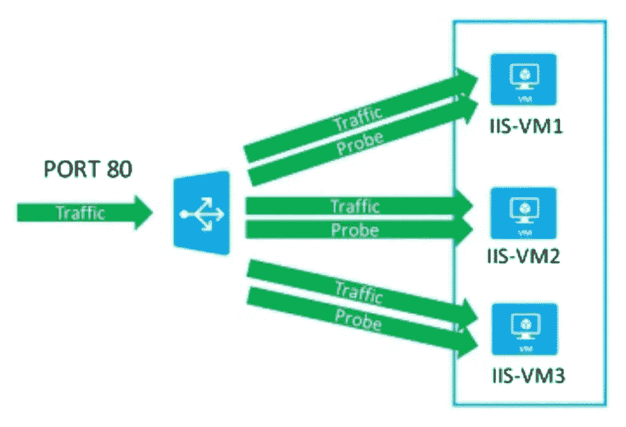

# 自动修复 Azure 虚拟机规模集实例

> 原文：<https://itnext.io/auto-heal-azure-vm-scale-set-instances-50c3b1908578?source=collection_archive---------5----------------------->



负载平衡器运行状况探测器

在最近的一次项目中，我被要求找到一种方法，在应用程序变得不健康时自动修复规模集中的实例。最近做了相当多的 Kubernetes，很好地理解了自动愈合的概念；我只需要找到音阶设置的解决方案。幸运的是，微软在 2020 年 4 月推出了一项名为 VMSS 自动实例修复的新功能。

在开始实现之前，让我们回顾一下什么是自动修复。自动修复解决方案由两个关键组件组成:

1.  检查应用程序运行状况的探测机制
2.  使应用程序进入健康状态的恢复机制

# 探测机制

为了探测应用程序，健康探测器被定义为定期检查应用程序。L4 和 L7 探针是可能的。

*   L4(第 4 层)探测器检查应用程序的 TCP 端口是否打开。虽然端口可以打开，但它可能无法完全反映端口背后的应用程序的健康状况。
*   L7(第 7 层)探测器检查 HTTP 或 HTTPS 上的 URL 路径。最粗糙的选项是 index.html，但是不会验证应用程序是否正在处理请求。首选方案是拥有一个验证应用程序多个方面的应用程序健康端点。从探测器的角度来看，当应用程序健康时，它期望接收一个 HTTP 200 否则将其标记为不健康。

可以从负载平衡器运行状况探测器或通过使用 VMSS 应用程序运行状况扩展来执行探测。使用负载平衡器探测器是首选选项(在下面的限制中解释)

# 恢复机制

在前云时代，实例被当作宠物来管理，操作员会尝试让实例重新联机。这种方法是劳动密集型的，并且对于每个应用需要不同的程序。

相反，通过采用牛的方法，可以认为实例是一次性的和可替换的。VMSS 方法将终止不健康的实例并产生一个新的实例。所有在原始实例上运行的脚本/扩展将在实例化新节点时运行(与自动缩放过程相同)。因此，尽量缩短这些步骤，因为它们会给恢复健康状态带来延迟。

# 限制

*   **宽限期** —每当规模集被修改(添加节点、修改配置)时，自动修复过程都会进入至少 30 分钟的宽限期，然后才能采取修复措施。这是给应用程序一个稳定的时间。用 Kubernetes 的话来说，这是一个非常粗糙的就绪调查。我怀疑微软会加强这一点，以符合 Kubernetes 的语义。
*   **负载平衡器 HTTPS 探测器** — LB HTTPS 探测器不支持使用自签名证书。而应用网关探测器通过具有可信根证书(AppGw v2)或认证证书(AppGw v1)来支持这些证书；它们还不是有效的探针来源
*   **应用健康扩展** —该扩展在 VMSS 实例中运行，并执行健康检查。该扩展针对 localhost/127.0.0.1 进行探测。因此，如果您的应用程序绑定到特定的接口，探测器将无法到达端点并使实例失败。修复方法是将您的应用程序绑定到 0.0.0.0。
*   **应用健康扩展** —与外部化的负载平衡器探测器不同，由该扩展管理的探测器不支持在将实例标记为不健康之前的间隔时间和失败探测器数量。我希望微软能加强这一点，以配合外部探测行为。

# 配置

要配置自动修复，需要通过在 ARM 模板的*属性*部分下添加这个块来启用

```
"automaticRepairsPolicy": {
          "enabled": true,
          "gracePeriod": "PT30M"
}
```

## 应用健康选项

在 *extensionProfile* 部分下，添加健康扩展的配置

```
"extensionProfile": {
    "extensions": [
        {
        "name": "[variables('applicationHealthExtensionName')]",
        "properties": {
            "autoUpgradeMinorVersion": true,
            "publisher": "Microsoft.ManagedServices",
            "type": "ApplicationHealthLinux",
            "typeHandlerVersion": "1.0",
            "settings": {
              "protocol": "[parameters('healthProbeProtocol')]",
              "port": "[parameters('healthProbePort')]"
            }
        }
        }
    ]
```

## 负载平衡器选项

对于此选项，单独创建负载平衡器，并将探测器资源 Id 传递到规模集的*network profile . health probe . Id*字段中。配置简单多了。

```
"networkProfile": {
            "healthProbe": {
              "id": "[variables('probeID')]"
            },
```

# 资源

VMSS 自动实例修复的微软文档:[https://docs . Microsoft . com/en-us/azure/virtual-machine-scale-sets/virtual-machine-scale-sets-Automatic-instance-repair](https://docs.microsoft.com/en-us/azure/virtual-machine-scale-sets/virtual-machine-scale-sets-automatic-instance-repairs)