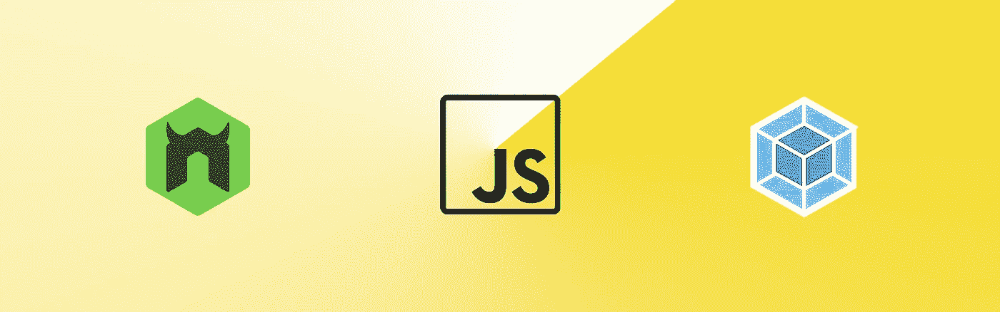

# 如何使用 nodemon 和 webpack-dev-server 自动重载全栈 JavaScript 项目

> 原文：<https://itnext.io/auto-reload-a-full-stack-javascript-project-using-nodemon-and-webpack-dev-server-together-a636b271c4e?source=collection_archive---------2----------------------->



[*点击这里在 LinkedIn* 上分享这篇文章](https://www.linkedin.com/cws/share?url=https%3A%2F%2Fitnext.io%2Fauto-reload-a-full-stack-javascript-project-using-nodemon-and-webpack-dev-server-together-a636b271c4e)

几周前，当我受到时间的压力时，我决定尝试运行 webpack-dev-server (WDS)。我悲惨地失败了，没有在这个项目上浪费时间，而是继续前进。现在，我再次发现自己需要一个工具来加快开发时间。上周我做了研究，今天我为了子孙后代而分享。此外，在撰写本文时 [webpack-livereload-plugin 不兼容](https://github.com/statianzo/webpack-livereload-plugin/issues/40)几天前[刚刚发布的 webpack 4。这种配置的唯一缺点是我不能使用 socket.io 在 nodemon 的服务器和 WDS 的客户端之间进行通信。](https://medium.com/webpack/webpack-4-released-today-6cdb994702d4)

我正在快速开发一个全栈 javascript 单页应用程序(SPA)。我认为使用 nodemon 在每次保存代码时自动进行后端刷新是理想的，这样我就可以实现 RESTful API。此外，我希望重新构建我的包，并在包准备好时刷新我的浏览器。这两件事结合起来，WDS 将实现我的目标。

下面是我必须对我的 webpack.config.js & package.json 文件进行的更改。在文章的最后，我一次就完成了我的整个最终 webpack.config.js 文件，如果你想复制它的话。

首先安装必要的包，如果你还没有使用 npm 或 yarn 的话

```
npm install --save-dev nodemon webpack-dev-server webpack-cli
```

在我开始之前，我的输出属性被设置为如下:

```
output: {
  path: __dirname,
  filename: './public/bundle.js',
},
```

这样做的问题是，当 WDS 运行时，它会在[http://your URL:your port/public/bundle . js](http://yourURL:yourPort/public/bundle.js)上提供这个包。为了解决这个问题，我需要“path”并将我的设置更改为如下:

```
output: {
  path: path.join(__dirname, '/public'),
  filename: 'bundle.js'
},
```

接下来是一系列在属性“devServer”的对象中的设置。首先是两个与我的静态文件夹路径相关的命令。第一个是静态内容的路径，它将在站点的根目录下提供。第二个是一个标志，表示如果静态内容改变，是否自动刷新，默认为 false。

```
devServer: {
  contentBase: path.join(__dirname, '/public'), //serve your static files from here
  watchContentBase: true,
}
```

接下来，因为我希望 nodemon 托管我的 api 路由，所以我需要设置一个代理。这基本上是告诉 WDS 扮演中间人，并将您的请求重定向到 nodemon 实例。重要的是，您的 nodemon 实例和您的 WDS 不共享相同的端口，这将导致错误。

```
proxy: [ // allows redirect of requests to webpack-dev-server to another destination
  {
    context: ['/api', '/auth'],  // can have multiple
    target: 'http://localhost:8080', //server and port to redirect to
    secure: false //don't use https
  }
],
```

最后一个重要的设置是端口，这允许你覆盖 WDS 的默认端口 8080。此外，我发现这些有趣的设置可以让我知道是否有构建警告或错误，而不必盯着控制台。

```
port: 3000, // port webpack-dev-server listens to, defaults to 8080
overlay: { // Shows a full-screen overlay in the browser when there are compiler errors or warnings
  warnings: true, // default false
  errors: true, //default false
},
```

最后但同样重要的是，我将以下脚本添加到我的 package.json 中。— hot 选项启用[热模块更换](https://medium.com/@rajaraodv/webpack-hot-module-replacement-hmr-e756a726a07)。一个额外的花絮，当 WDS 捆绑 JS 文件时，它从内存中提供它。如果您在触发这些脚本后没有在文件系统中观察到 bundle.js，也不用担心。

```
"test": "nodemon ./server/index.js",
"WDS": "npm test & webpack-dev-server --inline --hot",
"WDSC": "npm test & webpack-dev-server --inline --hot --open 'Google Chrome'",
"WDSF": "npm test & webpack-dev-server --inline --hot --open 'Firefox'",
"WDSS": "npm test & webpack-dev-server --inline --hot --open 'Safari'"
```

最后，这是我完成的 webpack.config.js:

如有任何意见或问题，请联系我。